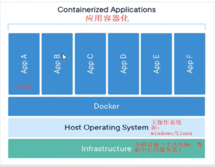
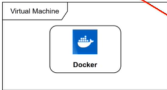
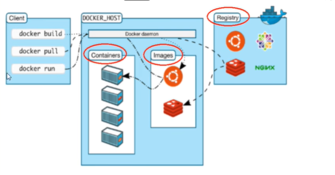
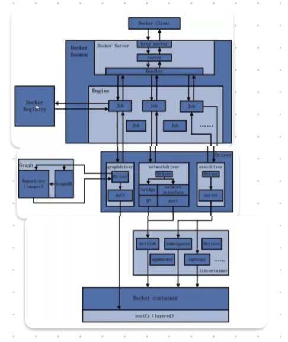

# 介绍
## 概念
### 背景
环境配置不一致、安装复杂、多台集群、扩容和缩容     
### 解决方法 
将所有源码、配置、环境、版本等都打包成为一个镜像文件放在docker引擎中   

docker:过去所产出的结果是能够编译执行的二进制字节码，所以需要手动再去配置环境。但是Docker透过镜像将作业系统核心外，运作应用程序所需要的系统环境，由下而上打包，达到应用程式夸平台的无缝连接，类似搬家————>搬楼。  

### 理念  
类似在虚拟机VMware上下载的CentOS_7.iso的操作系统一样，只要下载的镜像文件版本一致那么它的环境变量等都一样。
综上的VMware就是Docekr的概念。达到了一次镜像处处运行的目的。    
是一种基于Go语言实现的开源的云项目  

#### 容器和虚拟机的区别  
容器发展：磁盘————>卡台机————>虚拟机————>Docker(容器虚拟化技术)  
虚拟机：带环境安装的一种解决方案 缺点：占用资源大、冗余步骤多、开机时间慢  
容器虚拟化：Linux容器不是一个完整的操作系统，而是在操作系统层面上实现虚拟化，直接复用了本地主机的操作系统。是内核级虚拟化      


# 安装  
1.官网  
2.docker hub:安装docker的镜像仓库  

Docker的实质就是在已经运行的Linux下制造一个隔离的文件环境，因此他执行的效率几乎等同于所部署的Linux主机。所以是部署在Linux内核上的  
 


## Docker三要素
### 1.镜像 
一个只读的模版，一个镜像可以创建多个容器。   
### 2.容器  
实列对象——基于镜像生成的实际对象，是运行实体。一个简易版本的Linux实体。    
### 3.仓库  
集中存项镜像文件的仓库Docker Hub中，分为公开仓库和私有仓库。  

## 架构图


### 运行原理  
Docker是一个客户端-服务端结构的系统，Docker的后台守护进程运行在主机上，守护进程从客户端接受命令并管理运行在主机上的容器。客户端类似前端界面。  

## 高阶架构体  
### 介绍
是一个C/S模式的架构，后段是一个松耦合结构，众多模块各司其职。  
工作详细步骤：  
1.在客户端发送/Docker Client与后段守护进程/Docker Daemon建立通信，并发送请求给后者。  
2.守护进程作为架构的主题部分，首先提供服务的功能让他能接受客户端的请求。  
3.Docker Engine 执行Docker内部的一系列工作，每一项工作都是以job的形式存在。  
4.Job的运行过程当需要容器镜像时候，则从Docker Registry/仓库将镜像以Graph的形式存储。  
5.需要为Docker容器配置网络环境，通过网络管理驱动Network driver创建并配置Docker容器网络环境。    
6.限制Docker容器运行资源或执行用户指令等操作时，则通过Exec drive来完成  
7.Libcontainer 是一项独立的容器管理包，Network dirver以及Exec driver都是通过Libcontainer来实现具体对容器进行的操作  



## 具体安装
具体步骤可以学习下面的博客：    
https://blog.csdn.net/a1010256340/article/details/144828982    
1.确认虚拟机系统CentOS7机以上版本   
` cat /etc/redhat-release `  
2.卸载过去就版本的Docker  
`sudo yum remove dicker`  
3.yum安装gcc配置、环境配置  科学上网或者更换yum源  
` yum -y install gcc gcc-c++`  
4.安装需要的软件包  
a.安装Docker的远程仓库/下载shell脚本
``` 
yum install -y yum-utils   #安装yum的工具类  
yum-config-manager \ 
--add-repo\ 
https://download.docker.com/linux/centos/docker-ce.repo         #设置静态本地仓库外国会很慢    

yum-config-manager \ 
--add-repo\ 
https://mirrors.aliyun.com/docker-ce/linux/centos/docker-ce.repo    #设置国内的静态仓库  

yum makecache fast  #使更新yum仓库重建索引  

yum install docker-ce  #开始下载docker引擎  

systemctl start docker #启动服务  

docker version  #查看版本，客户端和服务端的版本号相同  
docker run hello-world #执行本地的hellowold  如过本地没有hello这个文件那么就会去远程仓库里面拉到本地再去执行

#配置本地镜像加速器  

system stop docker  #关闭服务
yum remove docker-ce docker-ce-cli containerd.io  #删除依赖包  
rm -rf /var/lib/docker  /var/lib/containerd  #删除本地文件  


```  

docker 比虚拟机的快的原因  
1.docker比虚拟机有更少的抽象层：因为docker不需要像虚拟机一样实现硬件资源虚拟化，而是直接使用实际物理机的硬件资源  
2.docker直接利用宿主机的内核，从而不需要加载操作系统内核    


## Docker常用命令  

### 启动命令
```
systemctl start docker  #启动docker
systemctl stop docker #暂停dokcer
systemctl restart docker #重启docker 
systemctl staus  docker  #查看docker的状态  
systemctl enable docker  #开机时候启动docker 
docker  info #查看docker的状态  
docker --help  #查看docker的总体帮助文档  

```

### 为docker镜像源配置/使用Linux达到科学上网

#### 1.下载v2ray软件
`https://www.v2fly.org/guide/workflow.html#%E5%B7%A5%E4%BD%9C%E5%8E%9F%E7%90%86
`  

#### 2.了解原理：  
需要配置至少一个入站协议（Inbound）和一个出站协议（Outbound）才可以正常工作。  
入站协议负责与客户端（如浏览器）通信：  
入站协议通常可以配置用户认证，如 ID 和密码等；  
入站协议收到数据之后，会交给分发器（Dispatcher）进行分发；  
出站协议负责将数据发给服务器，如另一台主机上的 V2Ray。  
当有多个出站协议时，可以配置路由（Routing）来指定某一类流量由某一个出站协议发出。
路由会在必要时查询 DNS 以获取更多信息来进行判断。  
*总而言之，相当先将虚拟机中需要科学上网的流量，汇集在Inbound内，然后通过v2ray服务进行加密再发送到Outbound服务端中*   

#### 3.操作：  
1.首先可以在本机上下载(因为github是半墙模式也很难直接下载，注意window上面下载的如果复制粘贴的换行符号和Linux不同等格式问题）  
2.上传到Linux并且利用shell脚本安装好。  
`https://guide.v2fly.org/prep/start.html#linux-%E7%89%88%E6%9C%AC%E7%9A%84%E9%97%AE%E9%A2%98`  
小白可以看这个网站  
3.配置/usr/local/etc/v2ray/config.json  文件——这个初始下载好后并没有的。  
需要注意里面应该没有拼写错误、引号等基本错误就可能导致无法启动。


```
{
"log": {
    "loglevel": "warning", // 日志级别
    "access": "/var/logs/v2ray/access.log",  
    "error": "/var/logs/v2ray/error.log"
  },            //日志文件是每个程序员必须要的，因为程序是在后台运行所以需要日志去记录他的行动  
  "inbounds": [
    {
      "port": 1080, // 监听端口
      "protocol": "socks", // 入口协议为 SOCKS 5、如果你想添加http请求需要把这个协议修改为http
      "sniffing": {
        "enabled": true,
        "destOverride": ["http", "tls"]
      },
      "settings": {
        "auth": "noauth"  //socks的认证设置，noauth 代表不认证，由于 socks 通常在客户端使用，所以这里不认证
      }
    }
  ],
  "outbounds": [
    {
      "protocol": "vmess", // 出口协议
      "settings": {
        "vnext": [
          {
            "address": "serveraddr.com", // 服务器地址，请修改为你自己的服务器 IP 或域名
            "port": 16823,  // 服务器端口
            "users": [
              {
                "id": "b831381d-6324-4d53-ad4f-8cda48b30811",  // 用户 ID，必须与服务器端配置相同
                "alterId": 0 // 此处的值也应当与服务器相同
              }
            ]
          }
        ]
      }
    }
  ]
}
```
4.配置完成后使用  
systemctl start v2ray  启动代理  
systemctl status v2ray 查看代理情况  
如果无法启动查看日志的时候需要确定linux的客户端时间和服务端的时间需要一致，不然也可能运行失败。  
5.完成后这是在客户端运行了v2ray，而服务端是机场配置的（需要vmess协议的）。  
6.docker的镜像设置代理  
配置/etc/docker/daemon.json   
```
{ 
    "proxies":
 { 
    "default":
  { 
    "httpProxy": "http://127.0.0.1:1080",
   "httpsProxy": "https://127.0.0.1:1080",  
    "noProxy": "localhost,127.0.0.1"   #不走代理的 
    }
     }
      }
```
为什么要用1080端口？  
相当于把docker里面的流量发送给本机的1080端口，而v2ray-Inbound监听的就是1080这样就会进行加密，从而达到发送到Outbound所指向的服务端  

7.重启docker
systemctl reload docker  #重新加载docker的配置文件  
systemctl restart docker #重启docker  


