# 介绍
## 概念
### 背景
环境配置不一致、安装复杂、多台集群、扩容和缩容     
### 解决方法 
将所有源码、配置、环境、版本等都打包成为一个镜像文件放在docker引擎中   

docker:过去所产出的结果是能够编译执行的二进制字节码，所以需要手动再去配置环境。但是Docker透过镜像将作业系统核心外，运作应用程序所需要的系统环境，由下而上打包，达到应用程式夸平台的无缝连接，类似搬家————>搬楼。  

### 理念  
类似在虚拟机VMware上下载的CentOS_7.iso的操作系统一样，只要下载的镜像文件版本一致那么它的环境变量等都一样。
综上的VMware就是Docekr的概念。达到了一次镜像处处运行的目的。    
是一种基于Go语言实现的开源的云项目  

#### 容器和虚拟机的区别  
容器发展：磁盘————>卡台机————>虚拟机————>Docker(容器虚拟化技术)  
虚拟机：带环境安装的一种解决方案 缺点：占用资源大、冗余步骤多、开机时间慢  
容器虚拟化：Linux容器不是一个完整的操作系统，而是在操作系统层面上实现虚拟化，直接复用了本地主机的操作系统。是内核级虚拟化      


# 安装  
1.官网  
2.docker hub:安装docker的镜像仓库  

Docker的实质就是在已经运行的Linux下制造一个隔离的文件环境，因此他执行的效率几乎等同于所部署的Linux主机。所以是部署在Linux内核上的  
 


## Docker三要素
### 1.镜像 
一个只读的模版，一个镜像可以创建多个容器。   
### 2.容器  
实列对象——基于镜像生成的实际对象，是运行实体。一个简易版本的Linux实体。    
### 3.仓库  
集中存项镜像文件的仓库Docker Hub中，分为公开仓库和私有仓库。  

## 架构图


### 运行原理  
Docker是一个客户端-服务端结构的系统，Docker的后台守护进程运行在主机上，守护进程从客户端接受命令并管理运行在主机上的容器。客户端类似前端界面。  

## 高阶架构体  
### 介绍
是一个C/S模式的架构，后段是一个松耦合结构，众多模块各司其职。  
工作详细步骤：  
1.在客户端发送/Docker Client与后段守护进程/Docker Daemon建立通信，并发送请求给后者。  
2.守护进程作为架构的主题部分，首先提供服务的功能让他能接受客户端的请求。  
3.Docker Engine 执行Docker内部的一系列工作，每一项工作都是以job的形式存在。  
4.Job的运行过程当需要容器镜像时候，则从Docker Registry/仓库将镜像以Graph的形式存储。  
5.需要为Docker容器配置网络环境，通过网络管理驱动Network driver创建并配置Docker容器网络环境。    
6.限制Docker容器运行资源或执行用户指令等操作时，则通过Exec drive来完成  
7.Libcontainer 是一项独立的容器管理包，Network dirver以及Exec driver都是通过Libcontainer来实现具体对容器进行的操作  


## 具体安装
具体步骤可以学习下面的博客：    
https://blog.csdn.net/a1010256340/article/details/144828982    
1.确认虚拟机系统CentOS7机以上版本   
` cat /etc/redhat-release `  
2.卸载过去就版本的Docker  
`sudo yum remove dicker`  
3.yum安装gcc配置、环境配置  科学上网或者更换yum源  
` yum -y install gcc gcc-c++`  
4.安装需要的软件包  
a.安装Docker的远程仓库/下载shell脚本
``` 
yum install -y yum-utils   #安装yum的工具类  
yum-config-manager \ 
--add-repo\ 
https://download.docker.com/linux/centos/docker-ce.repo         #设置静态本地仓库外国会很慢    

yum-config-manager \ 
--add-repo\ 
https://mirrors.aliyun.com/docker-ce/linux/centos/docker-ce.repo    #设置国内的静态仓库  

yum makecache fast  #使更新yum仓库重建索引  

yum install docker-ce  #开始下载docker引擎  

systemctl start docker #启动服务  

docker version  #查看版本，客户端和服务端的版本号相同  
docker run hello-world #执行本地的hellowold  如过本地没有hello这个文件那么就会去远程仓库里面拉到本地再去执行

#配置本地镜像加速器  

system stop docker  #关闭服务
yum remove docker-ce docker-ce-cli containerd.io  #删除依赖包  
rm -rf /var/lib/docker  /var/lib/containerd  #删除本地文件  


```  

docker 比虚拟机的快的原因  
1.docker比虚拟机有更少的抽象层：因为docker不需要像虚拟机一样实现硬件资源虚拟化，而是直接使用实际物理机的硬件资源  
2.docker直接利用宿主机的内核，从而不需要加载操作系统内核    


## Docker常用命令  

### 启动命令
```
systemctl start docker  #启动docker
systemctl stop docker #暂停dokcer
systemctl restart docker #重启docker 
systemctl staus  docker  #查看docker的状态  
systemctl enable docker  #开机时候启动docker 
docker  info #查看docker的状态  
docker --help  #查看docker的总体帮助文档  

```

### 为docker镜像源配置/使用Linux达到科学上网

#### 1.下载v2ray软件
`https://www.v2fly.org/guide/workflow.html#%E5%B7%A5%E4%BD%9C%E5%8E%9F%E7%90%86
`  

#### 2.了解原理：  
需要配置至少一个入站协议（Inbound）和一个出站协议（Outbound）才可以正常工作。  
入站协议负责与客户端（如浏览器）通信：  
入站协议通常可以配置用户认证，如 ID 和密码等；  
入站协议收到数据之后，会交给分发器（Dispatcher）进行分发；  
出站协议负责将数据发给服务器，如另一台主机上的 V2Ray。  
当有多个出站协议时，可以配置路由（Routing）来指定某一类流量由某一个出站协议发出。
路由会在必要时查询 DNS 以获取更多信息来进行判断。  
*总而言之，相当先将虚拟机中需要科学上网的流量，汇集在Inbound内，然后通过v2ray服务进行加密再发送到Outbound服务端中*   

#### 3.操作：  
1.首先可以在本机上下载(因为github是半墙模式也很难直接下载，注意window上面下载的如果复制粘贴的换行符号和Linux不同等格式问题）  
2.上传到Linux并且利用shell脚本安装好。  
`https://guide.v2fly.org/prep/start.html#linux-%E7%89%88%E6%9C%AC%E7%9A%84%E9%97%AE%E9%A2%98`  
小白可以看这个网站  
3.配置/usr/local/etc/v2ray/config.json  文件——这个初始下载好后并没有的。  
需要注意里面应该没有拼写错误、引号等基本错误就可能导致无法启动。


```
{
"log": {
    "loglevel": "warning", // 日志级别
    "access": "/var/logs/v2ray/access.log",  
    "error": "/var/logs/v2ray/error.log"
  },            //日志文件是每个程序员必须要的，因为程序是在后台运行所以需要日志去记录他的行动  
  "inbounds": [
    {
      "port": 1080, // 监听端口
      "protocol": "socks", // 入口协议为 SOCKS 5、如果你想添加http请求需要把这个协议修改为http
      "sniffing": {
        "enabled": true,
        "destOverride": ["http", "tls"]
      },
      "settings": {
        "auth": "noauth"  //socks的认证设置，noauth 代表不认证，由于 socks 通常在客户端使用，所以这里不认证
      }
    }
  ],
  "outbounds": [
    {
      "protocol": "vmess", // 出口协议
      "settings": {
        "vnext": [
          {
            "address": "serveraddr.com", // 服务器地址，请修改为你自己的服务器 IP 或域名
            "port": 16823,  // 服务器端口
            "users": [
              {
                "id": "b831381d-6324-4d53-ad4f-8cda48b30811",  // 用户 ID，必须与服务器端配置相同
                "alterId": 0 // 此处的值也应当与服务器相同
              }
            ]
          }
        ]
      }
    }
  ]
}
```
4.配置完成后使用  
systemctl start v2ray  启动代理  
systemctl status v2ray 查看代理情况  
如果无法启动查看日志的时候需要确定linux的客户端时间和服务端的时间需要一致，不然也可能运行失败。  
5.完成后这是在客户端运行了v2ray，而服务端是机场配置的（需要vmess协议的）。  
6.docker的镜像设置代理  
配置/etc/docker/daemon.json   
```
{ 
    "proxies":
 { 
    "default":
  { 
    "httpProxy": "http://127.0.0.1:1080",
   "httpsProxy": "https://127.0.0.1:1080",  
    "noProxy": "localhost,127.0.0.1"   #不走代理的 
    }
     }
      }
```
为什么要用1080端口？  
相当于把docker里面的流量发送给本机的1080端口，而v2ray-Inbound监听的就是1080这样就会进行加密，从而达到发送到Outbound所指向的服务端  

7.重启docker
systemctl reload docker  #重新加载docker的配置文件  
systemctl restart docker #重启docker  


### 镜像命令
docker images  #列出本地主机的镜像  
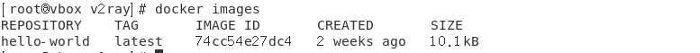
REPOSITORY:镜像的仓库源  
TAG:镜像的标签版本号，如果不具体说明默认为最新版本的。可以有多个版本号      
IMAGE ID: 镜像ID  
CREAYED:镜像创建时间  
SIZE:镜像大小  
`docker images -a `查看所有镜像  
`docker images -q `只展示镜像ID 

docekr search xxx  #查询xxx镜像，即搜索xxx是否在远程仓库。  
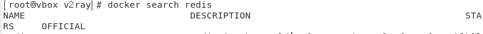
NAME:镜像名称  
DESCRIPTION:镜像说明  
STARS:点赞数量  
OFFICIAL:是否官方  
AUTOMATED:是否自动构成（可选）   
`docker search  --limit 5 xxx #表示只显示前5个 `  

下载镜像：   
docker pull xxx    #拉取xxx镜像，即从远程仓库拉取xxx镜像。  
docekr pull xxx:TAG #拉取xxx镜像版本TAG.   

docker system df 
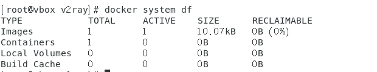   
TYPE:类型  
TOTAL:占用总空间大小  
ACTIVE:正在活动的容器数量  
SIZE:每个对象的实际大小    
BECLAIMABLE:可伸缩性，可以回收的空间大小    

`docker rmi xxx/xxx_id` 删除镜像利用名字/id，不是强制删除  
`docker rmi -f xxx/xxx_id` 强制删除    
`docker rmi -f $(docker images)`可以嵌套命令，这个相当于删除了所有   

docker虚悬镜像：仓库名、标签都是<none>的镜像有ID、大小、时间，就是虚悬镜像————工作中没有太大用处   

### 容器命令  
在docker中安装一个ubunt操作系统  
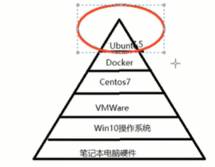  

#### 1.前提
```
docker search --limit 5 ubuntu 
docker pull ubuntu  
```
#### 2.新建+启动容器
`docker run [OPTION] IMAGE [COMMAND]{ARG...}` 按照镜像生成一个一个的容器  
OPTION:可选项——————  
--name="容器名称"。  
-d ：后台运行容器并且返回容器ID,启动守护式容器（后台运行）。    
*启动交互式容器（前台命令行）*：-i:以交互模式运行容器，-t:为容器重新分配一个伪输入端口，通常与-i一起使用。相当于对一个容器生成后要对容器内部进行操作，所以需要交互并且拥有输入端口。  
`docker run -it ubuntu:last /bin/bash ` 因为是交互模式相当于启动一个shell脚本的命令输入口，所以需要规定对应的命令解释器    
   
因为前缀的更改，相当于进入容器内部了，输入exit退出终端回到虚拟机中，容器停止————ctrl+p+q退出，容器不停止  
      
*端口映射*：当外部需要访问docker容器的服务的端口为80，他其实访问主机的端口是808端口。   
-p：指定端口映射即 -p 8080:80 也可以加上ip -p 127.0.0.1:8080:80     
-P:随机端口映射  

#### 3.其他指令
`docker ps [OPTION]` 列出所有正在运行的容器实列  
`docker ps -a` 列出所有活动过的容器实列，包括被删除的   
`docker restart 容器名称/ID` 重启容器  
`docker stop 容器名称/ID` 停止容器  
`docker kill 容器名称/ID` 强制停止容器  
`docker rm  容器名称/ID` 删除已停止容器  
`docker rm -f 容器名称/ID`  强制删除容器  
  

#### 4.重要指令
`docker  run -d 容器名称`  启动守护式容器（服务运行是在后台运行的）————需要注意的是：Docker容器后台运行，就必须要一个前台进程，就是如果不是一直挂起的命令，就会自动退出，因为我们只需要启动服务就可以了，但是docker前台没有运行的应用，这样容器会立即自杀，因为它觉得没事可做。————解决方法：运行的程序以前台进程的形式运行-it  
`docker ps` 检查一下是否运行了
`docker top 容器ID`查看容器内运行的进程  
`docker inspect 容器ID`查看容器的详细信息

`docker exec -it 容器ID /bin/bash`进入正在运行的容器并且使用bash命令解释器。  
`docker attach 容器ID` 进入正在运行容器   
这两个的区别是：attach直接进入容器启动命令的终端不会启动新的进程，exit退出会导致容器停止。而exec是在容器打开新的终端，并且可以启动新的进程，exit退出不会导致容器停止。  

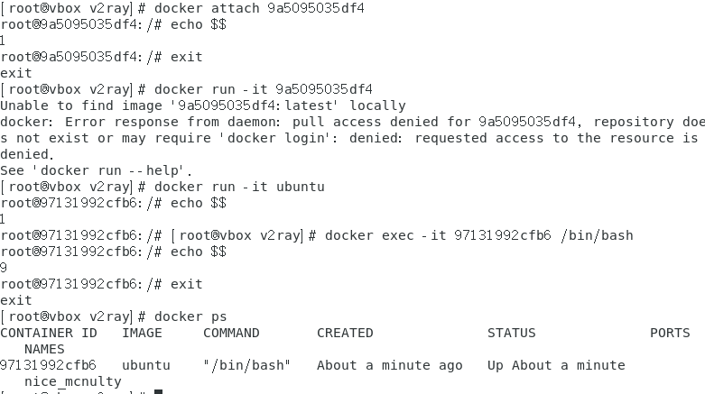  
所以exec进入的会是命令解释器开个新进程不是之前那个命令解释器了。  

#### 5.备份内容
从容器拷贝内容到主机上  
`docker cp 容器ID:容器内路径  目的主机路径 `   
导入和导出容器  
export导出容器的内容留作为一个tar归档文件————备份整个容器[对应improt命令]  
`docker export 容器ID > 文件名.tar`默认导出到当前目录下面    
import从tar包中的内容创建一个新的文件系统再导入为镜像[对应export]  
`cat 文件名.tar ｜ docker import - 镜像用户/镜像名称：版本号`导入之后生成的是一个镜像  

## docker镜像底层原理  
UnionFS(联合文件系统)：是一种轻量级且高性能的文件系统，它支持对文件系统的修改作为一次提交来一层层叠加，同时将不同目录挂载到同一个虚拟文件系统下。因此镜像可以通过分层来进行继承，基于基础镜像可以制作各种具体的应用镜像。  
 特点：一次同时加载多个文件系统，但从外面看起来，只能看到一个文件系统，联合加载会把各层文件系统叠加起来，这样最终文件系统就会包括所有底层的文件和目录。  

Docker镜像加载原理：实际上采用的就是UnionFS的文件系统。   
分层结构：每个Docker镜像是由一系列只读的层组成的，这些层可以理解为不同的文件系统。当你在创建镜像时，每执行一条指令（例如RUN、COPY、ADD等），都会在之前的层之上添加一个新的层。这使得镜像具有分层结构。
读写层：当你基于某个镜像启动容器时，Docker会在镜像的最上层添加一个读写层（容器层）。在这个读写层中，你可以对容器进行修改，比如创建新文件、修改已有文件等。但这些更改仅影响该容器，并不会影响到原始镜像或其他基于同一镜像运行的容器。

 底层原理：bootfs（boot文件系统）主要包含bootloader和kernel,bootloader主要是引导加载kernel,Linux刚启动时会加载bootfs文件系统，在Docker镜像的最底层就是引导bootfs。当boot加载完成过整个内核就在内存中，此时内存的使用权就由boot转交给内核，然后卸载boot。  

  在Linux系统中，/boot 是用来存放引导加载程序（boot loader）相关的文件和内核映像的。这些文件对于系统的启动过程非常重要：  
**引导加载程序**：这是位于 MBR（主引导记录）或 GPT（GUID分区表）分区上的小程序，它负责加载操作系统的内核到内存中。常见的引导加载程序有 GRUB（Grand Unified Bootloader）和LILO（Linux Loader）。GRUB2 是现代Linux发行版中最常用的引导加载程序。  
**内核映像**：这些是操作系统的核心组件，通常命名为 vmlinuz 或者类似的名字。它们包含了操作系统运行所需的基本功能和服务，并负责管理系统资源、提供硬件抽象层等。  
初始化RAM盘 (initrd)：为了在挂载根文件系统之前加载必要的驱动程序，使用了一个临时的文件系统，称为初始化RAM盘。这个文件通常叫做 initrd.img 或 initramfs.img。   
**配置文件**：例如，GRUB 的配置文件 grub.cfg 也存放在 /boot 目录下，虽然该文件通常是自动生成的，但它定义了引导加载程序的行为，比如如何显示菜单、超时时间以及各个操作系统的内核参数等。   
**其他支持文件**：这包括了各种模块和驱动程序，确保内核能够在尽可能多的硬件平台上成功启动。   

优点：  
共享基础层、高效利用存储、快速部署  

### 进阶指令 
为仓库添加一个新的自己定义的镜像（容器层-->镜像层）  
`docker commit  -m="提交的描述信息" -a="作者" 容器ID 创建的目标镜像名：[标签名]` 
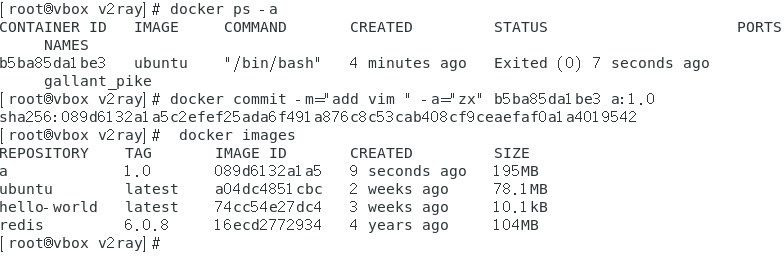  

本地镜像发布到阿里云  
阿里云的ESC流程图  
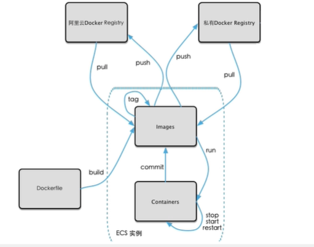  

1.生成本地镜像(如上面的步骤)  
2.在ailiyun图形化界面完成一系列的创建（命名空间——包名、镜像仓库——类）  
3.按照后面指引即可——需要注意要授权固定密码（在仓库管理的访问凭证）
```
$ docker login --username=xxxx xxxxxxx.cn-chengdu.personal.cr.aliyuncs.com
$ docker tag [ImageId] crpi-n0g9bg8c4s7bu6xe.cn-chengdu.personal.cr.aliyuncs.com/zx-centos/myunbutu1.3:[镜像版本号]
$ docker push crpi-n0g9bg8c4s7bu6xe.cn-chengdu.personal.cr.aliyuncs.com/zx-centos/myunbutu1.3:[镜像版本号]
```  


本地镜像发布到Docker Hub 同理`https://hub.docker.com/  `  
构建本地的Docker Registry-- 自己搭建的本地私有的Docker Hub    
1.`docker pull registrt`  下载镜像   
2.`docker run -d -p5000:5000 -v /xxx/xxxx/:/tmp/registry --privileged=true registry`  主机的5000端口映射到docker的5000端口  -v后面表示的是容器卷放在何处，不写就是默认/var/lib/registry（端口是虚拟的，为了方便服务的）  
3.在容器外执行`docker commit -m="config add" -a="zx" 容器ID:[版本号]`  
4.利用curl验证私服库上有什么请求  

```
curl 是一个在 Linux 系统中广泛使用的命令行工具，用于在网络中传输数据。它支持多种协议，包括 HTTP、HTTPS、FTP 等，并且能够通过不同的选项来定制请求。
基本用法
获取网页内容：curl http://example.com
这条命令会从指定的 URL 下载内容并将其显示在标准输出（通常是终端）。
常用选项
-o：将输出保存到文件中。
示例：curl -o savedpage.html http://example.com
此命令会将 http://example.com 的内容保存到 savedpage.html 文件中。
-O：使用远程文件名保存下载的内容。
示例：curl -O http://example.com/file.zip
此命令会直接以 file.zip 为名保存文件。
-X：指定请求方法（GET, POST, PUT, DELETE 等）。
示例：curl -X POST http://example.com/api
-d：发送数据。通常与 -X POST 一起使用。
示例：curl -X POST -d "param1=value1&param2=value2" http://example.com/resource
-H：添加请求头。
示例：curl -H "Content-Type: application/json" http://example.com
-u：提供用户名和密码进行认证。
示例：curl -u username:password http://example.com/protected
```
综上指令为：  
`curl -XGET http://registry容器的ip：5000/v2/_catalog`  
ubuntu上下载更新ifconfig指令为:  
` apt-get update ` 更新源  
`apt-get install net-tools`更新工具结束  

5. 克隆镜像（规范）   
`docker tag 原镜像名称：[版本号] 仓库ip:端口/镜像名称：[版本号] `
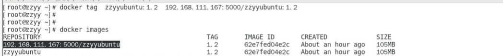  

6.docker默认不支持http请求推送镜像    
```
vim /etc/docker/deamon.json   #配置这文件
{
    "registry-mirrors":["镜像加速器"]，  ##可配可不配
    "insecure-registries":["镜像仓库的ip:端口"] #添加信任的仓库
    }
systemctl restart docker #重启docker/docker仓库  

```

7.推送到私服仓库  
`docker push 规范后的容器名称`  

8.再次验证
`curl -XGET http://registry容器的ip：5000/v2/_catalog`  

9.拉取本地  
`docker pull 容器名称（因为规范了名称所以可以直接拉取） `  


### 容器数据卷
`docker run -d -p5000:5000 -v /xxx/xxxx/:/tmp/registry --privileged=true registry`   
这是在上述操作的第2步中生存仓库中使用了容器卷  
`-v /xxx/xxx/:/xxx/xxx`: 左边的表示宿主机的路径，右边表示容器内部的路径，表示实现了宿主机和容器内部的资源共享和信息共通————容器数据卷    

`--privileged=true `标志会赋予容器几乎所有的能力，并解除大部分的安全限制，这意味着容器内部的应用程序可以执行需要更高权限的操作，例如挂载文件系统、访问设备等,它可以处理自己挂载区域的数据并且权限更高级，哪一块区域就属于它的了  

定义：是对容器数据进行备份。对宿主机目录——>容器目录的映射，将容器的数据备份+持久化到本地主机目录。  
卷就是目录/文件，存在于一个或者多个容器中，由docker挂载到容器，但他不属于联合文件系统，是完全独立于容器的生命周期，因此Docker不会在容器删除时删除其挂载的数据卷，就相当于插了个U盘用来保存数据    

宿主机和容器的互通指令： `docker run -it  -v 宿主机绝对路径:容器内目录 --privileged=true 镜像名称` -v 可以写多个  

特点：1.容器的数据更改可以直接使主机的生效、主机的更改容器内也可以生效（自动备份）    
2.容器卷的更改不会包含在镜像的更新中。  
3.数据卷的生命周期一直持续到没有容器使用为止  
4.容器停止后，宿主机对共享区域进行修改，容器启动后会自动更新  

上面描述的是采用的默认规则：  
` docker run -it --privileged=true -v /宿主机的绝对路径:/容器内绝对路径:rw 镜像名`  
这里的rw=没写就是表示默认规则————可读可写。  
当只能读取不能写入，表示这块数据不能从容器内修改-但宿主机可读可写不会被限制    
` docker run -it --privileged=true -v /宿主机的绝对路径:/容器内绝对路径:ro 镜像名`  
 
#### 卷的继承和共享  
1.u1容器完成和宿主机的映射  
` docker run -it --privileged=true -v /宿主机的绝对路径:/容器内绝对路径  --name u1  镜像名`
2.u2容器继承u1容器的卷规则（--volumes-from）  
` docker run -it --privileged=true --volumes-from 父类（u1） --name u2  镜像名`  
此时主机的和u1 、u2实现了容器共享。    
假如关闭u1容器的运行状态，那么u2共享的依旧不影响  

### Docker常规安装  
总体步骤：  
搜索-拉取-查看-启动（端口对应）-停止容器-移动容器  

#### tomcat安装  

```
docker search tomcat  
docker pull tomcat  
docker  images tomcat 
docker run -d -p 8080:8080 --name tomcat1 tomcat 

```
在网站上访问：localhost:8080  但是此时访问的是404  
可能原因1.没有映射端口、没有关闭防火墙  
2.webapp.dist目录换出webapps  

新版tomcat想要看到那只猫需要把webapp.dist改成webapps
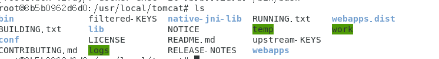 

因此不需要下载这么高级的tomcat
```
docker pull billygoo/tomcat-jdk8  
docker run -d -p 8080:8080  --name mytomcat_8  billygoo/tomcat-jdk8  
```

#### mysql 安装  

```
docker search mysql 
docker pull mysql:5.7
docker run -p 3306:3306 -e MYSQL_ROOT_PASSWORD=13456 -d mysql:5.7   #-e后面表示用户名为root 密码为123456  
docker exec -it mysql容器_id /bin/bash   
#进入mysql容器 
mysql -uroot -p 
123456  
#进入mysql  
show databases  ;
create database db01;  
use db01  ;
create table t1(id int ,name varchar(20)); 
insert into t1 values(18,"张三");
select * from t1 ;
```

问题：1.中文乱码——docker上默认字符集编码隐患  
mysql容器中输入`SHOW VARIABLES LIKE 'character%'`  

2.删除mysql容器后，里面的mysql数据如何办  

解决： 
1.重新输入定义mysql容器
```
docker run -d -p 3306:3306 --privileged=true -v /宿主机用户名/mysql/log:/var/log/mysql  
-v /宿主机用户名/mysql/conf:/etc/mysql/conf.d  
-v /宿主机用户名/mysql/data:/var/lib/mysql 
-e MYSQL_ROOT_PASSWORD=123456 --name my_mysql mysql:5.7   
#相当于备份了日志和配置、数据    
```
2.新建my.cnf   
通过容器卷同步给mysql容器实例——因为宿主机拥有工具所以可以解决该问题   
```
cd /用户名/mysql/conf/  
vim my.cnf  #mysql的配置文件  


[client]
default-character-set = utf8mb4
[mysqld]
collation_server = utf8_general_ci
character_set_server = utf8

:wq  
#配置文件完成

docker restart my_mysql  

docker exec -it my_mysql /bin/bash  
mysql -uroot -p 

#解决了中文乱码问题-并且数据保存了  
```  

# DockerFile解析  
定义：Dockerfile是用来构建Docker镜像的文本文件，是由一条条构建镜像所需的指令和参数构成的脚本。——类似shell脚本    

作用：因为之前每次修改都要一次commit一次很麻烦，所以给出一个list清单，后续需要加入任何功能直接在list清单里面即可

如图是一种独立于的
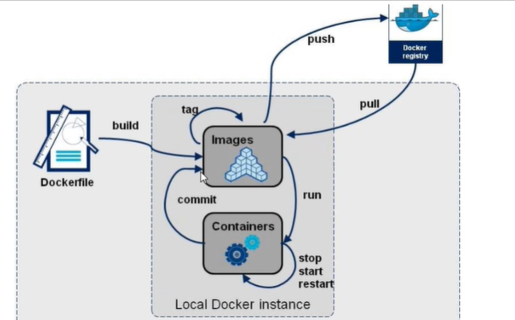  

步骤：  
1.编写Dockerfile文件  
2.docker build命令构建镜像  
3.docker run 依镜像运行容器为实例  

基础知识：  
1.每条***保留字指令***都必须为大写字母且后面要跟随至少一个参数  
2.指令按照从上到下，顺序执行  
3.#表示注释  
4.每条指令都会创建以恶搞新的镜像层并对镜像进行提交  

Dockerfile执行的大致流程：  
1.docker从基础镜像运行一个容器  
2.执行一条指令并对容器进行修改  
3.执行类似docker commit的操作提交一个新的镜像层  
4.docker再基于刚提交的镜像运行一个新容器  
5.执行dockerfile中的下一条指令直到所有指令都执行完成

### 保留字指令  
补充：1.shell格式<命令>  
2.exec格式["可执行文件","参数1","参数2"....]    
从网上拉取的其实就是dockerfile文件   

`FROM`:基础镜像，当前的新镜像是基于哪个镜像的，指定一个已经存在的镜像作为模版，第一条必须是from    
`MAINTAINER`:镜像维护者的姓名和邮箱    
`RUN`: 在容器构建（build）的时需要运行的命令 ——两种格式：shel、exec 。构建就相当于生成了一个容器之后执行了RUN后面的指令 `RUN yum -y install vim `  
`EXPOSE`:当前容器对外暴露出的端口  
`WOEKDIR`:指定在创建容器后，终端默认登陆进来的工作目录、一个落脚点  
`USER`: 指定镜像以什么样的用户去执行，如果都不指定默认为root  
`ENV`: 这个环境变量可以在后续的任何RUN指令使用，就如同制定了环境变量前缀一样，也可以在其他指令中使用这些环境变量。`ENV MY_PATH /usr/mytest #定义了环境变量，键值对新式 `    
`VOLUME`:  容器数据卷。在容器和主机/var/lib/docker下创建和容器内相同的临时文件  
`ADD` :将宿主机目录下的文件拷贝进镜像且会自动处理URL和解压tar压缩包——可以拷贝jdk8之类的，相当于COPY+解压    
`COPY`:拷贝文件和目录到镜像中  
`CMD`:指定容器启动后干的事情——两种格式：shel、exec 。注意：Dockerfile中可以有多个CMD指令，但只有最后一个生效，CMD会被docker run 之后的参数替换   
就类似于 `docker run -p 8080:8080 -d  镜像id /bin/bash ` 那么此时的/bin/bash会覆盖原本的CMD里面的内容  

`ENTRYPOINT`:类似`CMD`但是他不会被docker run后面的指令覆盖，而且这些命令行参数会被当作参数送给 `ENTRYPOINT`指令指定的程序  
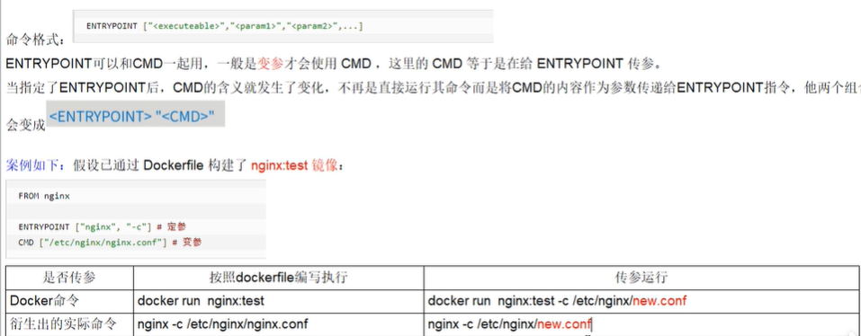

目的给镜像添加jdk等工具  
jdk的地址：https://www.oracle.com/java/technologied/downloads/#/java8
```
docker pull centos:7  
#在虚拟机中下载好了jdk的安装包放在my_file中
mkdir my_file
/myfile/jdk-8u171-linux-x64.tar.gz   
#编写Dokerfile文件
vim Dockerfile

# 使用一个轻量级的基础镜像
FROM centos
MAINTAINER zx<zx@163.com>

ENV MYPATH /usr/local 
WORKDIR $MYPATH

# 安装必要的软件包和JDK 8
RUN yum install vim  -y 
#安装网络配置
RUN yum install net-tools  -y
#安装java8以及lib库
RUN yum install glibc.i686  -y
RUN mkdir /usr/local/java  
#ADD是相对路径.jar，把jdk添加到容器中，安装包必须要和Dockerfile文件在同一位置  
ADD jdk-8u171-linux-x64.tar.gz  /usr/local/java/    
#配置环境变量  
ENV JAVA_HMOE /usr/local/java/jdk1.8.0_171  
ENV JRE_HMOE $JAVA_HOME/jre  
ENV CLASSPATH $JAVA_HOME/lib/dt.jar:$JAVA_HOME/lib/tools.jar:$JRE_HOME/lib:$CLASSPATH  
ENV PATH $JAVA_HOME/bin:$PATH  

EXPOSE 80  

CMD echo $MYPATH
CMD echo "success ------- ok"  
CMD /bin/bash  

#编译完成Dockerfile文件
:wq

#在/my_file目录下执行 这个.表示的是当前路径，如果不想当前路径docker build -t centos:1.0 -f /path/to/Dockerfile /path/to/build/context
 
docker buliud -t centos_java8:1.0 .

#就会在镜像中出现centos_java8:1.0
docker images 


#CMD指令在构建的时候会一个一个执行的，
最后显示successful
```
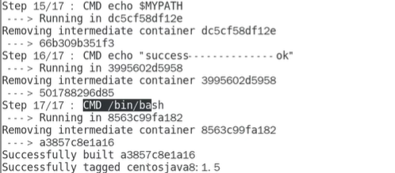

### 虚悬镜像  
定义：仓库名和标签都是`<none>` 的镜像，俗称虚悬镜像  
产生原因：构建和删除的时候产生一系列错误——虽然操作成功了但是最后产生的结果是错误的，所以会产生虚悬镜像。  
```
#在宿主机中  
vim Dockerfile
FROM  ubuntu 
CMD echo 'success'  

docker buliud .  
#构建操作会成功
docker images 
#就会显示虚悬镜像，相当于此时没有做任何处理-无任何意义     

docker  image ls -f dangling=true 
#表示单独查看虚悬镜像  

docker image prune
#表示删除所有的虚悬镜像  

```  


# Docker 微服务实战  
### 通过IDEA新建一个普通微服务模块  
1.自己在IDEA里面写SpringBoot的一套    
2.使用Maven进行打包bulid生成jar包  
3.使用ssh上传到宿主机LINUX服务器  

### 编写Dockerfile文件  
这两个文件在同一个文件夹中  
```
vim Dockerfile  
FROM java:8  
MAINTAINER ZX  #作者  
VOLUME /tmp   #指定临时文件目录为/tmp,在主机/var/lib/docker目录下创建了一个临时文件并链接到容器的/tmp  
ADD docker_boot.jar  zx.jar #将jar包导入容器中  
RUN bash -c 'touch /zx.jar'  #更新jar的时间戳  

ENTRYPOINT ["java","-jar","zx.jar"] #生成容器自时动执行再java -jar zx.jar  


EXPOSE  8888 #暴露端口

docker buliud -t zx_docker:1.0 .  #构建镜像  

docker run -d -p 8888:8888 zx_docker:1.0   #生成容器  


``` 

# Docker网络
docker 不启动网络情况  
1.ens33:在nat模式中这个就是宿主机的ip地址    
2.lo:local本地回环电路127.0.0.1      
3.virbr0:默认固定ip192.168.122.1是在CentOS的安装过程中如果有选择相关虚拟化的服务安装系统后，启动网卡时会发现有一个以网桥连接的私网地址的virbr0网卡，是用来做虚拟机网桥的————类似交换机  

当开启docker服务后  
在上面的基础上会出现docekr0:  
ip为172.17.0.1,它是为实现宿主机与容器，容器与容器间的互相连接。  

### 网络命令  
`docerk network ls  `   
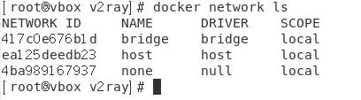  
docker会默认创造三大网络模式  
1.bridge:为每一个容器分配、设置i，并将容器连接到docker0（就是途中的bridge）————虚拟网桥，默认该模式。独立分配  
2.host:容器将不会虚拟出自己的网卡，配置自己的ip等，而是使用宿主机的ip和端口。公用宿主机的  
3.none:容器有独立的Network namespace,但并没有对其进行任何网络设置，如分配veth pari和网络连接，ip等没有网络驱动，拥有原材料但是没有设置里面的内容。`--network none 指定NAME/ID`  
4.container:新创建的容器不会创建自己的网卡和配置自己的ip,而是和一个指定的容器共享ip、端口等。公用别人的ip,不一定是宿主机。命令`--netwoek container:NAME/ID `


`docker network create zx`  表示创建了一个zx名称bridge类型（网桥）的网络  
`docker netrwork rm  zx`  删除刚刚的网络  
`docker network inspect xxx` 查看网络数据源（JSON串的格式）  

### Docker 网络的作用  
容器间的互连通信以及端口映射。  
容器IP变动时候可以通过服务名直接网络通信而不受影响。
#### bridge  
其中最重要的是docker0，它在**内核层**连通了其他的物理或虚拟网卡，这就是将所有容器和本地主机都放到同一个物理网络。Docker默认制定了docker0接口的IP地址和子网掩码，让主机和容器之间可以通过网桥相互通信。因为是网桥并且其他bridge模式都连接到这个Dockr0网桥上所以就可以实现转发的功能。  
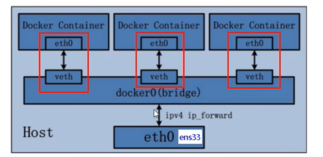  
所以上述表示了横向访问就需要通过网桥docker0（默认网关）    
注意特点：网桥docker0创建一对对等虚拟设备接口一个叫veth，另一个叫eth0（容器内部）成对匹配。  
```
docker run -d -p 8081:8080 --name tomcat81 tomcat-jdk8
docker run -d -p 8081:8080 --name tomcat82 tomcat-jdk8
#创建两个tomcat容器81、82  
ip addr 
#查看宿主机里面，发现添加了 25 veth@24 两个  
docker exec -it tomcat81 bash 
ip addr 
#查看容器内部发现了24  eth0@if25  存在一一对应关系  
```   

#### host  
直接使用宿主机的ip地址与外界通信，不再需要NAT(网桥转换)。不会虚拟出自己的网卡和ip。   
`docker run -d -p 8081:8080 --network  host --name tomcat83 tomcat-jdk8`创建host的网络模式，此时会出现警告因为网络映射已经和主机一样了端口映射没有意义了。   
`docker run -d  --network  host --name tomcat83 tomcat-jdk8`   
`ip addr`  发现这个里面的网络配置和宿主机的网络配置一摸一样  
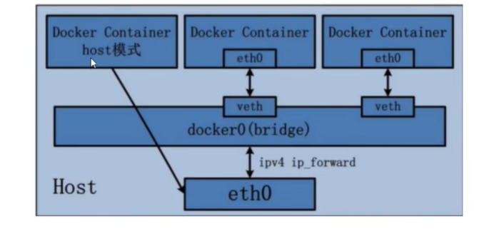  
就相当于在主机上下载了一个tomcat服务  

#### none  
禁用了网络功能之用lo（本地回环了）127.0.0.1    
不会进行任何配置没有网卡。
`docker run -d -p 8084:8080 --network  none --name tomcat84 tomcat-jdk8`

#### container  
新建的容器和意见存在的一个容器共享一个网络ip配置而不是和宿主机共用，只有ip、端口范围的共用其他的  
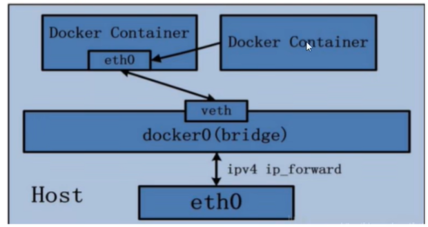
`docker run -d -p 8086:8080 --network  container:toncat82  --name tomcat85 tomcat-jdk8`会报错因为端口冲突，82和85共用用一个ip同一个端口  
注意：如果关闭了共享源即container映射的，那么另一台就会只剩下lo了  

#### 自定义网络  
因为docker 容易内部ip是可能变化的，所以需要定义服务名  
自定义桥接网络中默认使用的是桥接网络bridge  
```
docker network create zx_network   #创建自定义网络  
docker run -d -p 8081:8080 --network  zx_network --name tomcat81 tomcat-jdk8
docker run -d -p 8081:8080 --network  zx_network --name tomcat82 tomcat-jdk8
#将81和82放入自定义网络中 ，此时就可以在81/82容器中直接ping tomcat81/82 直接用服务名去ping通了，从而达到不需要把血丝    
```

# Docker容器编排
定义：是一种对Docker容器集群的快速编排工具，需要一个YAML格式的配置文件——docker_compose.yml。写好多个容器之间的调用关系。然后，只要一个命令就可以实现同时启动/关闭这些容器  
docker允许用户通过一个单独的docker-compose.yml模版文件（YAML格式）来定义一组相关联的的应用容器为一个项目（poject）  

## 安装
`curl -SL https://github.com/docker/compose/releases/download/v2.33.0/docker-compose-linux-x86_64 -o /usr/local/bin/docker-compose`
如果下载的太慢了可以使用finalshell去本地下载之后上传到虚拟机上 
`chmod +x /usr/local/bin/docker-compose`赋予权限    
`docker --version `检查是否安装成功
`rm /usr/local/bin/docker-compose`卸载Docker Compose  

## 要素
1.服务————一个一个应用容器实例。   
2.工程—————由一组关联的容器组成的一个完整业务单元，在docker-compose.yml文件中定义  

## 步骤
1.编写Dockerfile定义各个微服务应用并构建出对应的镜像文件  
2.使用dockercompose.yml定义一个完整业务单元，安排好整体应用中的各个容器服务。  
3.最后执行docker-compose up命令来启动并运行整个应用程序，完成一键部署上线。  

## 常见命令  
```
docker-compose up  #启动所有docker-compose服务
docker-compose up -d #启动所有docker-compose服务并后台运行  
docker-compose down #停止并删除容器、网络、卷、镜像等。  
docker-compose exec yml里面的服务id #进入容器内部实列  
docekr-compose config #检查配置  
docker-compose config-q #检查配置，有问题才输出  

```


## 微服务改造并生产新镜像  
before
1.创建数据库脚本  
2.定义好函数，spring_boot  
3.使用maven打包packeage，生产jar包  
4.jar包放到同一个Dockerfile文件中，编写Dockerfile文件  
5.docker bulid -t name:1 构建dockerfile文件  

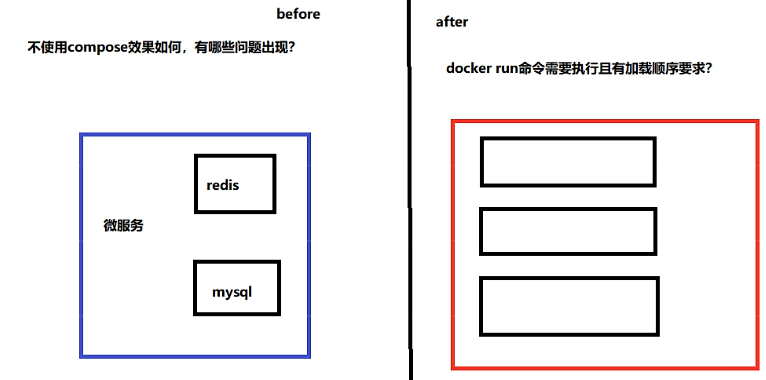  

after  
`vim docker-conpose.yml` 在Dockerfile的同一文件下编写  
直接编写docker-compose.yml文件  
```
version "3"    //版本号
services:       //几个容器实例
  microService:     
    image:name_docker:1   //镜像名称  
    container_name:zx_1     //容器名称
    ports:                //端口号映射
      - "6001:6001"
    volumes:                //容器卷，前面是宿主机后面是容器内的路径  
      - /app/microService:/data  
    network:                  //属于自定义网络，可以按照名称映射ip  
      - zx
    depends_on:               //依赖于  
      - redis 
      - mysql  
    
    redis:           //未表明名称会显示 当前文件夹_redis
      image:redis:6.0.8       //镜像名称
      ports:                  //端口
        - "6379:6379"
      volumes:                //逻辑卷
        - /app/redis/redis.conf:/etc/redis/redis.conf
        - /app/redis/data:/data
      network:
        - zx
      command: redis-server /etc/redis/redis.conf                   //使用命令启动了这个配置文件  

    mysql:
      image: mysql:5.7  
      environment:
        MYSQL_ROOT_PASSWORD:'123456'
        MYSQL_ALLOW_EMPTY_PASSWORD:'no'
        MYSQL_DATABASE:'db12'
        MYSQL_USER:'zx'    
        MSYQL_PASSWORD:'zx123'
      ports"
        - "3306:3306"
      volumes:
        - /app/mysql/db:/var/lib/mysql
        - /app/mysql/conf/my.cnf:/etc/my.cnf
        - /app/mysql/init:/docker-entrypoint-initdb.d
      networks:
        - zx
      command: --default-authentication-plugin=mysql_native_password      // 解决外部无妨访问的问题  
      
network:                 //自定义网络  
    zx            
```
编写完成后将原本配置文件的ip地址直接修改成为域名(mysql/redis)等再次上传。  
`docker-compose config -q`表示检查一下编写的是否有错误  
`docekr-compose up -d`  运行启动这个一键部署，后台运行。   
`docker network ls ` 会显示当前  文件夹_zx  

之后依旧进mysql建立表格等基本配置  

`docker-compose stop` 一键停止当前network的关闭  


# Docker轻量级可视化开发  
1.监控  
2.统计  
Portainer是一种轻量级应用，它提供了图形化界面，用于方便地管理Docker环境，包括单机环境和集群环境  
## 安装
`docker run -d -p 8000:8000 -p 9000:9000 --restart=always  -v /var/docker.sock:/var/run/docker.sock -v portainer_data:/data  portainer/portainer `     alwaly表示docker重启后这个容器也跟随启动  

第一次登陆需要创建admin ,访问地址为虚拟机主机ip:9000  
密码8位  
选择local后就可以看见图形化界面dashbord（仪表盘）  
Stack表示有几组编排的容器（compose）  
就是`docker system df `


# Docker容器监控工具重量级  
 产生原因：docker stats 统计结果只能是当前宿主机的全部容器，数据资料是实时的，没有地方存储、没有健康指标过线预警等功能。  
 容器预警三套：CAdvisor监控收集+InfluxDB存储数据+Granfana展示图表   
 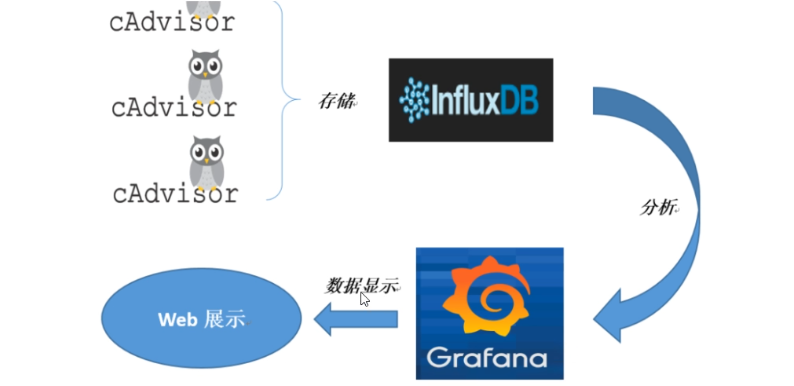  

 CAdvisor:是一个容器资源监控工具，包括容器的内存、CPU、网络IO、磁盘IO等同时监控，并且默认存储2分钟的数据，只针对单物理机。    
 InfluxDB: 是一个Go语言编写的开源分布式时序、事件和指标数据库，无需外部依赖，时序数据库   
 Granfana:开源的数据监控分析可视化平台，支持多种数据源配置  

## 安装——利用compose 
```
mkdir cig 
vim docekr-compose.yml  
______________________________
version '3.1'     //版本  

volumes:
  grafana_data:{}

service:
  infulxdb:
    image:tutum/influxdb:0.9
    restart:always    
    environment:          //预加载的数据  
      - PRE_CREATE_DB=cadvisor
    ports:
      - "8083:8083"
      - "8086:8086"
    volumes:
      - ./data/influxdb:/data

  cadvisor:
    image:google/cadvisor
    links:
      - influxdb:influxsrv    //可以连接道上面的容器放置数据。  
    command: -storage_driver=influxdb-storage_driver_db=cadvisor   -storage_driver_host=inclusxrv:8086
    restart:always        //驱动的引擎    
    ports:
      - "8080:8080"
    volumes:
      - /:/rootfs:ro
      - /var/run:/var/run:rw
      - /sys:/sys:ro
      - /var/lib/docker/:/var/lib/docker:ro  
  
  grafana:
    user:"104"
    image:grafana/grafana
    user:"104"
    restart:always
    links:
      - influxdb:influxsry
    ports:
      - "3000:3000"
    volumes:
      - grafana_data:/var/lib/grafana
    environment:
      - HTTP_USER=admin
      - HTTP_PASS=admin
      - INFLUXDB_HOST=influxsrv
      - INFLUXDB_PORT+8086
_______________________________
docker-compose config  -q
docker-compose up -d
docekr ps  
```

查看：  
cAdvisor收集服务：http://虚拟机ip:8080/  
influxdb收集服务：http://虚拟机ip:8083/  
grafana收集服务：http://虚拟机ip:3000/  


