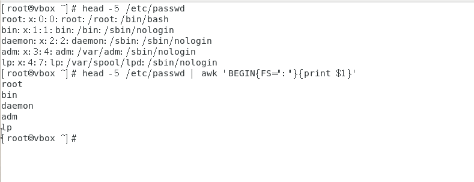

### shell脚本
概念：shell 是命令解释器，用于解释用户对系统的操作，把用户所执行的命令翻译给内核，再根据结果反馈给内核。  
shell的类型分配在/etc/shells文件中，CentOS7默认使用bash  

Linux 的启动过程：  
BIOS 基本的输入输出功能在主板半，选择引导的介质  
MBR 硬盘的主引导记录，是否可引导，包含了磁盘分区表等内容    
BootLoader(grub) 启动和引导内核的主要工具(选择内核以及版本号)    
kernel 内核
systemd/init 系统初始化进程，管理硬件，启动服务，管理服务————启动一号进程  
shell 用户与内核之间的桥梁，用户通过shell与内核进行交互，shell脚本就是用户与内核之间的桥梁  

```
dd if=/dev/sda of=mbr.bin bs=446 count=1 //将硬盘的MBR备份到mbr.bin文件中
hexdump -C mbr.bin //查看mbr.bin文件的十六进制表示-c表示显示为字符，因为没有安装文件管理系统。在512字节的最后内容为55aa，表示可引导。  

boot/grub2/grub.cfg  //grub的配置文件，用于配置内核的启动参数  
grub2-editenv list  //表示查看引导的内核的版本号    

/etc/re.d //CentOS6启动的是/usr/sbin/init引导程序,init会在/etc/rc.d下面发现大量的脚本。
/etc/systemd/system //CentOS7启动的是/etc/etc/systemd/system就会有很多启动级别，就是1号进程，然后根据启动级别/usr/lib/systemd/syetem目录下读取各种service服务。  
```


### shell格式  
为了组合命令和多次执行，使用脚本文件保存需要执行的命令。  

```
cd /var/ ;ls   //这就是执行两条命令，进入var目录并且查看。  
```


### 指令学习  
赋予文件的权限（chomd u+rx  filename）  
```
cd /var/ ;ls ;pwd ;du -sh //表示进入文件并且显示文件的大小以及显示所在位置和文件总实际大小  
```

建立脚本文件最好以.sh结尾。  
```
vim 1.sh 
//内容为
#！ /bin/bash
cd /var
ls
pwd
du -sh 
//结束  
chmod u+x 1.sh //初始化的文件值只有读、写的权限没有执行权限。  
bash 1.sh  //使用命令解释器解释,那么此时的第一行就成为了注释。
./ 1.sh //会使用系统自带的shell——就会使用注释下面的解释器#！/bash/bin
# 表示注释这一行的内容
```

### 执行命令的方式
`bash ./filename.sh`  
就会产生一个新的子进程，然后再这个子进程种运行该脚本，执行结束后返回父进程。    
使用bash作为命令解释即使执行的文件没有赋予执行权限也可以执行但是因为产生了内部进程所以此时的环境不会改变

`./filename.sh`  
会利用文件种的注释来执行，并且同样生成一个新的子进程然后执行脚本，执行完脚本后返回父进程。  
当文件没有执行权限的时候无法执行。同理因为产生了内部进程所以此时的环境不会改变。      
`source ./filename.sh == . filename`    
不会产生子进程，所以当前目录也会改变


注意：内建命令不会产生子进程同理.和source .也不会产生子进程  


###  管道、重定向  
管道：方便两条命令之间的通信  
重定向：让程序把标准输出作为另一个程序的输入。  

1.管道和管道符号  
管道和信号是一样的，是进程的通信方式之一  
符号为"|"是将前一个命令执行的结果传递给后面的命令。  
```
cat | ps -f // cat把文本内容显示到终端，此时执行的是空指令 ps -f 查看进程。所以管道符号相当于把两个外部命令生成了两个子进程，然后把第一个子进程的输出当作第二个进程的输入。  
```


proc 里面存放的文件都是表示进程，通过ps-f 查看到cat想对应的进程号，并且0表示输入（/dev/pts表示从终端的输入），1表示输入这个pipe:[45144]表示管道符号， 由于ps -f是个瞬时指令所以在指令执行完成后这个文件就不存在了不然在他的fd里面的0是pipe:[45144]  

综上管道符号可以创建相对应的子进程，通过子进程执行的，所以通过管道符执行内部命令的时候，当进程结束时父进程不会有影响。    

重定向：把输入、输出和错误输出做了一个链接。 就是利用文件的内容代替输入、输出————代替终端。  
```
read var < /path/to/a/file   //输入重定向文件————》终端
echo 123 >/path/to/a/file // 输出重定向 终端————》文件   

```
输出的四种不同写法：  
'>'：把输出到的文件里面的内容清空后再写入   
'>>'：把输出到的内容追加到文件内容后面   
'2>'：对文件描述符2————产生错误，错误重定向     
'&>'：无论是正确还是错误都输出到指定文件    


### 变量   
定义： 字母、数字、下划线开头   
赋值： 
 ```
   a=123   //变量名=变量值  使用""可以带空格（如果里面有双引号就需要`"   "`）   等号左右不能出现空格  
   let a=10+20 //let 为变量赋值会使后面的值进行计算    
   l=ls //将命令赋值给变量 
   letc=$(ls -l /etc) //将命令结果赋给变量，$（）或者`` ，减少执行次数     
```

输出：  
`${变量名}`————对变量的引用/部分情况可以 `$变量名`，当需要在输出的变量后面加上其他部分的时候就需要{},如`${string}23`，表示在string变量名后面加上了23.      
`echo ${变量名}`——————查看变量的值  

作用范围：  
默认范围：只针对当前的终端/shell.（关闭了终端/shell就不生效了）  
使子进程的到父进程的拓展：`export 变量名` //导出这个变量。   
删除变量名：`unset  变量名`  

#### 环境变量：  
概念：每个shell打开都可以获得到的变量。  


```
env //查看环境变量    
echo $环境变量名 //查看当前的环境变量值（环境变量一般都是大写的）
echo $PS1表示查看的是终端的输出形式（[\u@\h   \w] ==[\root@vbox \]）  
```

PATH代表的是命令的搜索路径，即普通的命令如ls，cd，pwd等，这些有的是二进制可执行文件有的是shell脚本。这些命令都是通过命令搜索路径（PATH）去找到的。如果没有添加到命令搜索路径里面的指令就必须要使用命令解释器去执行      


通过给添加搜索路径里面的路径，就可以把对应的shell/二进制可执行文件，作为指令了。无论在哪个路径下都可以实现1.sh和2.sh。但是定义的只是暂时因为没有写进文件中，所以只对当前的进程和子进程生效（export）.  

```
set |more  \\ 可以查看预定义变量和位置变量  
echo $?    \\上一条命令是否正确执行 0——正确 1——错误在shell脚本中可以用于判断    
echo $$   \\显示进程的PID
echo $0   \\当前进程名称  . 执行方式进程名为bash  bash 执行方式名称为进程文件名    
\\上面三个就是预定义变量  
\\位置参数相当于执行之后的输入参数如
./2.sh -a -l  \\-a就被输入为$1 -l被输入为$2
$1 $2 .....$9  ${10} ${11}...  \\因为二位数不能直接写不然会被认为是$第一位数字，这些一般用于shell脚本文件中的。    
${1}_  \\表示如果读入的是空的话默认为_ 如果赋值为a那么结果就是a_  
${1-任意想要替代} \\表示如果有值就是原来的值没有值就会替换为自己想要替换的字符/字符串  
```


环境变量的配置文件  
```
/etc/profile    \\保存系统启动和终端启动的环境   使用su - 的时候这个就会被加载  
/etc/bashrc     \\保存在etc下的属于通用的文件，所有用户都可以使用 
~/.bashrc       \\切换用户不加su  那么bashrc不执行   
~/.bash_profile    \\家目录的文件，特定用户使用特定的环境变量   
/etc/profile.d/  \\目录文件，基于不同的版本和shell执行不同的文件   
```
当执行切换(su - )的时候执行的顺序为  
/etc/profile————>.bash_profile—————>.bashrc————/etc/bashrc     
使用(su )命令的时候是加载不完全的  
.bashrc————>/etc/barshrc    
存在执行顺序是因为后面的文件会覆盖前面的文件  
所以想要增加环境配置的时候可以给上面任意文件中写入  
export PATH=$PATH:/new/path  \\export保证了子进程也可以使用  
更改了配置文件是需要重新打开终端才会生效，并不会立即生效。使用 source+更改的配置文件就可以不需要退出终端 

#### 数组
定义方式：  
```
IPTS=（10.0.0.0 10.0.0.1 10.0.0.2） \\定义数组使用空格隔开  
echo${IPTS[@]}     \\显示所有元素  
echo${#IPTS[@]}    \\显示数组元素个数  
echo${IPTS[0]}     \\显示数组的第一个元素  

```

#### 转义与引用  
特殊字符：  
概念：一个字符不仅有字面意义，还有元意    
#——注释    
;——分号  
\——转义符号（`\$` `\"` `\\`）   
"和'引号 

运算符：  
赋值运算符:"="赋值运算符，用于算数赋值和字符串赋值，unset取消为变量的赋值，除了作为赋值运算符还可以作为测试操作符。  
算数运算符：“+，-，*，/，%”  使用 *变量*=expr进行运算（只支持整数）如：expr 4 + 5 整数要有空格  num1=\`expr 4 + 5\` 把计算结果赋给num1    
数字常量：`let 变量名=变量值   #变量值使用0开头表示八进制，0x表示为十六进制`   
————>（简写）
```（
    (a=5+5)）   #echo $a  =>10
    b=5+5      #echo $b ==>5+5
    ((a++))    #echo $a ==>11  不能直接写a++
echo $((10+20))   # 30  
```
所以写的脚本其实就是把终端指令存储起来然后执行。   

特殊符号大全  
引号：  
\'单引号——完全引用，即里面如果有$变量名，那么显示的任然是$变量名  
\"双引号——不完全引用，会对里面的$变量名，变成为相对应的值  
\`反引号——执行命令    

括号：  
（）、（（））、$（）圆括号  

单独使用会产生一个子shell  （xyz=123）    
数组初始化IPS=(ip1 ip2 ip3 )   
cmd1=$(ls)表示把运行的结果赋值给cmd   

[]、[[]]方括号  
单独使用是测试或数组元素功能。 [2 -gt 3]  $?返回0真的为0    

两个表示测试表达式   [[2 < 3]]  $?返回0假返回1    

< <<  >尖括号  
重定向  

{}花括号    
输出范围echo {0...9}  输出0，1，2，3...9 数字  
文件复制 cp /etc/passwd{,.bak} =cp /etc/passwd /etc/passwd.bak  #,表示前面相同 mv也可以这么使用  

其他符号  
;命令分隔符号——case语句要;;  
:空指令  
.和source命令相同  
～家目录  
，分隔目录表示与前面的相同  
\* 通配符  
？条件测试\通配符  
$ 取值符号  
| 管道符号  
& 后台运行  
_ 空格  

#### 测试与判断  
退出与退出状态：  
```
exit   \\会读取这条指令的上一条指令，如果成功了返回0 不成功返回非0————程序结束的时候默认执行了  
exit 10  \\自定义exit返回值，如果错误返回10正确返回0   
$?   \\判断当前shell前一个进程是否正常 
```  

测试命令  
```
test 表达式 
test -d  文件  \\文件是否存在并且为目录  -e 文件是否存在  -f文件存在且为一个普通文件  
[-d 文件]  \\==test -d 
[ "   " = "   "] \\用于比较字符串，且区分大小写  
[[表达式]]  \\可以使用> < =等符号  
```

### 系统数据库的调用  

```
 vim .bashrc  #里面检测是否含有/etc/bashrc 相当于执行的是. /etc/bashrc  
 #会先执行/etc/bashrc 在执行bashrc   
 alias     #表示命令的别名 
```

### 脚本控制

 1.脚本优先级  
 概念：脚本占用的资源的多少。  
 通过使用 nice和renice调整脚本优先级————注意避免出现不可控制的死循环（会导致CPU占用高、导致死机）  
  ```
  ulimit -a   #查看用户的系统限制——如果是root用户的话就不会有系统限制  
  max user processes  #ulimit里面的最大进程数量

  func (){func | func & }  #可以使用函数的调用创建子进程
  func     #直接执行 创建大量的子进程出现fork炸弹  

  .(){.|.&}  ; .  #使用匿名函数的形式  
  ```

 2.捕获信息  
类似之前提到的信号  
kill 默认发送15号信号给应用程序  
ctrl + c发送2信号给应用程序  
9号表示不可阻塞——这个信号不能被重写的 

```
vim 1.sh 

#!/bin/bash 

#sign demo  捕获信号  
trap  "echo sig 15"  15   #只有发送了15号信号给这个进程他才会执行trap里面的命令
echo $$     #表示显示进程
while :
    do 
        : 
    done
执行死循环

./1.sh  &  #执行文件  
#显示这个文件的进程号  ，并且这个文件一直执行  
kill -15 进程号  #并不会结束这个进程，但他会显示sig 15  这个信号  
kill -9  进程号  #才能杀死这个进程  
ctrl + c 相当于执行 2 号信号
trap "echo  ctrl + c 被执行 " 2   
```

### 计划任务
概念：一些脚本需要定时的去调用，不是人为的执行  
一次性计划任务  
`at 18:31  ; echo hello>/tmp/hello.txt  #表示在18：31的时候执行脚本hello并写入hello.txt里面`  
`atq   #表示查看当前的一次性任务还有那些`  
注意事项：1.执行一次性计划任务的时候需要完整的路径，即echo 要写程echo $PATH 的完整路径  
2.一次性任务是没有终端输出的，所以需要日志去替他完成  

周期性计划任务  
```
crontab -e  #配置方式  
crontab -l  #查看现有的计划任务  
#配置格式  
分钟  小时  日期  月份 星期 执行的命令  
注意命令的路径问题  


crontab -e 
#进入文本编辑的格式  
* * * * * /user/bin/data >> /tmp/date.txt   # *表示自动匹配,data需要写完整的路径，使用which data 可以查看这条命令在哪里  
* * * * 1,5  /user/bin/data >> /tmp/date.txt #  
/var/log     #里面有一个cron的日志文件  
tail -f cron #可以查看这条命令的执行     
```  
计划任务加锁flock  


### find的用法

```
find /etc -type f -regex .*wd   \\按照类型去匹配是文件，并且以wd为后缀  
find /etc -atime 8          \\表示多久时间内更新了 
Lang=C stat 文件名   \\表示用英文的方式查看文件的属性（i节点）  
```
利用find去执行删除文件  
```
-exec   \\ 不进行任何提示
-ok    \\  进行一些提示的
find *txt -exec rm -v {} \;    \\因为不需要交互所以使用exec 然后-v 是进行提示最后使用{}表示删除的内容整合到{}内部    
```

grep表示查找正则  
```
gerp pass  /root/anaconda-ks.cfg       \\查找pass在/root/anaconda-ks.cfg  
```

###  sed和awk文本编译器
   
vim叫做全文本编译器，属于交互式   
sed和awk叫做行编辑器，属于非交互式  
`sed  '/user1/s/user1/u1'   /etc/passwd   # 这是执行了一个s指令相当于把/user1 替换成为 /user1/u1 也可以使用正则表达式`  
` awk -F:'/wd$/{print$1}'/etc/passwd  #也可也使用正则表达式进行输出`   

详细讲解  
sed的模式空间：将文件以行为单位读取到内存（模式空间）  
使用sed的每个脚本对该进行操作  
处理完成后输出该行  
所以相当于对文件中的多行进行替换，每行都会执行一次。  
```
sed 's/old/new/'  filename    \\如果替换命令里面有分割符号那么可以写's!/!abc!' 表示把/替换成为abc  
sed -e 's/old/new/' -e 's/old/new/' filename   \\表示进行多个更换命令，如果要多个处理文件也可以跟多个处理文件  
#对上面也可以使用's/old/new;s/old2/new2 ' 进行多个替换，但是这些替换却没有写入原始文件中  
sed -i 's/old/new' 's/old/new' filename   \\替换完成后的原样写会写入替换文件中
sed -r 's/扩展正则表达式/new/' filename  \\可以使用管道符号等进行替换   
```

就像一个a.txt文件中有`a a a `  
执行了`sed 's/a/aa' a.txt`  
结果显示为`aa a a`  

sed加强版  
全局替换  
`s/old/new/g    #g用于替换这一行所有出现的次数如果和正则表达式冲突可以使用s@old@new@g`  
`s/old/new`   

寻址  
默认对每行进行操作，增加寻址后对匹配的进行操作  
/正则表达式/s/old/new/g  
行号s/old/new/g    
行号可以是具体的行也可以是最后一行$  
`1,$s/bash/!   #表示从第一行到最后一行进行bash和!的替换`   
可以使用两个寻址符号，也可以混合使用行号和正则地址  
`/^bin/s/bash/!   #表示利用正则表达式匹配到有bin开头的进行bash和!的替换`  
这两个也可以组合起来。   

分组  
寻址可以匹配多条命令  
`/regular/{s/old/new/;s/old/new/}`  

sed脚本文件  
可以将选项保存为文件，使用-f加载脚本文件  
`sed -f sedscript  filename`  

sed其他指令  
删除命令  
[寻址]d  
删除模式空间内容，改变脚本的控制流，读取新的内容  
`sed '/ab/d' filename  #表示删filename里面存在ab的行`   
所以当使用d之后的命令更改的行相当于完全删除，之后的改变不会再生成这一行   

追加、插入、更改  
```
sed '/ab/i hello' filename #表示发现有ab就会在这一行的上面插入hello   
sed '/ab/a hello' filename #表示发现有ab就会在这一行的下面插入hello   
sed '/ab/c hello' filename #表示发现有ab就会在这一行的直接替换成为hello 
```  

打印  
可以把具体的行号打印出来  
`sed  '/ab/p' filename #表示在filename中存在ab的行的内容打印在下一行`  
一般和-n连用  
`sed -n '/ab/p' filename #表示单独答应出来存在ab的行的所有内容`  


下一行  
读到某一行，并且这一行不进行处理，直接对下一行进行处理     
读文件和写文件  
```
sed '/ab/r filename1' filename #表示在filename里面发现有ab后就会在下一行插入filename1的内容 
sed '/ab/w filename1' filename #表示在filename里面发现有ab后就会把这一行插入filename1中 
```

退出命令  
当我们匹配当之后就退出q   
```
time sed -n '1,10p' a.txt  #表示读取a.txt的内容并且是把a里面的所有呢日哦那个都放到了空间里面  
time sed  -n '/10/q' a.txt  #表示是一个一个读取到空间里面匹配到10之后不继续了  

```


#### 多行模式处理  
应对配置文件的多行  
N 表示将本行和下一行都追加到模式空间内类似12  23 34 的方式处理循环进行  
`sed 'N;s/hel\nlo/!!!' filename   #表示替换的hello里面含有换行符`  
D 删除模式空间的第一个字符到第一个换行符但不会结束模式空间  
P 打印模式空间的第一个字符到第一个换行符  
`sed 'N;s/\n//;s/hello bass/hello sed\n/;P D' `

#### 保持空间  
保持空间也是多行的一种操作方式  
经内容暂存在保持空间，便于多行处理  
h（覆盖模式）和H（追加模式）将模式空间的内容放到保持空间内  
g（覆盖）和G（合并）将保持空间内容取出到模式空间  
x交换模式空间的保持空间的内容 


### awk
相当于每次在执行行为一次自动的大循环
输入数据前列程BEGIN{}    
主输入循环{}  
所有文件读取完成END{}  

#### 字段引用和分离  
每行称为AWK的记录  
使用空格、制表符分隔开的单词称为字段  
可以自己指定分隔的字段  
```
awk '/^menu/{print $0}' filename  #表示以menu为开头的整个段落$0表示整个段落 
awk  -F "-" '{prit $2 }' filename   #表示以-为分割符输出第二段从1开始  
```

表达式    
'='是最常用的赋值操作符号  
```
var="name" #表示赋值语句 
var2="hello" "world"  #表示多个字符串，但是会自动连接  
var3=$1   #表示分隔开的第一个字段  
```

其他操作符号  
++ --  += /= %=   

系统变量  
FS（输入）和OFS（输出）字段分隔符，OFS表示输出的字段分割符  
`awk 'BEGIN{FS=":" ;OFS="-"}{print $1 ,$2}'`    
RS记录分隔符号（多行合并的时候）默认为'/n'    
`awk 'BEGIN{RS=":"}{print $1 ,$2}'`  
NR和FNR行数  
`awk '{print NR,$0}'  #就会输出行号和里面的内容（不区分文件）`  
`awk '{print FNR,$0}'  /etc/passwd   /etc/hosts  #就会输出行号和里面的内容但是行号会根据不同文件重写排号`    
NF字段数量，最后一个字段内容可以用$NF取出   
`awk 'BEGIN{FS=":"}{print NF}'  #就会输出整个字段又多少个`  
`awk 'BEGIN{FS=":"}{print $NF}'  #就会输出最后一个字段的内容`  
  

#### 循环和条件语句  
```
if(表达式)  
 {awk语句 ;
  awk语句
 } 
 [else
 awk语句2  
 ]
```
存在多个语句需要执行可以使用{}将多个语句括起来  

```
while(表达式)
{
    awk语句;
    awk语句2;
}


do{
    awk语句;
    awk语句2;
}while(表达式) 

for(i=1;i<=NF;i++){
    awk语句;
    awk语句2;
}
```

### 数组  
数组名[下标]=值  
下标可以使用数字也可以使用字符串  

遍历  
for(变量 in 数组名)  

删除元素  
delete数组[下标]  
delete数组  #删除整个数组  

`awk '{sum=0 ; for(c=2;c<=NF;c++)sum+=$c ;averge[$1]=sum/(NF-1)}END{for(user in averge)print user ,averge[user] }' a.txt`    

命令行参数数组  
ARGC  
ARGV  
`for(i=0;i<ARGC;i++)print ARGV[i] #表示ARGC是总共的行数，ARGV表示的是数组`  
`awk -f wrg.awk  11 22 33  #表示使用awk执行了这个wrg.awk文件 ARGC为4因为第一个awk也算进去了 `  

应用  
```
vim a.wak   #可以先进行编写一个脚本文件  

{ 
 sum = 0 
 for(coclum = 2 ;coclum<=NF ;coclum++)
    sum+=coclum
 averge[$1]=sum/(NF-1)    

}
END{
for(user in averge)
    sum_all +=avergep[user]
averge_all=sum_all/NR  
for(user in averge)
    if(averge[user]> averge_all)
     above++
    else 
     below++
print above,below  
}


#然后
awk -f a.wak  b.txt  
```

#### 函数
算数函数  
sin()   
cos()
int()    
rand()  #随机数0~1重复运行的时候是一样的
srand()  rand()   #每次都不一样了 

字符串函数  
gsub(r,s,t)  #字符串替换
index(s,t)  
length(s)  
match(s,r)  #字符串匹配  
split(s,a,sep)  #字符串分割  
sub(r,s,t)    #字符串替换  
substr(s,p,n)  #字符串替换  
man +字符串函数   #使用帮助文档查看  

自定义函数   
```
#写在BEGIN和主输入循环外侧  
function 函数名（参数）{
    awk语句  
    return awk变量  
}

awk 'function a() {return 0} BEGIN{}'
```


###  防火墙概括  
概念：可以限制那些用户或者ip可以使用这个服务  
分类：软件防火墙（包过滤防火墙、应用层防火墙）和硬件防火墙   
iptables的表和链————规则表（过滤）：filter nat mangle raw  ————规则链（方向）:INPUT OUTPUT FORWARD   PREROUTING POSTROUTING（路由转发，目标地址）    
iptables的fiter表：  
基本使用
`iptables -t filter 命令（具体做什么） 规则链（从哪里过滤） 规则（具体） 动作（是否允许通过）` 

```
iptables -t filter -nL  #查看已经实现的过滤条件，添加了n就会不把ip转化为域名解析 +v的话会更详细 
iptables -vnL  #相当于默认实现了查看的是filter
iptables -t filter -A INPUT -s 10.0.0.1 -j ACCEPT  #添加一条过滤规则允许IP进入  
iptables -t filter -A INPUT -s 10.0.0.1 -j DROP  #表示拒绝这个ip的进入  
#但是这个10.0.0.1还是进入了这个主机因为他会先执行允许的时候就已经进入了。  
iptables -I INPUT -s 10.0.0.1 -j DROP  #这个表示直接插入到第一条，这样就不允许了  

#当所有都没有匹配的时候就会进入默认规则，如果默认规则同意就可以进入  
iptables -P INPUT DROP  #表示更改默认规则为否  
iptable -F  #表示清空了自己添加的规则，但是不修改默认规则  
iptable -D 规则序号/名称  #指定特定的删除规则  
iptable -N/X/E 自定义规则链子/删除/重命令  

iptables -A INPUT  -s   10.0.0.1/24 -j ACCEPT # -s 针对ip地址添加，/24表示添加的是一段ip  
iptables -A OUTPUT -d 10.0.0.1  -j ACCEPT #表示针对目的ip  

#限制进入和出去的网络接口  
利用 -i eth0 和 -o eth0  
#指定协议和端口  
-p tcp --dport 80  

iptables -A INPUT -i eth0 -s 10.0.0.1/24 -p tcp --dport 8080 -j ACCEPT 
#指定特定的访问  
iptables -t filter -A INPUT -j DROP  #表示其他的请求都丢弃  

```


iptables的nat表(相当于路由转发，内部地址和外部地址)    
`iptables -t nat 命令 规则链  规则`   
PREROUTING 目的地址转换（内网端口转化为外网端口）   
POSTROUTING  源地址转换（将某一节点统一代理）  
```
iptables -t nat -A   -PREROUTING -i eth0 -d 114.115.116.117  -p tcp --dport 80   -j DNAT --to-destination 10.0.0.1 
#这个-i eth0：指定了流量进入的接口是eth0这是指接收数据包的网络接口名称。 匹配目标IP地址为114.115.116.117的数据包。-j DNAT：表示如果前面的条件都匹配，则执行DNAT动作。
DNAT指的是目标网络地址转换。
#所有发往114.115.116.117这个IP地址，并且目标端口为80/tcp的流量，转发到内部网络中的10.0.0.1这台机器上。 
iptables -t nat -A POSTROUTING -s 10.0.0.0/24 -o eth1 -j SNAT --to-source 111.112.113.114  
#所有来自`10.0.0.0/24`这个子网的数据包，当它们通过`eth1`接口离开本机时，将其源地址替换为`111.112.113.114`。
```  

iptables配置文件  
```
/ect/sysconfig/iptables    #配置文件中  
yum intsall iptables-services   #CENTOS_7 没有下载  
service iptables save|start|stop|restart 

```

firewalld服务  
命令更简单，支持区域功能'zone'——自建的规则链  
firewall-cmd  
`systemctl  start|stop|enable|disable firewalld.service`  

```
systemctl status firewalld.service   #查看当前firewalld状态  
# service iptables stop   #停止iptables 不然会和firewalld起冲突    
firewall-cmd  --status  #也是查看firewall的状态  
firewall-cmd --list-all #查看规则链条 
#里面的public就表示一个zone     interfaces表示网卡  
source表示原ip   ports表示访问的端口  service表示采用的服务ssh还自带22端口可以访问  

firewall-cmd --zone=public --list-interface  #表明查找特定的域中的特定网卡  
firewall-cmd --get-zones   #表示查看还有什么其他的区域/规则链  
firewall-cmd --get-default-zone #表示查看默认的规则链  

#服务和端口的关系，当有些服务存在默认端口如http默认80 如果想要修改默认端口的时候就需要限制端口了，还有可以限制ip  

firewall-cmd --add-service=http  #表示添加了http服务它会根据预定义的服务配置来开放特定的端口  
firewall-cmd --add-dport=81/tcp  --permanent  #添加了特定的端口号并且永久保存了    
fierwall-cmd --reload  #表示添加之后需要重新加载进去  
firewall-cmd --remove-source=10.0.0.1  #表示移除ip--zone表示特定的规则默认为public  

```


### SSH 
远程连接 
telnet服务的问题：传输的时候是明文传输  
```
getenforece  #查看selinux的状态
setenforce 0   #需要关闭selinux 安全管理

yum intsall telnet telnet-service xinetd -y  #安装三个软件  
systemctl start xinetd.service  #用来端口监听工作（从外部传输来的数据第一步处理）
systemctl start telnet.socket #只负责处理端口的数据
yum -ql telnet-server   #表示查看安装服务的路径文件在哪里  

grep telnet /etc/services  #查看telnet的端口      
iptables -I INPUT -p tcp --dport 23 -j ACCEPT  #表示iptables的允许端口号进入
fierwall-cmd --permanent --add-port=23/tcp  #打开23端口

tcpdump -i any port 23 -s 1500 -w /root/a.dump  #表示使用抓包，抓端口为23的1500字节写道/root/a.dump里面  

telnet  + 目的ip地址
#使用非root用户 ctrel+ ] 用来断开连接  

yum install wireshark-gnome  #使用图形化界面查看
``` 

#### ssh 简单配置和使用  
/etc/ssh  配置文件    
sshd_config 表示客户端配置文件    
shh_config 表示服务端  
在配置文件中17行有默认端口为22 ，如果想改变的化Port  222  
`systemctl restart sshd.service   #表示重启ssh服务，如果远程连接就会断开连接`  
38行中表示是否允许root登录默认为yes  
47行中AuthorizedKeysFile  这个表示利用密钥登录的公钥放在那个文件中  

会随着linux启动而启动

利用ssh去连接  
`ssh  -p 端口号 root@（可省略）目的ip地址  #表示利用root用户去连接或者直接连接`  
使用密钥方式验证就可以省去交互式：相当于服务端有公钥，客户端掌管私钥，公钥不怕被泄露，一般是使用私钥去连接公钥      
产生密钥`ssh-keygen -t rsa `  会产生一个私钥和公钥，公钥用来拷贝到服务端  

`ssh-copy-id -i /root/.ssh/id_rsa.pub  服务端ip（root@10.211.5.3） ` 在客户端产生密钥放在服务端下次登录就不需要输入密码了  
在服务端就会有authorized_key 手动创建权限为600  

```
scp 本地文件   root@10.211.5.3:/tmp/  #表示从本地文件中拷贝到服务端文件中
scp root@10.211.5.3:/tmp/    本地文件  #表示从服务端中拷贝到本地文件中 
```  

### FTP协议  
文件传输协议：使用两条链路（命令端口——21端口、数据端口）  
数据端口：主动模式（服务器主动连接）、被动模式（服务器被动等待连接）   
vsftpd服务器安装
```
yum intsall vsftpd  ftp  #ftp是用来客户端的连接 vsftpd服务端安装
systemctl start vsftpd.service  
ftp 服务器ip   #匿名账号ftp 密码为空  
#匿名登录后会来到/var/ftp/下面相当于所有人都可以共享  
ftp 目的ip  
用户+密码    
```

#### vsftpd
主要用于限制用户的登录和读写  
/etc/vsftpd/vsftpd.conf  主配置文件  
12行anonymous_enable 表示是否支持匿名登录  
16行local_enable 表示是否支持本地添加用户（useradd添加的），还需要sellinux是否为enforcing中的ftp_home_dir的bool值
19行write_enable 表示服务端是否可写入（客户端上传给服务端）  
43行的connect_from_port_20  表示开启主动传输模式  
132行的 userlist_enable 表示是否支持黑白名单

/etc/vsftpd/ftpusers   用户黑名单   
/etc/vsftpd/user_list  用户的黑白名单  

```
#连接成功后，使用！表示在本地执行
!ls   #表示查看的是本地目录  
put a.txt  #表示客户端上传给服务端
get k.txt  #表示服务端下载到本地  
```

#### vsftpd虚拟用户  
确保用户的安全性，并且不在/etc/passwd里面  
guest_enbale=YES   是确保使用虚拟用户     
guest_username=vuser  用来映射虚拟用户的权限   
user_config_dir=/etc/vsftpd/vuserconfig  用户的权限写入这个里面    
allow_writeable_chroot=YES     
pam_service_name=vsftpd.vuser  可插拔验证模块的

```
useradd vuser -d /data/ftp  -s /sbin/nologin  #表示添加虚拟用户并且家目录为/data/ftp,-s表示该用户的shell为/sbin/nologin ，即不可以使用终端登录  
vim /etc/vsftpd/vuser.tmp  #表示建立虚拟用户  
单行为用户名，双行为密码  
db_load -T -t hash -f /etc/vsftpd/vuser.tmp /etc/vsftpd/vuser.db    
#文本文件或二进制文件导入到 Berkeley使用hash 
chmod 600 /etc/vsftpd/vuser.db   #赋予权限  

vim /etc/pam.d/vsftpd.vuser  #虚拟用户的验证配置文件  vsftpd是本地的验证方式    
auth sufficient /lib64/security/pam_userdb.so db=/etc/vsftpd/vuser  #虚拟用户文件
account sufficient /lib64/security/pam_userdb.so db=/etc/vsftpd/vuser
    #将虚拟用户的验证配置文件写入主要配置文件中

vim /etc/vsftpd/vsftpd.conf    
pam_service_name=vsftpd.vuser  #打开并且关掉原本的，这样匿名和本地的用户就不可以使用了  
user_config_dir=/etc/vsftpd/vuserconfig  #这个配置目录里面就是写的虚拟用户的权限  
mkdir /etc/vsftpd/vuserconfig   
#然后生成文件名和用户名一样的就是相当于赋予权限  

vim u1  
local_root=/data/ftp  #表示该用户登录进来访问的目录  
write_enable=YES   #是否可写  
anon_umask=022
anon_world_readable_only=NO  #只可以读 
anon_upload_enable=YES    #可上传
anon_mkdir_write_enable=YES  #可创建目录
anon_other_write_enable=YES  #可写
download_enable=YES  #可下载  

#写完后要重启该服务
systemctl restart vsftpd.service 
```

### samba 服务  
共享服务的区别：  
1.协议不同  
2.对操作系统的支持程度不同  
3.交互的便利性不同  

```
yum install samba   #安装
/etc/samba/smb.conf  #配置文件
[share]
    comment= my shar   #共享名
    path=/data/share  #路径
    read only=NO   #是否可读 

smbpasswd -a   添加用户 /-x  删除用户 #添加的用户必须要有个和系统用户同名的，因为权限相同     
pdbedit -L 查看用户
systemctl restart samba.service #重启  

mount -t cifs -o username=user1 //127.0.0.1/user1   /mnt  #表示共享目录，并且挂载到mnt目录下 类似网络映射驱动 
输入samba 的密码  
umount /mnt 
```

### NFS共享文件  
/etc/exports  配置文件（服务端）  
  /data/share10.2.1.3(rw,sync) 10.2.2.3（rw）  
  1.里面有共享目录的路径/data/share  
  2.共享的ip，*代表所有    
  3.代表共享的权限rw表示可读可写，ro只读，sync同步数据给磁盘，all_squash使用匿名用户，不希望权限太大了  
systemctl start nfs.service

客户端
showmount -e loacalhost  #表示查看服务器已经共享的目录  
mount -t nfs localhost:/data/share /ent  #表示服务器共享目录的挂载在客户端机上  


### Nginx
介绍：是个高性能的web和反向代理服务器支持http、https协议    
下载  
```
yum-config-manager  --add-repo https"://openresty.org/package/centos/openresty.repo  #表示添加源到yum仓库里面
yum install openresty  
/usr/local/openresty/nginx/conf/nginx.conf  #配置文件    
service openresty start   #启动服务  

第3行  worker_processes  #表示启动nginx会占用多少个进程/cpu  
第12行 中的worker_connection 1024 #表示每个进程最多能接受1024个请求并发    
第17行  http的服务基本内容 
第31行  keepalive_timeout #表示为了减少每次都需要三次握手的时间设定了一个时间用来约束保持连接的时间  
第35行 server表示服务
``` 

#### nginx虚拟域名主机  
定义：访问同一服务器上的多个端口服务
在配置文件添加,相当于对server写多份  
```
server{
    listin 8000;
    server_name www.servera.com;  #相当于访问这个域名的时候是访问80端口
    location/{                  
        root html/servera;          #访问域名的是访问这个目录
        index index.html index.htm;
    }
}

server{
    listin 8000;
    server_name www.serverb.com;  #相当于访问这个域名的时候是访问80端口
    location/{                  
        root html/serverb;          #访问域名的是访问这个目录
        index index.html index.htm;
    }
}

#返回上一级目录进入sbin目录
./nginx -t     # 编译
./nginx   #启动
./nginx -s stop  #停止nginx
./nginx -s reload  #不停止nginx，重启nginx  

#解决域名问题
vim /etc/hosts  #配置域名
127.0.0.1  www.servera.com 
127.0.0.1  www.serverb.com         #在配置里面写完后访问这两个域名的会转发个ip为127.0.0.1

#/usr/local/openresty/nginx/html 
mkdir servera serverb  #相当于当访问www.servera/serverb.com的时候就是访问这两个目录里面
echo servera> servera/index.html   #相当于里面访问的时候会默认访问index.html文件  

curl http://www.servera.com :8000   #访问这个域名  
```


### LNMP 
介绍：将nginx和数据库等结合起来的软件  
环境：LINUX+MYSQL(轻量级数据库)+PHP+nginx  

```
yum install mariadb mariadb_server  #安装mysql的替代文件
vim /etc/my.cnf   #修改配置文件  改为utf8
systemctl start mariadb.service  #启动Mysql 

yum instal php-mysql  php-fpm  #fpm确保php为一个独立的进程  
systemctl start php-fpm.service  #启动php  

vim /usr/local/openresty/nginx/conf/nginx.conf  #对nginx配置  
#在server中的65行找到php的，表示访问php页面时候  
location ~\.php${   #正则表达式表示以.php结尾的网址  
  root     html;    #访问root的html目录下
  fastcgi_pass  127.0.0.1:9000;   #通过fastcgi的协议把这个网址交给127.0.0.1：9000的端口（php-fpm） 
  fastcgi_index   index.php;  #默认主页 
  fastcgi_param  SCRIPT_FILENAME $document_root$fastcgi_script_name;  #$document_root作为环境变量是/usr/local/openresty/nginx/html    
  #$fastcgi_script_name表示的是请求的php的文件名
  include  fastcgi_params;  #表示传输的参数
}
```

### DNS 
介绍：域名解析，IP解析为域名，域名解析为Ip   
FQDN:完全限定域名  
域名分类：根域(.)、顶级域（.com .cn）  
查询方式：递归（查询本机）、迭代（通过询问其他服务器得到）  
解析方式：正向解析、反向解析  
DNS服务器的类型：缓存域名服务器、主域名服务器、从域名服务器（对主域名服务器备份）  
```
/etx/hosts  #早期实现需要手动整理  
yum install bind bind-utls  -y   #通过每个人整理自己层级的再上传到网上   

#主配置文件修改/etc/named.conf  
12行中options{
 listen-on port 53{ any; };  #表示默认监听端口53 UDP和TCP都用到了any表示网卡可以查询  
 allow-query {any;};   #表示允许查询  

}表示全局配置

zone  "."  IN{
    type hint;
    file "named.ca"; 
} #表示区域配置,这是一个根域，它的解析在named.ca文件中，这个文件在/var/named目录中
#查找本地缓存：当一个DNS查询被发起时，首先会在本地DNS缓存中查找是否有该域名的记录。如果有，并且记录未过期，则直接返回结果，不再进行后续的查询。
#根服务器查询：如果本地没有缓存或者缓存已过期，DNS客户端或递归解析器将向根域名服务器（root DNS server）发起查询请求。根服务器不直接包含具体域名的IP地址信息，但它知道所有顶级域名（如.com、.org、.net等）的权威服务器的地址。  
#顶级域名（TLD）服务器查询：接下来，基于根服务器提供的信息，递归解析器会查询相应的顶级域名服务器（在这个例子中是.com TLD服务器）。这些服务器维护着它们负责的顶级域名下所有注册域名的信息，但并不直接持有baidu.com的具体数据，而是知道哪个权威DNS服务器负责baidu.com。  
#权威域名服务器查询：最后，递归解析器会查询由TLD服务器指定的针对baidu.com的权威DNS服务器。这台服务器拥有并能提供baidu.com及其子域名（如www.baidu.com）的具体IP地址信息。    
#返回解析结果：一旦获得了www.baidu.com的IP地址，这个信息会被返回给请求的客户端，并且通常也会被缓存起来以便于未来的查询。


zone  "test.com"  IN{
    type master;   #主域名  
    file "test.com.zone";  #表示解析的配置文件 
} #自己编写一个配置文件  


#编写配置文件  
cd /var/named
cp -p named.ca  test.com.zone  #表示复制权限和内容  
vim test.com.zone  
#内容 
$TTL   1D  #生存周期，在其他主机缓存中生存的时间  
@ IN SOA @ ns1.test.com. (    
#第一个@表示当前域名（test.com)  IN表示internet访问 SOA表示起始授权记录  表明当前记录是由ns1.test.com来负责解析  
                          2019072800 ;serial  #序列号以10位组成主从服务器
                          1D ; refresh  #刷新时间 主从服务器
                          1H ; repire    #当获取不到时候，持续发送请求间断时间 主从服务器
                          1W ; expire    #当一直获取不到1周之后就默认失联  
                          3H ); minimun  #最小缓存时间  
@    IN NS ns1        #@代表当前域的根，即整个区域的起点。例如，如果你正在编辑  test.com.zone的区域文件，那么 @ 就代表 test.com就会自动转化位ns1
ns1  IN  A  10.211.55.3     #ns1.test.com 的域名由10.211.55.3解析，后面没有加.会自动补全的 
www  IN  A  10.20.0.100     #www.test.com 的域名由10.20.0.100解析 
mail IN  CNAME  mailexchange  #表明mail.test.com实际上是mailexchange.test.com的一个别。
mailex  IN A 10.20.0.200  
)
#NS、A这指定了记录的类型为名称服务器（Name Server）记录。NS记录用于指定由哪个DNS服务器负责解析该域中的主机名。

systemctl restart named.service  #重启这个DNS

nslookup  #用来检测主机是否成功
server 10.211.55.3 #表示使用10.211.55.3这个当服务器  
www.test.com #就会弹出主机的ip  

set type =ns  #就可以产看是那个域名服务器管理这些dns了
test.com   

set type=a 
ns1.test.com   #可以查看这个权威服务器域名对应的解析
 quit  


named-checkconf #表示检查该域名是否有错  
systemctl start named.service   

```  

从域名服务器 
当主服务器出现错误时更新
```
zone "test.com" IN{
type slave;
file "slaves/test.com.zone"; #配置文件会自动映射
masters{ 10.211.55.3; };  #通过这个搭建从服务器
};
```

反向解析配置文件：ip地址映射为主机名
zone"0.20.10.in-addr.arpa"IN{   #IP要反着写10.20.0,具体的ip在配置文件中对应
    type master;
    file "10.20.0.zone"
};

在/var/named的区域配置文件总就要改成
`100 IN PTR www.test.com`

### NAS 
介绍：网络附属存储器    
磁盘整列保证安全  
```
#建立一个磁盘分区  
#挂载文件上
#利用shell脚本添加一个用户并定义为ftp的用户
#利用smbpasswd来左 
```