# 架构设计  
单体架构：将所有功能模块都放在一个项目中，优点是结构简单，缺点是耦合度高，不利于维护和扩展。  
分布式结构：根据业务功能将系统进行拆分，每个业务模块作为独立的项目开发，称为一个服务。优点降低耦合度，有利于升级拓展。考虑问题：服务拆分粒度，服务集群地址如何维护，如何实现远程调用，健康状态如何？  
微服务是一种良好架构设计的分布式架构方案，特征：  
1.单一职责，每一个服务都对应唯一的业务能力，做到单一职责，避免重复业务开发  
2.面向服务：微服务对外暴露业务接口  
3.自治：团队独立、技术独立、数据独立、部署独立  
4.隔离性强：服务调用做好隔离、容错、降级、避免出现级联问题  

# 微服务  
技术框架——SpringCloud（SpringCloud集成了各种微服务功能组件，并基于Spring Boot实现了该组件的自动装配）、Dubbo    
微服务集群中有——服务集群——注册中心——配置中心——服务网关    

## 服务拆分及远程调用
1.不同微服务，不要重复开发相同业务  
2.微服务数据隔离，不要访问其他服务数据库  
3.微服务可以将自己的业务暴露为接口，供其他微服务使用  

```
cloud-demo
├── order-service // 订单服务————sql(db)
├── user-service // 用户服务————sql(db)

```

### 远程调用  
当服务内部需要调用其他服务时，称为远程调用————Java代码中发送HTTP请求  
注册RestTemplate——在controller层    
```
@MapperScan("com.itheima.order.mapper")
@SpringBootApplication
public class OrderApplication {
    public static void main(String[] args) {
        SpringApplication.run(OrderApplication.class, args);
    }

    @Bean //在启动类完成注入
    public RestTemplate restTemplate() {
        return new RestTemplate();
    }
}


//在其他中调用  
@Autowired
private RestTemplate restTemplate;

User user = restTemplate.getForObject("http://localhost:8081/user/1", User.class);
//GET请求使用getForObject方法，POST请求使用postForObject方法,第一个参数是路径，第二个表示需要的返回的类型——因为返回的是一个JSON风格的类型但是我们想要返回一个对象     
```

服务提供者：一次业务中，被其他微服务调用的服务  
服务消费者：一次业务中，调用其他微服务的服务    

## Eureka注册中心  
因为之前发送的URI中的地址是写死了的，如果更换地址就无法使用了，并且存在集群，所以需要一个注册中心来管理服务地址  
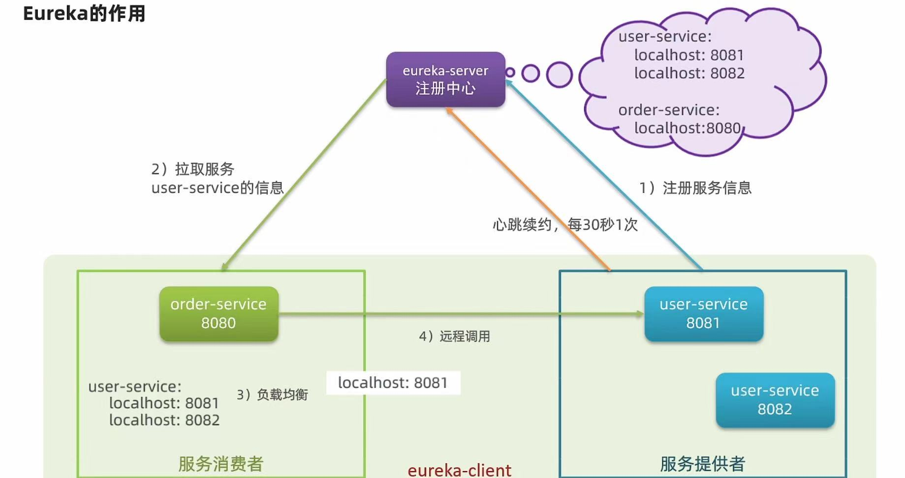  

消费者如何获取服务提供者具体信息？  
1.服务提供者启动时向Eureka注册中心注册服务  
2.Eureka保存这些  
3.消费者根据服务名称向Eureka注册中心获取服务提供者地址    

如果有多个服务提供者，消费者如何获取服务提供者具体信息？    
服务消费者利用负载均衡从服务列表中挑选一个  
 
消费者如何感知服务提供者健康状态？  
Eureka中有一个心跳机制，如果服务提供者正常运行，则每隔30秒发送一次心跳，如果服务提供者宕机，则Eureka会自动将其从服务列表中剔除，消费者可以拉去最新的消息。  


### 搭建Eureka注册中心  
#### 服务端的初始化    
1.引入依赖
```
<dependency>
    <groupId>org.springframework.cloud</groupId>
    <artifactId>spring-cloud-starter-netflix-eureka-server</artifactId>
</dependency>
```
2.边写启动类，添加注解@EnableEurekaServer    
3.修改配置文件YML  
```
server:
  port: 10086  //服务端口
spring:
  application:
    name: eureka-server //服务名称
eureka:
  client:
    service-url:
      defaultZone: http://localhost:10086/eureka //配置Eureka的集群的地址而不是单独一个，其他客户端注册到这个服务的地址    
```


#### 客户端的初始化  
1.引入客户端就是在主模块使用依赖  
```
<dependency>
    <groupId>org.springframework.cloud</groupId>
    <artifactId>spring-cloud-starter-netflix-eureka-client</artifactId>
</dependency>
```
2.配置消费者YML文件  
在原本连接了JDBC、SPRING、MYBATIS的基础上，添加Eureka客户端的配置  
```
spring:
  application:
    name: user_service //服务名称，如果多个属于同一个服务名称就会放在一个注册表中，按照链表的形式  
eureka:
  client:
    service-url:
      defaultZone: http://localhost:10086/eureka //告诉服务端我这里有一个服务需要注册
```   
能通过浏览器看到服务IP的详细信息， 
  

#### 服务的拉取  
服务的拉取是基于服务名称获取服务列表，然后对服务做负载均衡  
1.修改OrderService 的代码，修改访问的Url路径，用服务名代替Ip、端口  
```
String uri = "http://user_service/user/" + userId;  
//使用的名称只是替代了最外层的IP和端口  
```   
2.修改OrderController 的代码，添加@LoadBalanced注解  
```
@Autowired
@LoadBalanced //就会实现负载均衡后自己选择服务器  
private RestTemplate restTemplate;//启动远程调用  
```

流程：  
浏览器发请求给OrderService,OrderService因为要使用User的数据就会使用远程调用（RestTemplate），当使用远程调用不能直接写死服务IP所以需要使用Eureka注册。Eureka注册需要先配置服务端，然后每个客户端都需要配置服务端的IP,和自己提供服务的名称，Eureka会根据名称将服务注册到服务端，然后客户端会从服务端拉取服务列表，然后对服务做负载均衡。  

## Ribbon负载均衡    
发送出去的服务会被Ribbon拦截，Ribbon会转发个Eureka注册中心，Eureka注册中心会根据服务名称从服务列表中挑选一个服务，然后发给Ribbon进行负载均衡。  
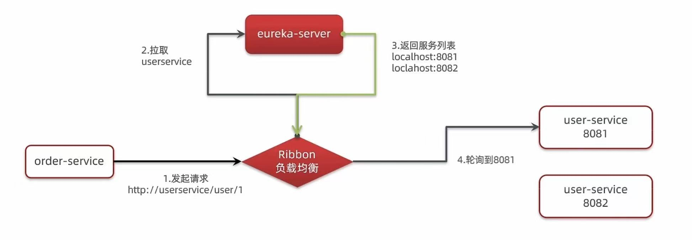    
实现地点：  
```
@Autowired
@LoadBalanced  
private RestTemplate restTemplate;//启动远程调用  
```
这里的LoadBalanced是Ribbon的注解，表示restTemplate发送的所有请求都会被Ribbon拦截，然后进行负载均衡。    
```
pubil ClientHttpRequestInterceptor interceptor() {
        ·········
}
//会在这个方法里面被拦截，并且拿去服务名称，转交给Ribbon的服务，然后返回列表，再在这个方法中做负载均衡——轮询负载均衡    
```

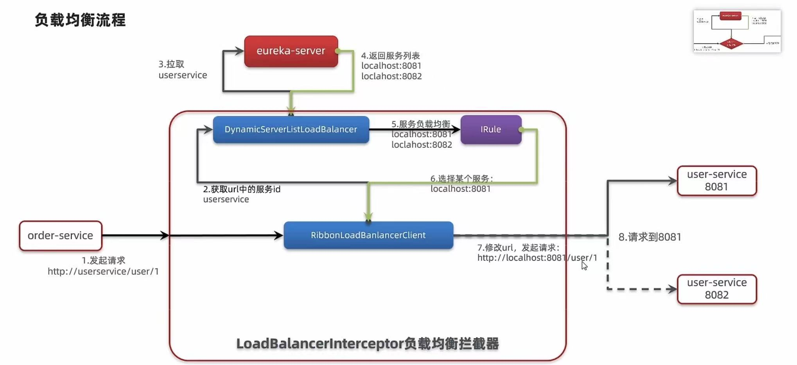  

其中的类大概这样：   
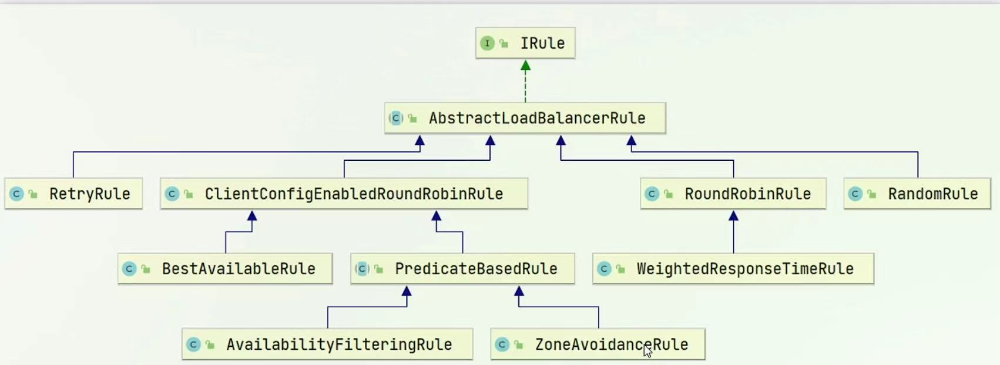  
全局调整负载均衡的策略  
```
@Bean
public IRule randomRule() {
    return new RandomRule(); //把轮询的负载均衡策略改成随机负载均衡策略
}
```
针对某个微服务,修改配置文件  
```
userservice: //微服务名称————针对的服务（在Eureka注册中心中注册的服务）    
  ribbon:
    NFLoadBalancerRuleClassName: com.netflix.loadbalancer.RandomRule //负载均衡策略
```


轮询负载均衡：按顺序轮询服务实例
随机负载均衡：随机选择一个服务实例。  
根据权重：根据服务实例的权重来选择，权重越大，被选中的概率越大。    

### 饥饿加载  
Ribbon默认使用的是懒加载，即第一次访问时才会去创建LoadBalancerClient，如果想要在项目启动时创建，则需要进行饥饿加载。 
懒加载结束后会被加载到缓存中。  
```
ribbon:
  eager-load:
    enabled: true //开启饥饿加载
    clients: 
      -userservice //指定需要饥饿加载的服务名称更多的前面要加-  
```

## Nacos注册中心    
Nacos是阿里巴巴开源的一个更易于构建云原生应用的动态服务发现、配置管理和服务管理平台。  
下载并且解压出服务端的代码   
客户端下载依赖：  
父工程导入依赖为
```
<dependency>
    <groupId>com.alibaba.cloud</groupId>
    <artifactId>spring-cloud-alibaba-dependencies</artifactId>
    <version>2.2.6.RELEASE</version>
    <type>pom</type>
    <scope>import</scope>
</dependency>
```
子工程导入依赖为
```
<dependency>
    <groupId>com.alibaba.cloud</groupId>
    <artifactId>spring-cloud-starter-alibaba-nacos-discovery</artifactId>
</dependency>
```

修改子工程yml文件  
```
spring:
  cloud:
    nacos:
        server-addr: localhost:8848 //配置Nacos的地址
```

之后时图形化界面了  

### 分级存储模型  
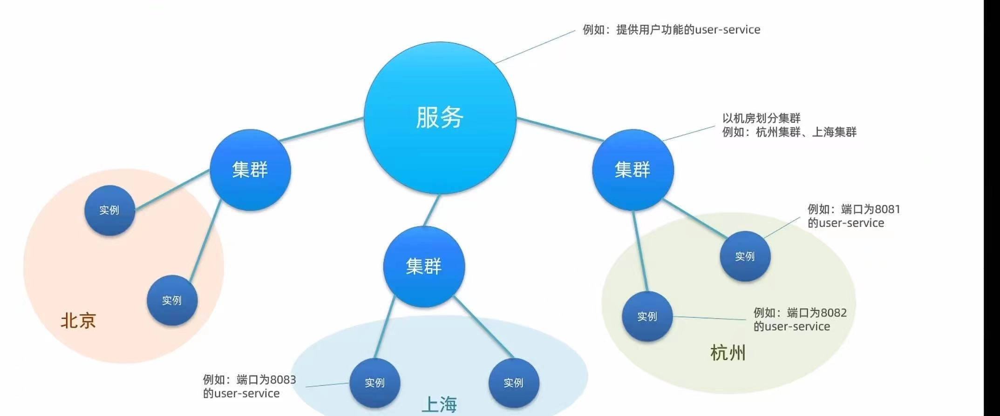    
引入集群的概念：服务调用尽可能选择本地集群的服务，跨集群调用延迟高。  
只有本地集群不可访问时候，再去访问其他集群————原本时服务、实列    

配置集群属性  
```
spring:
  cloud:
   application:
    name: userservice  # 这个就是服务名，会注册到 Nacos 中
   nacos:
    server-addr: localhost:8848 //配置Nacos的地址
    discovery:
      cluster-name: DEFAULT //集群名称
```  

但是并不能实现实列优先选择集群中的服务，这是因为负载均衡方面没有修改实列的关系，依旧时轮询，所以会导致不同集群间通信加大。所以需要修改配置文件   
```
userservice:  //服务名称就是在 RestTemplate中调用的url的路径
  ribbon:
    NFLoadBalancerRuleClassName: com.alibaba.cloud.nacos.ribbon.NacosRule //优先选择本地集群再使用随机的模式去选择  
```
如果本地集群挂掉了，就会实现夸集群访问，并且给出警告信息     

权重负载均衡：因为服务器设备之间有性能差异，部分实列所在机器性能较高，一些较差，我们希望性能好的机器承担更多的用户请求。   
Nacos中可以为服务设置权重，权重越高，被选中的概率越大。    
图形化界面配置（0~1）之间，配置文件不需要改变——所以说明ribbon的负载均衡是在Nacos注册的服务端，权重为0不会被访问——做到平滑升级    

### 环境隔离     
定义：namespace命名空间(外层隔离)，group分组，service/Data——对服务做隔离  
开发环境、测试环境、生产环境  


```
spring:
  cloud:
   application:
    name: userservice  # 这个就是服务名，会注册到 Nacos 中
   nacos:
    server-addr: localhost:8848 //配置Nacos的地址
    discovery:
      cluster-name: DEFAULT //集群名称
      namespace: 123456 //命名空间（ID）
```  
不同下的环境的服务是不可见的  

  
### 注册细节  
1.临时实列——临时心跳，如果实列宕机，则Nacos会自动删除该实列    
2.非临时实列——不做心跳检测而是主动去检测询问，如果实列宕机，则Nacos不会自动删除该实列，而是作为不健康标记，等健康了就继续使用。——但是对服务器的压力大    
3.Eur  eka只做定时pull而nacos是pull+push（有变化立马推送）两个结合     
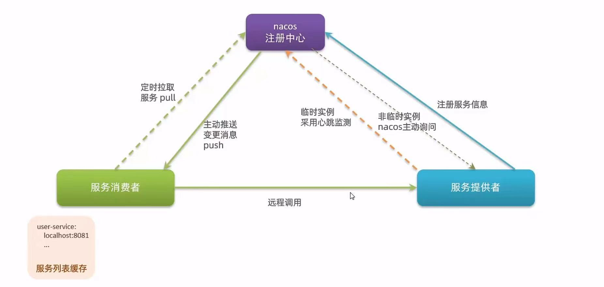  

```
spring:
  cloud:
    nacos:
      discovery:
        ephemeral: false //设置为非临时实例(默认是true)

```  

## Nacos配置管理  
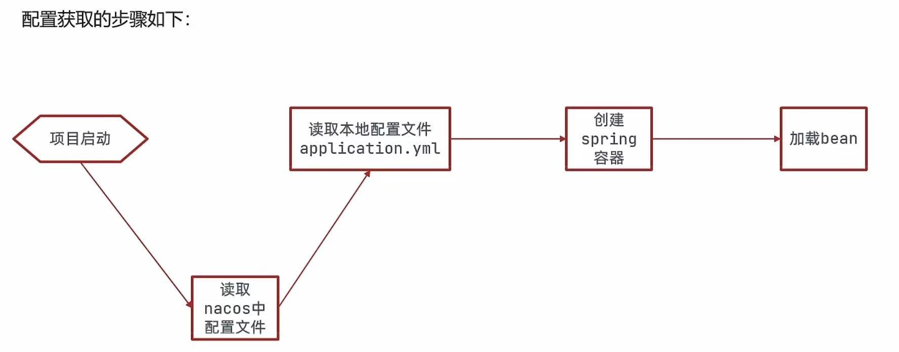  
### 1.统一配置管理   
在图形化界面中选择配置管理，的配置列表。  
Data ID：配置文件的名称(微服务名称-开发环境.yaml)       
Group：配置文件的组名（默认是DEFAULT_GROUP）  
格式选择：yaml  
配置内容做热更新——将来会有变化的内容    
```
pattern:
  dateformat: yyyy-MM-dd HH:mm:ss
```

### 2. 客户端得到配置  
注意的是APPLICATION.YML文件中配置nacos的地址的话，nacos配置文件读取时机要在application.yml之前，就会读取不到。所以我们应该配置在bootstrap.yml文件(这个文件读取优先级更高)  

引入配置管理依赖  
```
<dependency>
    <groupId>com.alibaba.cloud</groupId>
    <artifactId>spring-cloud-starter-alibaba-nacos-config</artifactId>
</dependency>
```

在resources目录下创建bootstrap.yml文件    
```
spring:
  application:
    name: userservice //服务名称
  profile:
    active: dev //开发环境
  cloud:
    nacos:
      config:
        file-extension: yaml //配置文件格式/后缀名  
      server-addr: localhost:8848 //读取配置的服务地址  
```

### 3. 配置热更新    
在nacos图形化界面中修改配置文件，微服务无需重启就可以实现热更新。不过需要修改一下面两种配置   
1.在@Value注解中添加的变量类上添加@RefreshScope注解（属性刷新）  
会出现大量日志，表示配置文件被修改了，会通知从而达到刷新。属性注解  
被 @RefreshScope 标记的 Bean 会 销毁再创建一次（注意依赖注入引用的生命周期）  

2.实现@ConfigurationProperties注解绑定  
会自动刷新  
@ConfigurationProperties(prefix = "pattern") //指定配置文件中的前缀  
public class PatternProperties {
    private String dateformat;
}

如果注册中心和配置中心不属于一个地方  
```
spring:
  application:
    name: order-service  # 服务名，决定注册名和配置 dataId

  cloud:
    nacos:
      config:
        server-addr: 192.168.1.100:8848  # 配置中心地址
        file-extension: yaml
        namespace: your-namespace-id
        group: DEFAULT_GROUP

      discovery:
        server-addr: 192.168.1.101:8848  # 注册中心地址
        namespace: your-namespace-id
        group: DEFAULT_GROUP
```

### 4. 配置共享    
微服务启动的时候会从Nacos读取许多配置文件如：[SPRING.APPLICATION.NAME]-[SPRING.PROFILES.ACTIVE].YML————这是特有的     
[SPRING.APPLICATION.NAME.YAML]————这个文件会多环境被共享  

如果本地配置文件和远端有相同的配置变量名，优先使用远程的配置。远程优先级更高（SPRING.APPLICATION.MAME.YAML）  
如果特有的环境和共有的环境变量中有相同的配置变量名，优先使用特有的环境变量（SPRING.APPLICATION.NAME-SPRING.PROFILES.ACTIVE.YAML）     

### 5.Nacos集群  
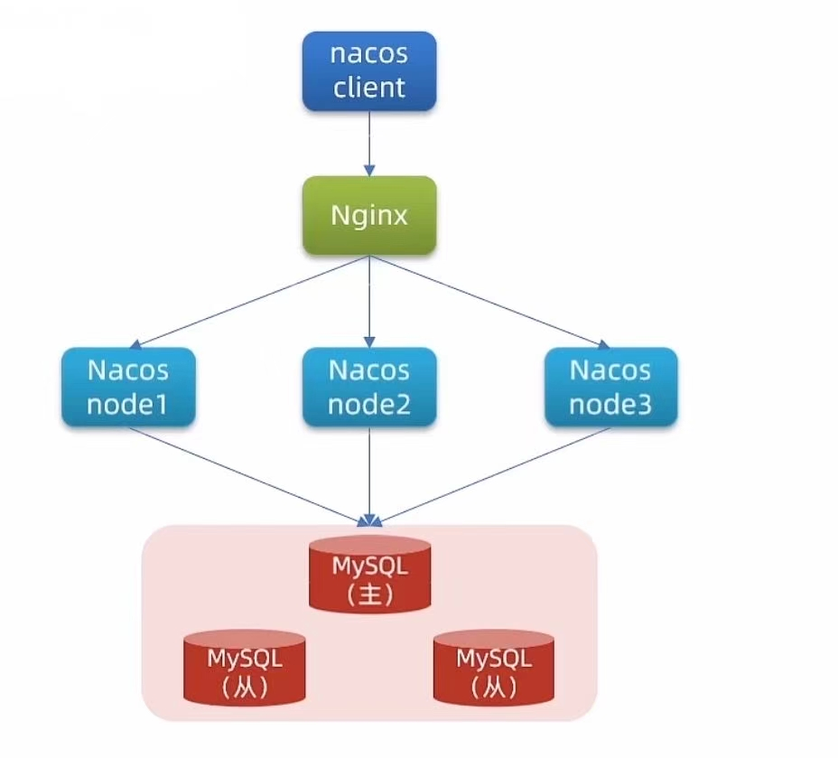    
1.初始化数据库  
2.下载nacos  
2.1 配置naocos  
在config文件夹中修改cluster.conf.example文件为cluster.conf文件     
修改配置文件  
```
server.port=8848 //服务端口  
spring.datasource.platform=mysql //数据库类型
db.num=1 //数据库数量
db.url.0=jdbc:mysql://192.168.1.100:3306/nacos?characterEncoding=utf8&connectTimeout=1000&socketTimeout=30000&autoReconnect=true //数据库连接地址
db.user=nacos //数据库用户名
db.password=nacos //数据库密码
```  
生成数据库后里面的数据库表格任然需要自己先配置好，不然无法持久化  
3.启动nacos  
使用startup.cmd启动nacos   


4.nginx做反向代理负载均衡    
在nginx的config文件中修改配置文件nginx.conf  
```
//放在http的内部就可以了
upstream nacos-cluster {
    server 192.168.1.100:8848;
    server 192.168.1.101:8848;
}   //配置了一个名为 nacos-cluster 的负载均衡集群，包含两个 Nacos 实例；
//默认是 轮询（Round Robin） 策略
server {
    listen 80;  //表示监听的端口（因为是http请求所以监听80）——如果来浏览器访问的时候没有输入请求路径会自动设置为80  
    server_name localhost;
    location /nacos {     // 这里的/nacos 就是nginx的访问路径  
        proxy_pass http://nacos-cluster;
    }   //配置反向代理,表示只要访问这个路径就会代理到Upstream中配置的集群，在浏览器主动输入无法访问，因为浏览器中的HOST没有DNS对应  
}
```

5.启动nginx  
使用startup.cmd启动nginx  

6.测试  
在浏览器中访问http://localhost/nacos，应该会看到Nacos的登录页面。

7.配置java代码   
直接修改nacos对应的url和端口号即可  

## Feign  
定义：是一个声明式的http客户端——能够优雅的实现http请求的发送   

1. 引入依赖  
```
<dependency>
    <groupId>org.springframework.cloud</groupId>
    <artifactId>spring-cloud-starter-openfeign</artifactId>
</dependency>
```

2. 启动类添加@EnableFeignClients注解  
```
@EnableFeignClients
public class OrderApplication {
    public static void main(String[] args) {
        SpringApplication.run(OrderApplication.class, args);
    }
}
```

3. 声明一个远程调用    
```
@FeignClient(value = "userservice")   
public interface UserClient {
    @GetMapping("/user/{id}")
    User getById(@PathVariable("id") Long id);//User 表示返回值  
}
```
默认使用springMVC的注解。  

4.使用Feign客户端  
```
@Autowired
private UserClient userClient;

User user =  userClient.getById(1);

```


注意feign也实现了负载均衡成功替代了RestTemplate.因为feign已经集成了ribbon。  

### 自定义配置  
日志配置： feign的日志级别有四种  
NONE：默认的，不显示任何日志——默认  
BASIC：仅记录请求方法、URL、响应状态码及执行时间  
HEADERS：除了BASIC中记录的信息外，还会记录请求和响应的头信息  
FULL：记录请求和响应的全部信息  

feign.coder.Decoder：解码器，将响应体(json字符串)转换为java对象    
feign.coder.Encoder：编码器，将各种格式转换为http的请求体  

feign.coder.Contract：契约，用于规定支持哪一种注解默认使用mvc注解  
feign.Retryer：重试机制，默认是没有任何重试机制,不过会使用ribbon的重试机制——如果某个查询结果失败就会触发重试换一个实列去查询   

配置文件配置  
```
feign:
  client:
    config:
      default: //表示全局生效如果要使用局部就是用特定的名称如userservice   
        loggerLevel: FULL //日志级别
```

java代码配置  
```
@FeignClient(value = "userservice", configuration = FeignConfig.class) //指定特定的服务配置生效而不是全局   
@EnableFeignClients(defaultConfiguration = FeignConfig.class) //指定全局的配置而不是单个  
public class FeignConfig {
@Bean
public Logger.Level feignLoggerLevel() {
    return Logger.Level.FULL;
}
}
```

### Feign性能优化   
实现模式：  
URLConnection：默认实现，不支持连接池——jdk自带    
Apache HttpComponents：支持连接池  
OKHttp：支持连接池    

1.引入依赖  
```
<dependency>
    <groupId>io.github.openfeign</groupId>
    <artifactId>feign-httpclient</artifactId>
</dependency>
```

2.配置连接池    
```
feign:
  client:
    config:
      default:
        loggerLevel: BASIC //日志级别  
  httpclient:
    enabled: true //开启httpclient连接池  
    max-connections: 200 //最大连接数  
    max-connections-per-route: 50 //每个目标地址的最大连接数    
```

### 实践  
通过统一的抽取然后写在一个api包里打包给maven成为一个jar包，然后其他服务引入这个jar包就可以使用feign客户端了。    
 


## 统一网关  
1.身份验证和权限校验  
2.服务路由、负载均衡  
3.请求限流    

### 网关的实现    
gatewat——是基于Spring5中提供的WebFlus,属于响应式编程的实现，具有良好的性能    
zuul——是一种基于servlet的实现属于阻塞式编程    

1.创建model引入依赖  
```
<!-- 引入网关依赖   -->
<dependency>
    <groupId>org.springframework.cloud</groupId>
    <artifactId>spring-cloud-starter-gateway</artifactId>
</dependency>

<!-- 引入nacos服务发现依赖 -->
<dependency>
    <groupId>com.alibaba.cloud</groupId>
    <artifactId>spring-cloud-starter-alibaba-nacos-discovery</artifactId>
</dependency>

```

2.网关中实现路由转发——配置  
```
server:
  port: 10010 //端口号
spring:
  application:
    name: gateway //服务名称
  cloud:
    nacos:
      discovery:
        server-addr: localhost:8848 //nacos地址
    gateway:
      routes:  //网关路由（多个）  
        - id: user-service //路由id，自定义，只要唯一即可  
          url: lb://userservice //路由的目标地址，lb（loadbalance）表示负载均衡，userservice是服务名称——网关会去Nacos中去找注册表实现ribbon负载均衡    
          predicates:   //断言，判断请求是否符合路由规则  
            -Path=/user/**    //这个是按照路由路径匹配，只要以/user开头就符合要求就会转发到url上  
         - id: order-service //路由id，自定义，只要唯一即可  
          url: lb://orderservice //路由的目标地址，lb（loadbalance）表示负载均衡，orderservice是服务名称——网关会去Nacos中去找注册表实现负载均衡、还支持http的格式不过不能实现负载均衡      
          predicates:   //断言，判断请求是否符合路由规则  
            - Path=/order/**    //这个是按照路由路径匹配，只要以/oreder开头就符合要求就会转发到url上      
```
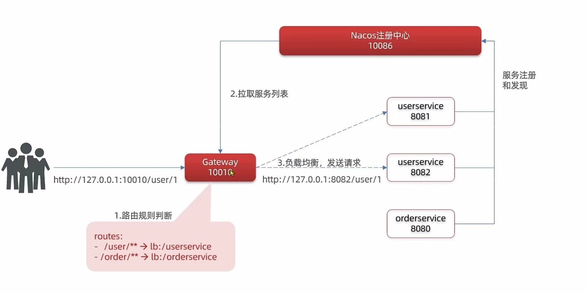  
实现流程：  
启动网关后会先去Nacos中找注册表并且缓存在本地生成注册表，如果前端发来请求会通过断言进行匹配，再通过注册表中的服务名称寻找对应的服务之后通过负载均衡发送到指定的请求  

路由断言工厂：我们再配置文件中写的只是断言规则，这些字符串会被断言工厂读取并处理，转变为路由判断条件。  


### 过滤器GatewayFilter   
GatewayFilter是网关中提供的一种过滤器，可以实现对进入网关的请求和微服务的响应做处理  
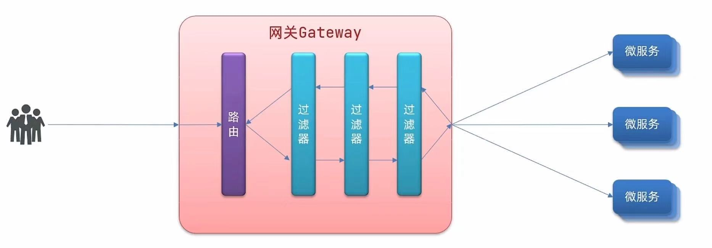  
过滤工厂用来处理这些过滤规则,所以还是修改配置文件，就可以实现对通信的加密    
```
spring:
  cloud:
    gateway:
      routes:
        - id: user-service 
          url: lb://userservice 
          predicates: 
            - Path=/user/**
          filters: //如果配在某个路由下，就只对某个路由生效，如果配在全局下，就对所有路由生效   
            - AddRequestHeader=X-Request-Id,123456 //添加请求头即X-Request-Id，值为123456  
      default-filters: //全局过滤器与routes同级    
        - AddRequestHeader=X-Request-Id,123456 //添加请求头即X-Request-Id，值为123456  
``` 

### 全局过滤器GlobalFilter  
全局过滤器的作用也是处理一切进入网关的请求和微服务响应，与GatewayFilter的区别在于GlobalFilter的过滤器对所有路由都生效，而GatewayFilterZ作用一样  
区别在于这个GlobalFilter是由配置文件配置的，写死了的，而GlobalFilter可以自己写，可以实现更复杂的业务逻辑    
```
public interface GlobalFilter{  //实现这个接口  
  Mono<Void> filter(ServerWebExchange exchange, GatewayFilterChain chain); //返回值是Mono<Void>，表示没有返回值  
}
exchange：封装了request和response的内容    
chain：表示过滤器链    
Mono：表示响应式编程的返回值，表示一个异步的响应式编程    
```

拦截并且判断用户身份  
```
//@Order(-1) //表示这个过滤器的优先级，注解可以写也可以用接口实现
@Component //表示这个类是一个组件，交给spring管理  
public class AuthorizeFilter implements GlobalFilter, Ordered{
  @Override
  public Mono<Void> filter(ServerWebExchange exchange, GatewayFilterChain chain) {
   string str = exchange.getRequest().getQueryParams().getFirst("Authorization");
  if (str == "admin"){
    return chain.filter(exchange);
  }
  else{
    exchange.getResponse().setStatusCode(HttpStatus.UNAUTHORIZED);
    return exchange.getResponse().setComplete();//表示拦截了并且返回了状态码  
  }
}
  @Override
  public int getOrder() {
    return  -1 ; //表示这个过滤器的优先级，越小越靠前  
  }
}
```

路由的执行顺序  
当请求进入路由后，会将当前路由过滤器和DefaultFilter、GlobalFilter进行合并成为一个过滤器链，合并后的顺序为：  
DefaultFilter、路由过滤器、GlobalFilter  
因为有一个适配器会把GlobalFilter适配成为一个GatewayFilter,所以可以放在一个集合内  
其中有一个Order接口，可以设置优先级，越小越靠前，但是defaultFilter、和GlobalFilter都没有实现这个接口，所以就和配置文件中的顺序有关系，如果排在前面从1开始然后每次累加1。  
需要注意这几个配置中都是从1开始彼此之间不影响。所以可能导致重复，如果重复的话顺序就是DefaultFilter、路由过滤器、GlobalFilter的顺序执行      


### 跨域问题处理  
跨域问题就是域名不一致、端口不一致  
原理：浏览器禁止请求的发起者与服务端发生ajax请求，请求被浏览器拦截的问题  
解决防范：CORS（跨域资源共享）————浏览器询问服务器是否允许跨域  
更改配置文件就行了  
```
spring:
  cloud:
    gateway:
      globalcors://处理全局跨域  
        add-to-simple-url-handler-mapping: true //浏览器发送的是options请求，加上这个就不会拦截options请求了    
        cors-configurations:
          '[/**]':// 匹配哪些路径需要设置跨域规则（后端接口路径范围）
            allowed-origins: "*" 	//允许哪些域访问这些路径（前端来源域名）只有这个和后端接口两个都满足的请求才能实现跨域   
            allowed-methods: "*" //允许所有请求方式跨域  
            allowed-headers: "*" //允许在请求中携带头部信息  
            allow-credentials: true //允许携带cookie跨域  
            max-age: 3600 //有效期，表示下次再次发送跨域请求不需要询问了    
  ```


## DOCKER  
计算机硬件——>操作系统——>系统应用——>容器      
系统应用(UBUNTU、CENTOS)因为系统应用所调用的操作系统指令不同，所以可能会导致有些程序无法使用。这个时候直接使用操作系统调用就可以解决这个问题了  


## 服务异步通信     
同步通讯：A和B之间进行通讯，A和B之间使用视频通话的感觉——时效性短、立即得到反馈需要之前给的消息      
异步通讯：A和B之间进行通讯，A和B之间使用短信的方式——时效性长、不需要立即得到反馈   

同步通讯的问题：1.耦合度高 2.性能低——因为一直需要等待用户返回信息  3.有等待过程——浪费资源 4.一个程序宕机会影响所有程序    

异步调用——事件驱动模式:  
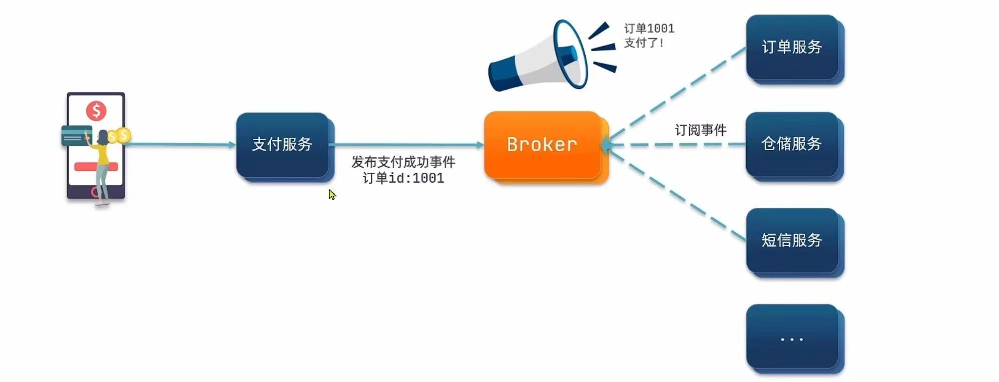
A事件——>Broken事件订阅（广播模式）——>其他事件   
当A事件通知给Broken后，Broken会通知其他事件，并且立即给A反馈，从而不需要A等待浪费资源，其他事件执行的快慢就不关心了  
优点：服务解耦、性能提升吞吐量提高（耗时减少）、 不担心级联失败问题、流量削峰（起到缓冲作用）  
缺点：依赖于Broken的可靠性、结构复杂，没有明显的流程线，不好追踪管理  

### 消息队列（MQ）   
MQ 中文是消息队列，字面来看就是存放消息的队列，也就是图中的Broker  

1.下载安装  
```
docker load -i rabbitmq.tar  # 自动解压并且导入镜像  
docker pull rabbitmq:management  # 下载镜像    
docker run -d --name rabbitmq -p 5672:5672 -p 15672:15672   -e RABBITMQ_DEFAULT_USER=admin -e RABBITMQ_DEFAULT_PASS=123456  rabbitmq:management # 启动容器，配置用户名和密码  15672是客户端、5672是服务端   
```
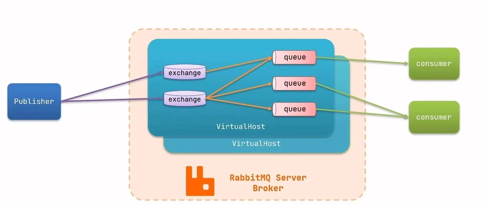
每个用户会拥有自己的虚拟主机，每个虚拟主机之间都是隔离的看不到的  

2.RabbitMQ的结构  

#### 队列模型：
基本消息队列  
一个生产者——>队列——>一个消费者  
生产者代码  
```
public class Producer {
  ConnectionFactory factory = new ConnectionFactory();
  //建立连接工厂  
  factory.setHost("192.168.1.100"); //设置IP地址  
  factory.setPort(5672); //设置服务端口号  
  factory.setVirtualHost("/"); //设置虚拟主机-每个用户有自己的虚拟主机
  factory.setUsername("admin"); //设置虚拟用户名  
  factory.setPassword("123456"); //设置密码   

  Connection connection = factory.newConnection(); //开始建立连接  
  //RabbitMQ的客户端会显示已经建立连接了  
  Channel channel = connection.createChannel(); //创建通道  
  String queueName = "queue1"; //队列名称  
  channel.queueDeclare(queueName, false, false, false, null); //声明队列    
  String message = "Hello World"; //消息内容    
  channel.basicPublish("exchange", queueName, null, message.getBytes()); //发送消息以字节的格式发送出去  
 
  channel.close(); //关闭通道  
  connection.close(); //关闭连接  
  //已经关闭了通道，所以不需要等待回复消息就结束了耦合  
}
```

之后可以去客户端看到队列的发送
消费者的代码  
```
public class Consumer {
  ConnectionFactory factory = new ConnectionFactory();
  //建立连接工厂  
  factory.setHost("192.168.1.100"); //设置IP地址  
  factory.setPort(5672); //设置服务端口号  
  factory.setVirtualHost("/"); //设置虚拟主机-每个用户有自己的虚拟主机
  factory.setUsername("admin"); //设置虚拟用户名  
  factory.setPassword("123456"); //设置密码   

  Connection connection = factory.newConnection(); //开始建立连接  
  //RabbitMQ的客户端会显示已经建立连接了  
  Channel channel = connection.createChannel(); //创建通道虽然之前生产者生产过，但是不知道先后顺序，所以仍然需要创建通道这样可以保险    
    
   channel.baseicConsume(queueName, true, new DefaultConsumer(channel)){
   //方法里面的DefaultConsumer是匿名内部类   
   @Override
   public void handleDelivery(String consumerTag, Envelope envelope,
                             AMQP.BasicProperties properties, byte[] body) throws IOException {
                              String message = new String(body);//将字符转化为字符串  
                              System.out.println("收到消息：" + message);
   }
   //这是异步的处理方法，表示一旦队列里面有消息就会怎么处理   
   }
}
```

工作消息队列  
一个生产者——>队列——>多个消费者  

发布订阅模型  
一个生产者——>交换机——>多个队列——>多个消费者  
交换机三种类型——广播、路由、主题  


### SpringAMQP  
AMQP定义：AMQP是应用程序或之间传递业务消息的开放标准。该协议与语言和平台无关，更符合微服务独立性的要求  
Spring AMQP：是基于AMQP协议定义的API规范，提供了模板，其中Spring-amqp是基础抽象类，Spring-rabbit 是底层的默认实现  

实现流程  
1.引入依赖：  
```
<dependency>
  <groupId>org.springframework.boot</groupId>
  <artifactId>spring-boot-starter-amqp</artifactId>
</dependency>
```
2.利用RabbitTemplate发送消息    
在服务中编写配置类  
```
spring:
  rabbitmq:
    host: 192.168.1.100 
    port: 5672 
    virtual-host: / //虚拟主机  
    username: admin
    password: 123456
```

3.编写生产者代码  
```
@RunWith(SpringRunner.class)  //拥有SPRING的运行环境  
@SpringBootTest
public class Producer {
  @Autowired
  private RabbitTemplate rabbitTemplate;
  public void sendMessage() {
    String quename = "simple_queue";
    String message = "Hello World";
    rabbitTemplate.convertAndSend(quename,  message);
    //选择队列名称和发送的消息  
  }
}
```

4.编写消费者代码——引入依赖——配置文件    
```
@Component
public class Consumer {
  @RabbitListener(queues = "simple_queue") //监听队列名称    
  public void receiveMessage(String message) throws InterruptedException {
    System.out.println("收到消息：" + message);
  }
  //监听的消息在message里面——传过来的是byte[]但是Spring会自动转化为字符串    
}
//消息一旦消费就会从队列拿出来，RabbitMQ没有消息回溯功能  
```

### 队列——消费者模型   
一对多模式——消费者具有合作关系  
工作队列，可以提高消息处理速度，避免队列消息堆积   
思路：  
1.在publisher服务中定义测试方法，每秒产生50条消息，发送到队列中  
2.在消费者服务中定义两个消费者，一个消费者每秒处理20条消息，另一个消费者每秒处理10条消息    
```
@RunWith(SpringRunner.class)  //拥有SPRING的运行环境  
@SpringBootTest
public class Producer {
  @Autowired
  private RabbitTemplate rabbitTemplate;
  public void sendMessage() {
    for (int i = 0; i < 50; i++) {
      String quename = "simple_queue";
      String message = "Hello World" + i;
      rabbitTemplate.convertAndSend(quename,  message);
      Thread.sleep(20);  
      //选择队列名称和发送的消息  
    }
  }
}
```

消费者
```
@Component
public class Consumer {
  @RabbitListener(queues = "simple_queue") //监听队列名称    
  public void receiveMessage(String message) throws InterruptedException {
    System.out.println("消费者1收到消息：" + message);
    Thread.sleep(20);
  }
  //监听的消息在message里面——传过来的是byte[]但是Spring会自动转化为字符串    
}


@Component
public class Consumer {
  @RabbitListener(queues = "simple_queue") //监听队列名称    
  public void receiveMessage(String message) throws InterruptedException {
    System.out.println("消费者2收到消息：" + message);
    Thread.sleep(200);
  }
  //监听的消息在message里面——传过来的是byte[]但是Spring会自动转化为字符串    
}
```
但这样配置是奇偶数分配——RibbonMQ 的消息（预取机制）  
就是消费者1、2会预先取出队列中的所有消息——平均分配，所以需要修改配置文件  
```
spring:
  rabbitmq:
    listener:
      simple:
        prefetch: 1 # 每次只从队列中取一条消息,只有处理完这一条消息才会处理下一条消息    
```  

### 发布订阅模型    
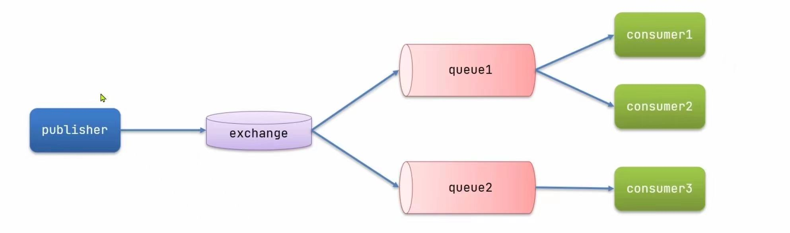   
1.Fanout:广播  
2.Direct:路由    
3.Topic:主题    
路由器只负责消息的转发   
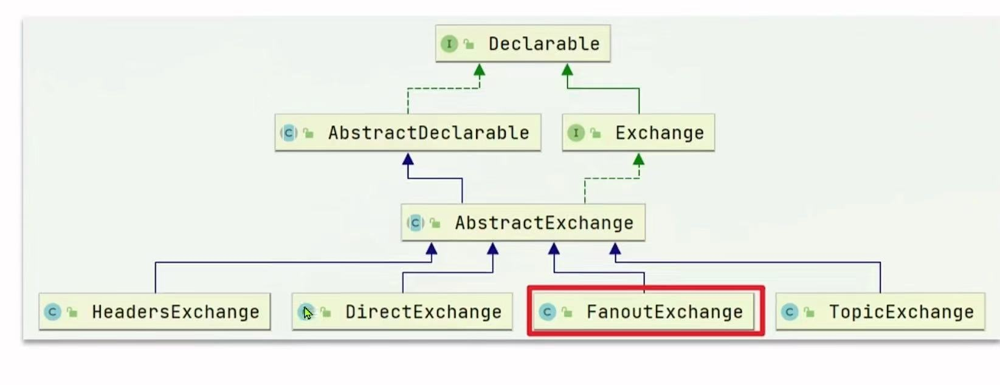  


#### Fanout模式  
交换机接受的消息每个队列都可以收到，需要绑定
```
@Configuration//表示是个配置类  
public class FanoutConfig {
 //声明交换机  
  @Bean
  public FanoutExchange fanoutExchange() {
    return new FanoutExchange("fanout.exchange");//给交换机起名
  }
  //声明队列  
  @Bean
  public Queue fanoutQueue1() {
    return new Queue("fanout.queue1");//给队列起名
  }

  //绑定交换机和队列  
  @Bean
  public Binding fanoutBinding1() {
    return BindingBuilder.bind(fanoutQueue1()).to(fanoutExchange());//绑定交换机和队列
  }


  @Bean
  public Queue fanoutQueue2() {
    return new Queue("fanout.queue2");//给队列起名
  }

 @Bean
  public Binding fanoutBinding2() {
    return BindingBuilder.bind(fanoutQueue2()).to(fanoutExchange());//绑定交换机和队列
  }
}


//调用API即可  
```  
会在RibbonMQ 客户端生成一个交换机  

生产者  
```
public class Producer {
  String exchangeName = "fanout.exchange";
  String message = "Hello World";
  rabbitTemplate.convertAndSend(exchangeName, "", message);//RoutingKey为空 
}
```

#### Direct模式  
交换机会将接受到的消息根据规则路由到指定的队列中，称为路由模式    
实现过程：  
每个队列都会与交换机设置一个BindingKey  
发布者发送消息时，指定消息的RoutingKey  
Exchange将消息路由到BindingKey与RoutingKey一致的队列中,可以绑定多个BindingKey  
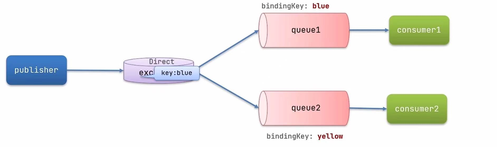    

利用RabbitListernr注解去绑定  
```
@RabbitListener(bindings = @QueueBinding(
  value = @Queue(name = "direct.queue1"),
  exchange = @Exchange(name = "direct.exchange", type = "direct"),
  key = {"direct.key1", "direct.key2"}
))
public void listenDirectQueue1(String message) {
System.out.println("消费者1收到消息：" + message);
}
```
然后客户端中能看见相对应得东西  

生产者  
```
public void sendMessage() {
  String exchangeName = "direct.exchange";
  String message = "Hello World";
  rabbitTemplate.convertAndSend(exchangeName, "direct.key1", message); //指定RoutingKey 
}
```

#### Topic模式  
Topic模式和Direct模式类似，但是Topic模式可以模糊匹配用.分割      
#代表一个或多个字符，\*代表一个单词  如：china.# /china.\*     
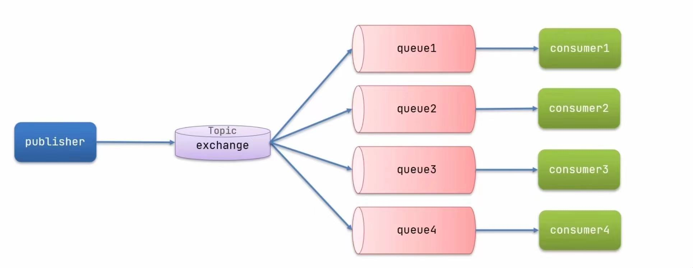    

在消费者绑定  
 ```
 @RabbitListener(bindings = @QueueBinding(
  value = @Queue(name = "topic.queue1"),
  exchange = @Exchange(name = "topic.exchange", type = ExchangeTypes.TOPIC),
  key = "china.#"  
))  
public void sendMessage() {
  System.out.println("消费者1收到消息：" + message);
 }
 ``` 

生产者发送得消息需要以.为分割    
```
public void sendMessage() {
  String exchangeName = "topic.exchange";
  String message = "Hello World";
  rabbitTemplate.convertAndSend(exchangeName, "china.news", message); //指定RoutingKey 
}
```


### RabbitMQ--消息转化器  
发送一个对象类型得
```
public void testSendObjectQueue(){

  Map<String, Object> map = new HashMap<>();
  map.put("id", 1);
  map.put("name", "张三");
  rabbitTemplate.convertAndSend("object.queue", map);

}
```
发送出得是一个Object类型，会自动使用java序列化将他序列化。但是java序列化容易造成数据体比较大。  
修改序列化——使用JSON  
导入依赖：  
```
<dependency>
  <groupId>com.fasterxml.jackson.dataformat</groupId>
  <artifactId>jackson-dataformat-xml</artifactId>
  <version>2.9.10</version>
</dependency>
```
我们在启动类声明MessageConverter    
```
@Bean
public MessageConverter messageConverter() {
  return new Jackson2JsonMessageConverter();  //使用JSON序列化  
}
```

接受JSON  
引入依赖  
```
<dependency>
  <groupId>com.fasterxml.jackson.dataformat</groupId>
  <artifactId>jackson-dataformat-xml</artifactId>
  <version>2.9.10</version>
</dependency>
```

在启动类创建Bean  
```
@Bean
public MessageConverter messageConverter() {
  return new Jackson2JsonMessageConverter();  //使用JSON序列化  
}
```
 
 定义消费者  
 ```
 @RabbitListener(queues = "object.queue")
 public void receiveMessage(Map<String, Object> map) {
  System.out.println("消费者收到消息：" + map);
 }  //JSON是一种map结构，所以可以接受  
 ```


## 分布式搜索  
### elasticsearch    
    定义：是帮助我们从海量数据中快速找到需要的内容——存储、计算、搜索数据（lucene）   
    提供了Restful API接口，可以被任何语言调用，支持分布式可水平扩展  

  底层技术——倒排索引  
  正向索引：按照ID在表格中不断查询，如果采用模糊查询内容的时候，需要遍历整个表格，效率低下  
  倒排索引：会创建一个词条（文档（每条数据就是一个文档）按照语义分成的词语），会根据词条来储存ID ——词条不能重复存储的ID往后面追加即可  
  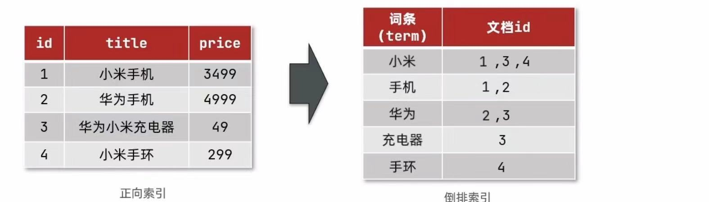    
过程：填入搜索词——>去词条列表查询文档Id(会把搜索词划分为多个词条)——>根据文档ID查询文档——>存入结果集  
经历了两次查询，第一次查询词条列表，第二次查询文档列表（这个不需要查看文档内容速度快）  

Elasticsearch 是面向文档存储的，可以是数据库中的一条商品数据，一个订单信息。文档会被序列化为Json格式后存储在elasticsearch中的。  
索引：相同类型的文档的集合————传过来的JSON会判断是否标题一样（类似数据库里面的表）  
映射：索引中文档的字段约束信息，类似表的约束  
文档————数据库表中的行  
字段————数据库表中的列  
DSL（JSON风格的请求语句，发出的是http请求类型所以与语言无关） ————SQL  

Mysql擅长事务类型操作，可以确保数据的安全和一致性————读操作  
Elasticsearch擅长海量数据的搜索，可以提供近实时的搜索服务————写操作   

所以可以使用mysql同步技术到Elasticsearch  

### 安装elasticsearch  
1.创建网络  
```
docker network create es-network  
```
2.拉取镜像  
```
docker pull elasticsearch:7.12.1
```
3.启动容器  
```
docker run -d --name es 
--net es-network 
-p 9200:9200 //http端口
-p 9300:9300 //集群端口
-e "discovery.type=single-node"   //单点运行
-e "ES_JAVA_OPTS=-Xms512m -Xmx512m"  //设置JAVA运行的内存大小，默认是1G，因为不需要这么大但是不能小于512这个值否则会运行失败  
 -v /mydata/elasticsearch/plugins:/usr/share/elasticsearch/plugins  //挂载插件目录
 -v /mydata/elasticsearch/data:/usr/share/elasticsearch/data  //挂载数据目录
 elasticsearch:7.12.1
```
可以在客户端9200端口访问看到一个JSON格式  

安装kibana——可视化界面  
1.拉取镜像  
```
docker pull kibana:7.12.1
```
2.启动容器  
```
docker run -d --name kibana
 --net es-network
  -e "ELASTICSEARCH_HOSTS=http://es:9200"  //这里的es是容器名，但在同一个网络中所以可以互连  
  -p 5601:5601 
  kibana:7.12.1
  //启动速度比较慢————直接在浏览器中输入http://192.168.1.100:5601/  
```
作用：发送一个Restful请求给elasticsearch，模拟DSL请求  

### 分词器  
es在创建倒排索引时需要对文档分词；在搜索时，需要对用户输入内容分词。但默认的分词规则对中文处理并不友好。  
```
POST /_analyze {  //analyze索引库名称
  "analyzer": "english",  //会逐字分词——因为没有办法理解中文分词  
  "text": "中华人民共和国"
}
```sousuo

中文分词一般采用IK分词器  
1.在线安装——在容器内部安装
```
docker exec -it es /bin/bash
./bin/elasticsearch-plugin install 
https://github.com/medcl/elasticsearch-analysis-ik/releases/download/v7.12.1/elasticsearch-analysis-ik-7.12.1.zip
exit 
docker restart es  
```

2.离线安装——在容器外部安装通过插件目录  
```
cd /usr/share/elasticsearch/plugins
将解压好的文件夹放在插件目录就可以了  
docker restart es  
```

可以使用IK分词器了  
有两个模式1.ik_smart 2.ik_max_word  
ik_smart：会进行最少切分———从字数多向字数少分  
ik_max_word：会进行最细粒度切分——会根据分词的内容再分词  

原理：依赖于字典分词  
所以需要修改字典分词的拓展词库——IK分词器的目录下的config目录中的IKAnalyzer.cfg.xml文件   
```
<?xml version="1.0" encoding="UTF-8"?>
<!DOCTYPE properties SYSTEM "http://java.sun.com/dtd/properties.dtd">
<properties>
  <comment>IK Analyzer 扩展配置</comment>
  <entry key="ext_dict">
   //拓展字典 ——这个在当前配置文件的目录中的文件  
  </entry>
  <entry key="ext_stopwords">
   //停用词 ——这个在当前配置文件的目录中的文件  
  </entry>
</properties>
```  


### 索引库操作    
mapping是对索引库的映射，定义了索引库中的字段名称、类型、是否分词等属性  

  #### 创建索引库
type:字段数据类型，常见的有：  
 字符串：text（会分词）、keyword（精确值）  
 数值：long、integer、short、byte、double、float  
 布尔：boolean  
 日期：date  
 对象：object  
 地理位置：geo_point （经纬度点） 、geo_shape （多边形）  

 ES 中没有数组的类型但是可以存储多个  
index:是否创建索引，默认为true是否创建倒排索引————用来做搜索才需要 如果不需要就要false 
analyzer:分词器类型 一般只有text类型需要分词  
properties:指定字段的子字段  
```
PUT /索引库名称  
{
  "mappings":{
    "properties":{
      "字段名1":{
        "type": "text",
        "analyzer": "ik_smart",
      },
      "字段名2":{
        "properties":{
          "字段名2.1":{
            "type": "text",
            "analyzer": "ik_smart",
          },
          "字段名2.2":{
            "type": "text",
            "analyzer": "ik_smart",
            //一旦指定为text就需要分词器  
          } 
        }
      }
    }
  }
}
```

#### 查询、删除、修改索引库（表）  
```
GET /索引库名称
DELETE /索引库名称
```

修改索引库————不允许修改索引库的结构，但是可以添加新的字段  
```
PUT /索引库名称/_mapping
{
  "properties":{
    "新的字段名":{
      "type": "text",
    }
  }
}
```  
 
#### 文档操作    
添加文档  
```
POST /索引库名称/_doc/文档id  //不添加id会自动随机生成  
{
  "字段名1":"值1",
  "字段名2":"值2",
  "字段名3":{
    "字段名3.1":"值3.1",
    "字段名3.2":"值3.2"
  }
}
```

查询文档id 
```
GET /索引库名称/_doc/文档id
```

查询所有文档  
```
GET /索引库名称/_search
```

删除文档  
```
DELETE /索引库名称/_doc/文档id
```

会根据文档id对这个文档每次的version会增加  

修改文档  
1.全量修改，删除旧文档，添加新文档——如果id没有能做修改也能作为新增就是需要每个值都对应       
```
PUT /索引库名称/_doc/文档id
{
  "字段名1":"值1",
  "字段名2":"值2",
}
```
2.局部修改，修改文档中的部分字段只修改一个版本号都会变化      
```
POST /索引库名称/_update/文档id
{
  "doc":{
    "字段名1":"值1",
  }
}
```

### RestClient操作索引库    
定义：是ES官方提供了各种不同语言的客户端，来操作ES。这些客户端的本质就是组装DSL语句，通过http请求发送给ES。  
如果输入一个字段想要同时搜索多个文档，那么可以使用copy_to属性将当前字段的索引指向新的字段中，然后使用新的字段搜索。    
```
"all":{
  "type":"text",
  "analyzer":"ik_max_word"
},
"brand":{
  "type":"keyword",
    "copy_to":"all"
},
"name":{
  "type":"integer",
  "copy_to":"all"
}
```
这样就实现了all的字段可以实现倒排索引，里面包括了brand和name，这只是添加了一个索引标志而没有内容重写  
搜索的时候使用 `Post /索引库名称/_search` 
```
{
  "query":{
    "all":"搜索内容"
  }
}
```
这样就会返回文档（有all字段内容的选中映射的）所有内容

#### 初始化RestClient    
1.引入依赖 es的依赖 
```
<dependency>
  <groupId>org.elasticsearch.client</groupId>
  <artifactId>elasticsearch-rest-high-level-client</artifactId>
</dependency>
```
2.保证springboot的默认ES版本号覆盖  
```
<properties>
  <java.version>1.8</java.version>
  <elasticsearch.version>7.12.1</elasticsearch.version>
</properties>
```
3.初始化RestHighLevelClient  
```
@BeforeEach
public void restHighLevelClient(){
    this.client = new RestHighLevelClient(RestClient.builder(
      HttpHost.create("http://192.168.1.100:9200"),
       HttpHost.create("http://192.168.1.101:9200")));
}
//集群可以有多个  

@AfterEach
public void close() throws IOException{
  this.client.close();
}

//创建索引库
@Test
public void createIndex() throws IOException{
  //创建索引库的请求体
  CreateIndexRequest request = new CreateIndexRequest("索引库名称");
  //发送请求类似  ： PUT /索引库名称
 request.source(MAPPING_CONTENT, XContentType.JSON);
 //指定数据载体JSON格式    MAPPING_CONTENT这个是一个STRING类型的常量，表示DSL语句    
  client.indices().create(request, RequestOptions.DEFAULT);
  //发送请求——请求头信息   client.indices()获取索引库操作对象  
}


//删除索引库
@Test
public void deleteIndex() throws IOException{
  DeleteIndexRequest request = new DeleteIndexRequest("索引库名称");
  client.indices().delete(request, RequestOptions.DEFAULT);
}

//判断是否存在  
@Test
public void existsIndex() throws IOException{
  GetIndexRequest request = new GetIndexRequest("索引库名称");
  boolean exists = client.indices().exists(request, RequestOptions.DEFAULT);
  System.out.println(exists);
}
```
所有索引库的操作都在client.indices()中，只有请求不一样  

#### 实现文档的增删改查  
去数据库查询然后导入索引库中  

```
@SpringBootTest


@Autowired
private IHotelService hotelService;
//导入数据库的增删改查  

private RestHighLevelClient client;

@BeforeEach
public void restHighLevelClient(){
    this.client = new RestHighLevelClient(RestClient.builder(
      HttpHost.create("http://192.168.1.100:9200"),
       HttpHost.create("http://192.168.1.101:9200")));
}
//集群可以有多个  

@AfterEach
public void close() throws IOException{
  this.client.close();
}


//添加文档——索引库已经有了-实现了数据库到索引库的转化  
@Test
public void addDocument() throws IOException{
  Hotel hotel = hotelService.getById(1L);
  //这时候就需要注意到这个是数据库里面的实体类，而DSL语句中定义的文档可能有些数据对不上所以需要合并之类的操作  
  HotelDoc hotelDoc = new HotelDoc(hotel);//实现了数据库到索引库的转化  

  IndexRequest request = new IndexRequest("索引库名称").id(hotel.getId().toString());
  //准备request请求体
  request.source(JSON.toJSONString(hotelDoc), XContentType.JSON);
  //发送请求
  client.index(request, RequestOptions.DEFAULT);
}


//查询文档  查询一个空文档会返回nil
@Test
public void getDocument() throws IOException{
  GetRequest request = new GetRequest("索引库名称").id("1");
  GetResponse response = client.get(request, RequestOptions.DEFAULT);
  String json = response.getSourceAsString();//需要的其实是_source字段  
  System.out.println(json);
}


//修改文档——使用方法二 
@Test
public void updateDocument() throws IOException{
  UpdateRequest request = new UpdateRequest("索引库名称,"ID");
  request.doc(
    "字段名1":"值1",
    "字段名2":"值2"
  )
//对应更改的内容  
  client.update(request, RequestOptions.DEFAULT);

}

//删除文档  
@Test
public void deleteDocument() throws IOException{
  DeleteRequest request = new DeleteRequest("索引库名称","ID");

  client.delete(request, RequestOptions.DEFAULT);
}


//批量导入文档  
@Test
public void bulkDocument() throws IOException{
List<Hotel> hotels = hotelService.list();

BulkRequest request = new BulkRequest();
  //准备请求体

  
for (Hotel hotel : hotels) {
  HotelDoc hotelDoc = new HotelDoc(hotel);
  request.add(new IndexRequest("索引库名称")
  .id(hotel.getId().toString())
  .source(JSON.toJSONString(hotelDoc), XContentType.JSON));
}
  //添加批量请求  

  client.bulk(request, RequestOptions.DEFAULT);
}
//这样只会发一个请求,就不会频繁的触发，注意如果中途有DSL是错误的也不会中断批处理，会在最后显示哪里错误，其他的正常执行，也没有回滚机制的    

```
#微服务技术  
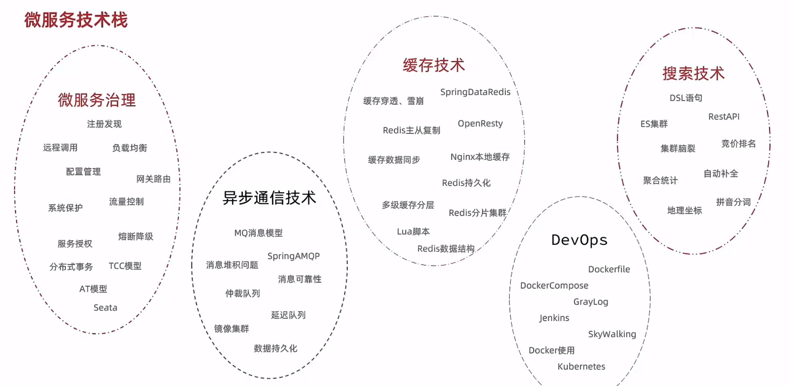  

### 文档的查询  
Query DSL 查询 包括  
1. 查询所有文档——查询所有数据      
2. 全文检索查询——利用分词器对输入内容分词，然后去倒排索引库查询  
match_query、multi_match_query  
3. 精确查询——根据精确词条值查找数据，一般查询不分词的字段  
ids 、 range  、 term  
4. 地理查询——根据经纬度查询   
geo_distance、geo_bounding_box、geo_polygon、geo_distance_range    
5. 复合查询——组合查询，将多个查询条件组合在一起  
bool  
function_score  
  
#### 基本语法 
1. 查询所有文档  
```
GET /索引库名称/_search 
{
    "query": {
        "查询类型": {
            "查询条件": "条件值 "
        }
    }
}


//对应的  
GET /索引库名称/_search 
{
    "query": {
        "match_all": {}
    }
}

//会返回相对应的数据
{
    "took": 0,  //查询花费时间
    "timed_out": false, //是否超时
    "_shards": {
        "total": 1,
        "successful": 1,
        "skipped": 0,
        "failed": 0
    },
    "hits": {   //命中的数据
        "total": {
            "value": 1,
            "relation": "eq"
        },  //搜索的总条数  
        "max_score": 1,  //最大得分
        "hits": [
            {
                "_index": "索引库名称",
                "_type": "类型",
                "_id": "id",
                "_source": {
                    "字段1": "值1",
                    "字段2": "值2"
                }
            }
        ]
    }
}
```

2. 全文检索查询  
定义：类似于对用户输入内容分词，常用于搜索框搜索  

```
GET /索引库名称/_search 
{
    "query": {
        "match": {
            "all": "条件值" //这个会根据相关度进行排先后，条件值分词然后分次后出现的多少次数以及相关度进行打分——会使用一个默认的all进行把所有数据库里面的内容进行关联，一般只写一个关联的如content、name、title，也可以使用自己关联的字段如all，从而速度变快。      
        }
    }
}

//multi_match  查询  
GET /索引库名称/_search  
{
    "query": {
        "multi_match": {
            "query": "条件值", //查询的条件值
            "fields": ["字段1", "字段2"]  //只要有任意一个字段的内容存在条件值，就会返回，并且会根据相关度进行排先后——但是这个效率会变低，因为不要多个字段去查询而是按照上面的把多个字段copy_to到all字段里面，然后进行查询，这样速度会变快  
        }
    }
}

```

3. 精确查询  
定义：根据词条值查询，常用于查询过滤，值不可分割    

```
//term——精确值查询  
GET /索引库名称/_search 
{
    "query": {
        "term": {
            "FIELD":{
            "value": "条件值"//必须完全一致  
            }
        }
    }
}

//range  范围查询    
GET /索引库名称/_search 
{
    "query": {
        "range": {
            "FIELD": {
                "gte": 10, //大于等于 gt 大于不等于  
                "lte": 20 //小于等于
            }
        }
    }
}
```

4. 地理查询  
定义：根据经纬度查询，常用于地图查询，查询一定范围内的数据    

```
GET /索引库名称/_search 
{
    "query": {
        "geo_bounding_box": {
            "FIELD": { //这个FIELD是文档中自己定义的location字段里面有经纬度
                "top_left": {  //表示FIELD字段里面的左上角 
                    "lat": 39.9, //纬度
                    "lon": 116.4 //经度
                },
                "bottom_right": { //表示FIELD字段里面的右下角
                    "lat": 39.9, //纬度
                    "lon": 116.4 //经度
                }//根据左上角和右下角画一个矩型之后在这个区域里面的就是符合条件的数据  
            }
        }
    }
}

//geo_distance  以某个点为中心，查询一定范围内的数据    
GET /索引库名称/_search 
{
    "query": {
        "geo_distance": {
            "FIELD":   "条件值", //FIELD这个条件值是经纬度,自己定义的location字段
            "distance": "10km" //表示以某个点为中心，查询一定范围内的数据  
        }
    }
}

```

5. 复合查询  
定义：将多个查询条件组合在一起，常用于复杂查询  
fuction score :算分函数查询，可以控制文档相关性算分，控制文档排名，人工对相关度进行干预  
词条频率（TF）=词条在文档中出现的次数/文档的总词条数    
词条逆文档频率（IDF）=log(文档总数/包含该词条的文档数+1)    
词条权重（TF-IDF）=词条频率（TF）*词条逆文档频率（IDF）    

 BM25算法——不会根据词频增加而增大，但增长曲线会趋于水平  

总的来说是由：  
（原始过相关性+过滤条件之后的值进行的算分函数）加权模式 = 新算分  
 ```
 GET /索引库名称/_search 
 {
    "query": {
        "function_score": {
            "query": {
                "match": {"all":"条件值"}  //原始的查询  
            },
            "functions": [
                {
                    "filter": {
                        "term": {"FIELD":"条件值"}  //过滤条件，符合条件的文档才会被重新算分  
                        }
                    ,
                    "weight": 2  //算分函数的结果成为function_score的算分，将来会于query score运算，得到新算分——weight:给一个常数
            //field_value_factor: 给一个字段值，根据字段值进行算分
            //random_score: 随机算分，根据随机数进行算分  
            //script_score: 脚本算分，根据脚本进行算分——自定义      
                }
            ]，
            "boost_mode":"multiply"  
            //加权模式，定义function score 与 query score(查询份素) 的计算方式   
            //multiply: 相乘  、replace: 替换 、sum: 相加 、avg: 平均值 、max: 最大值 、min: 最小值  
        }
    }
}

```

布尔查询  
定义：将多个查询条件组合在一起，常用于复杂查询   
`must`：必须满足的条件'&'    
`should`：选择性查询'|'    
`must_not`：必须不满足的条件     
`filter`：必须匹配不参与算分    

### 复合查询Boolean Query  
`must_not、filter`查询不参与算分——这种过滤性的查询会放入缓存中，从而提高查询效率 

代码如：  
```
Get /hotel/_search 
{   
  "query": {
    "bool": {  //复合查询  
      "must_not": [
          "range": {
            "price": {
                "lte": 300,
                "gte": 100
            }
        }
      ],
      "must": [
        {
          "term": {
            "brand": "汉庭"
          }，
          "term": {
            "city": "北京"
          }
        }
      ]
    }
  }
}

//所以可以多放一点在must_not和filter中，这样就可以减少计算量，提高查询效率  
Get /hotel/_search 
{   
  "query": {
    "bool": {  //复合查询  
      "must": [//这个是要算分的所以需要少
          "match": {
            "name": "如家" //match是匹配查询  
          },
      ],
      "must_not": [
          "range": {
            "price": {
                "lte": 400
           }
        }],
      "filter": {
        "geo_distance": {
          "distance": "10km",
          "location": {
            "lat": 39.9,
            "lon": 116.4
          }
        }
      }
    }
  }
}
```

### 搜索结果处理  
1.排序  
默认是按照相关度算分来排序。  
```
Get /hotel/_search 
{   
  "query": {
    "match_all": {}
  },
  "sort": [
    {
      "price": "asc"},
      {
      "_geo_distance": {
        "location": 
          "lat": 39.9,
          "lon": 116.4,
          "order": "asc",
          "unit": "km"
      }
        }  //如果存在多个排序会先按照第一个排序，如果第一个排序相同，则按照第二个排序，以此类推,这样就不会进行打分了  
  ]
}
```  

         
2.分页   
默认情况下只返回top10的数据，如果想要查询更多的数据就需要修改分页参数了  
```
Get /hotel/_search 
{   
  "query": {
    "match_all": {}
  },
  "from": n,//从第n条开始，默认是0,开始的位置
  "size": 10//默认是10，最大是10000，选择返回的数量  
}
    "sort":{
        "price": "asc"
    }
```
实际上实现是从0开始搜索到n+sieze条，然后返回n+sieze条数据，然后从n+sieze条数据中按照排序规则返回size条数据  
问题：ES是分布式的，所以会面临深度分页问题。所以需要从集群中每个都抽取size条数据，对每个size进行排序然后选择出对应的size条数据     
所以搜索页数过深，或者结果集（size+from）越大，对内存和CPU消耗也越高，所以上限为10000（超过这个限制就会报错）    
使用：search_after——分页时需要排序，原理上从上一次排序值开始查询下一页数据 
scroll——原理叫排序形成快照，保存在内存（无法查找实时数据）  


3.高亮  
在搜索结果中把关键字高亮显示    
前端的css使用em选择器——是由服务端的ES 加上的标签  
```
Get /hotel/_search 
{   
  "query": {
    "match": {
        "all": "汉庭"
    }
  },
  "highlight": {
    "fields": { //默认情况下搜索字段必须与高亮字段一致  
        "name": { //all中的name
            "require_field_match": false,//默认情况下搜索字段必须与高亮字段一致，设置为false后，搜索字段与高亮字段不一致也可以高亮
            "pre_tags": "<em>",//前缀
            "post_tags": "</em>"//后缀
        }
    }
  }
}
```

### RestClient 实现文档查询  
查询所有
```
void testSearch() throws IOException {
    //1.创建RestClient对象
   SearchRequest request = new SearchRequest("hotel");  
   //2.组织DSL参数  
   request.source()              //这个source就是专门用来组织DSL的
   .query(QueryBuilders.matchAllQuery());

   //3.发送请求
   SearchResponse response = restClient.search(request, RequestOptions.DEFAULT);

   //4.解析响应
   SearchResponse response = restClient.search(request, RequestOptions.DEFAULT);
   //将会返回结果全部封装为JSON 格式 所以需要把他转化为对象  
   SearchHits hits = response.getHits();
   //获取总条数
   long total = hits.getTotalHits().value;
   //获取结果集
   SearchHit[] hits = hits.getHits();
   //遍历结果集
   for (SearchHit hit : hits) {
    string json = hit.getSourceAsString();  
    HotelDoc hotelDoc = Json.parseObject(json, HotelDoc.class);//反序列化  
    System.out.println("hotelDoc = " + hotelDoc);
   }
}
```

查询指定字段匹配  
```
void testSearch() throws IOException {
    //1.创建RestClient对象
   SearchRequest request = new SearchRequest("hotel");  
   //2.组织DSL参数  
   request.source()              //这个source就是专门用来组织DSL的
   .query(QueryBuilders.matchQuery("name", "汉庭"));
   //QueryBuilders.matchQuery("name", "汉庭")表示的值匹配一个  
   //QueryBuilders.multiMatchQuery("汉庭", "name","brand")表示的值匹配多个    

   //3.发送请求
   SearchResponse response = restClient.search(request, RequestOptions.DEFAULT);

   //4.解析响应
   SearchResponse response = restClient.search(request, RequestOptions.DEFAULT);
   //将会返回结果全部封装为JSON 格式 所以需要把他转化为对象  
   SearchHits hits = response.getHits();
   //获取总条数
   long total = hits.getTotalHits().value;
   //获取结果集
   SearchHit[] hits = hits.getHits();
   //遍历结果集
   for (SearchHit hit : hits) {
    string json = hit.getSourceAsString();  
    HotelDoc hotelDoc = Json.parseObject(json, HotelDoc.class);//反序列化  
    System.out.println("hotelDoc = " + hotelDoc);
   }
}
```
因为重复的有很多所以可以抽取  
```
@Test
void handleResponse(SearchResponse response) {
     SearchHits hits = response.getHits();
   //获取总条数
   long total = hits.getTotalHits().value;
   //获取结果集
   SearchHit[] hits = hits.getHits();
   //遍历结果集
   for (SearchHit hit : hits) {
    string json = hit.getSourceAsString();  
    HotelDoc hotelDoc = Json.parseObject(json, HotelDoc.class);//反序列化  
    System.out.println("hotelDoc = " + hotelDoc);
   }
}
```
精确查询、范围查询仅仅只需要修改请求体
`QueryBuilders.termQuery("name", "汉庭")`   
`QueryBuilders.rangeQuery("price", 100, 300)` 

复合查询需要重新申请一个boolQuery  
```
 BoolQueryBuilder boolQuery = QueryBuilders.boolQuery();
 boolQuery.must(QueryBuilders.termQuery("name", "汉庭"));
 boolQuery.filter(QueryBuilders.rangeQuery("price", 100, 300));
```

排序和分页  
`request.source().from(0).size(10)` 分页，因为是支持链式编程的即不管调用那种方法返回的还是request.source的对象      
`request.source().sort("price", SortOrder.ASC)` 对应字段和排序方式  

高亮  
1.请求的构建都是链式编程    
`request.source().highlight(new HighlightBuilder().field("name").requireFieldMatch(false))`  requireFieldMatch(false)表示的是搜索字段与高亮字段不一致也可以高亮  
2.响应的解析——高亮部分在Highlight中    
```
//因为查询出来的都是有的所以只需要高亮的结果  
 HotelDoc hotelDoc = Json.parseObject(response.getHits().getHits()[0].getSourceAsString(),HotelDoc.class);//反序列化
Map<String, HighlightField> highlightFields = hit.getHighlightFields();//表示高亮部分是一种Map类型
if(CollectionUtils.isNotEmpty(highlightFields)){
   HighlightField highlightField = highlightFields.get("name");
   if(highlightField != null){
    String name = highlightField.getFragments()[0].String();  
    //这样就可以覆盖原来的name 从而实现高亮 替换了原来的name   
    hotelDoc.setName(name);
   }
}
``` 
获取高亮字段  

地理坐标排序  
```
request.source().sort("price",SortOrder.ASC);  
request.source().sort( SortBuliders  //排序器
.geoDistanceSort("location",new GeoPoint(116.4, 39.9)))
.order(SortOrder.ASC)
.unit(DistanceUnit.KILOMETERS) //单位

```

相关性算分  
```
FunctionScoreQueryBuilder functionScoreQuery = QueryBuilders.functionScoreQuery(
    QueryBuilders.matchQuery("name","外滩"),
    new FunctionScoreQueryBuilder.FilterFunctionBuilder[]{ //满足条件的进行加权分，不满足的维持原本的分数不变
        QueryBuliders.termQuery("isAD ","1"), //过滤条件
        ScoreFunctionBuilders.weightFactorFunction(2) //权重
    }
)
request.source().query(functionScoreQuery);
```


### 数据聚合  
种类：  
统计、分析、运算  

1.桶聚合——文档做分组    
TermAggregation：按照文档**字段值**分组   
Date Histogram：按照日期分组(一周、一月、一季度)  


```
Get /hotel/_search  
{
  "size ":0, //设置size为0，表示不返回文档，只返回聚合结果  
  "aggs": {  //定义聚合  
    "brandAgg": {  //定义聚合名称  
      "terms": {  //聚合类型  ——按照字段分组  
        "field": "brand",  //参与聚合字段  
        "size": 10  //参与聚合的桶的个数  
        "order": {
          "_count": "desc" //按照价格降序排序
        }
      }
    }
  }
}
//先按照terms寻找对应的，会按照brand字段进行分组，然后返回每个品牌的文档数量 ，按照给定的size返回所以可能还有多余的  


Get /hotel/_search  
{
  "query": {
    "range": {
      "price": {
        "gte": 100,
        "lte": 300
      }
    }
  },
  "size ":0, //设置size为0，表示不返回文档，只返回聚合结果  
  "aggs": {  //定义聚合  
    "brandAgg": {  //定义聚合名称  
      "terms": {  //聚合类型  ——按照字段分组  
        "field": "brand",  //参与聚合字段  
        "size": 10  //参与聚合的桶的个数  
        "order": {
          "_count": "desc" //按照价格降序排序
        }
      }
    }
  }
}

//先利用搜索，再用聚合，这样就能减少聚合的文档数量，从而提高聚合的效率  

```


2.度量聚合——计算文档的指标  
用以计算最大值、最小值、平均值  
```
Get /hotel/_search  
{
  "size ":0, //设置size为0，表示不返回文档，只返回聚合结果  
  "aggs": {  //定义聚合  
    "brandAgg": {  //定义聚合名称  
      "terms": {  //聚合类型  ——按照字段分组  
        "field": "brand",  //参与聚合字段  
        "size": 10  //参与聚合的桶的个数
        "order": {
          "priceAgg.avg": "desc" //按照价格降序排序
        }
      },
      "aggs": {  //聚合的嵌套  
        "priceAgg": {
          "stats": {  //度量聚合类型  全部计算出对应的min、max、avg、sum
            "field": "source" //参与度量字段
          }
        }
      }
    }
  }
}


```


使用RestClient实现    
```
request.source().size(0)  
request.source().aggregation(
  AggregationBuilders
  .terms("brandAgg")————使用的是terms聚合  
  .field("brand")
  .size(10)
)
request.source().aggregation(
  AggregationBuilders
  .terms("nameAgg")————使用的是terms聚合  
  .field("name")
  .size(10)
)
SearchResponse response = restClient.search(request, RequestOptions.DEFAULT);

Aggregations aggregations = response.getAggregations(); //获取聚合结果
Terms brandAgg = aggregations.get("brandAgg");  //通过聚合名称取得结果,返回的是一个terms类型  
for (Terms.Bucket bucket : brandAgg.getBuckets()) {  
    String brand = bucket.getKeyAsString();//取得品牌名称
    long count = bucket.getDocCount();
    System.out.println(brand + " : " + count);
}
  
  //如果对多个聚合会产生多个terms类型的数据  

 ``` 


### 自动补全  
1.拼音分词器  
安装拼音分词器——类似IK分词器  
反到plugin目录下，解压，进入bin目录，执行命令，重启ES  
```
POST /_analyze  
{
  "analyzer": "pinyin", //就会按照拼音进行分词  
  "text": ["汉庭"]
}
```
缺点：不会先分词，并且只有汉字没有拼音  


2.定定义分词器  
三部分：  
a. character filters 字符过滤器——对文本进行预处理如替换、删除    
b. tokenizer 分词器——将文本按照一定的规则分割成词条（IK分词器）    
c. token filters 词过滤器——将词条更近异步的处理，如大小写转化，同义词处理  

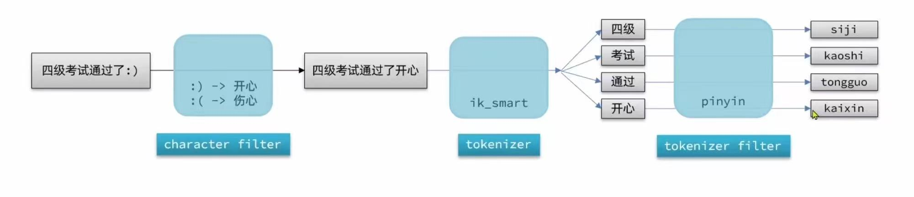  
我们要在创建索引库时，通过Settings来配置自定义分词器，所以只对当前索引库有效    
```
PUT /test 
{
  "settings": {//设置索引库的设置
    "analysis": {
      "analyzer": {  //自定义分词器  
        "my_analyzer": {  // 分词器名称  
       "tokenizer": "ik_max_word", //分词器类型  
       "filter": "py" //自定义一个词条过滤器的属性 
        }
        },
      "filter": {
        "py": {  //过滤器名称  
          "type": "pinyin",
          "keep_first_letter": true,
          "keep_full_pinyin": false
        }
      }
      "mapping": {
        "properties": {
          "name": {
            "type": "text",
            "analyzer": "my_analyzer" //使用自己的自定义分词器  
          }
        }
      }
    }
}
}
```
创建倒排索引的时候使用pinyin分词器没有问题，但是在搜索的时候不应该使用pinyin分词器不然同音字会有冲突  
```
PUT /test   //插入的索引库   
{
  "settings": {//设置索引库的设置
    "analysis": {
      "analyzer": {  //自定义分词器  
        "my_analyzer": {  // 分词器名称  
       "tokenizer": "ik_max_word", //分词器类型  
       "filter": "py" //自定义一个词条过滤器的属性 
        }
        },
      "filter": {
        "py": {  //过滤器名称  
          "type": "pinyin",
          "keep_first_letter": true,
          "keep_full_pinyin": false
        }
      }
      "mapping": {
        "properties": {
          "name": {
            "type": "text",
            "analyzer": "my_analyzer" //使用自己的自定义分词器 
            "search_analyzer": "ik_max_word" //搜索的时候使用自己的自定义分词器  
          }
        }
      }
    }
}
}
```
这样就是搜索的时候使用ik_max_word分词器，创建的时候使用自己的自定义分词器    


3.自动补全查询  
自动补全类型有completion类型  ，字段的内容一般是用来补全的多个词条形成的数组  
```
POST test2
{
  "mappings": {
    "properties": {
      "title": {
        "type": "completion"   //类型为completion就是定义了自动补窜
      }
    }
  }
}


POST test2/_doc
{
  "title": ["Sonny","WH"]//参与自动补全的数组  
}


GET /test2/_search 
{
  "suggest": {  //不是做文档查询所以用suggest
    "titleSuggest": {   //查询名称  
      "text": "s",  //前缀    
      "completion": {  //类型  
        "field": "title",   //补全查询的字段  
        "skip_duplicates": true,  //跳过重复的  
        "size": 10  //返回的个数    
      }
    }
  }
}

//返回类型会按照s为前缀的实现自动补全，会返回text和完整信息  

其中定义的completion类型在java中是作为List<String>类型来存储的——由现有的信息放入      
```
使用API实现  
```
SearchRequest request = new SearchRequest("hotel");  
request.source().
        suggest(
        new SuggestBuilder()
        .addSuggestion(
      "titleSuggest",
      SuggestBuilders.completionSuggestion("title") //补全字段
      .prefix("s")  //因为就是类似前缀查询  
      .skipDuplicates(true)
      .size(10)
      )
    )
SearchResponse response = restClient.search(request, RequestOptions.DEFAULT);  
Suggest suggest = response.getSuggest();  
CompletionSuggestion titleSuggest = suggest.getSuggestion("titleSuggest");  
for (CompletionSuggestion.Entry.Option option : titleSuggest.getOptions()) {
    String text = option.getText().string();
    System.out.println(text);
}

```
### 数据同步  
数据库和ES数据同步    
1.同步调用
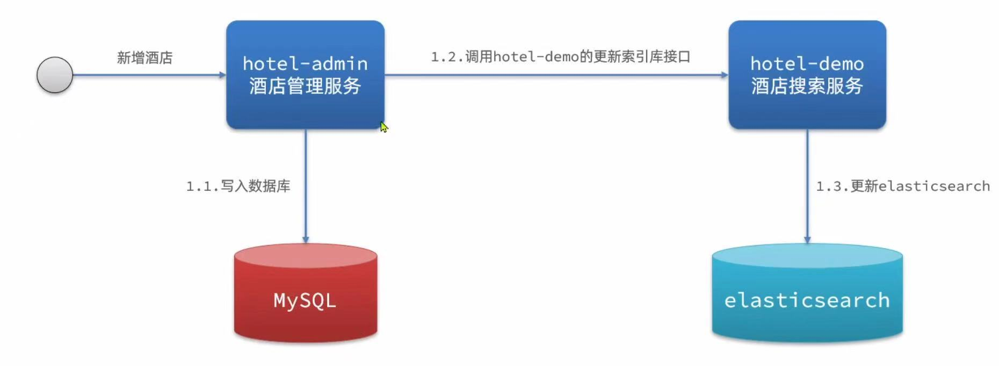  
一步变三步，依次执行，业务耦合  

2.异步通知  
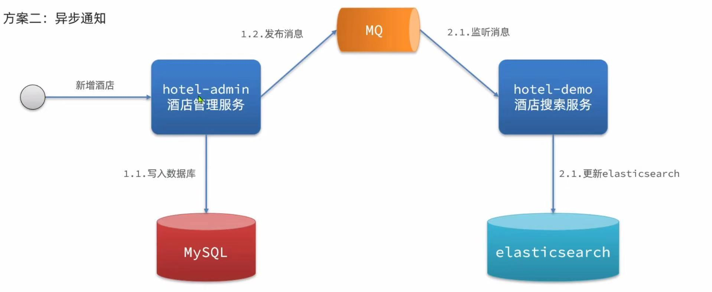  
利用MQ消息队列实现  
利用一个交换机，两个队列（增、改一个，删一个）  

3.监听binlog  
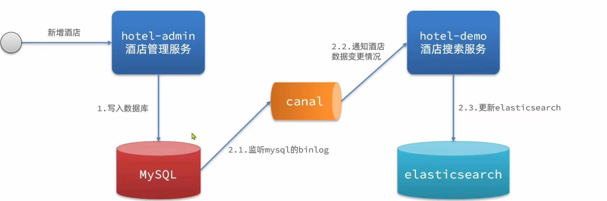  
每次数据库的增删改的时候都会引发数据库binlog的改变，依赖中间件binlog，且对数据库负荷增大，但是耦合度最低    


### 集群   
海量数据存储问题、单点故障问题  
将海量数据库从逻辑上拆分成为N片，存储到多个节点，再将分片数据存储在不同节点备份 

```
docker-compose.yml 
 

version   '2'
services:
  es01://集群名称
    image: elasticsearch:7.12.1
    container_name: es01
    environment:
      - cluster.name=es-docker-cluster//集群名称ES中只要集群名称一样就是在一个集群中了  
      - node.name=es01//节点名称
      - discovery.seed.hosts=es01,es02,es03//另外两个集群的ip地址  
      - cluster.initial_master_nodes=es01,es02,es03//初始候选主节点  
      - "ES_JAVA_OPTS=-Xms512m -Xmx512m"//内存大小
    ports:
      - "9200:9200"
    volumes:
      - ./elasticsearch.yml:/usr/share/elasticsearch/config/elasticsearch.yml
    networks:
      - es-network
  es02://集群名称
    image: elasticsearch:7.12.1
    container_name: es02
    environment:
      - cluster.name=es-docker-cluster//集群名称ES中只要集群名称一样就是在一个集群中了  
      - node.name=es02//节点名称
      - discovery.seed.hosts=es01,es02,es03//另外两个集群的ip地址  
      - cluster.initial_master_nodes=es01,es02,es03//初始候选主节点  
      - "ES_JAVA_OPTS=-Xms512m -Xmx512m"//内存大小
    ports:
      - "9201:9200"
    volumes:
      - ./elasticsearch.yml:/usr/share/elasticsearch/config/elasticsearch.yml
    networks:
      - es-network 

  es03://集群名称
    image: elasticsearch:7.12.1
    container_name: es03
    environment:
      - cluster.name=es-docker-cluster//集群名称ES中只要集群名称一样就是在一个集群中了  
      - node.name=es03//节点名称
      - discovery.seed.hosts=es01,es02,es03//另外两个集群的ip地址  
      - cluster.initial_master_nodes=es01,es02,es03//初始候选主节点  
      - "ES_JAVA_OPTS=-Xms512m -Xmx512m"//内存大小
    ports:
      - "9202:9200"
    volumes:
      - ./elasticsearch.yml:/usr/share/elasticsearch/config/elasticsearch.yml
    networks:
      - es-network

```


但是ES运行的时候需要LINUX的权限  
```
vim /etc/sysctl.conf
vm.max_map_count=262144  
sysctl -p    

//然后就可以正常运行了  
docker-compose up -d    

```

 cerebro 可视化插件用来管理集群  
 在bin下的bat文件双击运行，然后去访问9000端口  

 创建索引库中需要配置分片信息和副本数量  
```
PUT /hotel
{
  "settings": {
    "number_of_shards": 3,  //分片数量-分三篇
    "number_of_replicas": 1 //副本数量-每篇一个副本，每个副本都在集群中的不同机器上  
  }
}
```
节点类型：  
master-eligible 候选主节点-配置参数node.master=true-作用：备选主节点，主节点可以管理和记录集群状态，决定分片在那个节点，处理创建和删除索引库的请求——CPU  
data 数据节点-配置参数node.data=true-作用：存储数据，处理增删改查请求——硬件     
ingest 处理节点-配置参数node.ingest=true-作用：处理数据，处理数据清洗、处理、转换等操作 ——CPU+内存 
coordinating 协调节点-配置参数node.coordinating=true-作用：协调客户端请求，将请求转发给其他节点，并将结果返回合并给客户端（路由+负载均衡）    
默认情况下都拥有这些类型——无法控制。
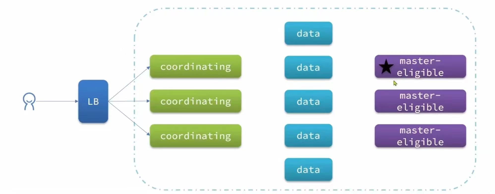  
问题：  
脑裂：如果主节点发生网络问题，即A为主节点但是网络问题只能和部分数据连接其他的数据和B、C连接，所以B、C 会先选取一个为主节点和另外一部分连接，这样就出现了两个主节点连接不同的数据，一旦网络恢复正常，就会出现两边数据不一致的情况，所以选举的节点需要满足：  （elihible节点数量+1）/2才能选为主节点，所以一般是奇数节点    

在构建索引库的时候朝某个ES发送POST请求后，在这个集群中的所有都可以使用GET去查询到，是因为使用hash算法来计算存储到那个分片  
shard = hash(_routing) % number_of_shards  
_routing默认是文档的id    
因此算法与分片数量有关，所以索引库一旦创建，分片数量就不能修改了  
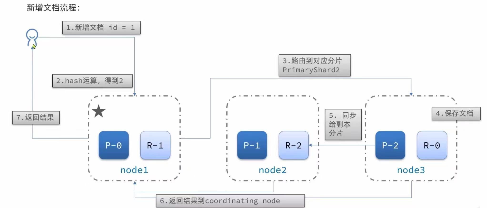    

协调查询：  
1.scatter phase 分散阶段，coordinating node会把请求分发到每一个分片    
2.gather phase 聚集阶段，coordinating node 汇总data node的搜索结果，并处理为最终结果返回给用户  
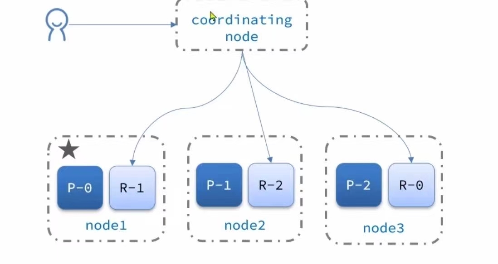  
协调节点可以是任何一个node节点   

#### 故障转移  
集群中的主节点一旦挂机，集群就需要重新选举一个主节点，然后主节点就会去观察自己还正常存在的节点是否有完整的数据，并且把挂掉的节点的数据迁移到其他节点，这就叫故障转移，数据不会丢失。  
如果重新启动挂掉的节点，会把原本迁移的数据返回给他，但他不是主节点了     


  


