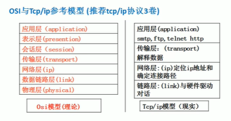
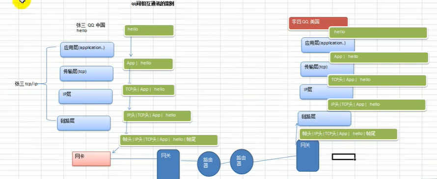
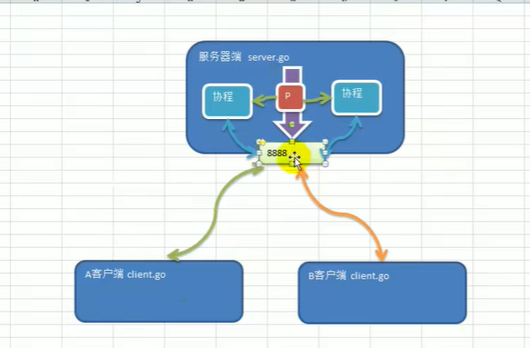

# 执行流程   
1.先编译成为可执行文件再运行（.go文件——go bulid/编译———>可执行文件——运行——>结果）  
2.直接对文件生成结果（.go文件——go run/编译运行———>结果）  

这两者的区别：  
1.如果先编译生成可执行文件，那么我们将该可执行文件拷贝到没有go语言开发环境中仍然可以运行。（编译之后会将它所需要的库倒入这个文件中）  
2.如果是直接利用go run生成的文件在另一台机器运行任然需要go的环境（因为直接使用go run进行的，所有并没有go的编译文件没有导入相应的库）    
3.在编译过后的可执行文件将包含程序执行的库文件，所以会变大很多。  
 
# 网络编程  
## 基础介绍
1.TCP socke编程  
底层采用TCP/IP 协议的比如：QQ聊天  
2.b/s结构的http编程  
使用浏览器访问服务器时候，使用的就是http协议，底层依旧使用tcp socket实现的。比如京东商城  

计算机之间实现通信必须要求有：网线/网卡（无线网卡）。  
协议（tcp/ip）：网络通讯协议，确定双方通讯所规定的内容——————http、https、ws、ftp、自定义协议等。  

QQ通讯案例(利用五层模型协议)：  
  
 
### ip地址  
每个internet上的主机和路由都有一个ip地址，它包括网络号和主机号。ipv4表示的是用4个字节表示的地址，ipv6表示6个字节128位。  

端口：是一种逻辑意义的端口，端口是出入房间的门，是用来对应服务的，一个 ip可以拥有（256*256）个端口  
客户端发送tcp连接的时候使用的端口是随机的，服务器接受的端口是确定的。所以有接受端口和发送端口。  
0 是保留端口  
1-1024是固定端口，又叫有名端口即被某些程序固定使用，一般程序🦍不使用。  
1025-65535是动态端口，这些端口程序员可以使用  

注意事项：  
1.服务器尽量少开端口。  
2.一个端口只能被一个程序监听。  
3.如果使用netstat-an可以查看本机端口有哪些在被监听。  
4.可以使用netstat-anb 来查看监听端口的pid，在结合任务管理器关闭。  

## 实战
客户端和服务端使用TCP连接使用长连接。  
### 服务端处理  
1.监听端口-8888  
2.接受客户端的tcp连接，建立客户端和服务端的连接  
3.创建goroutine,处理该链接的请求  

### 客户端处理
1.建立与服务端链接  
2.发送请求数据——终端输入，接受服务器端返回的结果数据  
3.关闭链接  

  
相当于服务端开一个主线程，根据每个客户端发来的请求创建一个协程————并发的进行    

代码实现：查看code  
