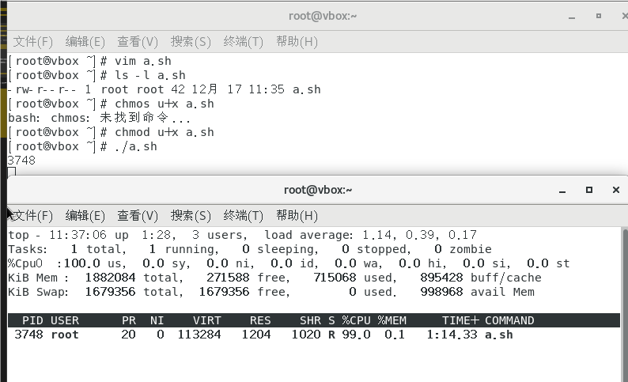
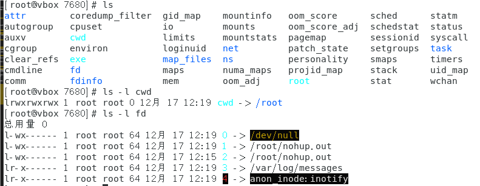
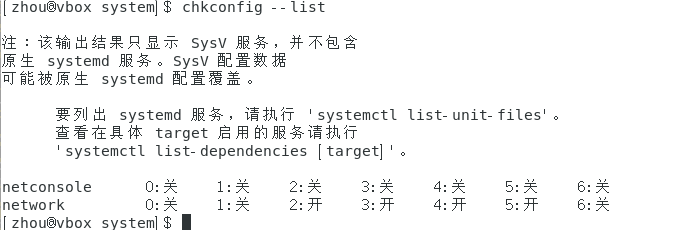

# LINUX学习（CentOS_7）

## 1.Linux系统开发

服务器大多数使用Linux系统，命令行的格式。
CentOS版本免费且稳定  1.下载 https://www.virtualbox.org/wiki/Dwonloads为下载虚拟机

## 2.下载Linux

### 2.1 下载CentOS

### 镜像http://isoredirct.centos.org/centos/x86_64/CentOS-7-x86_64-DVD-1810.iso表示下载了一个镜像。

### 2.2 在虚拟机中使用镜像
其中文件夹是用来保存虚拟机里面的数据的 版本Red Hat 64位 内存1024 虚拟磁盘就是虚拟机的硬盘  之后在设置中找到光盘并且把iso放在里面
设置ROOT用户的密码 	无脑继续 

## 3.启动Linux 
init 0 表示关机命令 

### 3.1当登陆之后

使用控制台里面输入init 3进入无图形化的面板 当存在$符号表示是一个普通用户，切换用户使用 exit 退出当前用户 超级用户位#   

### 3.2 目录结构  

1./根目录 2./root root用户的家目录 3. /home/username 普通用户的家目录 
4. /etc 配置文件目录 5. /bin命令目录 6./sbin 管理命令目录 
7./usr/bin/usr/sbin 系统预装的其他命令
### 3.3 控制命令
#### 3.3.1 帮助
man +控制命令 //可在前面加一个数字表示第几章其中第一章表示命令 第五章为配置文件
man a ls 表示查看所有的

help 
其中shell(命令解释器)自带的命令称为内部命令，其他的为外部命令
内部使用	help cd 
外部使用	ls -- help
(其中type命令可以区分哪些是外部、内部)

info 是更详细的help但是全英文

#### 3.3.2文件管理
#####  1.文件查看
pwd	 显示当前的目录名称 

ls /root /	查看/root目录的文件和/根目录下的文件
ls -l   //表示当前目录 
其中第一个字符表示文件类型其中普通文件表示- 目录或者文件夹为d 
后面九个字符表示文件的权限
之后1、2 表示文件夹下的个数
 root为创建者 下一个root为创建者属于那个组
后来为目录所占用的大小 
最后为最后的修改时间、文件名称

ls -a 为查看所有隐藏文件夹,其中以.开头为隐藏文件
ls -r  以逆向的方向排序（默认为文件名）
ls -R 表示查看当前目录下的所有目录及其子目录
ls -lh 以多少M或者多少G的形式显示

cd 进行目录的切换
当敲击了大致内容后可使用左tab建实现命令的补全
cd - 表示回到刚才的目录
使用全局目录即--绝对路径
cd /xxx/xxx/xx    从根目录/开始一级一级的去切换目录
使用相对路径
cd ./xxx/xxx/xx   即从当前目录继续往下搜寻其中./也可省略即
cd xxx/xxx/xx
回到上一级目录
cd ../ 		/可以省略即
cd ..

##### 2.文件创建和删除
创建
mkdir [路径]/文件名
mkdir /root/creatMkdir/A  即在creakMkdir 下面创建一个A的文件
mkdir A  表示在当前pwd路径下生成一个A的文件
可以创建多个目录
mkdir a b c 表示在当前pwd下创建a,b,c三个目录
同名目录会创建失败
其中想要创建多级目录时可以使用	-p
mkdir -p a/b/c/d 表示在当前目录创建多个a/b/c/d

删除（只能删除空目录不能有其他的文件）
rmdir [路径]/文件名

删除非空的目录可以删除多个目录用空格隔开
rm [路径]/文件名
但是要进入每一级目录 除非加-f  不进行提示的是-r  
rm -rf   /xx/xx/x


clear 可以清除控制台的所有信息

##### 3.复制和移动文件
cp 复制的文件  复制到的地方
cp  -r 复制的目录  复制到的地方
cp -v 可以查看复制的进度
cp -a 将完全复制（包括操作时间、权限等）目录 //不是文件


mv 源文件  目标文件 （表示移动文件/重命名）移动目录同理
移动和改名同时进行只需要将目标文件的最后输入文件的名称即可


##### 4. 通配符
​      *表示前的所有文件
xxxx* 可以使用
*xxxx  也可以使用
？表示单个字符
即xxx? 表示xxxa  xxxb不含多个的


##### 5.文本查看
cat 文本内容显示到终端
head 查看文件开头
tail 查看文件结尾		-f 文件内容跟更新后显示信息同步更新（日志文件）
	（默认为10行/想要查看到几行 -x） 
wc 统计文件内容信息 
wc -l 查看文件多少行


创建一个文件
touch 文件地点以及名称

##### 6.打包和压缩
打包的意思其实是ta因为以前要备份在磁带中所以tar命令打包
而压缩是因为打包后需要节省磁带的存储空间所以需要压缩 gzip和bzip2
经常拓展名为.tar .gz .tar .bz2 .tgz

tar cf  打包到的地方	 需要打包的文件（一般打包etc下面的额配置文件）
一般打包之后都要压缩而tar命令提供了这个一体化
tar czf  打包到的地方（一般后缀会为.tar.gz）	需要打包的文件 ---使用gzip
tar cjf  打包到的地方（一般后缀会为.tar.bz）	需要打包的文件 ---使用bzip2   ---压缩比列更大但是时间更久

下载好了的压缩包实现解压功能
tar xf 	解压的文件  -C   放在的文件下
要解压缩的时候 tar xzf/xjf  解压文件   -C	放在的地方


##### 7.文本编译器 
vim 多模式编译功能 （vim是原始编译器vi的拓展）  相当于复制一个以.开头的隐藏文件，当保存之后并退出之后就会替换这个原来的文件
1.正常模式如下图  	光标的移动h左j下k上l右  复制一般按行复制即y y ，3行复制为 3yy左下角会有提升信息   复制从光标位置到这一行到结尾是 y $		剪切命令是dd   剪切从光标位置到这一行结尾是d$		按p 是粘贴		撤销指令是u 	将撤销指令撤销 ctrl+r	光标位置删除 x  光标位置替换 r    将光标行移动到指定的行shift+g 在输入指定的行 小写g光标移动第一行 大写G移动最后一行   光标移动到这一行的开头shift+6 光标移动到结尾shift+4    	显示所有行的数字:set nu   //可以复制粘贴在这个模式下


2.编译模式	    按  i   建进入插入模式即光标位置			大写I 表示进入但光标到当前行的开头    小写a光标的后面		大写A到光标当前行的结尾  	o向下产生空行		大写O上行产生空行 //即可对文件进行编译


3.命令模式      从编译模式——>命令模式  按esc    保存该文件  :w+ 文件保存的地点要用绝对路径	如果是打开一个文件的话直接 :w 就可以保存在原始的路径了   不保存退出为 :q!  所以保存推出 :wq 	在编译器中执行控制台内容即 :!+命令    查找文本里的某个字符  /+字符——>若多个按n查找光标下一个 shift+n查找光标的上一个	 只针对光标所在的替换:s/旧的字符/新的字符  在整个文档中使用单次替换%s/旧/新 使用多次替换为     						// 进行保存


4.可视模式  	 按小写v建/大写V 以及ctrl+v 块可视化	  //对此进行块改进

##### 4.用户权限管理
###### 1.指令
1.用户操作
useradd 创建用户
useradd -g 用户组名称  用户 
可以使用id命令确定是否存在用户——>id 用户名 //分配的有单独的id
创建的用户在/home	里面有用户的文件夹，并且会被记录到/etc/passwd文件里面	etc/shadow里面也会添加新的数据（与密码相关的文件） 给用户划分组（权限管理）没有划分的话会创建一个同名的用户组==>root用户才有权限创建用户
passwd  修改用户的名称


userdel 用户名称  删除用户 那么/home/用户名的文件将不能被任何人访问和修改除了root用户
userdel -r 用户名 会将/home下的对应的文件删掉不加r不会删掉	那么


usermod	修改用户账号的信息 
-d修改家目录的位置
usermod  -d  修改后的位置  用户名


change	修改用户生命周期

2.用户组的操作
groupadd  新建用户组
groupadd 用户组名称
usermod -g  用户组  用户  //将用户添加到用户组里面

groupdel  删除用户组
groupdel 用户组	


3.切换用户

su 	-  用户名	//带-表示把环境也切换过去，不带 - 就任处于root目录下就存在无权访问的情况 

sudo 	以其他用户身份执行命令，相当于授权部分权限给用户让其执行命令。
就像visudo只有root用户才能使用，但不想把密码给普通用户的时候，就可以使用sudo但需要输入当前用户的密码   
即visudo会展示为：

以#开头的文件为样例文件，这个文件里面修改权限的在下面为

%wheel 	ALL=/sbin/mount /mnt/cdrom, /xxx/x/x/  	NOPASSWD： ALL
第一个表示如果是用户组就在前面加上% ，如果使用户就直接写用户名称 	 	第二个表示可以在那个主机上（本地/远程登录）执行那些命令要写全路径可以被赋予，多条命令用	, 隔开 			最后一个字段表示当前用户是否输入密码
本地是指字符终端——>localhost，而图形化和SSH都属于远程终端为ALL

当寻找命令在那个文件中的具体路径可以使用 which +	命令
其中可能出现缓存的有过去的权限所以要使用 sudo -k 重新登录

###### 2.配置文件
/etc/passwd(保存用户和权限的相关信息)

 分为7个字段
 root(用户名称) :	 x（是否需要密码验证 x为是 空格为不需要）	:	0（用户的uid——唯一标识符不看用户名称而是看id，如果重复就以前面的为准        比如果出现另外一个user也用uid为0那么他相当于变成了root）	:	   0（用户的gid）  : 	root（注释） 	:	/root（表示用户的家目录在那个位置）	:/bin/bash（用户命令解释器）——/sbin/nologin表示不允许用终端输入	
举列：
user4 : x : 1004  : 1004 :一个用户：/home/user4（需要自己创建文件）: /bin/bash


/etc/shadow（保存密码相关信息的）

只了解前两段 	第一段为用户名 第二段为加密的密码一般为$6$开头可以防止相同密码别人破解 

/etc/group(配置和用户组相关的
)
root (用户组名称) :x(是否需要密码，很少使用) : 0（gid）:（组成员列表)就是当前组的附加成员可以给予额外的权限

######  3.查看文件权限的方法
 1.文件的基本概念
)
其中第一个字母表示类型 	- 普通文件（不以拓展名区分）   d目录文件  b块特殊文件 c字符特殊文件  l符号链接 		 f命名管道  s套接字文件
后面九个表示权限 （前三个表示用户  中间三个为用户组的权限  最后三个为其他人）  			之后是所属用户和用户组		还有文件名
其中创建文件的时候有默认权限，根据umask值计算——>一般默认的权限是666 但是要减去umask= 0022	所以最后一般是644

2.不同文件的权限
当对于普通文件时 -开头（cat）r=4表示可读、w=2可写、x=1可执行	
等对于目录文件时 d开头  x 进入目录	rx 显示目录内的文件名	wx修改目录内的文件名（即删除目录、添加）


3.修改文件权限（权限限制是非root用户）
chmod 修改文件、目录权限 其中修改的不同部分使用的是不同的单词如 u（表示修改属主）	g(表示修改属组)  	o(表示修改其他)	a(表示修改所有)
+（表示增加权限）	-（表示减少权限）	=（表示赋权限）
设置数字权限就相当于赋权限直接664（r+w,r+w,r）
)
`chmod u+x (755)	/xxx/xxx`
`chown+属主+文件 	更改属主`
`chown+：属组+文件	更改属组`
`chown +属主：属组 +文件  达到属主和属组同时修改`
`chgrp	可以单独更改属组`
)

 4.权限测试
echo asddas > a.txt
只有属主才有权力修改它的权限，只有创建者才有权力
表示使用echo 将 后面的内容输入a.txt里面
当权限冲突的时候以属主的权限为准——>意思就是当一个用户属于一个组里面但是该组没有相应的权限但主有相应的权限，那么按照主的权限执行。
文件的所属主相当于文件的创始人的、而所属组相当于参观者、其他人相当于无关人员。基于这个思想理解就很明白了
 


特殊权限
SUID 用于二进制可执行文件，执行命令时取得文件属主权限 类似于/etc/passwd
在修改密码的时候就需要SUID的权限 不然每次修改密码都需要root用户
rws 这里的s就是这个权限或者 4755最后多加一个5

SGID 用于目录，在该目录下创建新的文件和目录，权限自动更改为该目录的属组

SBIT 用于目录，该目录下新建的文件和目录仅root和自己可以删除类似于/tmp
rwt中的t表示的就是这个权限数组为1777 里面的1就相当于

###  4.网络管理

##### 4.1.网络状态查看工具
1.net-tools
ifconfig  +特定的接口也可以	或者使用	/sbin/ifconfig
eth0 表示第一块接口（网络接口）
但是可能是下面这个表示方法
enp0s3:表示无法获取物理信息的接口
等等
这种网络接口的名称不统一很难进行批量操作，所以需要修改回网卡的名字为eth0的格式
 
这些是受到biosdevname和net.ifnames两个参数的影响，他们被配置在
/etc/default/grub文件中，GRUB_CMDLINE_LINUX里面增加biosdevname=0  net.ifnames=0
再更新文件grub 
`#  grub2-mkconfig -o /boot/grub2/brub.cfg   如果使UEFI启动   用/boot/efi/EFI/centos/grub.cfg`	
/boot/grub2/brub.cfg  会在启动的时候被系统调用读取
reboot	重启的命令
 
inet   后面对应的是ip地址 		netmask 后面对应的子网掩码	ether  对应的是mac地址
lo:    表示本地网卡 127.0.0.1		中RX为发送的数据个数 TX为接受的个数
mii-tool eth0 表示查看网卡的物理连接情况  //虚拟机不支持
route -n 查看网关  -n不解析主机名 
 
2.iproute2
这个不详细介绍


##### 4.2.修改网络配置
###### 1.网络接口
网络接口是指计算机系统中用于进行网络通信的虚拟或物理接口。网络接口不仅可以与硬件网卡相关联，还可以是虚拟接口，例如虚拟机或容器的网络接口
上面中的eth0就是一个网络接口有自己的ip地址可以有多个
网卡是有MAC地址
修改网卡的ip地址
ifconfig	 <网络接口>	<ip地址>	[netmask 子网掩码]
ifconfig eth0 10.211.55.4.  —子网掩码默认为255.0.0.0
ifconfig 	eth0 	10.211.55.4 	netmask 255.255.255.0
 


这两个指令是NetworkManager 服务管理的
启动接口
ifup <网络接口>
Ifup eth0  —一般在重置网络接口的时候需要启动

关闭接口
ifdown <接口>
ifdown  eth0

###### 网关
是连接两个不同网络的设备，局域网连接广域网、互联网的设备
查看默认网关
route -n
 
Destination 表示目的ip
Gateway 表示网关（表示想要发祥目的地的时候在这个路段就要发送给这个网关）
其中最后的Iface表示的是网络接口

添加网关
默认网关
route  add default（0.0.0.0） gw <网关ip>
route add 0.0.0.0 gw 10.211.55.1
 

明细路由 就是到达特定的位置选择特定的路径
route add -host <指定ip> gw <网关ip> 
route add -host  10.0.0.1 gw 10.211.55.2
网段表示的是一个范围内的ip地址的网络，是多个网络
route add -net<指定网段>netmask<子网掩码> gw <网关ip>
route add -net 192.168.0.0 netmask 255.255.255.0 gw 10.211.55.3
表示从192.168.0.0 到 192.168.0.255的都要走 10.211.55.3的网关
0.0.0.0 是默认路由，指示所有未匹配的流量将通过 10.0.2.2/10.211.55.4 网关发送
 

删除网关
route 	del  default(0.0.0.0)	 gw.  10.211.55.1
-net 删除网段 要加上netmask
 


##### 4.3.网络故障排除
ping		//检测当前路径和目标路径是否畅通

traceroute		//追踪服务器的每一跳的质量
traceroute -w 1 [www.baidu.com](http://www.baidu.com) 表示从本机到目标的质量	-w表示等待的时间 1秒钟	
会返回***的方式表示不支持

mtr		//检查到目标主机是否存在数据包丢失内容更丰富 不需要加其他的

nslookup		//查看域名能否连接 将域名解析为pi地址
nstlooup	 [www.baidu.com](http://www.baidu.com) 

telnet			//查看端口是否有问题
首先下载telnet应用，即yum install telnet -y
telnet [www.baidu.com](http://www.baidu.com) 80 //检查到对方主机的80端口是否畅通

tcpdump		//网络抓包即网卡的所有包
tcpdump -I any  -n port 80 可用and连接
表示抓取-I any 任意网卡的访问port 80端口的数据包 -n并且不要捕获成为域名的形式用ip地址
再加上host 10.0.0.1 表示从我主机到10.0.0.1的端口为80的tcp数据都会被捕获

netstat			//监听范围
netstat -ntpl	t表示tcp	l表示监听 p表示显示进程0.0.0.0 表示所有人都可以访问 

ss	-ntpl 


##### 4.4.网络管理程序（由于使用的是CentOS9 所以这些文件可能不存在）
两部分：1.SysV. 2.systemd 
CentOS7 使用systemd  网卡 配置文件 ifcfg-eth0 //随着接口的名称而更改
/etc/hosts	存储主机映射到ip地址的

 
service network status 查看网络状态
service network restart  重启网络，表示恢复默认。——通过systemctl 控制的 
networkmanager/network	是两个网络管理服务一般两个不重复出现
其中查看network的属性的时候
chkconfig.  - -list network 
禁用的时候使用
chkconfig - -level 2345 network off
此时就会使用network manage	
激活为
chkconfig - -level 2345 network on
上述的在CentOS9中已经被NetworkManager取代了
用systemctl status NetworkManager 查看状态
禁用networkmanager
systemctl disable NetworkManager
启动服务
systemctl enable NetworkManager 


网卡的配置文件在		/etc/sysconfig/network-scripts/
其中ifcfg-* 的开头为网络接口 ——>可能出现一个网络接口对应多个ip的情况
其中里面的是键-值队的形式
BOOTPROTO =“dhcp” //表示动态分配的Ip	static表示静态分配的
NAME 	、UUID、DEVICE //表示网卡的基本信息
ONBOOT=“yes”		//表示开机的时候是否会启动
上面为动态分配配置文件

BOOTPROTO=none		//表示静态分配
IPADDR=10.211.55.3		//表示静态分配的IP
NETMASK=			//子网掩码
GATEWAY=			//网关	
DNS1=				//域名 3个
上面为静态分配

使用service network restart 使这个网络接口生效
或者systemctl  restart NetworkManager.service	
或者	ifup eth0 打开网络接口
  ifdown eth0 表示关闭网络接口
之后可以使用route  -n	查看当前路由的相关信息
nslookup	 回车	server		查看当前的DNS

查看主机名	hostname
主机名.域名	其中域名表示的是从ip转换过来的
临时更改主机名	hostname  c7.test1
永久更改为 	hostnamectl	set-hostname	c7.test		//但是很多都依赖于主机名称
所以我们需要在配置文件中也修改	/etc/hosts
并且在里面加上 127.0.0.1 c7.test1	将主机名和ip地址写在里面
reboot	重启	
 


### 5.软件的安装
##### 1.软件包管理器
包管理器是方便软件安装、卸载，解决软件依赖关系的重要工具
	CentOS 、RedHat 使用yum包管理器，软件安装包格式为rpm
	Dbian 、 Ubuntu 使用apt包管理器，软件安装包格式为deb
##### 2. rpm 包格式和安装
###### 1.光驱
光驱可以被用作一种软件包的存储媒介。在早期的 Linux 使用场景中，光驱常用于提供系统安装介质（如 Linux 发行版 ISO 镜像）或软件包的存储库。
/dev里面的都是设备文件
软件包在光驱里面，光驱在/dev/sr0里面 （这个就相当于一个u盘我没有下载就没有这个u盘）
是个b_是个块文件
 
可以使用 dd if=/dev/sr0  of =/xxx/xx.iso 把一个光盘做成光盘镜像
对于块文件我们要使用挂载进行操作
 
mount  需要挂载文件 (相当于插u盘的使用) 放置位置（/mnt这个是系统默认给你的）
其中rpm包是在/mnt/Packages文件夹里面

###### 2.rpm
在 Linux 中，使用 rpm 指令安装软件时，确实需要本地已有该软件包的文件（通常是以 .rpm 为后缀的文件）。这意味着你需要先下载或获取目标软件包，然后通过 rpm 命令进行安装。
rpm格式：
vim-common-7.4.10-5.el7.x86_64.rpm
软件名称     软件版本（解决依赖关系）     系统版本（el7表示对centOS7 做支持  、el6也可以安装但是版本兼容性可能没有这么强）   平台x86_64
rpm -q 查询软件包  -a表示所有的软件包 
rpm -i 安装软件包 （全部名称） //其中安装一些软件包的时候要先下载依赖——yum仓库可以帮助自动解决依赖关系
rpm -e 卸载软件包


##### 3.yum管理软件（相当于通过网络解决了依赖然后安装）
定义：是一个高层次的软件包管理工具，它通过使用远程或本地的 软件仓库（repositories） 来自动化软件包的安装、更新、移除和查询，同时能够智能地处理依赖关系，确保所需的软件包和库能够正确安装。
 
[base]这个表示配置文件的主要标题
baseurl 表示基础运用的包的源放在那个路径下面
gpgcheck 表示检测yum源是否被人恶意修改，是否为最开始发布的内容

更改yum源
1.备份
mv	 /etc/yum.repos.d/CentOS-Base.repo  	/etc/yum.repos.d/CentOS-Base.repo.backup(backuo表示是一个备份文件)
 
接来下（表示直接从网站上下载配置文件并且覆盖本地的配置文件） ：					wget -O    /etc/yum.repos.d/CentOS-Base.repo  https://mirrors.aliyun.com/repo/CentOS-7.repo  
更新缓存确保yum源的更改
yum makecache

使用yum包管理器更加方便的管理rpm包
官网：https://mirror.centos.org/centos
其中yum仓库的源是：https://opsx.alibaba.com/mirror
yum intsall 安装
yum remove 卸载
yum list|grouplist 查看软件包
yum update + （指定的升级）升级软件包 


##### 4.源代码编译安装
通过一系列步骤将代码转换成可以在特定操作系统和硬件架构上运行的可执行程序或库的过程。
流程：
表示安装完后的目录有bin文件等
 
```
wget  xxx/xxx/xx//x //下载代码会下载到当前的文件夹下面
tar -zxf x  //对文件进行解压
./configure --prefix=/xx/x/x   //即在解压后的文件里面有这个文件，如果没有可以阅读Readme.md文件 匹配环境和指定安装位置即prefix后面的为位置防止四处散落。可能执行这个代码的时候要使用gcc进行编译 需要不断补全依赖一般在后面加devel
make -j2   	//源代码编译成为可执行文件 j2表示使用两个cpu如果没有编译没有上下文依赖关系速度就会加快如果没有的话就不会
make install  //编译好的文件安装
```


##### 5.内核升级
1.rpm安装内核
```
yum install epel-release -y //先安装别的库方便更新内核
uname -r //查看内核的版本
yum install kernel-3.10.0 //安装内核版本
yum update //安装或者升级内核

```


2.源代码依赖安装内核
 

 ```  
 //首先安装依赖包解决依赖问题，再下载内核
 
wget -o  https://www.kernel.org
tar xvf xxxxxxxxx  -c /xx/xx/xx   //解压下载的内核并且指定位置
cd /xx/xx/xx        //进入内核文件中配置编译参数
make menuconfig| allyesconfig | allnoconfig   //第一个是自定义、第二个是所有都下载、第三个是啥都不要
cp /boot/config-kernelversion.platform /xx/xx/xx/.config //这样就相当于使用本系统的配置
lscpu   //用来查看cpu的个数
make -j2 all  //用来编译并且指定两个cpu
make modules_install  //安装内核支持的模块  
 make install //安装内核 
 reboot //重启之后在界面选择
 ```

##### 6.grub配置文件
grub 是一个启动的引导软件。//类似于进入时的引导团光标

gurb1需要手动的修改很麻烦但是grub2提供了很多命令可以直接修改

grub2的配置文件在:/boot/grub2/grub.cfg  

但是我们不能直接修改grub的配置文件而是修改/etc/default/grub里面的文件，如果想要修改更详细的配置文件可以/etc/grub.d/里面的文件（01、02、03排序的）。

 
	
GROUB_DEFAULT=save //表示引导的内核为哪一个内核


 

list 表示内核正在使用的版本

grep 表示查找文本文件中包含关键字的一行  ^xxx表示以那个开头
然后显示出来的就是配置文件中所包含的内核有哪些
再用grub2-set-default 0 表示更改内核的引导且0 为第一个list里面的


GRUB_CMDLINE_LINUX 确认linux引导的内核确认什么样的参数 里面的rhgb表示引导的为图形化界面 quiet表示时静态的，当出错误时会将QUIT去掉依次获得更详细的内容


当遗忘root密码时如何操作
先reboot  进入图形化界面后按e建 然后找到linux16 /vmlinuxz-.....  这一行最后面添加  single
如果时wind 7 的操作系统需要rd.break（ctrl+x） 然后按照下面的提示重启

 


重启之后根目录没有在根目录下面而是现在处于一个虚拟的文件系统所作的任何操作是不会保存的
，而/sysroot 里面的才是真正的硬盘数据

使用mount -o remount ,rw  /sysroot //需要重新加载即把移动硬盘拔掉重新加载并且修改插入之后的权限以前默认时r只有只读的权限挂载失败的话就不能修改

chroot /sysroot  //更改目录并且使他为根目录

echo 123 | passwd --stdin root //这样就会使123变成root的账号和密码了类似于 passwd  充值了密码

但是还有个安全的组件 SELinux 强制访问控制会对etc和passwd进行校验即不是在系统文件进行标准修改的所以我们需要关闭它   
vim  /etc/selinux/config  //这个文件中

SELINUX=enforcing  改成disabled   wq保存
使用exit退出回到虚拟目录  然后reboot

 

### 6.进程管理
##### 1.进程定义和基本
进程——运行中的程序，从程序开始运行到终止的整个生命周期是可管理的
终止可以分为：正常终止（在main返回和调用exit等方式）、异常终止（调用abort 、接受信号 ） 

查看指令
``` 
ps （当前终端能够查看到的进程）   PID为唯一的标识  TTY当前执行该进程的终端（pts表示虚拟的）
pe -e  |  more  查看不同终端的进程
ps -ef |more 能够显示更详细的信息   UID表示有效进程的用户（可更改）  PPID父进程（ init 是所有进程的父进程）
ps -elf 增加了一个LWP线程
pstree  //会用树状显示进程的关系
top //会动态的显示进程随时间改变的(如下图)
  ```


20min 表示从最近开始到关机的时间 

users 表示当前有多少个用户登录了
   
load average 表示平均负载 当和为1时表示系统很繁忙 
   
Tasks 表示总共有多少个任务在进行， 2个在运行状态  195个处于休眠状态 

还有cpu 1.0用于用户计算  0.7用户系统运算 98.3处于空闲状态 wa 等待IO的磁盘操作  按数字1可以查看详细的

Men 表示内存   Swap表示交换分区

##### 2.进程的控制
运行一个shell脚本 

vim a.sh
```
#!/bin/bash 

echo $$

while :
do 
	:
done

```
赋予权限  chmod u+x a.sh

./a.sh 		//表示执行shell脚本且用当前的终端执行的子进程，继承父进程的用户（root）

top -p 经常id(pid)
里面还有PR(系统的实时优先级 实时进程的优先级或者 I/O 优先级而言，值越高则意味着更高的优先级。)     NI（nice值占用多少资源的意思越高表示占用越少）





1.调整优先级

nice

范围：从 -20 到 19，默认值为 0。

规则：nice 值越高，进程的优先级越低；nice 值越低，进程的优先级越高。

作用：nice 值影响的是用户空间进程的CPU优先级。普通用户只能设置正的 nice 值，而负的 nice 值需要超级用户权限。

nice  -n 10 ./a.sh  运行程序

renice -n  15 PID 将正在运行的程序的优先级降低


2.进程的作业控制
当进程运行在前台时不会在接受任何命令。

./s.sh  &  //这样就会在后台运行了

后台运行的程序调回前台使用jobs   再用fg 1就调回前台。   bg 1 把后台暂停的程序继续执行

使用ctrl+z把前台的程序调入后台并且停止（挂起状态）


##### 3.进程之间的通信
信号时进程间的通信方式之一，典型就是：终端用户输入中断命令，通过信号机制停止一个程序的运行。还有管道也可以实现

使用信号的常用快捷键和命令，相当于发送一个信号给进程使进程结束
```
kill -l //查看所有的信号
ctrl +c 
kill -9  进程id //强制终止进程彻底杀死 无条件
```


##### 4.守护进程
守护进程随着用户的开机就会启动不需要用户启动，并且输出打印到指定的日志里面，并且在根目录里面。

还有一个使用nohup命令生成的进程（会忽视挂载过程）即关掉终端他也不会结束进程（相当于发了一个终端关掉的信号给他但是他不回应），并且忽略输入追加到nohup.out里面

```
tail -f   /var/log/messages          //会一直跟随一个进程的变化
ps -ef | grep tail  //表示查看这个命令是否执行且用管道符号过滤了其他进程

使用nohup生成
nohup tail -f /var/log/messages  &（&表示后台执行） 生成一个nohub.ut的文件

```


但是nohub还是需要打开终端生成这个进程，守护进程就1.不需要打开终端就可以实现了如：网页服务、桌面、享服务等。2.所以就会有很多日志文件，因为这些服务没有终端只能打印日志文件。3.在当前执行的程序会把执行目录作为根，所以这个目录就不能被卸载因为已经被使用了

linux 里面有个特殊的目录/proc      （这个目录原本是硬盘中不存在的，相当于读取内存信息，然后以文件的形式呈现可以像操作文件一样操作，所以后面可以加上进程的id）

这个/proc/进程id    里面有

cwd 文件夹表示当前进程的挂载地方，表示占用了当前的目录，导致该目录无法卸载（相当于正在使用的目录）
fd  文件夹中   0 表示输入 1\2表示标准输出\错误输出的地方   

nohup进程的


守护进程的


还有一个工具screen 
在进行终端操作的时候先进入screen，即当下次从远程连接时会恢复screen

```
screen //进入screen环境
ctrl + a +d//退出screen环境
screen -ls //查看screen会话
screen -r sessionid  //恢复会话
exit //退出screen环境

```


会把输出打印到/var/log 

messages 表示系统的常规日志文件

dmesg 表示内核的运行状态

secure 表示系统启动的安全日志


##### 5.systemctl服务管理工具

服务统一的管理起来 

service 运行起来比较简单但是需要自己编写脚本实现里面的一些服务

systemctl 将服务的脚本替换成一句了

```
/etc/init.d         //这个文件里面存放的就是service里面的启动脚本 
vim network      //这个里面写的就是200多行  set nu 可以查看行数
usr/lib/systemd/system  //这个里面存放的就是systemctl管理的
vim sshd.service  //这个里面的内容就非常的清晰
```
相当于写到了综合systemcetl

其中ExecStart就是对应的启动

重启对应的就是Restart	

服务启动的时候有顺序的问题，通过Unit来确定，即想要一个服务在sshd.service 前启动在AFTER后面和添加一个Requires的

[install]表示会在那个默认的状态被引导

```
After=network.target sshd-keygen.service a.service
require = a.service
```

环境也有环境的文件EnvironmentFile


表示权限 0是最高如（init 不可以被kill -9 结束）只能init 0 ,init 6表示重启， init 1 单用户
， init 2多用户模式  ,init 3 字符模式  ,init 5 图形模式  

上面的对应的数字的意思是当处于某个级别的时候他这些服务就会开/关

systemctl 的常见操作

```
systemctl start（启动）|stop（关闭）|restart（再次启动） | status(查看状态) | reload （服务不停加载配置文件） |enable （服务随着开机进行起来） |disable 服务名称
lib/systemd/system       //查看服务的级别  .target文件里
```
poweroff -- 关机     rescue --救援模式   multi-user--多用户模式  graphical--图形模式   reboot -- 重启    


` systemctl get-default  //查看当前在那种权限`

`systemctl set-default muilt-users.target //设置下次开机为那个权限`


##### SELinux
是一个安全增强的组件
  


