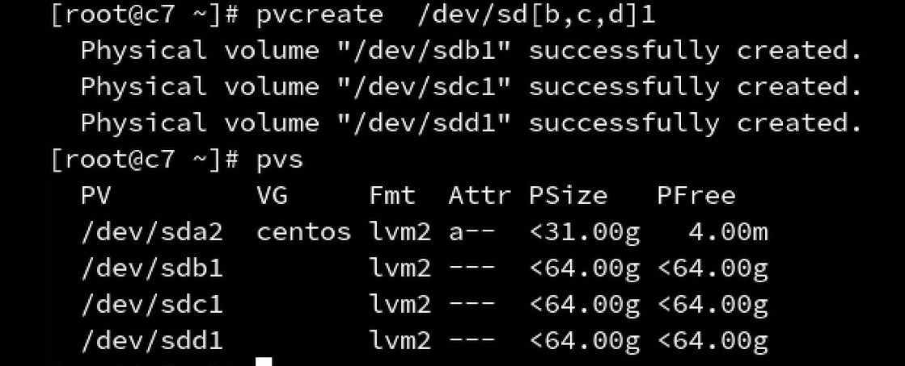
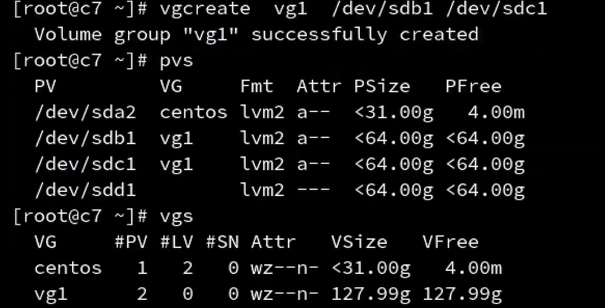
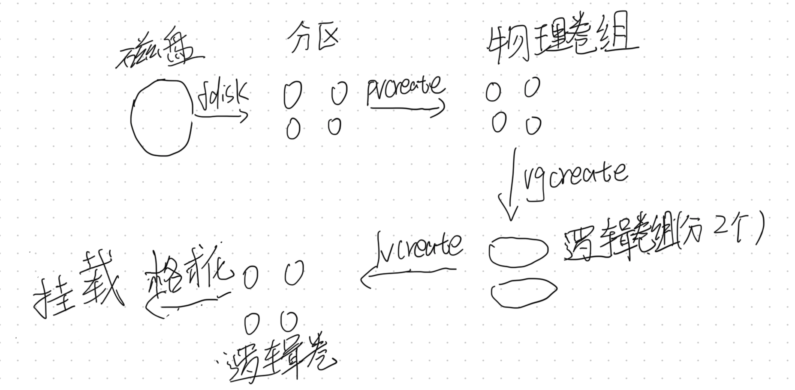
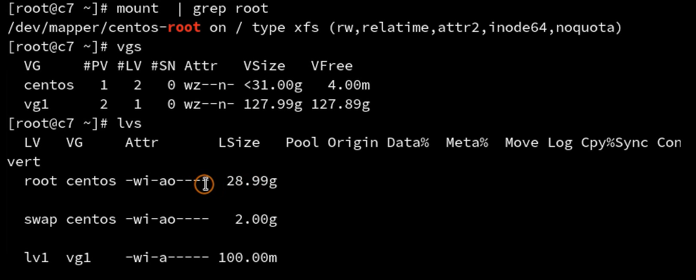
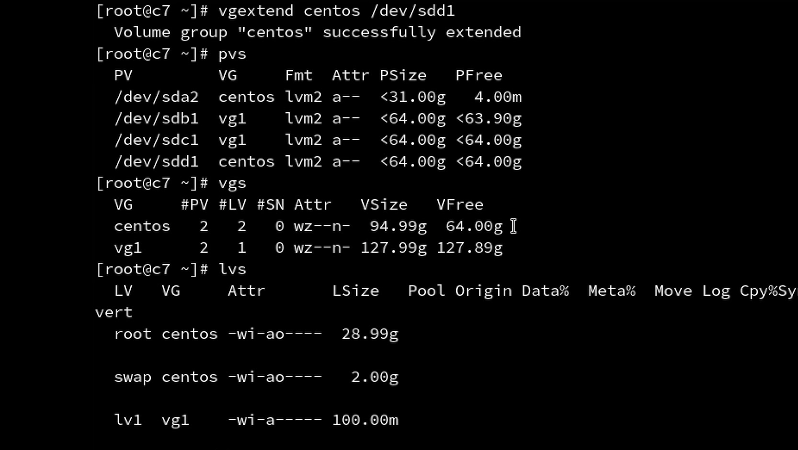

## 9   逻辑卷管理
概念：逻辑卷是建立在物理卷纸上的，多个物理卷可以组成一个或者多个卷组，然后从卷组中创建逻辑卷。逻辑卷的大小可以在不丢失数据的情况下动态调整。  

```
fdisk -l   //查看磁盘信息
 pvcreate /dev/sdb1   /dev/sdb2  /dev/sdb3    //然后在三块物理磁盘（可以大小不同）的基础上搭建物理卷
pvs   //查看
```



这里面PV代表物理卷  
VG代表逻辑卷组  
FMT 代表逻辑卷管理器  
Psize 代表物理卷大  
Pfree代表物理卷剩余空间  

```
vgcreate vg1 /dev/sdeb1 /dev/sdc1   //把这两个物理卷加入到一个逻辑卷组里面——————其中物理卷只能有一个逻辑卷组  
vgs //查看卷组里面的星系
```


其中里面vgs 查看下的  
PV表示物理卷个数  
LV表示这个物理卷划成了2个逻辑卷组————boot和/根分区  
```
lvcreate -L 100M -n lv1 vg1   //创建一个从VG1的逻辑卷里面划分100M大小名字为lv1的逻辑卷   
lvs //查看逻辑卷组
mkdir /mnt/test  //创建一个挂载点
mkfs.xfs /dev/vg1/lv1  //对逻辑卷进行格式化(xfs是文件系统)
mount /dev/vg1/lv1 /mnt/test  //挂载
df -h  //查看挂载点
```


总的过程是：  
fdisk-->pvcreate-->vgcreate-->lvcreate-->mkfs.xfs-->mountnn 
对磁盘分区-->物理卷-->逻辑卷组（可以包括多个物理卷）-->逻辑卷（对逻辑卷组进行划分）-->格式化-->挂载


图中不是物理卷组而是物理卷。

扩展逻辑卷：  


使用挂载的方式查看当前文件使用的是那个逻辑卷  
所以发现根分区是挂载在centos这个逻辑卷组上的root逻辑卷上的  
这个分区的挂载有两种派系：  
1.所有的分区都挂载在root这个逻辑卷上  
2.把root 、user ...其他分区挂载在不同的逻辑卷上，那个不够就加那个  
使用vgs 查看逻辑卷组的大小发现逻辑卷组不足，所以要先拓冲**逻辑卷组**的大小————lvs 查看逻辑卷的详细信息  
```
vgextend centos /dev/sdd1  //把sdd1物理卷加入到centos逻辑卷组中

```

  

此时的centos的大小已经扩充了但是具体的逻辑卷大小还没有扩充。
```
lvextend -L +50G /dev/centos/root  //扩充逻辑卷的大小
df  -h  //查看分区的大小  因为逻辑卷还有上一层为文件系统，所以还需要通知文件系统我已经扩充了
xfs_growfs /dev/centos/root  //通知文件系统我已经扩充了
```

## 10.系统综合状态查询
1.使用sar命令查看系统状态
```
sar -u 1 10  //查看cpu使用情况
sar -r 1 10  //查看内存使用情况
sar -b 1 10  //查看磁盘使用情况
sar -d 1 10  //查看磁盘IO情况
```

2.使用第三方命令查看网络流量
```
yum install epel-release  
yum install iftop
iftop -p   //默认接听eth0 
```


