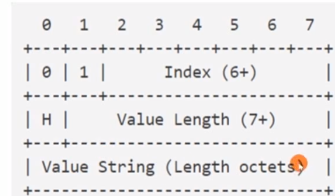
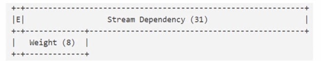
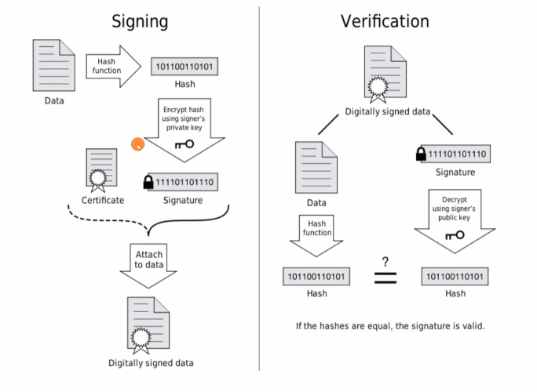
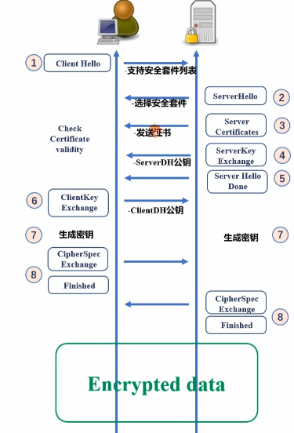
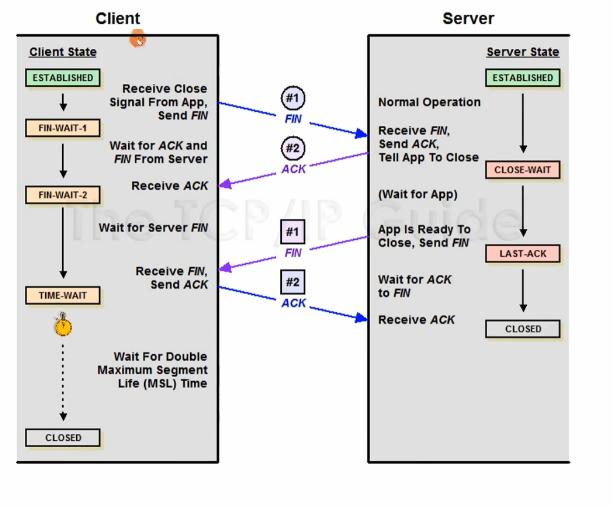

 # 基础内容分类  
从TCP/IP协议栈为依托，由上至下、从应用层到基础设施介绍协议。  
1.应用层：  
    HTTP/1.1  
    Websocket  
    HTTP/2.0  
2.应用层的安全基础设施  
    LTS/SSL  
3.传输层  
    TCP 
4.网络层及数据链路层  
    IP层和以太网  

# HTTP协议  

## 网络页面形成基本
流程：    
  
其中当在浏览器上面的网址搜索界面点击搜索的时候如果出现了一些记录就相当于图片中右边蓝色的“浏览器引擎”去搜索数据存储，然后找到发现一些存储在浏览器中的数据。  
详细操作：  
 

## 定义  
一种无状态的、应用层的、以请求/应答方式运行的协议，它使用可扩展的语义和自描述消息格式、与基于网络的超文本信息系统灵活的互动   

基于ABNF（元语言）语法的HTTP格式：  
1." "字符：用来分隔定义中的各个元素  
2."/"选择：表示多个规则都是可供选择的规则  
3."%c##-###":表示从字符 ##到 ###  
4."()"序列组合：将规则组合起来，视为单个元素  
5."m*n"不定量重复：  
*表示零个或更多元素  
1*表示1个或更多元素  
2*4表示两个或者至多4个元素  
6.[]可选序列：包体是可选的，可有可无的  
操作符为：  
  


根据上面的规则来分析格式  
  
HTTP-message：表示http消息  
start-line：起始行  
request-line/status-line:表示请求行或者响应行构成起始行  
request-line=method SP request-target SP HTTP-version CRLF:请求行有 方法 空格 请求路径 空格 HTTP版本 换行
status-line=HTTP-version  SP status-code SP reason-phrase CRLF ：响应行由 HTTP版本 空格 响应码（三位数字） 空格 字符串形式描述的原因  换行  

### 详细分析请求头  
method——常见的方法有：  
GET:主要的获取信息方法  
HEAD:类似GET方法，但服务器不发送BODY,用以获取HEAD元数据，幂等方法  
POST:常用于提交HTML FROM表单、新增资源等  
PUT:更新资源、带条件时是幂等方法  
DELETE:删除资源、幂等方法  
CONNECT:建立tunnel隧道  
OPTION:显示服务器对访问资源支持的方法，幂等方法————跨域    
TRACE:回显服务器手到的请求，用于定位问题。  
Linux中使用： `curl static.taohui.tech -X OPTIONS `可以查看允许使用的方法  
用于文档管理的  
PROPFIND:从Web资源中检索以XML格式存储的属性——查看目录    
PROPPATCH:在单个原子性动作中更改和删除资源的多个属性  
MKCOL:创建集合或者目录  
COPY:将资源从一个URI复制到另一个URI   
MOVE:将资源从一个URI移动到另一个URI  
LOCK:锁定一个资源  
UNLOCK:接触资源的锁定  

### 详细分析响应行  
  
响应码的规范:  
**1XX**:表示请求已经被服务器接收到了，需要进一步处理才能完成更进一步的操作    
100 Continue:上传大文件前使用  
101 Switch Protocols:协议升级使用  
102 Proccessing:表示服务器已经收到了请求但是这个响应需要很长的时间处理，放置客户端超市。  

**2XX**:成功处理请求  
200 OK :成功返回响应  
201 Created: 有新资源在服务器端杯成功创建  
202 Accepted:服务器接收并开始处理请求，请求并没有处理完成。异步、需要很长时间处理的任务  
203 Non-Authoritative Information:当代理服务器修改了origin server 的原始响应包体时。  
204 NO Content:成功执行了请求且不携带响应包体，并暗示客户端无需更新当前的页面视图。  
205 Reset Contern:成功执行了请求切不携带响应包体，同时指明客户端需要更新当前页面视图。  
206 Partial Content:使用range协议时返回部分响应内容时的响应码,多线程下载  
207 Multi-Status:在WEBDAV协议汇
208 Already Reported:为了解决WEb协议    

**3XX**:重定向  
300 Multiple Choices:允许客户端主动的显示  
301 Moved Permanently:表示资源永久的重定向  
302 Found:表示资源临时的重定向。  
303 See Other:重定向到其他资源  
304 Not Modified:客户端可复用的缓存  
307 Temporary Redirect:明确重定向后请求方法必须与原请求方法相同  
308 Permanent Redirect:类似301 

**4XX**:客户端出现错误  
400 Bad Request:服务器认为客户端出现了错误，但不能明确判断那种错误  
401 Unauthorized: 用户认证信息缺失  
407 Proxy Authentication Required :对需要经有代理的请求，认证信息为通过代理服务器的验证  
403 Forbidden: 服务器理解请求的含义，但没有权限执行此请求  
404 Not Found: 服务器没有找到相对应的资源  
410 Gone :服务器没有找到对应的资源，且明确的知道该位置永久性找不到资源————对404补充    
405 Method Not Allowed:服务器不支持请求行中的method方法  
406 Not Acceptable:对客户端指定的资源表述不存在————语言不兼容   
408 Request Timeout:服务器接收请求超时  
409 Conflict:资源冲突  
411 Length Required:请求中未携带Content-Length头部  
412 Precondition Failed:条件类请求不满足时候返回  
413 Payload Too Large/Request Entity Too Large:请求的包体超出服务器能处理的最大限度  
414 URI Too Long:请求的URI超出服务器的最大长度  
415 Unsupported Media Type:上传的文件类型不支持  
416 Range Not Satisfiable: 无法提供Range请求中指定的那段包体  
417 Expectation Failed: 对于Expect 请求头部期待的情况无法满足  
421 Misdirected Request: 服务器认为该请求不该发给它  
426 Upgrade Required:服务器拒绝基于当前HTTP协议提供服务，必须要Upgrade告知客户端升级  
428 Precondition Required:用户请求中缺少条件类头部  
429 Too Many Requests:客户端发送请求的速率太快  
431 Request Header Fields Too Large:请求的头部大小超过限额  
451 Unavailable For Legal Reasons :由于法律原因资源不可访问  


**5XX**：表示服务端出现错误  
500 Internal Server Error :服务器内部错误  
501 Not Implemented: 服务器不支持实现请求所需要的功能  
502 Bad Gateway:代理服务器无法获取到合法响应  
503 Service Unavailable :服务器资源尚未准备好处理当前请求  
504 GateWay Timeout:代理服务器无法及时的从上游获得响应  
505 HTTP version Not Supported: 请求的HTTP协议版本不支持  
507 Insufficient Storage:服务器没有足够的空间处理请求————存在安全错误    
508 Loop Detected:访问资源是检测到循环  
511 Network Authentication Required:代理服务器发现客户端需要进行身份验证才能获取网络访问权限  


 
*（header-field CRLF）:表示0个或多个以CRFL为结尾的http头部 
header-field = field-name":"OWS field-value OWS 表示由一个头部名称 中间分隔符号为：和头部的值构成      
OWS = *(SP / HTAB ) : 表示由零个或者多个空格或者横向制表符构成    
field-name = token————表示头部字段的名字，它必须是一个token，即由一系列非控制、非空白字符组成，不能包含特殊字符如冒号、空格等。    
field-value = *(field-content/obs-fold) ————这是头部字段的实际内容，它可以包含各种字符    
**header-filed**是一种类似键值对的形式  

CRLF:空行    
[message-body]:表示后面可以有消息体，但他与头部必须中间隔了一个CRLF。  
message-body: 表示由二进制的包传递的  

## 利用telnet 工具查看  
`telnet www.taohui.pub 80`

对比上面发现发现  
**请求构成**：  
`GET SP request-target SP HTTP/1.1 CRLF ` 符合请求头的格式  
`Host : www.xxx.com ` 表示的就是header-field : field-value     

**响应构成**：
上面一大串就是status-line  
分隔开的单独的CRLF(空行，表示从这里开始这一行就没有了)  
最后的那一段就是message-body  

## 网络为什么要分层  
OSI 概念模型  
  
应用层：解决业务问题--七层设备nginx等    
表示层：把网络中的消息转化成为应用层的东西（TLS/LLS加密）  
会话层：建立关系连接/握手————概念层    
传输层：解决进程与进程的关系，TCP协议等--四层设备  
网络层：确保在广域网中从一个ip发送到另一个ip上--三层设备  
数据链路层：利用mac地址连接到局域网的交换机的--二层设备  
物理层：物理介质   

分层的好处是：每一层只需要关注自己这一层的东西（封装）不需要关心其他层做了什么。这样技术迭代的时候就不用担心兼容问题。  
坏处：因为分层之间需要数据处理，就需要更长的时间影响了效率。  

每一层的详细处理：  

  

## 架构风格  
### 1.数据流风格  
优点：简单性、可进化性、可扩展性、可配置性、可重用性  
  
管道与过滤器：每个Filter都有输入端和输出，只能从输入端读取数据，处理后再从输出端输出数据  
统一接口的管道与过滤器：在PF上增加了统一接口的约束，所有的Filter过滤器必须具有同样的接口  

### 2.复制风格 
优点：用户可察觉的性能、可伸缩性、网络效率、可靠性  
  
复制仓库（RR）：多个进程提供相同的服务，通过反向代理对外提供集中服务  
缓存：RR的变体，通过复制请求的结果，为后续请求服用  


### 3.分层风格
优点：简单性、可进化性、可伸缩性  
客户端服务器（CS）：由客户端触发请求，服务端监听到请求后响应，客户端一直等待收到响应后，会话结束  
分层系统（LS）:每一层为其上的层服务，并使用在其下的层所提供的服务，如：TCP/IP  
分层客户端服务器（LCS）：LS+CS,如正向代理/反向代理，从空间上分为外部层与内部层  
无状态、客户端服务器（CSS）:基于CS、服务器不允许有session state会话状态  
缓存、无状态、客户端服务器（C$SS）:提升性能  

### 4.移动代码风格
优点：可扩展性、网络效率  
虚拟机(VM)：分离指令与实现  
远程求值(REV):基于CS的VM，将代码发送至服务器执行  
按需代码（COD）:服务器在响应发回处理代码，在客户端执行  


### 5.点对点风格
优点：可进化性、可重用性、可拓展性、可配置性  
EBI:基于事件集成系统  

##  使用Chrome抓包  
   
控制器：控制面板的外观与功能。  
过滤器：过滤请求列表中显示的资源  
概览：显示HTTP请求、响应的时间轴  
请求列表：默认时间排序，可选择显示列  
概要：请求总数、总数据量、总花费时间等  

### 浏览器的加载过程  
1.解析HTML结构  
2.加载外部脚本和样式表文件  
3.解析并执行脚本代码//部分脚本会阻塞页面的加载  
4.DOM树构建完成//DOMContentLoaded事件  
5.加载图片等外部文件  
6.页面加载完毕//load事件  

请求时间详细分布：  
Queueing:浏览器在排队  
Stalled:请求可能会因Queueing中描述的任何原因停止  
DNS Lookup:浏览器正在解析请求的IP地址  
Proxy Negotiation:浏览器正在与代理服务器协商请求  
Request sent :正在发送请求  
ServiceWorker Preparation:浏览器正在启动Service Worker  
Request to ServiceWork:正在将请求发送到Service Workder  
Waiting(TTFB)：将浏览器正在等待响应的第一个字节  
Content Download:浏览器正在接受响应  
Receiving Push:浏览器正在通过HTTP/2服务器推送接受此响应数据  
Reading Push:浏览器正在读取之前的本地数据  


## URI
定义：  
Uniform Resource Identifier 统一资源标识符  
组成：  
  
schme, user information, host, port（HTTP默认43）, path, query,fragment（分段）      
用元语表示URI：  
URI= schme ":" hire-pary["?"query]["#"fragment]  
解释：  
schme=ALPHA*(ALPHA/DIGIT/"+"/"-"/".")————方案/协议后面跟：  
如：https,http,ftp,mailto,file,telnet等  
ALPHA表示字母  
DIGIT表示数字  

hire-pary="//" authority path-abempty / path-absolute /path-rootless /path-empty————（层次部分）：这个术语指的是URI中紧跟在方案标识符之后的部分，包含了用户信息、主机、端口以及路径  
 authority=[ userinfo"@"]host[":" port]————用户信息@域名:端口    
  userinfo=*(unreserved /pct-encoded /sub-delims/":")————这部分是可选的，用来存储登录服务器所需的用户名和密码  
  host=IP-literal/ipv4address/reg-name  
  port=*DIGIT(浏览器默认端口为80)  

query=*(pchar/"//"?")————以"?"开头的可选项，通常用来向服务器传递参数，以键值对的形式出现    

fragment=*(pchar/"/"/"?")————以"#"开头的可选项，用来指向文档内部的某个部分  

相对URI:去除绝对路径只留下/html/rfc7231?test=1#page-7  

## TCP编程角度看HTTP请求处理  
 

事务：对应着一个响应和一个请求  
短连接：每次客户端和服务端完成一次数据交互之后就立即断开连接。下次再有请求时重新建立连接。  
长连接：客户端和服务端建立连接后，即使完成了数据的交互也不立即关闭连接，而是保持这个连接，以便后续的数据交互。  
区分长连接还是短连接靠的就是Connection头部：  
 Keep-Alive:长连接  
 Close:短连接  
 如果存在代理服务器的话，不转发Connection头部，只与当前连接有关  
 存在的问题中有：陈旧的服务器可能无法识别Connection的长连接，就会导致自动退化为短连接，但是服务器和客户端仍然认为发送的是长连接——————Proxy-Connection就是用来解决这个问题的，它就会替代Connection表示当前使用的是代理连接    

 ### HTTP消息在路由中的传播  
 Host 头部————出现在URL  
 定义为： uri-host[":"port]  
HTTP/1.1请求中必须要传递Host头部否则返回400错误响应码  
因为HPPT/1.0的域名比较少就不会出现多个域名对应一个服务器的情况，但是现在域名变多了，所以1.1中就规定了请求路径必须是绝对路径的形式，而不能是相对路径  

### 处理方法  
1.建立TCP连接  
2.读取请求行、请求头部  
3.服务器寻找理由中对应的URI的路径处理相应请求  
4.访问相应资源并且生成响应  
5.返回给客户端并且生成一个日志  

### 代理服务器的头部  
HTTP头部中会有X-Forwarded-For传递IP———  X-Forwarded-For中包含的是之前经过的公网ip（所以这个里面的第一个Ip就是起始ip）,还有一些采用的是X-Real-IP(nginx)传递ip    

Max-Forwards头部————表示的限制Proxy代理服务器的最大转发次数  
Max-Forwards=1*DIGIT  

Via头部————进过了那些代理服务器，版本和名称  
via-1#(receuved-protocol(代理服务器版本号)| RWS received-by（代理服务器名称） [RWS comment（代理器的注释）])  

Cache-Control:notarnsform——————表示禁止代理服务器修改响应包体  


### 表示上下文的HTTP头部  
User-Agent————指明客户端的类型信息，服务器可以根据对资源的表述做抉择  
通用：  
User-Agent=porduct*(RWS(prodect/comment))  
product=token["/"product-version]  
RWS=1*(SP-空格/HTAB-换行)  
具体：  
user-agent:
Mozilla/5.0 (Macintosh; Intel Mac OS X 10_15_7) AppleWebKit/537.36 (KHTML, like Gecko) Chrome/133.0.0.0 Safari/537.36  
解释：Mozilla表示浏览器兼容的版本 （）里面表示的就是注释，比如基于那个操作系统上  
 AppleWebKit 表示的是浏览器的渲染引擎   
 Chrome、Safari表示是浏览器    

 Referer————当前请求来自另外一个页面浏览器就会自动添加这个页面到这个头部/是来自上一个请求的   
 referer:
https://www.csdn.net/  
表示我这个请求是来自csdn首页的然后跳转到这个页面——可以用于防爆链    
不会添加Refer情况：    
当源页面采用的协议表示本地文件的"file"或者"data" URI  
当前请求页面采用的是http协议，而来源页面采用的是https协议  
用处：用于统计分析、缓存优化、防盗链等功能  

From————主要告诉服务器的如何通过邮箱联系到爬虫的负责人  
  
Server:指明服务器上所用软件的信息，用于帮助客户端定位问题或者统计数据  
通用：  
Server=product*(RWS(product/comment))  
product=token["/"product-version]  
RWS=1*(SP-空格/HTAB-换行)  
具体：  
server: elb
server:nginx  

Allow————告诉客户端，服务器上该URI对应的资源允许那些方法执行  
通用：  
Allow=#method  
具体：  
Allow:GET、HEAD、PUT  

Accept-Range————告诉客户端服务器上该资源是否允许range请求  
通用：  
Accept-Ranges= acceptable-ranges  
如：  
Accept-Ranges:bytes  接收range请求  
Accept-Ranges:none  不接收range请求    

### 内容协商与资源表述  
内容协商：每个URI指向的资源可以是任何事物，它有着多种不同的表述（语言、方式、压缩方式等）  
  
方式:   
Proactive————主动式内容协商: 客户端表明想要的服务方式，服务端根据这些头部提供特定的representation表述。客户端————>服务器。    
Reactive————响应式内容协商: 服务器将多种表述方式都返回给客户端让客户端自己选择，服务器———>客户端。       

**要素**：
质量因子q————内容的质量、可接受类型的优先级  
媒体类型、编码————content-type:text/html;charset=utf-8  
内容编码————压缩算法——content-encoding:gzip    
表达语言————accept-language:zh-CN,zh;q=0.9,en;q=0.8  

### HTTP包体  
请求或响应都可以携带包体：  
HTTP-message = start-line*(header-field CRLF) CRLF [message-body]  
message-body = *OCTET(二进制字节流)    

#### 包体长度
发送HTTP消息时已经确认包体的全部长度————直接传输    
使用Content-Length 头部（HEAD，可见性高）明确指明了包体长度  
Content-Length = 1* DIGIT  （十进制）  
如果定义的Content-Length 少于实际的字节数量的话，那么浏览器中不能查看到全部内容，WireShark 可以看到请求是都有但是浏览器自动丢掉了。如果定义的是比实际多的话，会返回failed，因为不符合HTTP规范了  

不确定包体的全部长度——分块传输 
前提：
客户端支持Trailer头部————TE:trailers  
服务器告知chunk包体后会传输那些Trailer尾部中，比如包体的大小    


使用Transfer-Encoding头部指明使用Chunk传输方式————会自动忽略Content-Length头部    
通用：transfer-coding=**"chunked"**/"compress"/"deflate"/"gzip"/transfer-extension  
chunked-body=*chunk last-chunk trailer-part CRLF   

chunk = chunk-size[chunk-ext] CRLF chunk-data CRLF  
chunk-size(表示当前块的长度)=1*HEXDIG(16进制而不是10进制)————需要包括换行符号。  
chunk-data(实际的数据内容)=1*OCTET  

last-chunk（最后一块）=1*("0")[chunk-ext]CRLF  
trailer-part=*(header-field CRLF)————尾部部分紧跟在最后一个数据块之后，

它由零个或多个头部字段  
浏览器接收的是只有一个请求  
优点：基于长连接持续推送动态内容  
可是实现变压缩变发送————因为长度不知道  
先发送完包体再发送头部  


以下消息不含包体：  
HEAD方法请求对应相对的响应  
1XX、204、304  对应的响应  
CONNECT 方法对应的2XX的响应  


#### 包体内容  
MIME——媒体类型  
content:="Content-Type":"type"/"subtype*(";"parameter)"    
"Content-Type": 这是HTTP头部字段的名称  
type: 表示媒体类型的类别，如text, image, application等。  
subtype: 表示具体子类型的标识符，例如对于text/html中的html部分。  
举例：Content-Type: application/json; charset=utf-8  

Content-Disposition 是一个用于指示响应内容如何被处理的HTTP头部字段  
disposition-type = "inline" |"attachment"|disp-ext-type   
inline: 这是最常见的处置类型之一，意味着返回的内容应该在浏览器中直接显示（如果浏览器能够渲染的话）。例如，HTML页面或内联图像通常会使用这种类型。  
attachment: 表示返回的内容应该被视为下载附件，并提示用户保存到本地文件系统，而不是直接在浏览器中打开。
disp-ext-type: 这指的是扩展处置类型，允许定义非标准的处置类型。然而，在实际应用中很少使用，因为这可能不会被所有用户代理正确识别或处理    
`Content-Disposition: inline; filename="example.jpg"`   

#### 表单提交时的包体格式  

HTML：是一种结构化的标记语言，没有交互功能  
里面的FORM作用
FORM表单：提供了交互控制元件用来向服务器通过HTTP协议提交信息    
核心属性：  
action————提交时发起HTTP请求的URI    

method————提交时发起HTTP请求的http方法  

enctype————在POST方法下，对表单内容在请求包体中的编码方式   
application/x-www-form-urlencoded：这是默认类型，它会将表单数据转换成URL编码格式，键值对之间用&连接，空格变成+号，特殊字符转换为ASCII十六进制字节值  
multipart/form-data：这种编码方式不进行URL编码，而是使用多部分边界分隔每个字段的数据，特别适用于需要上传文件的情况。  
使用上面这种的时候就需要添加Content-type 头部指明这是一个多表述包体    
```

Content-type:multipart/form-data;   //认为每个输入框都是一个独立资源描述    
        boundary=---Webxxxx            //分隔  
    //boundary:=0*69<bchars>bcharsnospace  

multipart-body = 1*encapsulation close-delimiter //一个多部分消息体由一个或多个封装（encapsulation）组成，并以关闭定界符（close-delimiter）结束


//全部内容 
POST /upload HTTP/1.1
Host: example.com
Content-Type: multipart/form-data; boundary=boundary-string

--boundary-string
Content-Disposition（内容形式）: form-data; name="field1"

value   //表示field1的值是value
--boundary-string
Content-Disposition: form-data; name="field2"; filename="example.txt"
Content-Type: text/plain

(data)   //example.txt 里面的内容   
--boundary-string-- //最后加两个`--`表示结束了
```

## 多线程、断电续传、随机点播等场景的步骤  
### 步骤 
1.客户端明确任务：从哪里开始下载  
本地是否已有部分文件、文件已下载部分在服务器端发送改变？  
使用几个线程并发下载  
2.下载文件的指定部分内容  
3.下载完毕后拼装成统一的文件  

### HTTP Range规范  
允许服务器基于客户端的请求只发送响应包体的一部分给客户端，而客户端自动将多个片段的包体组合成完整的体积更大的包体————许客户端请求资源的特定部分（字节范围），而不是整个资源  

前提：Accept-Range头部表示支持Range请求  
#### Range用法
Accept-Ranges:byte 表示支持并且按照字节的形式传输类似于封装成贞的思想  
总长度为500  
直接表示：bytes=0-499    
分段表示：bytes=0-99,100-499 /(使用重合)0-200,100-499 客户端用来组装  
从后开始:bytes=-500,0-  
仅要第1个和最后一个字节：bytes=0-0,-1  
实际传输的时候需要在头部中Range: bytes=0-5  

#### Range条件请求  
如果客户端已经获得了Range响应的一部分——就是之前已经发送过了Range请求（服务器端会为这个响应生成ETag），并想在这部分响应未过期的情况下获取其他部分的响应。
`IF-Match:"ETag"`    
`Content-Range: bytes（单位） 0-999/1458934`表示显示传输资源的大小/表示总体大小如果不知道可以用*代替    
如果返回不符合就会返回416报错   
服务器不支持Range返回200    

### Cookie  
Cook是HTTP的状态管理机制  
保存在客户端的、由浏览器维护、表示应用状态的HTTP头部    
存放在内存或者磁盘中，服务器端生成Cookie在响应中通过Set-Cookie头部告知客户端，客户端得到Cookie后，后续请求都会自动将Cookie头部携带至请求中  

Set——Cookie头部一次只能传递1个name/value对，响应中可以含有多个头部  
set-cookie-header="Set-Cookie:" SP set-cookie-string  
"Set-Cookie:"：这是头部的名字，表明服务器希望客户端设置一个或多个cookie。
set-cookie-string：这是实际的cookie数据字符串，包含了cookie的各种属性。最基本的set-cookie-string至少包含一个键值对（即名称和值），但也可以包括额外的属性。   
可选属性有：  
Expires 指定了cookie的过期时间
Max-Age=3600 表示该cookie将在3600秒（即1小时）后过期，优先级高于expires    
Domain=example.com 定义了cookie有效的域名，默认是当前域名    
Path   表明指定路径下使用cookie  
Secure 标志表示此cookie只能通过HTTPS传输
HttpOnly 标志意味着这个cookie不能通过JavaScript的Document.cookie API访问，有助于减轻XSS攻击的风险。


Cookie用于客户端（浏览器）向服务器发送之前通过Set-Cookie头部存储的cookie信息。它仅包含键值对，没有额外的属性。 
Cookie-header="Cookie:"OWS cookie-string OWS   
"Cookie"这是Cookie头部的字面名称。在HTTP请求中，客户端通过包含这个头部来向服务器发送存储在客户端上的cookie信息  
cookie-string：这是实际携带的cookie数据，由一个或多个键值对组成，这些键值对通常是由服务器通过Set-Cookie响应头设置，并存储在客户端上。多个cookie用分号加空格（; ）分隔。

#### Cookie于Session的常见用法  
  
步骤：  
1.首先客户端请求发送POST请求给服务器，服务器读取数据库用户名和密码对比。  
2.通过后就会把已经登陆的状态生成一个session(有实效)，把session的id和有效时间放入内存数据库中  
3.服务器再返回这个时间给客户端，按照Set-Cookie返回  
4.浏览器保存session之后就会保存在cookie  
5.浏览器之后发送请求就会携带session
6.服务器接收到了session之后就会和内存数据库去比对  
7.成功后执行业务  

第三方Cookie  
浏览器允许对于不安全域下的资源响应中的Set-Cookie保存，并在后续访问该域时自动使用Cookie，就类似在第一个浏览器引用第三方的资源的时候，可能会把第三方的Cookie给携带走   
默认发送机制：当浏览器向网站发起请求时，会自动附带该网站域下的所有未过期的Cookie（根据路径匹配原则）。这意味着，如果一个网页加载了来自第三方的内容（如图片、脚本或iframe），而这些内容触发了对第三方服务器的请求，那么该第三方域下对应的Cookie也会被自动发送  
所以引用第三方Cookie时就会携带走一些隐私  

#### 同源策略  
原因：  
同一个浏览器发出的请求，未必都是用户自愿发出的请求如加载的时候就会发送GET请求：网页可以悄悄地向受害者的银行或电子邮件服务等敏感站点发送请求。如果用户的浏览器已经登录到这些服务并且相应的会话Cookie没有过期，这些请求将会自动携带有效的会话信息，从而可能导致未经授权的操作被执行。   
广告网络和其他第三方服务提供商经常使用Cookie来跟踪用户行为。例如，当一个用户访问不同的网站时，如果这些网站都加载了同一个第三方广告服务，那么该服务可以通过在用户浏览器中设置的Cookie来识别用户，并收集关于其浏览习惯的信息，用于个性化广告展示等目的。   

  

定义：限制了从同一个源加载的文档或脚本与另一个源的资源进行交互    
同源的定义：协议，主机，端口号都完全相同   
跨域问题：当一个网页尝试请求另一个不同源的资源时就会遇到跨域问题  

可用性：  
允许跨域写操作、允许带有SRC属性的可以跨域访问  

跨站请求伪造攻击（CSRF）  
    
当用户访问银行的服务器登陆之后，又访问一个木马网站。  
网站利用同源策略中的允许跨域写操作，对银行页面进行操作就可以使用Cookie了  

解决办法：1.禁止来源其他网页的发起请求————Reference: 如果带的有值就不允许操作，但这个一些版本过低的页面无法使用  
2.服务端返回一个唯一且有实效性的token 这样就当木马网站发送请求的时候这个实效就失效了，且token无法伪造  

CORS————跨域的资源共享  
这是正规、合理的跨域访问  
站点A允许站点B的脚本访问其资源，必须HTTP响应中显式的告知浏览器：站点B是被允许的  
所以要做到浏览器要告知站点A这个请求来自站点B并且站点A的响应中，应明确哪些跨域请求是被允许的  
策略1:使用简单请求  
GET/POST/HEAD方法之一  
仅能使用CORS安全的头部：Accept、Accept-Language、Content-Language、Content-type————协商类的  
Content-Type的值:text/plain、multipart/form-data、applicatio/x-www-form-urlencoded  
  
如同上图：客户端先给服务器发送一个请求携带了Origin告知服务器来自那个域，服务器返回一个允许通过的域给浏览器，从而浏览器放行。  
注意：服务端并不会阻拦相关的跨域，只有浏览器才能处理想对应的跨域请求  


策略2:使用复杂请求    
  
首先发送一个预检请求头部有：  
Access-Control-Request-Method: POST ———— 表示实际请求将使用 POST 方法。   
Access-Control-Request-Headers ————表示接下来发送的实际请求中需要包含自定义的头部  

服务器响应预请求  
Access-Control-Allow-Method————允许跨域请求的方法  
Access-Control-Allow-Origin————服务器允许来自XXX的请求访问资源。   
Access-Control-Allow-Headers————服务器允许请求中包含XXX头。
Access-Control-Max-Age: 86400: 服务器设置预检请求的结果可以被缓存 86400 秒（一天）。  

客户端发送实际跨域请求   

服务端返回一个响应跨域请求，并且告知浏览器哪里的请求可以跨域访问  
  
### 条件请求  
定义：由客户端携带条件判断信息，而服务器预执行条件验证过程成功，再返回资源表述  

####验证器
验证器：根据客户端请求中携带的相关头部，以及服务器资源的信息，执行两端的资源验证  
强验证器：服务器上的资源表只要有变动，那么旧的验证头部访问一定会验证不通过  
弱验证器：服务器资源变动时，允许一定程度上任然可以验证通过   
验证器响应头部有：  

1.Etag 响应头部  
定义:entity-tag=[weak]opaque-tag   
weak:弱验证器以W/前缀来标记  
opaque-tag : 这是指实体标签的具体值，它对客户端来说应该是不透明的（即客户端不需要理解其意义）。服务器端决定如何生成这个值，通常是为了唯一地标识一个特定版本的资源。    
弱验证:ETag: W/"67ab43"  
强验证:ETag: "67ab43"   

2.Last-Modified 响应头部  
表示上次修改的时间   
Last-Modified=HTTP-date  
Date头部表示的是响应包体生成的时间  

#### 基于上述的判断的条件请求  
if-Match="*"/1#entity-tag  
这个请求头用于确保只有当目标资源的当前实体标签（ETag）匹配指定的值时，才执行请求。如果使用了通配符\*，则表示无论当前的ETag是什么，都应执行请求。通常用于PUT或其他更新操作，以防
止覆盖他人的更改。  

if-None-Match="*"/1#entity-tag  
该请求头用于检查服务器上的资源是否不同于客户端已有的副本。若指定的ETag与服务器
端资源的ETag不匹配（即资源已更新），则执行请求（如GET）。如
果匹配，则返回304未修改状态码。  

if-Modified-Since=HTTP-date  
此请求头告知服务器仅当所请求的资源自指定日期以来已被修改时，才返回资源的内容；否则返回304未修改状态码。  

if-Unmodified-Since=HTTP-date  
如果资源自指定日期后没有被修改过，则允许执行请求。   

if-Range=entity-tag/HTTP-date  
这个请求头结合了范围请求（Range）一起使用。它指示服务器仅当资源的ETag或
最后修改时间与请求中指定的一致时，才处理范围请求。如果不匹配，服务器应当返回整个资源而不是部分内容。  

#### 应用场景
1.缓存更新   
a.首次缓存  
  
当客户端一开始没有任何缓存的时候，客户端会发送一个GET请求给服务器，服务器会返回给浏览器一个最后修改时间和Etag标记，和相应的数据    

b.基于过期缓存发送条件请求  
  
出现两种情况  
情况一：服务器并没有对数据进行修改。客户端向服务器发
送请求（包含了条件请求）检验是否修改如果回复304表示没有修改那么浏览器可以继续使用缓存大大减少了流量的浪费  
情况二：服务器对数据进行修改。那么客户端会回复200并且给他发送新的数据给缓存和Etag和Last-Modified  

2.增量更新  
当服务器支持Range服务时，连接意外中断时以及接收到部分数据  
  
为了防止两次下载间资源已发生了变更  
如果没有发送变化：  
  

如果发送了变化：  
 
服务器返回412然后浏览器重新发送GET请求，他就会使用新的Etag    
若要使If-Range工作，需要确保所使用的条件（无论是ETag还是HTTP-date）与服务器端的状态相匹配。如果条件不符合，服务器将默认返回完整的资源而不是部分内容——就不需要再发送Get请求了而是合并了。  

3.更新丢失问题  
获取资源，再把本地修改后的资源提交  
  
相当于两个客户端同时访问同一片共享资源的时候可能会出现一个客户端把另一个客户端的内容给覆盖了。  
解决办法：乐观锁————基于条件请求判断是否基于最新的标签  
乐观锁还能解决首次上传的问题：  
  
首次上传的时候默认为* 修改之后标签改变不为*就会返回412  


#### Nginx的处理图  
  


## 缓存
HTTP缓存：为了当前请求复用前请求的响应  
目的：减少时延；降低带宽消耗  
  
表示先从浏览器发送请求给服务器，服务器响应请求并且返回客户端。浏览器Cache储存响应中的数据  
1.如果缓存没有过期的话，下次的请求不会直接发送给服务器而显查找本地的缓存————就不会发送请求给Web服务器。    
查看是否使用缓存可以查看浏览器中的Network中的size有From cache 
2.如果缓存过期了，客户端先从浏览器Cache中检查缓存过期，Local Browser Cache会先返回一个标签，然后给服务器返回标签。服务器对比标签发现里面的内容没有改变依旧可以使用就会返回一个304 然后重新发一个这个缓存使用时间的标签，并不会传递全部的缓存。  

### 私有缓存与共享缓存  
私有缓存：仅提供一个用户使用的缓存，通常只存在浏览器这样的客户端上  
共享缓存：可以提供多个用户的缓存，存在于网络中负责转发消息的代理服务器————相当于发出请求的时候访问的不是服务器，而是访问的是代理服务器的缓存。  

  
首先客户端给代理服务器发送Get请求，代理服务器查找自己Cache是否有对应的数据（并且检查是否过期），如果没有就给服务器发送Get请求要求给代理服务器要缓存。然后服务端响应之后会有max-age表示在代理服务器存放的时间，并且给分支给客户端。  
如果代理服务器有了缓存之后客户端下次访问的代理服务器缓存就是直接返回给客户端。  
如果代理服务器缓存过期了，那么下次客户端发送请求给代理服务器，代理服务器会发现自己缓存过期再次向服务器发送请求更新自己的数据。  

缓存实现的机制  
  
相当于缓存按照关键字能够快速查找：使用字典（哈希表）作为主索引可以提供对存储在双向链表中的数据项的快速访问能力。HTTP请求信息（如schema、path、host）作为键，允许系统迅速定位到相应的缓存项。  
顺序管理：双向链表的存在使得数据项之间能够保持一定的顺序，这通常用于实现LRU（Least Recently Used，最近最少使用）等缓存淘汰策略。新访问的数据项可以通过移动到链表头部来标记为最近使用过，而长时间未被访问的数据项则会逐渐移向链表尾部，便于淘汰。  

判断缓存是否过期：  
response_is_fresh=(freshness_lifetime>current_age)  
freshness_lifetime:按优先级，取以下响应头部的值  
s-maxage>max-age>Expires>预估过期时间（默认的缓存）————(DownloadTime-LastModified)*10%  
current_age定义：在HTTP缓存机制中表示一个缓存响应的当前年龄，即自该响应资源被最初生成或最后验证以来经过的时间长度。它是决定缓存内容是否仍然新鲜（即是否可以继续使用而不需重新验证或获取）的一个关键因素————是一个概念并不会在http头部出现    
current_age=corrected_initial_age+resident_time
corrected_initial_age:最初始的发出可以使用的时间  
resident_time:是指从缓存接收到响应开始直到当前时刻为止的时间长度（时延）。    
  
先有源服务器发送为date1表示该响应是在 date1 时刻生成的。，然后代理服务器1接收到这个响应的时间此时的Age表示传输花费的时间。发给代理服务器2now-date1 的表示在代理服务器停留的时间  所以综上Currnet_age表示的是传输途中消耗的时间  
因为需要缓存会被不停的调用所以Currnet_age会不断被更新从而就出现currnet_age更新，它是接收了一次请求就会更新  
在network中的age表示从产生到这个浏览器的时间  

### Cache-Control 头部
Cache-Control=1#chache-directive  
cache-directive = token [ "=" ( token quoted-string ) ]  
token=1*DIGIT    

#### 请求中的值
max-age ————客户端希望接收缓存时间不超过指定秒数的响应（即使缓存中存在更旧的资源）。  
max-stale————允许接收已过期的缓存响应（默认允许任何过期时间，或指定最大可接受的过期时间）。  
min-fresh————要求响应至少在接下来的指定秒数内保持新鲜（即未过期）。  
no-cache————强制缓存服务器在使用缓存前必须向原始服务器验证资源的有效性。  
no-store————禁止任何缓存存储请求或响应的内容（用于敏感数据）。  
no-transform————禁止代理缓存对资源进行转换（如压缩、图片格式转换等）。  
only-if-cached————客户端仅接受缓存的响应，若缓存中无有效响应，则返回 504 Gateway Timeout。    

#### 响应中的值  
no-cache: 要求缓存在提供存储的副本之前必须先提交给源服务器进行验证（通过发送条件请求），以确保副本仍然有效。这并不意味着不允许缓存，而是强调了重新验证的重要性。   
no-store————禁止任何缓存存储请求或响应的内容（用于敏感数据）。  
max-age: 指定资源被视为新鲜的最大时间长度。在这个时间段内，缓存可以直接使用存储的响应而无需重新验证。  
must-revalidate: 一旦资源过期，在再次使用之前必须向源服务器验证其有效性。它强制缓存遵循新鲜度检查规则，即使这样做可能会导致网络访问失败。  
proxy-revalidate: 与 must-revalidate 类似，但是仅适用于共享缓存（如代理服务器）。它不影响私有缓存的行为。    
   
### 什么样的HTTP响应会被缓存  
请求方法可以被缓存理解（不只GET方法）  
响应码可以被缓存理解（404、205等）     
响应于请求中没有指明no-store  
响应中至少应含有以下1个或者多个头部：Expires、max-age、s-maxage、public当响应中没有明确指示过期间的头部，如果有响应码也可以被缓存。  
如果缓存存在代理服务器上  
不含有private、Authorization  

使用缓存的条件：  
URI是匹配的：URI作为主要的缓存关键字，当一个URI同时对应多分缓存时，选择日期最近的缓存  
缓存中的响应允许当前请求的方法使用缓存    
缓存中的响应Vary头部指定的头部必须于请求中的头部相匹配  
Vary="*"1#field-name，如果以\*开头匹配一定失败  
必须请求以及缓存中的响应都不包含no-cache头部  

Vary 缓存工作原理  
   
客户端1访问的时候代理服务器缓存的是gzip编码的内容，如果客户端二访问时候却要求使用br压缩的这时候是不能直接用代理服务器gzip编码的内容，因为请求中Vary规定了内容的编码方式，所有响应中必须相同只能用服务器中重新下载。

处理缓存中更新频率不同的资源如html和css、js。因为html需要经常更新所以可以携带css、js的标志如果更新了就可以和本地缓存进行对比从而进行更新，从而每次传输都不需要携带很多    

### Waring
定义是对状态码的补充。
warning-value=warn-code SP warn-agent SP warn-text [SP warn-date]  
warn-code=3DIGIT  
warn-agent=(uri-host[":"port])/pseudonym————产生该警告的实体，可以是服务器或缓存等   
warn-text=quoted-string ————产生该警告的实体，可以是服务器或缓存等   
warn-date=DQUOTE HTTP-date DQUOTE ————可选的，表示产生警告的时间   

warning 113 :表示预估的时间  

## 重定向
定义：当浏览器接收到重定向响应码时，需要读取响应头部Location头部的值，获取到新的URI再跳转访问该页面  
  
Location=URI-reference  

重定向响应返回码概念：  
原请求：接收到重定向响应码的请求  
重定向请求：浏览器接收到重定向响应码后，会发起新的重定向请求

永久重定向：表示资源永久性变更到新的URI    
301:重定向请求通常（原请求可能是POST请求）都会使用GET方法  
308:重定向请求必须使用原请求的方法和包体发起请求————不会改变方法  
临时重定向：表示资源只是临时的变更URI ————不存在缓存   
302:重定向请求通常使用GET方法，而不管请求究竟使用什么方法  
303:用于响应非GET或HEAD请求时，告知客户端应该用GET方法访问另一个URI来获取响应内容————改变放了  
307:类似于302，但它明确要求客户端使用原始请求的方法和包体发起重定向请求——不改变方法
特殊重定向：  
300:响应式内容协商中，告知客户端有多种资源表述，要求客户端选择一种自认为合适的表述，服务器有多种需要选择哪一种    
304:告诉客户端虽然缓存过期了但是任然可以使用  

### 重定向循环
服务器在生成Location重定向URI时候，在同一条路径上使用了之前的URI导致无线循环的出现   
Chrome浏览器就会提示：ERR_TOO_MANY_REDIRECTS  

## Tunnel隧道  
隧道技术通过将原始数据包封装在另一个数据包内来实现这一点，这个外部的数据包可以是不同协议的数据包，能够被中间网络识别和路由。   
用于通过HTTP连接传输非HTTP协议格式的消息，常用于穿越防火墙  
建立隧道后，由于传输的并非HTTP消息，因此不再遵循请求/响应模式，变为双向传输  


先对正向代理（网关）建立TCP连接，然后网关就知道是要向服务器建立TCP连接，建立成功后返回响应————这就是建立起了隧道，之后就可以双向传输了  
其中发出的CONNECT其实是属于request-line请求行中的一种  

## 网络爬虫的原理  
网络爬虫模拟人类使用浏览器、操作页面的行为，对互联网的站点进行操作————网络爬虫获取到一个页面后，会分析出页面中的URI，沿着URI路径递归的遍历所有页面  

常见的爬虫请求头部：  
User-Agent:识别是哪类爬虫  
From:提供爬虫机器人管理者的邮箱  
Accept:告知服务器爬虫对那些资源类型感兴趣  
Referer:相当于包含了当前请求页面的URI  


告知爬虫哪些内容不应该爬取  
robots.txt——————访问http://www.robotstxt.org/orig.html  
robots.txt文件中的内容：  
User-agent:允许哪些用户  
Disallow:禁止访问特定目录  
Crawl-delay:访问间隔数秒  
Allow:抵消Disallow指令  
Sitemap:指出站点地图的URI  

    

## 协议的基本认证  
  
一种基本的验证框架，绝大部分浏览器所支持，因为传输的时候是明文传输，如果不使用TLS/SSL传输则有安全问题
客户端发送GET请求要求输入密码，服务端返回一个响应头中含有WWW-Authentcate，表示告诉客户端需要输入用户名和密码。浏览器会告诉客户，然后输入结束后会发送一个GET请求，其中里面带有  Authorization——————用来传输用户名和密码的。    
请求头中的 authorizati : Basic ZGQ6ZWU 是dd:ee的base64编码，表示用户名和密码，可以用wireshark去抓包相对应的  
如果使用代理服务器的话就会传递 Proxy-Authenticate=1#challenge  

## WireShark的使用  
### 基本操作

可以在设置的选项中的视图选择时间显示格式中改为绝对时间/或者点击你需要选中的时间点击右键选择或者直接使用ctrl+T   
同属于一个会话中的请求会用实现表示不属于的会用虚线表示，请求的箭头朝右，响应尖头朝左。出现⭕️的表示与你点击的请求/响应有关联，✅表示当前选中的是ACK报文，那么选中的就是它确认的报文，两个✅就是重复确认的报文。   
追踪流  
点击你选中的请求，右键选择追踪流tcp，就会把这个会话中相关的tcp表示出来了  

### Wireshark过滤器  
1.捕获（BPF）过滤器  
用于减少抓取的报文体积   
使用BPF语法，功能相对有限  

是在设备驱动级别提供抓包过滤接口，多数抓包工具都支持这个语法——原语组成  
primitives原语：由名称或数字，以及描述它的多个限定词组成  

#### qualifiers限定词  
1.Type:设置数字或者名称所指示类型，如host www.baidu.com  
    host、port  
    net,设定子网，net 192.168.0.0 mask 2555.2555.2555.0=192.168.0.0/24  
    protrange设置端口范围，portrange 10-20  

2.Dir: 设置网络出入口放下 dst port 80(发出去端口)  
    src(源端口)、dst（目标端口）、src or dst 、src and dst        
    ra 、 ta、addree等  

3.Proto:指定协议类型如udp    
    ether、ip、ipv6、tcp、udp   

4.其他  
    gateway：网关ip等价于 ether host ehost and not host host 
    broadcast：广播报文，例如 ether broadcast 或者 ip broadcast  
    multicast: 多播报文，例如ip multicast 或者 ip6 multicast  
    less,greater:小于或者大于  


#### 原语运算符  
与:&&或者and  
或:||或者or  
非:!或者not  


2.显示过滤器  
对已抓到的报文过滤显示  
功能强大  

它支持在任何报文细节面板中解析出的字段名，都可以作为过滤属性  
在视图——>内部->支持的协议面板中，可以看到各字段名对应的属性名  
点击表达式就可以是使用可视化对话框  


## DNS 
定义：一个用于将人类可读的"域名"与服务IP地址进行映射的数据库  
采用递归查询的方式————根域名服务器、权威服务器  


### DNS报文
查询与响应  
query:查询域名  
response:返回IP地址  

  

DNS 报文的具体格式：  
  
是一种基于UDP报文的

Queries格式由三部分组成：QNAME、QTYPE、QCLASS  
QNAME——以.分隔为多端，每段以字节数开头、在ASCII编码每段字符、以0结尾,前两位比特必须为00，只能表示2^6-1字节  
QTYPE————（1——A——IPV4地址）（2——NS——权威域名服务器）（5——CNAME——别名）（15——MX——邮件交换）（16——TXT——文本字符串）（28——AAAA——IPV6）
QCLASS——IN表示internet   

Answer格式

NAME:前两位为11，接应用QNAME偏移，在DNS头部的字符————因为把请求带着过来的，所以只需要引用 c0 0c表示引用从UID开始后的第12位（一位两个字符）  
TTL:time to live  
RDLENGTH:指明RDATA的长度   
RDATA:查询值、如IP地址或者别名  

## Websocket协议
是一种存在TCP协议之上的协议    
当客户端需要了解服务器是否更新就需要不断给客户端发送请求询问是否更新，这行会造成服务端压力很大  
而Websocket相当于服务器一旦更新了就会给客户端发送消息表明自己更新了，类似客户端订阅了服务器，一旦服务器更新就会给客户端返回更新消息  
  
  

在浏览器自带WS代表的就是WebSocket协议 或者是过滤器中输入`is:running`  
**表格列：**  
Data:消息负载。如果消息为纯文本，则此处显示。二进制操作码，此列将显示操作码的名称和代码。  
Length:消息负载的长度（字节为单位）  
Time:收到或发送消息的时间  
**消息颜色：**  
浅绿色:发至服务器的文本消息  
白色:接收到文本消息  
浅黄色:操作码  
浅红色:错误  

### 成本  
1.元数据放在应用层了，HTTP放在的是头部  
2.传输是基于帧，HTTP是基于流传输  
3.同源策略  
4.同一台主机会根据URI、子协议支持同主机同端口上的多个服务  

URI格式  
we-URI/wws-URI ="ws/wws :" "//"host[":"port]path["?"query]   

    
发送四类消息  
红色的消息————必选的消息  
请求：  
必须是GET请求且为HTTP/1.1，头部必须是HOST头部，以及
携带WebSocket-Version的版本13，并且携带连接升级的消息Connection:keep-alive,Upgrade,
并且携带升级为什么类型Upgrade:Websocket  

绿色的为随机数

蓝色的为传递跨域信息  

黑色的为自协议等   
响应：  
必须返回的响应码为101，Connection为Upgrade,以及Upgrade为websocket  

绿色：服务器必须根据客户端传来的随机数生成新的编码  

蓝色为响应的跨域头部信息  

#### 如何证明握手被服务器接收  
请求中绿色的随机数作64位编码  
然后响应中的Sec-WebSocket-Accept 使用做拼接（BASE64(SHA1(Sec-WebSocket-KeyGUID))）作为验证  

### 消息与数据帧  
Message消息  
1条消息由1个或多个帧组成，这些数据帧属于同一类型  
代理服务器可能合并、拆分消息的数据帧  

Frame数据帧  
持续帧  
文本帧、二进制帧


帧的格式：
  
0——31 表示几个二位数——4个字节，红色的为必然存在的帧的头部  

FIN（Finish）是一个标志位，用于TCP连接的正常关闭过程。当一个设备想要终止与另一个设备之间的TCP连接时，它会发送一个带有FIN标志位设置为1的TCP段（或称为帧）。这表示该端不再有数据要发送了，但仍然可以接收对方发来的数据

RSV1-3:默认为0，仅当使用extension扩展时，由扩展决定其值
  
opcode:定义了帧的类型三种——1）持续帧————0表示跟前一个帧一样。
2）非控制帧————a.1——文本帧（UTF8） b.2——二进制帧 c.3-7为非控制帧  
3）控制帧————a.8——关闭帧（关闭连接） b.9——心跳帧ping c.A——心跳帧pong d.B-F——控制帧保留  

非控制帧的消息分片必须保证有序  
  
插入FIN=1 OP=A 表示插入了一个控制帧，并且通知对方要结束传输了，但是还有挥手协议所以还会有FIN=1的传递  

#### 内容和长度  
消息内容长度组成  
1.应用消息长度  
2.扩展数据长度————压缩等  

当内容长度为<=125字节————使用Payload len 的格式，
126-2^16-1 Payload len 值为126使用Extended payload length  16位表示长度，
2^16至2^64-1 Payload len值为127 使用Extended payload length 共8字节64位   
      

##### 发送消息的前提  
确保WebSocket会话处于POEN状态  
以帧来承载消息，一条消息可拆分位多个数据帧  
客户端发送的帧必须基于掩码编码  
一旦发送或者接收到关闭帧，连接必须处于CLOSING状态  
一旦发送了关闭帧，且接收到关闭帧，连接处于CLOSED状态  
TCP连接关闭后，WebSocket连接才完全关闭  

客户端向服务端发送消息要做掩码处理和原因  
由一种针对代理服务器的缓存污染攻击 
  
实现不当的代理服务器————只能识别HTTP请求，而不能识别WebSocket的服务器  
首先恶意页面通过JS发送握手，然后代理服务器正常代理进恶意服务器————成功建立了WebSocket握手  
问题就在第三步，恶意页面伪造GET 请求，而实际使用FROM增的请求，因为代理服务器无法识别WebSocket协议并且认为是HTTP请求就正常
转发给服务器。然后恶意服务器再返回响应给代理服务器，此时代理服务器就将这个恶意服务器的内容放入缓存————实际应该存放正常服务器的内容。  
这样正常浏览器访问页面的话就会返回恶意服务器里面的内容。  

解决办法：frame-masking-key 掩码  
客户器端消息：MASK为1（控制帧），传递32位无法预测的、随机的Masking-key  
服务器端消息MASK为0  
强制浏览器生成32位 Frame-masking-key,不能让那个js代码猜出，否则任然可以反向构造  
对传输包体按照Frame-masking-key执行可对称解密的XOR异或操作，使代理服务器不识别  

##### 心跳帧格式  
WebSocket用来维持长连接，如果ping-pong存在保持连接  
心跳帧插在数据帧中传输   
服务器->客户端  ping帧————opcode=9  可以含有数据  
客户端->服务器  pong帧————opcode=A  必须与ping帧具有相同  

### 连接关闭的流程  
控制帧中的关闭帧：在TCP连接之上的双向关闭  
 closing  一端发送关闭帧之后，不再发送任何数据，但是可以接受数据，另外一端任然可以接受数据    
 closed   接收到关闭数据帧之后，不再接收到任何数据     

opcode=8表示关闭帧 关闭帧仍然可以有数据，但是仅用于解释关闭会话的原因，前2字节必须为无符号整型，遵循mask掩码格式  

# HTTP 2 协议  
随着带宽的增加延迟并没有下降  
并发连接是有限的  
同一连接同时只能完成一个HTTP事务才能处理下一个事务  

特性  
使用http/1.x的客户端和服务器可以使用无缝通过代理的方式转到http/2上  
不识别http/2的代理服务器可以将请求降到http/1.x的版本   
可以实现多路复用————消息优先级     
传输数据量大幅度减少——以二进制方式减少、标头压缩  
服务器消息推送————并行推送   

## TLS/LLS  

TLS 常见的加密套件 
  
对成加密算法:AES_128_GCM 
密钥生成算法:ECDHE  
客户端与服务端通过交换部分信息后，各自独立生成最终一致的密钥  

通信过程：  
1.验证身份——建立好TCP连接之后客户端会发送客户端请求，服务器收到后回返回服务器响应并且返回服务器*证书*  
2.达成安全套件公——服务器和客户端的加密算法可能是不一样的，需要协商加密算法，客户端发送自己支持的，服务器选择           
3.传递密钥——利用非对称算法对两边同时进行加密，得到密钥  
4.加密通讯——其他的所有算法都基于这个加密算法  
 


## HTTP/2 会话
h2c————表示直接在TCP协议之上运行的HTTP/2称为h2c  
h2————表示基于TLS/LSS的基础上升级为HTTP/2  


h2c是类似于Websocke协议的方法去升级为HTTP/2,确定建立起连接后客户端还要发送Magic帧即
Preface——PRI * HTTP/2.0\r\n\r\nSM\r\n\r\n，都发送完毕后在发送SETTING帧确定建立完成  

h2建立HTTP/2的会话  
在应用层的协商是直接给服务器选择  

h2 和   h2c 的统一连接过程：  
   
都要发送Magic帧，并且时候发送SETTING帧以及返回对应的确定帧  

## 帧、流、消息关系  

  
连接Connection:1个TCP连接包含一个或者多个Stream  
数据流Stream:一个双向通讯数据流，包含1条或者多条Message————就类似一个信息传输到主机上包含的有请求/响应，
所以流之间的传输可以是无序的，但相同流ID到达的顺序必须是有序的  
消息Message：对应HTTP/1中的请求或者响应，包含一条或者多条Frame  
数据帧Frame：最小单位，以二进制压缩格式存放HTTP/1中的单位，可以分散传输，到达了目的地再组装起来    

StreamID的作用  
1.实现多路复用  
接受端的实现可据此并发组装消息  
同一Stream内的frame必须是有序的（因为组装器俩必须有序）  
SETTINGS_MAX_CONCURRENT_STREAMS控制并发Stream数  
2.推送依赖性请求的关键  
由客户端建立的流为奇数  
服务端建立的流必须是偶数  
3.约束性规定  
新建立的流ID必须大于曾经建立过的状态opened或者reserved的流ID  
在新建立的流上发送帧时，意味着将更小ID且为idle状态的流量置为closed状态  
StreamID 最大2^31 不能复用，长连接耗尽ID应创建新连接  
4.应用层流控仅影响数据帧  
StreamID  为0的流仅用于传输控制帧  
在不基于TLS/LLS的升级即h2c的时候以ID为1返回响应，流进入half-colsed 状态   

### 帧的类型及详细  
 
Length表示帧的长度,但0～2^14-1即16KB以下的可以支持使用帧  
16KM~16MB的帧时，必须接收端首先公布自己可以处理此大小再发送--通过SETTINGS_MAX_FRAME_SIZE帧（Identifier）告知   

Type 和Flags 各两个字节  

里面的Setting（设置帧）帧的格式————通知而不是协商  
一个设置帧可以一次设置多个对像  
Identifier（16）:设置对象   
Value（32）:设置值  

### HPACK 算法
因为HTTP/1.x每次传输的都是无状态的头部所以就会使他每次都传送重复大量的东西  
利用HPACK算法解决上面问题  

HPACK三种压缩方式  
静态字典、动态字典、压缩算法——Huffman编码  

静态字典：有1-61，它对应的有Header_Name和Header_Value,，就是一些比较常见的头部和对应的值都放在静态列表中了
而一些只有Header_Name没有Value就表示取值比较广泛  
动态表是在静态表后面添加，采用先入先出的淘汰策略，允许重复项和初始为空    

静态表和动态表就是利用索引表从而实现大量的压缩  
  

利用压缩算法将头部压缩  
Huffman编码：出现概率较大的符号采用较短的编码，概率较小的符号采用较大的编码  

  

HPACK算法的整型数字编码    
首先规定几位作为保留————如使用5位就表示的是2^5-1 是32 位就和静态表中发现32位以前才有
value之后就没有value 了，所以使用N位前缀的编码过程  
  

解码过程：  
  


### HEADER帧的具体格式  
  
Pad Length  表示可有可无的  
|E| 表示标志位  
Stream Dependency 表示依赖于哪一个流  
Weight 表示权重  
Header Block Fragment 头部  
Padding 可选  

当Header帧特别大的时候会跟着CONTINUATION(type=0X9)持续帧

二进制编码格式  
  
1.名称和值都在索引表（包括静态表、动态表）——首位传1，其余7位传索引号  
2.名称在索引表中，值需要编码传递，同时新增至动态表中   
前2位传01,index填入在静态表中对应的index值，如果是huffman编码的话
就会写H（以1开头）在首字母并且写出，之后写出这个值的唱的     
  
3.名称和值都需要编码同时新增动态表  
前两位传01后面传0然后依旧这么写  
  
4.不更新在索引表中    
前4位传0000   
  
5.永远不用传入动态表中  
前四位 0001   

动态表重大大小修改  
SETTING_MAX_HEADER_LIST_SIZE修改  
HEADER帧中修改  
001后五位传修改后的大小  

### RST_STREAM帧  
type=0x3  
HTTP/2多个流共享同一个连接，RST帧允许立刻终止一个未完成的流  
RST_STREAM帧不使用任何flag   
里面就包含4个字节的错误码  
  


## 服务器推动消息  
提前将资源推送到浏览器缓存  
特性：推送基于已发送的请求，例如客户端发送请求Html，主动推送js文件  
实现方式：  
推送资源必须对应一个请求  
请求由服务器端PUSH_PROMISE帧发送  
响应在偶数ID的STREAM中发送  

因为HTTP/1.x每次都是需要什么才发出请求，而HTTP/2是先发送GET请求之后，服务器会发现它所有需要的，
并且返回给客户端一个POSH_PROMISE帧：
其中告知客户端我把css文件也带过了，把html和css都返回个客户端————发送的是多个流  

PUSH_PROMISE(type=0x5)帧的格式  
  

可以在SETTING_ENABLE_PUSH(0x2)去禁用PUSH推送功能  
1表示开启  
0表示禁用  

## Stearm 状态变换  
特性：  
一条TCP连接上，可以存放多个处于OPEN状态的Stream  
客户端或者服务器都可以创建新的Stream  
客户端或者服务器都可以首先关闭Stream  
同一条Steam内的Frame帧是有序的  
从StreamID的值可以轻易分辨PUSH的消息  

HTTP/2的GET消息  
  

  
所有的Stream流都起始于idle状态终止于closed状态  
主要使用的是open状态，这个状态可以发送任何帧    


### 优先级设置帧  
Priority 优先级设置帧  
类型   type=0x2   
Stream Dependency :依赖流————这个流完成了之后再去做    
Weight 权重： 取值范围为1～256，默认为16  
仅针对Stream流，若ID为0试图影响连接，则接受端必须报错  
在idle 和closed状态下任然可以发送Priority帧  

    
｜E｜表示exclusive标记位  若为0表示不是独占该级别的，而设置为1表示独占  
  

## 流量控制   
HTTP/2中的流量控制既针对单个Stream也针对整个TCP连接  
1.客户端与服务器都具有流量控制能力  
2.单向流控制：发送和接受独立设定流量控制  
3.以信用为基础：接受端设定上限，发送端应遵循接受端发出的指令  
4.流量控制窗口的初始值是65535字节  
5.只有DATA帧服从流量控制  
6.流量控制不能被禁用  

### WINDOW_UPDATE帧  
流量通知帧  
type=0x8,不使用任何flag  
窗口范围1~2^31-1 字节，如果为0表示错误，接受端应该返回PROTOCOL_ERROR  
当Stream ID为0时表示对连接流控，否则为对Stream流控  
流控仅针对直接建立TCP连接的两端（代理服务器不需要传输流量控制帧、接受端的缩小流控窗口最终传递到源发送端）   

SETTINGS_MAX_CONCURRENT_STREAMS控制并发流  
只能控制open/hafl-close状态的流  
超出限制后的错误码  
PROTOCOL_ERROR  
REFUSED_STREAM  

## gRPC框架  
支持多语言编程、基于HTTP/2通讯的中间件  
  

## QUIC  
出现问题  
1.HTTP/2需要建立握手次数过多，TCP+TLS  
2.TCP连接中到达资源的有序————对头阻塞问题  
就是发送的时候是多路复用，然后传输到云端是随机传输的，接受端必须规定它到达的顺序和发送的顺序一致，就如果头部丢失就必须要等待头部再次重发报文  

提供了连接迁移功能：允许客户端更换ip地址、客户端后，任然可以复用当前连接  
根据头部CID和Packet Number 设定一个相同的ID解决这个问题  
对头阻塞问题：因为使用的是UDP所以没有队列这个概念  
握手优化：只需要一次握手（RTT）就是发送公钥和私钥的交换  

    

# TLS
目的：身份验证、保密性、完整性  

解决问题：  
Record记录协议——对称加密  
Handshake握手协议———1.验证通讯双方身份 2.交换加解密安全套件 3.协商加密参数  
 
有密钥交换算法、身份验证算法、对称加密算法-强度-工作模式、签名hash算法  

## 对称加密算法  
  

原理：对称加密之所以能实现一把密钥既能实现加密也能实现解密，是因为XOR异或运算（不同为1相同为0）这种运算速度很快。    
这就要求密钥和明文长度需要一至所以需要使用padding(填充)——Block cipher分组加密：将明文分为多个等长的Block模块，对每 个模块分别加解密，因此最后一个明文Block模块长度不足时，需要填充   
填充方式：位填充：以Bit位为单位填充/字节填充：以字节为单位填充    

### 分组工作模式
允许使用同一个分组密码密钥对多于一块的数据进行加密，并且保证其安全性  

ECB模式：直接将明文分解为多块，对每个快独立加密————无法隐藏数据特征  
CBC模式：每个明文块与前一个密文进行异或后，再进行加密————加密过程串行化（多个CPU无法同时进行）  
CTR模式：通过递增一个加密计数器已产生连续的密钥流————不能提供密文消息完整性校验，所以需要利用hash函数去检验完整性  

hash函数  
不同的输入经过hash函数之后会得到不同的值（这些值都是较短的、很难相同）    
所以能利用消息中的MAC（Hash之后的值）去验证完整性————即传送方通过Hash算法将消息转化为MAC值通过密钥的异或操作生成最终MAC，传送给接收方不仅有消息还有最终MAC值，接收方通过密钥和传输过来的消息进行相同操作对比传输过来的MAC和生成的MAC是否相同即可。  

### AES加密算法  
是比利时密码学所设计，又称Rijndael加密算法  
填充算法：PKCS7  
常用分组工作模式：GCM  

步骤：  
把明文按照128bit(16字节)拆分成若干明文块，每个明文块是4*4矩阵  
按照选择的填充方式来填充最后一个明文块  
每一个明文块利用AED加密器和密钥，加密成密文块  
拼接所有的密文块，成为最终的密文结果  

十轮加密  
分为三类：   
     
1.初始轮  
AddRoundKey 轮密钥加   
2.普通轮   
AddRoundKey 轮密钥加  
SubBytes 字节替代  
ShiftRows 行移位  
MixColumns 列混合  
3.最终轮     
SubBytes  字节代替  
ShiftRows 行移位 
AddRoundKey 轮密钥加  

详细解读里面的加密  
AddRoundKey 步骤：  
矩阵中的每一个字节都与该次回合密钥做XOR运算；每个子密钥由密钥生成方案产生    
  
密钥K是经过密钥扩展算法,密钥扩展就是把我们每一轮的密钥所使用的密钥扩展成为下一轮使用的密钥
，比如说先把每4个字节构成一个字，把它构成一个4字节的数组再基于G函数和异或生成下一轮密钥。  
  

SubBytes 步骤  
透过一个非线性的替换函数，用查找表的方式把每个字节都替换成对应的字节  
避免了简单代数性质的攻击,即提供一个S沙盒，将a每个都通过S找到索引值放入SubBytes后替换  
S盒子就是一个二维表格，有行和列    


ShiftRows 步骤
把矩阵中的每个横列进行循环式移位  
第一行不变，第二行循环左移1个字节，第三行循环左移2个字节，第四行循环左移3个字节  

MixColumns 步骤  
将左边行举证和列出的另一个矩阵进行相乘的出另一个矩阵  

解密反之  

## 非对称加密
每个参与方都有一对密钥  
公钥——向对方公开  
私钥——仅自己使用  

RSA算法公私钥产生——随机选择两个不相等的质数p和q  
计算p和q的乘机n(明文小于n)  
计算n的欧拉函数v=x(n)  
随机选择一个整数k  
1<k<v且k与v互为质数  
计算k对于v的模反元素d   
公钥：（k,n）  
私钥：（d,n）  

### openssl 
`openssl genrsa -out 导出文件`  生成私钥  
`openssl rsa -in 导出文件 -pubout -out 公钥生成` 生成公钥  

所以使用公钥去加密、私钥去解密  
`openssl rsautl -encrypt -in 需要加密文件 -inkey 公钥  -out 到处加密后的文件`   
私钥解密  
`openssl rsautl -decrypt -in 加密后的文件 -inkey 私钥 -out 解密后的文件`  

非对成加密应用：数字签名  
基于私钥加密，只能使用公钥解密：起到身份认证的作用   

公钥管理：Public Key Infrastructure (PKI)公钥基础设施  
由CA数字证书认证机构将用户个人身份与公开密钥关联在一起    
公钥数字证书组成：CA信息、公钥用户信息、公钥、权威机构的签字、有效期——因为用户通过私钥加密所以就知道是谁发出来的，一查CA机构就知道了  
PKI用户——向CA注册公钥的用户、希望使用已注册用户  

签名与验签流程  
  
现将用户个人信息Data利用Hash函数进行加密生成Hash值，再把Hash值利用CA机构的私钥进行加密的到秘文，再把秘文、用户信息、证书、网站的公钥打包为证书  
验签过程 把证书提取出两部分，一为原始数据和用户信息，将这个使用hash加密后的到一个值。第二个为证书传过来的已经公钥加密的值，让他使用CA机构的私钥去解密确认他的信用
如果这两个相同那就是可信任网站  


## DH密钥交换协议
前向保密性：前向保密性保证了过去的通信即使在将来密钥泄露的情况下仍然是安全的。
可以让双方在完全没有任何预先信息的条件下通过不安全信道创建起一个密钥。
首先客户端发送请求给服务端，服务端生成一对密钥1，公钥1返回给客户端，私钥留给自己。然后客户端再生成一对密钥2，私钥2依旧留给自己公钥2给服务端，之后这两种密钥通过通过一种算法组成的就是完全，这就是对称加密算法的交换性。
如果存在中间人伪造攻击就可以使用身份验证去解决这个问题

## TLS运作方式
客户端发送请求寻找安全套件，服务端选择安全套件并且发送证书和DH加密后的公钥同时返回给客户端。同时客户端返回一个公钥给服务器，两边同时证书交换  
  
TLS1.3
只需要1次RTT就可以完成了    
    

Session缓存的手段减少RTT次数，因为服务器存储的有sessionID并且没有过期，那么就可以继续使用上次点的加密密钥，这样就可减少传输密钥所需要的RTT时间  
问题：多个服务器如何共享SessionID,以及SessionId存放的时间应该是多久呢  
解决办法:Session ticket  
每台session中不再需要存放session的信息，而是基于独有的密码（整个服务器分享的密码）
客户端基于Session ticker加密后发给服务器集群，服务器是共享这个密码的解密后就获取上次连接后的密钥就可以继续使用上次连接的密钥  

重放攻击：中间恶意服务器利用原本正确的报文重新发给对应的服务器，从而改变服务器状态————解决办法协定过期时间  

## 量子通讯协议  
OTP的绝对安全性：  
密钥随机生成、密钥的长度大于明文长度、相同的密钥只能使用一次  

如何传递密钥————QKD量子密钥分发  
基于量子力学中：任何对量子系统的测量都会对系统产生干扰  
QKD：如果有第三方试图窃听密码，则通信双方便会察觉  

# TCP协议  
   

发展历史   
ARPA-NCP协议————可扩展性差、且对应的一般为单对单      

解决问题：  
在IP协议之上，解决网络通讯可依赖问题  
点对点，面向连接  
双向传递  
字节流：打包成报文断、保证有序接受、重复报文自动丢弃  
流量缓冲：解决速度不匹配问题  
可靠的传输服务：保证可达、丢包时通过重发进而增加时延实现可靠性  
拥塞控制  
任意长度的可靠传输  

TCP的作用：  
把不定长的HTTP请求切分成为TCP合适的断，按照段发送到目的的服务器上。这个断在任意节点都有可能丢失、路径也可能不一致。
TCP必须保证每一个报文都能抵达HTTP 服务器，当服务器接收到TCP服务后按照相同顺序交由内核实现，再转交给上面的应用层，再按照顺序返回给客户端。  
TCP：面向连接的、可靠的、基于字节流的传输层通信协议  
IP:根据IP地址穿越网络传送数据    
  

消息传输的核心要素  
寄件人与收件人消息、IP地址、TCP(UDP)端口、HTTP Host/URI 等  
物流订单号  
IP序列号、TCP序列号     

UDP头部  
  

TCP协议的任务  
主机内的进程寻址  
创建、管理、终止连接  
处理并将字节流打包成为报文段（IP报文）  
传输数据  
保持可靠性与传输质量  
流量控制与拥塞控制  

## 四元组（源地址、源端口、目的地址、目的端口）  
对于IPV4地址，单主机最大TCP连接数为2^(32+16+32+16)  
没有连接ID:QUIC协议  
  

TCP 报文段
  
Source Port :源端口  
Destination Port :目的端口    
Sequence Number/Acknowledgment Number:用来唯一表示报文的  

## TCPdump 抓包  
Linux使用TCPdump实现抓包  
```
tcpdump #开启tcpdump  
tcpdump -D # 查看所有的网卡  
tcpdump -i eth1 #选择eth1网卡  
tcpdump -i lo #查看还回报文  
tcpdump -c  #抓取多少条报文
tcpdump -s  #指定抓取多少条报文  
tcpdump -c 2 -w a  #抓取2个报文并且保存到文件a中  
tcpdump -r a #读取a文件  
-C 1 -W 3 限制输入文件大小，超出后以后缀追加1等数字的形式递增，输出的最大文件数量为3  
-e 显示数据链路层的   
-q 显示网络层的    
-S 显示数据链路层显示绝对ACK替换相对序列号 
-A 显示ASKM的格式显示数据的内容  
```

###  建立连接  
握手/建立连接的目标  
同步Sequence序列号———初始序列号ISN  
交换TCP通讯参数————如MSS、窗口比列因子等  

三次握手：  
客户端发送SYN序列号，服务端确认收到SYN回复一个ACK并且携带一个自己的SYN给客户端，然后客户端返回一个收到  
SYN：同步  
ACK：收到  
  
为什么客户端和服务端的SYN不都从0开始是为了解决网络延迟、丢失，为了防止影响所以每次都是随机的  
每个ACK都是上一个的SYN+1  

SYN报文    

在中间FLAG第7位SYN为1、为了确认确认号码有效需要将ACK也设为1

三次握手的时候五种状态。
CLOSE
LISTEN
SYN- SENT
SYN- RECEIVED
ESTABLISHED：结束状态

客户端发送一个SYN后就会从CLOSED状态进入SYN-SENT状态（这个状态很难看到），一旦收到服务端返回的SYN+ACK就会变到ESTABLISHED状态（状态改变的速度很快），服务端收到第一个SYN的时候就会进入SYN-RECEIVED状态 ，直到收到客户端ACK就会进入ESTABLESHED状态。


SYN的攻击方式：就是不使用操作系统内核提供的TCP协议，而是使用自己构造的SYN，从而使服务器大量属于SYN-RECEIVED状态，从而浪费了服务器的内存。

nestat命令查看TCP状态
```
nestat interval 重新显示选定的统计信息，各个显示时间暂停的间隔数秒
-a 显示所有连接和侦听端口
-n 以数字形式（IP地址）显示地址和端口号
-r 显示路由表
-s 显示每个协议的统计信息
-o 显示拥有的与每个连接关联的进程ID
-b/p 显示对应的可执行程序名字

```

两端同时发送SYN:双方使用固定源端口且同时建立连接  
两边分别发送SYN，并且都接受到了SYN后就进入SYN-SENT状态。再从这个状态接受到ACK就会进入ESTABLISHED————原本客户端不会进入   SYN-SENT的状态，现在由于接受的有SYN才会进入这个模式  
   
TCB：保存连接使用的源端口、目的端口、目的ip、序号、应答序号、对方窗口大小、己方窗口大小、TCP状态、TCP输入/输出队列、应用层输出队列、TCP的重传等有关变量  


### 三次握手中的性能
服务器三次握手流程
1.接受客户端发送的SYN网络分组，操作系统内核对这个进行操作
2.把SYN分组插入SYN队列中同时发送SYN/ACK确定消息。进入SYN-SENT状态
3.接受到客户端的ACK，并且把SYN队列中的之前SYN提出来放入ACCEPT队列
4.应用层次调用的时候其实调用的是ACCEPT队列里面的

负载与SYN、ACCEPT队列有关系————调整
客户端调整connect超时时间调整
服务器端也可以设置内核限制


使用Fast Open降低延时是因为在服务端返回的时候添加了一个Cookie，这个Cookie就会缓存下次建立TCP连接的端口等信息，就可以实现下次进行TCP握手只需要一个RTT的时间

### 使用tcp_syncookies 预防SYN攻击
SYN攻击的实质就是塞满SYN队列，但是没有传输到Accept 队列中。
可以设置net.ipv4.tcp_syncookies=1 这样就当SYN队列满后，新的SYN不进入队列，计算出cookie再以SYN+ACK中的序列号返回客户端，当客户端正常发送报文时候，服务器会根据报文中携带的cookie重新恢复连接。

### 如何可靠传输数据。
基于MMS对TCP拆分  
   
流的概念是：HTTP/2中提及——在TCP连接的基础上实现不需要请求-响应模式而是按照流ID等方法实现。
流拆分成段的依据：1.MMS：防止IP层分段 2.流控：接收端的能力
MMS:是指TCP承载数据，不包含TCP头部的大小
目的：1.尽量每个Segment报文携带更多的数据，以减少头部空间占用比率 2.防止Segment被某个设备的IP层基于MTU拆分
默认大小536字节，在握手阶段协商。 

### 重传与确认  
SYN序列号/ACK确认号——设计目的：解决应用层字节流的可靠发送（字节流而不是报文）    
防止序列号回绕的请求——带上时间戳（TCP timestamp）更精准计算RTO 和PAWS


RTT:是指一个请求和响应的时间
测量方法：使用数据包中的Timestamp去
RTO（请求重发时长）的设置应该略大于RTT，所以RTO的设置应该更平滑，及随着时间不断改变，不适用RTT波动大的场景

## 滑动窗口
滑动窗口：分为接受窗口和发送窗口
发送窗口：1.已发送并接受到Ack确认的数据：1-31字节
2.已发送未收到ACK确认的数据，32-45字节
3.未发送但总大小在接收方处理范围内：46-51字节
4.未发送但总大小超出接收方处理范围：52-字节。

46-51字节为可用窗口
32-51字节为发送窗口
32-36如果已经确认了就可以向后滑动，将52-56放入窗口中

  
SND———发送  
SND.WND——发送窗口大小  
SND.UNA——一个指针指向第一个发送但未确认的段号  
SND.NXT—未处理的字节段号  

接受窗口
  
RCV.WND—与内存和缓冲区有关，指的是接受窗口大小
RCV.NXT—接受到的段号的最后

### 窗口的滑动与流量控制
操作系统缓冲区与滑动窗口的关系
1.应用层没有及时读取缓存——窗口关闭及一直减少接收窗口大小  
2.收缩窗口导致的丢包——缓存已经收缩，但是发送窗口不知道并且继续发送超出接收窗口大小的数据就会出现丢包情况，出现丢包情况就会再次探测窗口大小  

设置合适的接收窗口应该考虑飞行中报文的数量，即时延*带宽就是最合  

SWS糊涂窗口综合症：即首先客户端发送一较大的数据报文，服务器接收但只能处理其中的一部分另一部分停留在服务器的缓存中，而此时返回处理部分的响应ACK，会导致客户端重传在缓存中的数据，并且缩小发送窗口然后一直循环。

SWS避免算法：
接收方—David D Clark 窗口边界移动值小于Min（MSS，缓存/2）时，通知窗口为0
发送方—Nagle算法：没有已发送未确认报文段时，立即发送数据 。存在未确认报文段时，直到没有已发送未确认报文段/数据长度到达MSS时再发送
Nagle算法会引发TCP延迟确认—当有响应数据要发送的时候，ack会随着响应数据立即发送给对方，如果没有响应数据ACK的发送会有一个延迟等待，以等待是否有响应的数据可以一起发送
  
 
### 拥塞控制
网络中许多TCP就会占满带宽，这时候就会引起恶意性拥塞

需要全局思考：1.慢启动 2.拥塞避免 3.快速重传 4.快速恢复

慢启动原理：
拥塞窗口cwnd 它代表发送方在没有接收到ACK的时候能发送的最大报文数
最初值为10个MSS ，每收到一个ACK（没有丢包），cwnd就会扩充一倍。
   


通告窗口rwnd——影响发送窗口的大小
发送窗口cwnd——min(cwnd,rwnd)

慢启动解决了不知道当前网络的拥塞情况，合理的启动。

拥塞避免算法：
当慢启动到达了慢启动阈值时候就会改成为线性的方式增加，如果丢包了就重新设置阈值（为当前的一半），并且拥塞窗口也降低。

## 快速重传
失序数据段：它可以指在网络传输过程中由于各种原因（如网络拥塞、路由选择不同等）导致的数据包到达接收端时顺序错乱的现象。即数据包不是按照发送顺序到达目的地。  
产生的原因：报文丢失，会产生连续的失序ACK、若网络路径与设备导致数据段失序，就会产生少量的失序ACK段、若报文重复，将会产生少量ACK段  
  
定义：连续三次重复丢失的话就使用快速重传丢包的文件  

### 实现：  
接受方：  
当接收到一个失序数据段时，立即发送它所期待的ACK序列号  
当接受到填充失序缺口的数据段时，立即发送它所期待的下一个ACK序列号  
发送方：  
当接受到三个重复的失序ACK段时，不再等待重传定时器触发，立即基于快速重传机制重发报文段  

### 快速恢复  
为了应对这种并不是网络拥塞而导致的丢包情况可以使用快速恢复  
  
步骤：将启动阈值设置为拥塞窗口的一半。设当前cwnd为启动阈值加上3*MSS  
每收到一个重复ACK，拥塞窗口增加一个MSS  
当丢失的数据包最终被确认后，TCP退出快速恢复，将cwnd设置为进入快速恢复前的ssthresh值。

### 重传方法
TCP 中Sequence序号的是累积确认的方法，所以并没有办法确认后面的序列号是否成功传入  
1.仅重传丢失段————保守乐观（当后面的报文丢失了就会出现问题）  
2.重传所有段————积极悲观 （可能浪费带宽）  
3.综合上面两种————SACK （选择性确认）通过服务器返回的ACK中携带了后面报文的情况，从而实现了选择性确认  


## BBR算法——基于测量驱动的算法  
  
基于丢包的拥塞控制点：  
高时延，大量丢包  
随着内存便宜，时延更高  

RTprop：是指发送数据到接受数据的时间  

BBR使用了一个四阶段的状态机模型，包括启动（Startup）、排水（Drain）、探测带宽（ProbeBW）和探测RTT（ProbeRTT）。这些阶段帮助BBR动态调整发送速率和窗口大小，以适应不断变化的网络条件。  
启动：在连接初期快速增加发送速率以迅速接近瓶颈带宽。  
排水：如果在启动阶段过度填充了瓶颈缓冲区，则需要进入排水阶段来清空多余的队列。  
探测带宽：在此阶段，BBR周期性地增加然后略微减少发送速率，以便准确估计当前可用的最大带宽。  
探测RTT：定期降低发送速率以重新测量最小RTT，确保不会因为长时间未评估而错过了网络状况的变化。  

##  关闭连接  
目的：防止数据丢失；与应用层交互  
四次挥手  
  
FIN:结束  
ACK:确认  

客户端首先发送FIN给服务器（客户端从ESTABLISHED进入FIN-WAIT-1阶段），客户端接受到了FIN请求后由内核处理（将服务端从ESTABLISHED进入CLOSE-WAIT）。服务器返回FIN的确认报文（服务器将准备关闭应用程度），客户端接受到了确认消息（从FIN-WAIT-1编程FIN-WAIT-2）表示等待服务器确认关闭应该程序。经过一段时间后服务器发送确认关闭应用程序的FIN（从CLOSE-WAIT进入LAST-ACK阶段）表明服务器的应用程序已经关闭，客户端接受到FIN静如TIME-WAIT阶段（会保持2分钟的时间）并且返回ACK报文，服务器接受到ACK 进入CLOSE阶段  

也可能两边同时发送FIN请求就直接关闭  

### 优化  
TIME-WAIT状态的意义：是为了延迟保护的，防止延迟发送过来的数据损坏新连接  
优化TIME-WAIT状态：至少维持2MSL时长（报文最大生存时间）——是为了保持至少一次报文的往返时间都是不可复用的  
或者可以设置TIME_WAIT的最大连接数量  

遇到异常状态的时候可以通过查看RST复位报文直接关闭连接等  
把RST置为1 

标记位PUSH 是表示需要立即处理这个请求（他的段落一旦发送完成），而不是去等待缓存区加载完毕才处理  
URG表示紧急标志位——当网络传输中如果还有数据想要终止传输的时，URG值为1就先处理这个请求不管其他数据
  

keep-Alive功能  
用于检测一个长时间（心跳周期）没有发送任何数据的TCP链接，它会发送多个探测包（如果收到TCP应答则认为还是活跃的，否则会间隔探测包时长在次发送——最多默认发送9个）  

## 多路复用  
定义：在一个信道上传输多路信号/数据流的过程和技术  

非组赛socket：同时处理多个TCP 
使用协程处理的原理：利用等待的时间就可以处理进程中的其他程序，实现了多路复用    


# IP  
无连接、非可靠、无确认  
## 报文传输   
支持广播、组播    
### 分类地址  
ip地址是又32位的二进制数表示——空间地址有2^32个  
ip地址是层层分配的  
  

优点：简单明了、具有3个级别灵活性、选录简单  

### CIDR 
表示方法 ；A.B.C.D/N,N范围[0,32]  
有子网掩码就可以将子网划分————通过/n表示从前数n位是不变的32-n表示的就是分下来的子网  

  

### ARP、RARP协议  
使用IP地址与MAC地址转换  
MAC地址：实现本地网络设备间的直接传输  
IP：实现大型网络间的传输  

ARP:动态地址解析协议————广播方式  
  
交换机只认识MAC地址，所以主机A先是发送一个广播去获得在这个路由上的其他主机的MAC地址
因为发送广播传输的时候消耗是很大的，所以每次都会先检查本地缓存是否有然后才会以广播形式请求之后单播形式应答  

RARP协议：从MAC地址寻找IP地址  
启动的时候是没有配置IP地址的需要一台服务器（路由器）给他自动分配IP地址。  
发送一个RABP的广播的形式请求,单播形式回应  

ARP欺骗  
通过主动回复广播形式，欺骗发送方的ip和mac地址映射表从而改变，使发送的消息需要通过C  


### IP地址短缺  
因为公网的Ip地址是稀缺的  

NAT技术前提：内网中主要用于客户端访问互联网、同一时间仅少量主机访问互联网、内网中存在一个路由器负责外网  
单向（向外）转换NAT：动态映射————将客户端中的源ip地址改为能够访问外网的路由器的ip其他不变。返回时也是设置为路由器的ip，只有到了路由器才改成为客户端的ip。  
为什么能知道这个地址该转化成谁呢？  
是因为路由器中存在一个映射表，将客户端的ip和目的服务器的ip都放在这个表中  
改进版——增加端口映射：NAT路由器会更改里面的端口也有映射关系  

双向（内向）NAT：IP地址静态映射  
就能实现外网访问内网的时候可以转换了  

### IP选路协议  
1.直接传输  
2.本地网络间传输——内部选路协议RIP、OSPF  
3.公网间传输————BGP 
  

路由表：只记录了下一跳的位置  

RIP内部选路协议：基于跳数确定路由、基于UDP协议向相邻路由器通知路由表  
问题：跳数度量、慢收敛、选路环路

OSPF 内部选路协议：
多级拓展结构:同级拓扑中的每台路由器具有最终相同的数据信息  
每个拓扑使用AREA0连接   
直接使用ip协议传递路由信息  
  

BGP协议：是通过TCP传递网络信息的多个BGP路由器有IBGP协议和EBGP协议  

## 报文细节  

  
IHL:头部长度，单位字  
TL：总长度，单位字节  
Id:分片标识   
Flags：分片控制  
DF为1:不能分片  MF为1:中间分片  
FO：分片内偏移，单位8字节  
TTL：路由器跳数生存期  
Protocol：承载协议  
HC：校验和  

MTU分片  
MTU最大传输单元（RFC791:>=576字节）  
ping命令  
-f:设置DF标志位为1，不允许分片    
-l:指定负载中的数据长度，使用字符填充     

MF置为1 表示现在处于中间分片，Offset表示的是偏移量  
分片主体：路由器、源主机  
重组主体：目的主机  

### ICMP协议  
ping命令就是调用了ICMP协议  
目的告知错误、传递消息  

ICMP协议是承载在IP协议之上的由类型、子类型、校验和组成  

  

ping命令的详细格式  
  
  
如果超过TTL的限制还没有到达目的服务器，就会在TTL当前到达的路由器生成TTL超限的返回报文  

#### 多播与ICMP协议  

224.0.0.0到239.255.255.255 表示的是组播IP地址   
组播地址与IP地址的映射关系是把低23位映射IP组播地址到以太网的地址前面25位保持不变    

路由器知道组播的范围有哪些IP就需要IGMP 协议——在IP之上添加了Group Record   

## IPv6  
更大的地址空间、跟好的多播支持  
采用16进制，并且每两个字节和在一起用：分隔。还可以使用0压缩技术——还回地址位：：1  
IPv6的组播格式：  
 
Scope ID填写的不同作用域也不同   
其中最后24位表示的是MAC地址的最后24位——但操作系统使用了隐私加强所以导致抓包并不相同  

### IPv6报文格式
头部长度40个字节   
  
Version  
Traffic Class:用于流量控制  
Flow Label :用于定义报文的优先级  
Payload Length:负载的头部  
Next Header: 把扩展首部连接起来——可以是传输层的  
Hop limit :表示TTL，最大跳转数量  

主首部不能分片、部分拓展首部可以分片  


