# 概念  
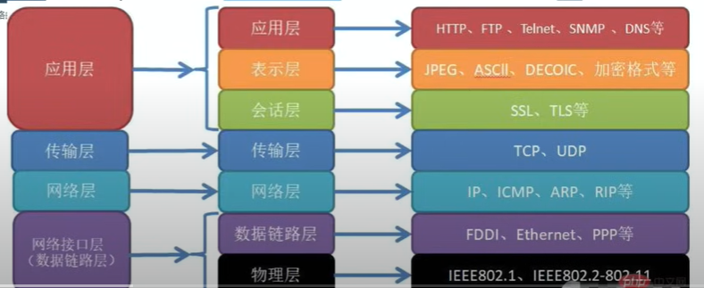
场景：当搜索一个域名（绑定了一个ip地址）的时候。  
1.首先在本地缓存查收是否有域名对应的ip  

2.如果没有会去查找本地的host文件，查看是否有映射关系  

3.都没有的话就会发送一个dns请求，这个是后五层网络模型所做的事情：从上往下封装      
应用层——— 生成一段'请告诉我baidu.com的ip的地址'    
传输层——— 对应用层数据进行封装生成原端口和目的端口（TCP/UDP传输协议）     
网络层——— 封装原ip和目的ip   
数据链路层 —— 当在这私网段找不到目的ip地址的时候就会去寻找网关（路由器），默认网关ip192.168.1.1,会添加网关的mac地址和本机mac地址    
物理层—— 通过网卡发送出去  

4.如果发送到交换机上（只有两层模型）从下往上解封  
物理层
数据链路层 —— 解析mac地址确实挂载自己端口两边进行转发

5.发送到路由器 （有三层模型）从下往上解封  
物理层
数据链路层 —— 发现这个目的mac地址就是自己，就接受数据包然后往上传到网络层  
网络层 —— 先通过查找路由表发现没有对应的ip，会发送到默认路由上（如果同样没有），就会从WAN口转发到公网上。这里面其中有个NAT地址映射表（会保存私网ip和端口以及对应公网的ip和端口），然后对这个请求的ip和端口、原mac地址、目的mac地址改为公网的ip和端口、本机的mac地址、规定转发到的路由mac地址    

6.进过互联网发送到dns服务器（应用层的）从下往上，每经过一个路由器就会修改相应的mac地址（原mac地址、目的mac地址）  最终确定ip相同、端口对应 就是发送给他的  

# GFW防火墙  
场景   
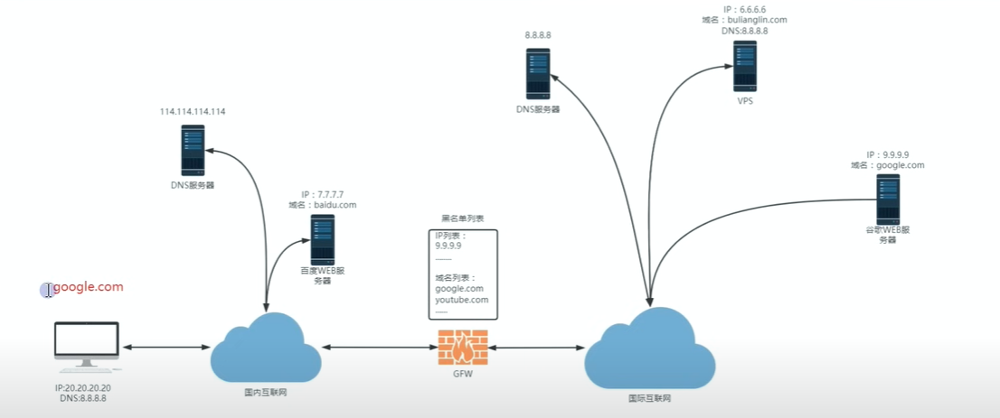  
  
定义：当国内访问国外数据的时候中间有道防火墙（GFW）它可以查看你数据包里面的内容。五层结构。    
问题1:  
因此可以将返回的数据包内容进行篡改——将返回的应用层数据里面的ip地址篡改（DNS污染/劫持）。      
解决办法：   
1.直接在host文件中添加ip地址和域名——不发送请求  
问题2:  
应用层的HTTP请求是基于TCP（有连接）的，但是GFW有黑名单ip出现在里面的话就会被干掉，无法到达。或者防火墙伪装成为服务器给你返回一个数据包（伪造）————TCP重制攻击  

问题3:  
因为存在其他的DNS解析ip，所以有可能会有数据包建立TCP连接。之后发送的请求任然被GFW检查，发现里面存在黑名单的域名（应用层）就会再次拦截。  

问题4:  
通过代理的方式，如http、socks5因为这个在墙外的服务器，国内可以连接，但是因为GFW可以查看应用层的东西所以任然会出现问题——甚至会把这个服务器的ip加入黑名单中。  

——————————  
综上的大部分原因都是因为：GFW可以查看到应用层的东西  
因此vpn可以实现的就是加密，但是传统vpn连接（IPSec openvpn  协议）的时候会在应用层表明要进行vpn连接，这个时候GFW并不会直接阻断，而是先允许你，但是会进行监控，在长时间大流量、和特殊时期就会可能进行关闭。————特征明显    
shadowsocks协议——不仅完成了加密而且没有那么明显的特征   
步骤：1.首先在服务端搭建ss服务监听8388端口的  
2.在本机上运行ss服务的客户端，监听端口1080（接受数据）  
3.对浏览器设置代理（浏览器的请求会先走这个端口）端口1080   
4.发送http请求的时候会先进过ss代理进行加密，从而使应用层加密，然后进过五层模型发送到互联网上。  
5.服务端解密并且进行带替去访问相对应的服务。然后对返回的数据也在应用层进行加密，在放回互联网。    
缺点：GFW可以实现主动探索从而试探出使用的是哪一种协议  

# 搭建节点    
VPS：一台24小时不关机的虚拟电脑——会给你分配一个公网ip。 
如果你的vps是window系统的话就可以使用FinalShell 进行管理连接3389端口来进行管理

1.ubuntu搭建shadowsocks  
```
apt install shadowsocks-libev   #下载服务

vim /etc/shadowsocks-libev/config.json #搭配配置文件  

{
    "server":{"::1","127.0.0.1"}, //127.0.0.1  表示的是只接受本地回环的ip地址，就是只接受在本机中的流量（如果有多个公网ip的时候这个就很有用），改为0.0.0.0可以接受所有ip的信息   
    "mode":"tcp_and_udp",
    "server_port":8388,
    "local_port":1080, 
    "password:"hss12",
    "timeout":86400,
    "method":"chacha20-ietd-poly1305"
}
___________________________________________
            //改为
{
    "server":{"0.0.0.0"},   
    "mode":"tcp_and_udp",
    "server_port":8388,
    "local_port":1080, 
    "password:"nPidLfSScD3F",
    "timeout":86400,
    "method":"chacha20-ietd-poly1305"  //加密方式
}
```  

问题5:  
GFW利用你的东西给同一台服务器发送相同的数据查看里面返回的数据是什么——查看运行的是什么服务（重放攻击）  

2.关闭服务端防火墙/开放端口运行对外访问  
`ufw allow 8388`  

3.查看日志  
`journalctl -u shadowsocks-libev.service -f `  
查看发现无法ping通并且日志没有更新内容————很大程度被GFW给阻隔了  
可以尝试更换端口  
发送成功后会看到  

这里面就会有一个不属于本机的ip去发送请求（重放攻击）  

4.在ss协议之后加上plugin（插件）  
原理：是在原本的数据基础上添加一些流量头，使这些流量伪装成为一个正常/合理的流量从而实现GFW不会重放攻击。之后服务端也使用这个插件进行解封在通过ss服务端的到真正的数据  

`apt install shadowsocks-v2ray-plugin` 安装插件  
`dpkg -L` 查看安装了什么内容  
`ss-v2ray-plugin` 可以直接使用但是没有配置，所以启动也没什么用  
`vim /etc/shadowsocks-libev/config.json `修改配置文件添加插件
{
    "server":{"0.0.0.0"},   
    "mode":"tcp_and_udp",
    "server_port":8388,
    "local_port":1080, 
    "password:"hss12",
    "timeout":86400,
    "method":"chacha20-ietd-poly1305"  //加密方式
    "plugin":"ss-v2ray-plugin" //添加插件
    "plugin_opts":"server"  
}

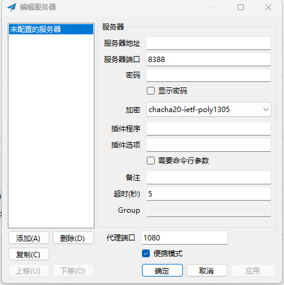  
插件选项为"server"其他一致  
其中客户端的配置中的端口为1080相当于在本机中再使用一个代理ip为127.0.0.1  
  

# trojan的原理  
http原理： 是明文的任何中间的服务器都可以对我们的数据进行添加、修改.这样就会导致返回的数据中可能插入其他的广告之类的东西  
https原理：  http+tls，tls会进过加密处理使应用层的东西不可见，对数据流量进行加密防止中间人篡改  
## tls 加密  
前提条件：
1.开启https访问网站的时候必须要网站证书  

2.网站证书在CA机构去申请   
申请证书需要去CA机构————通过服务器发送请求将公钥和域名都包括在里面。  
AC机构需要确定你能控制这个域名————通过返回一些字符串，通过这些字符串在网站的首页放好这些字符串。  
AC机构发送确定信号————表明服务器搭建好了“字符串”，AC机构确定它能掌控。  
都确定好后AC机构将颁发证书给服务器  
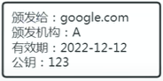   

3.申请之前又需要一对公私钥（进行非对称加密的）  
对称加密算法：对数据加密和解密必须使用相同的密钥  
非对称加密算法：使用私钥对他加密，必须使用公钥对他解密。使用公钥对加密，必须使用私钥对呀解密。        
其中私钥是源于自己生产，公钥是基于私钥生产。公钥给别人让他们知道，属于公开的，私钥是自己的不允许公开。  

具体步骤：  
1.在http阶段生成了一个数据包，把这个数据包放入tls中  
2.刚放入TLS之后并不会立即加密，因为不知道密钥，所以先进行握手连接——————跟目的服务器进行tls连接，目的服务器返回AC机构的证书。  
3.本机（里面有受信任的证书颁发机构）和返回的证书里面的信息一对比，确定这个证书满足条件之后就会产生连接，否则出现警告。    
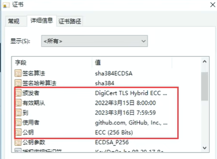    
4.有效后利用证书中的公钥（会在tls握手的时候协商使用什么加密算法）对数据进行加密。  
域名不加密是因为一个ip可能对应多个域名，如果域名加密的话就不知道使用哪一种密钥去解密了。  

## trojan 加密
trojan的原理类似于https服务器。
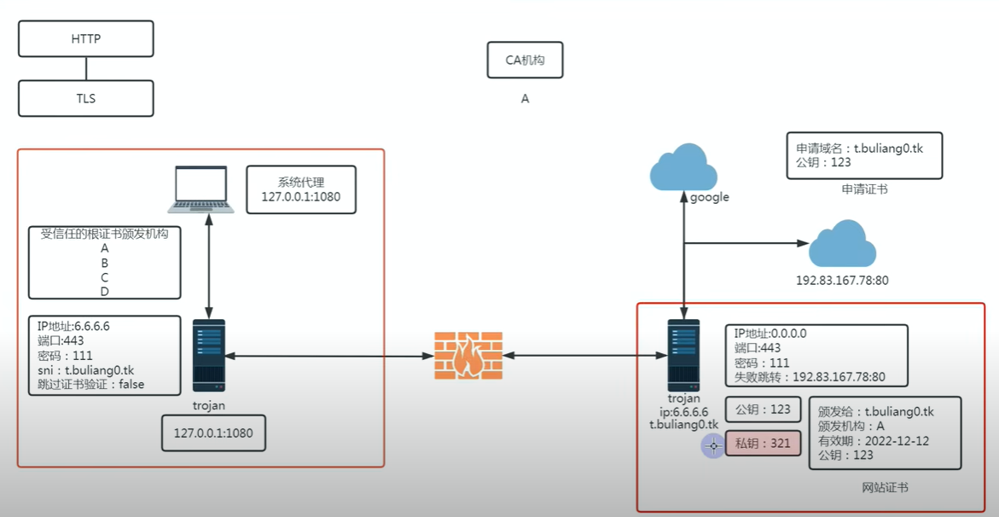  
前提条件
1.所以trojan服务器也需要一个证书，同上先生成私钥再去AC机构申请证书，并且拿到证书。  
2.之后trojan服务端就会配置0.0.0.0接受任何请求，端口443（因为https的请求就是443————方便伪装），密码用于身份验证而不是加密数据———失败后跳转192.83.168.78:80    
3.trojan客户端配置目的ip为服务器，端口、密码对应，sni为访问的域名必须和网站证书一致。

具体步骤：  
客户端：  
1.首先生成一个http请求的数据包。  
2.将这个数据包通过tls加密，但是并没有遮掩住sni————目的域名。  
3.tls之后交给代理服务器，会在数据包的前面加上协议头（trojan:密码）。  
4.再经过tls，但是此时发送的数据是发向trojan的服务端（通过发送证书的方式）。  
5.通过tls加密后只会露出服务端的域名其他的又全部封装了，就可以通过GFW。  
服务端：  
6.对发来的数据先确定是不是trojan数据包，并且查看密码是否正确。  
7.然后解密。如果不是trojan数据包、密码错误就会发送到失败跳转（规避了防火墙主动试探）  

代码操作：  
```
mkdir trojan  #创建文件夹
cd trojan  #进入  
wget  https://github.com/p4gefau1t/trojan-go/releases/download/v0.10.6/trojan-go-linux-amd64.zip  
#下载trojan
unzip trojan-go-linux-amd64.zip  #解压  
ls  #绿色的代表可执行文件，example代表一些实例。  
vim config.json   #trojan配置文件   
_______________________
{
    "run_type": "server",     #服务端
    "local_addr": "0.0.0.0",   #监听任何请求
    "local_port": 443,           #伪装端口
    "remote_addr": "127.0.0.1",  #失败后跳转
    "remote_port": 80,             #跳转端口
    "password": [
        "your_password"        #密码
    ],
    "ssl": {                 #tls设置  
        "cert": "your_cert.crt",     #证书
        "key": "your_key.key",     #私钥  
    }
}
_______________________
./trojan-go -config config.json  #表示运行trojan并且带上配置文件  

./trojan-go #执行可执行文件默认加载同目录下的配置文件    
```

### 申请证书：  
```
curl https://get.acme.sh| sh  #安装acme
apt install  socat   #安装socat ——安装acme的条件  
ln -s /root/acme.sh/acme.sh  /usr/local/bin/acme.sh #添加软连接，bin目录下放置的就是环境变量  
acme.sh -register-account-m my@example.com  #注册账号，利用邮箱  
ufw allow 80 #开放80端口——这个端口能让acm自动搭建web服务器满足证书发放的条件  
acme.sh -issue -d 申请的域名  -standalone -k ec-256 #最后为加密方式  
_____________________________
# 如果颁发的太忙了那么可以切换颁发证书的服务： 
acme.sh -set-default-ca -server letsencrypt  
acme.sh -set-default-ca -server buypass 
acme.sh -set-default-ca -server zerossl  
___________________________ 
#将完整的私钥和完整的证书链安装到这个目录下  
acme.sh -installcert -d 域名 -ecc -key-file /root/trojan/server.key -fullchain-file /root/trojan/server.crt  
#成功运行  
./trojan-go 
```

### 申请自签证书  
```
服务端证书等级F
#生成私钥
openssl ecparam -genkey -name prime256v1 -out ca.key  
#生成证书  
openssl req -new -x509 -days 36500 -key ca.key -out ca.crt -subj"/CN=bing.com"  
#/CN=bing.com 中的 CN 是 "Common Name" 的缩写，中文通常称作“通用名称”。对于服务器证书而言，这个字段通常是填写网站的域名，以便客户端可以通过检查该字段来验证它正在与正确的服务器通信。例如，在你提供的命令中，CN=bing.com 表示此证书是为 bing.com 这个域名颁发的。

#在客户端 
改成不验证证书并且SNI改成CN后面的，因为tsl加密方式中要对应的上  
因此更正证书的属性很重要  

nonhub ./trojan-go>trojan.log 2>&1 & #将内容重定向到日志文件中，2>在shell中表示标准错误输出作为正确输出，左边不需要&转义。  
```

trojan 加密会使两层加密。  


# VMESS和V2RAY 关系  
定义：VMESS 表示的是一种网络协议，v2ray是一种网络工具。  

## vmess
配置：
{  
出站类型：vmess  
服务端ip  
端口  
用户id  
额外id  
加密方式：auto————自动选择一种加密方式    
传输协议：tcp  
}  

原理：进行三层加密  
首先本地生成的数据包进过v2ray客户端代理。  
1.进入代理后自动加密算法在数据包头部加上加密算法名称和生成一个随机密钥，之后通过这两个队原本的数据包1进行加密生成数据包2  
2.在使用用户id对数据包2进行加密，这个加密方式是固定的是和服务器商量好的生成数据包3  
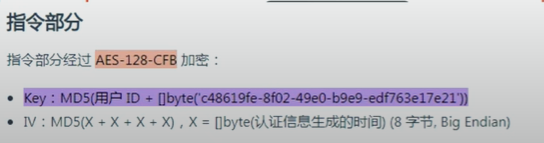
3.再头部插入时间戳+用户Id进行进行哈希处理，生成md5的数据（不可逆）生成数据包4（没有对数据包3的数据内部进行改变）  
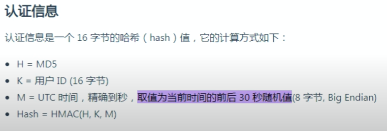
把数据包4发送出去————GFW很难识别  

服务端  
v2ray设置了vmess入站协议解析  
1.检验头部数据是否合法，因为这个头部是不可逆的，所以会根据此时的系统时间戳生成一个大数组+-120秒内和服务器配置的用户id加上去，然后每个进行hash算法一一对应，直到检验合法/不合法  
2.解密成为数据包3（检验是否是需要的数据）  
3.因为数据包3只是通过用户id用固定的方式进行解密为数据包2   
4.因为可以看见加密方式和密钥所以又可以用这种方式进行解密（对称加密算法）  

所以vmess时间不能超过90秒  
额外id的作用用因为可能同意时间发送多个请求，所以会出现重复的情况，这个时候使用额外id就可以避免。就是在主id的基础上生成多个额外id,然后服务端额外id设置比当前客户端额外id大的数字  

但是由于重放攻击可以破处VMESS加密的  
  
因此加强设置为AEAD的方式————设置额外id为0  

下载v2ray  ：
https://www.v2fly.org/guide/workflow.html#%E5%B7%A5%E4%BD%9C%E5%8E%9F%E7%90%86 
  
##  vmess+tls
设置vmess里面加密方式设置为zero,数据包内部不加密了，但是协议头依旧会加密，uuid的固定加密。使用tls之后就会把整个数据全部加密，如果不加密的话就会看到数据内的直接隔断。tls伪装成https。使用v2ray把传输协议再加上ws（基于tcp、udp）  


承载和伪装的区别：  
伪装：通过对数据进行头部文件的伪装，看起来像http请求  
承载：使用过对数据包进行层层加信息使他数据包加密。vmess->ws->tcp一步一步承载  

### 前提  
网络证书  
```
acme.sh -installcert -d 域名 -ecc -key-file /usr/local/etc/v2ray/server.key -fullchain-file /usr/local/etc/v2ray/server.crt   #把证书安装到v2ray的地方  

vim /usr/local/etc/v2ray/config.json #更改配置文件
——————————————————————————————
{
  "inbounds": [
    {
      "port": 16823, // 服务器监听端口
      "protocol": "vmess",    // 主传入协议
      "settings": {
        "clients": [
          {
            "id": "b831381d-6324-4d53-ad4f-8cda48b30811",  // 用户 ID，客户端与服务器必须相同
            "alterId": 0
          }
        ]
      },
      "streamSettings":{
        "network":"tcp",  #改成ws就实现了vmess+ws+tls传输  
        "security":"tls",
        "tlsSettings":{
            "certificates":[
                {
                    "certificateFile":"/usr/local/etc/v2ray/server.crt ",
                    "keyFile":"/usr/local/etc/v2ray/server.key"
                }
            ]
        }
      }
    }
  ],
  "outbounds": [
    {
      "protocol": "freedom",  // 主传出协议
      "settings": {}
    }
  ]
}
——————————————————————————————
这个之后可能仍然会报错表示权限不足，那就去/etc/systemd/system/v2ray.service 里面删掉Usre那一行删掉  

systemctl start v2ray  
```
但是无法主动伪装（需要自己搭建一个伪装放置防火墙主动探索，自己发请求），需要搭配以一个伪装站点。  
 
利用图形话界面改为tls传输方式  
使用ws协议是因为它可以承载里面的数据并且可以转载的时候利用路径选择对应的端口,然后暴露在外面的是nginx主动探索的时候如果路径不对的话就会返回bing.com的首页    
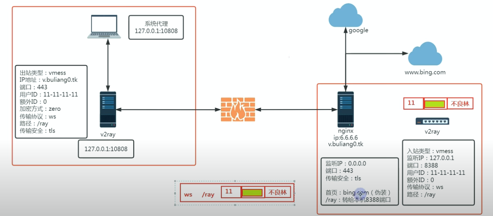

#### vmess+nginx+tls
```
apt install nginx -y 
vim /etc/nginx/nginx.conf
________________________
user www-data;
worker_processes auto;
pid /run/nginx.pid;
error_log /var/log/nginx/error.log;
include /etc/nginx/modules-enabled/*.conf;

events {
	worker_connections 768;
}

http {server {
listen 443 ssl;   #监听443端口
listen [::]:443 ssl;

server_name v.buliang0.tk; #你的域名
ssl_certificate /usr/local/etc/v2ray/server.crt; #处理了证书和密钥  
ssl_certificate_key /usr/local/etc/v2ray/server.key;
ssl_session_timeout 1d;
ssl_session_cache shared:MozSSL:10m;
ssl_session_tickets off;

ssl_protocols TLSv1.2 TLSv1.3;
ssl_ciphers ECDHE-ECDSA-AES128-GCM-SHA256:ECDHE-RSA-AES128-GCM-SHA256:ECDHE-ECDSA-AES256-GCM-SHA384:ECDHE-RSA-AES256-GCM-SHA384:ECDHE-ECDSA-CHACHA20-POLY1305:ECDHE-RSA-CHACHA20-POLY1305:DHE-RSA-AES128-GCM-SHA256:DHE-RSA-AES256-GCM-SHA384;
ssl_prefer_server_ciphers off;

location / {   #如果访问的首页的话就跳
proxy_pass https://www.bing.com; #伪装网址
proxy_ssl_server_name on;
proxy_redirect off;
sub_filter_once off;
sub_filter "www.bing.com" $server_name;
proxy_set_header Host "www.bing.com";
proxy_set_header Referer $http_referer;
proxy_set_header X-Real-IP $remote_addr;
proxy_set_header User-Agent $http_user_agent;
proxy_set_header X-Forwarded-For $proxy_add_x_forwarded_for;
proxy_set_header X-Forwarded-Proto https;
proxy_set_header Accept-Encoding "";
proxy_set_header Accept-Language "zh-CN";
}

location /ray {     #表示如果是/ray的话就进入真正的访问
proxy_redirect off;
proxy_pass http://127.0.0.1:8388 ;
proxy_http_version 1.1;
proxy_set_header Upgrade $http_upgrade;
proxy_set_header Connection "upgrade";
proxy_set_header Host $host;
proxy_set_header X-Real-IP $remote_addr;
proxy_set_header X-Forwarded-For $proxy_add_x_forwarded_for;
}
}

server {
listen 80;           #80重定向https
server_name v.buliang0.tk; #你的域名
rewrite ^(.*)$ https://${server_name}$1 permanent;
}
}
________________________


#再次更改v2ray的配置文件
vim /usr/local/etc/v2ray/config.json 
——————————————————————————————
{
  "inbounds": [
    {
      "listen":"127.0.0.1",   #表示只允许本机来访问不允许公网访问  
      "port": 8388, // 服务器监听端口
      "protocol": "vmess",    // 主传入协议
      "settings": {
        "clients": [
          {
            "id": "b831381d-6324-4d53-ad4f-8cda48b30811",  // 用户 ID，客户端与服务器必须相同
            "alterId": 0
          }
        ]
      },
      "streamSettings":{
        "network":"ws",  
        "wsSettings":{
            "path":"/ray"
        } 
      }
      #证书交给nginx处理  
    }
  ],
  "outbounds": [
    {
      "protocol": "freedom",  // 主传出协议
      "settings": {}
    }
  ]
}
```
## VLESS XTLS协议  
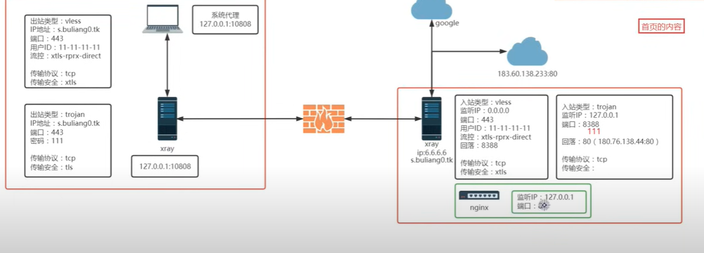
假设我们已经通过代理的方式获得了和google的tls连接，那么他的数据包就会被tls加密，搜索的内容会被加密，但域名并不会形成了数据包1。  
这个数据包通过Xray的系统代理，根据选择使用vless协议进行加密，就会在头部加上vless协议和自己的id，但是没有对域名进行加密，所以还是会被GFW拦截。  
###  xtls加密
使用xtls，他只对**前面那部分**进行加密、对后面已经加密的就不会进行加密，从而大大提升了性能。使用的版本为tls1.3加密（就可能包括部分tls1.2的内容，这个特效就可能被防火墙发现，并阻止），访问网站使用的可能是tls1.2/1.3，可以被精准的探索了      
###  trojan加密
此时我们可以选择使用trojan对**整个**数据加密，作为数据包2发送出去。  
数据包2发送到GFW认为是正常的http请求，然后到达目的ip。  
此时数据包使用的是trojan发送的端口为443，但是Xray的服务器使用的是vless监听的为443端口，将会用vless解密，发现并不能解密出正确的，此时就会出发回落机制回到本机的8388端口。  
而服务器的8388端口恰好是用trojan协议就可以实现解密。  
如果此时发送过来的http都不能解密就会回落到80端口，服务器的80端口是一个nginx,返回一个页面。强大的回落功能    
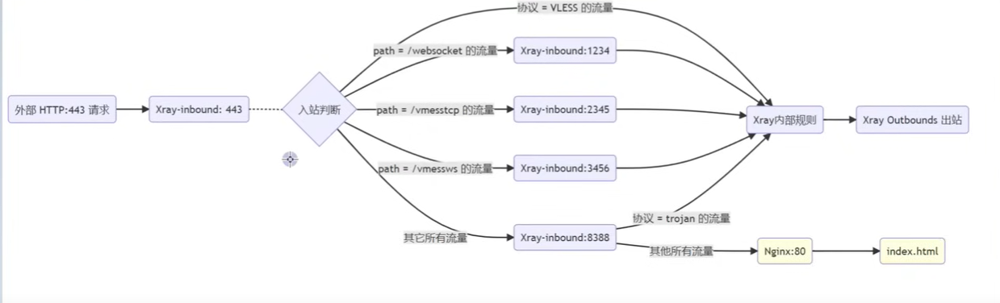
可以实现在同一个端口实现不同的对应功能。  

具体步骤：`https://bulianglin.com/archives/guide.html`  
回落节点可以选择多个  


# 提升节点的速度  
边界网关协议（BGP）：实现两个网络自治系统的连接，共享两边的ip，实现全互联。  
IXP：性能贼强的交换机  
移动、电信、联通这个区域就是自治系统。
## 国内部署大致：
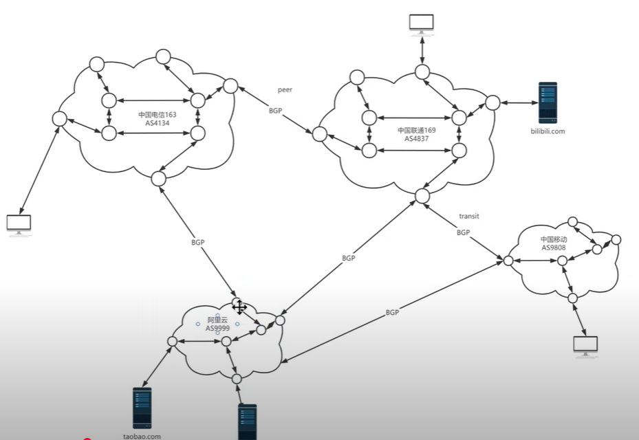
## 国际部署：
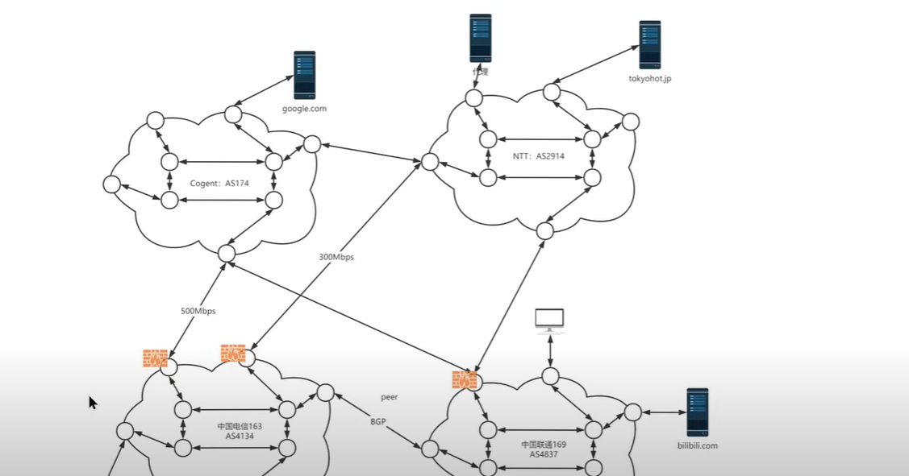
这些连接都是通过一条一条光缆（海底光缆）连接起来的。    
所以出国节点的会卡就是因为光缆传播带宽不够大。  
长城防火墙是部署在每个国际出口的地方，当流量拥挤的时候就会设置优先级，先处理正常的http请求可能将那些其他协议给舍弃掉。  
普通用户没有部署路由的权利，只能检测走的是哪一条路。（去程和回程不一定一致）  
综上得出，你网速的快慢和自己的vps没有太大关系，只是关于光缆（就可能需呀购买特定的线路）的带宽和拥堵情况  
中转机：只对数据进行中转不进行任何处理就不需要绕路了    
————通过端口转发（NAT转发就可以搭建节点了）直接转发，服务器的ip都一样就是换了个端口。      
————隧道转发会对数据进行加密，并且在落地解密


## 原理
下载X-UI，会自带Xray的内核  
```
bash <(curl -Ls https://raw.githubusercontent.com/vaxilu/x-ui/master/install.sh)   #安装X-UI
ufw disable  #关闭防火墙
```
在图形化界面使用vless协议，监听0.0.0.0 默认也可以 ，只要修改端口为80，传输协议为ws 

### cdn 
全名：内容分布网络  
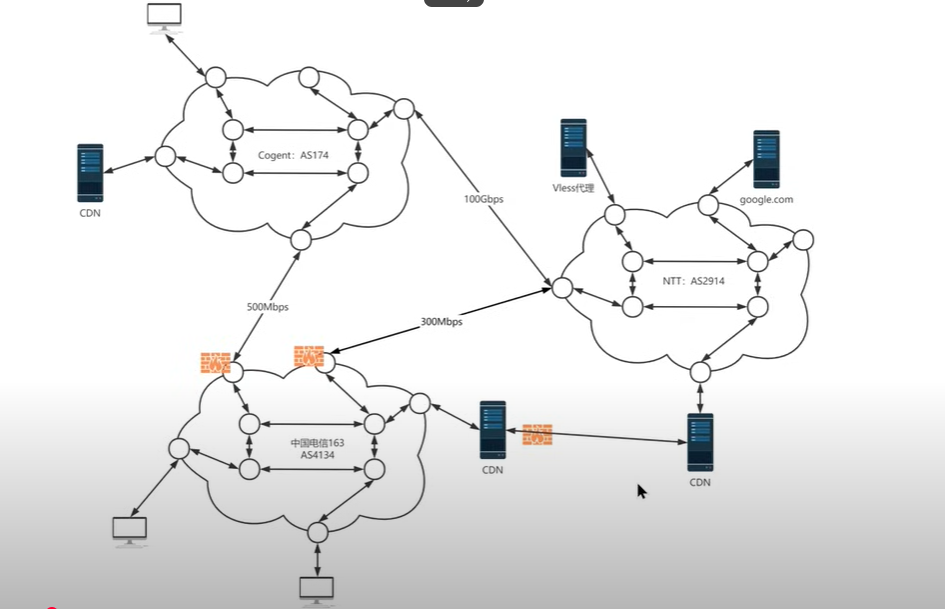  
CDN会缓存内容，起到了网络加速功能和内容分发。假如你访问的CDN没有需要的内容那么Acdn会向它的上级去要内容（这段链接使用的是专线）如果都没有就会一直向上级要，知道到目的服务器，然后下载里面的内容并且保存到CDN里面，可以缓存图片和一些静态资源。   
使用CDN为什么提速不快？  
因为国内CDN需要域名——实名注册（备案），国外虽然不需要但是无法绕过GFW走专线只能走共享的那条线（瓶颈链路），使用免费CF的CDN因为使用的人太多了被劣化了。  

## 实操
利用CF  `https://cloudflare.com`  
提供了DNS域名解析和CDN服务，在没有服务器的条件下创建一些自定义的workers   
配置内容为：只要写一个ip给个自定义名称和开启代理就可以了  
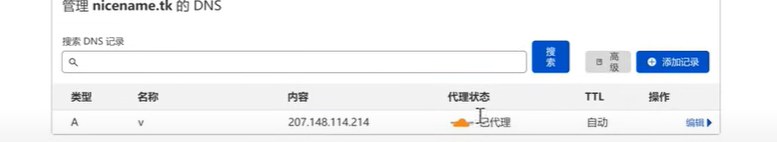

## 总流程图  
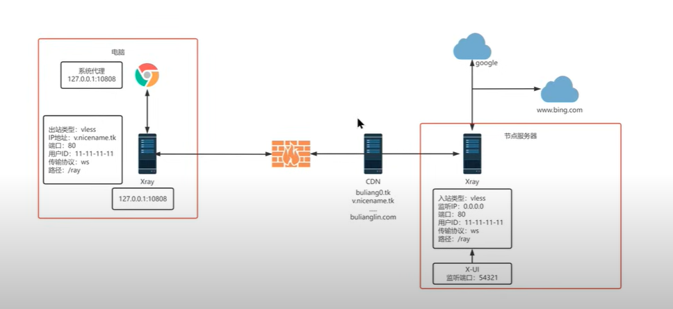  
CDN只能转发80端口发来的数据并且是http服务他才会转发。所以CDN类似一个端口的转发并不是全部数据的转发。  
所以这就定义了客户端需要将端口设置为80并且使用ws(是一种http服务的进阶)。  
综上从图中可以看出CDN能防治节点服务器被墙（可以让ip绕出来）。  
注意：发送给CDN的服务器可以使用不同的CDN即（客户端更换ip）
但是必须确保里面的域名是有的即v.nicename.tk。因为CDN会检查这个域名进行转发到相对应的ip。  

### 优选ip  
原理：是在所有cdn中随机挑选一些ip地址，先ping一下是否通顺，如果通顺就按延迟来排序，排序完成后去下载一个文件，找到下载速度最快的。因为下载是用我们本地的网络进行下载所以下载速度基本反映了我们本地连接这台cdn服务器的下载速度。   
优选ip挑选`https://github.com/XIU2/CloudflareSpeedTest`  

### tls加密
此时我们传输的数据是一种明文的形式传输，所以需要进行tls加密,只需要在客户端进行加密就可以了，服务端不需要配置证书和密钥，因为CDN和服务端的传输可以是明文的不需要担心被防火墙给阻塞。而CDN属于别人的主机已经下载好了相应的证书所以只需要修改客户端端口改为443传输协议加上tls即可。因为443端口是https流量走的默认被套上了tls进行加密的。   
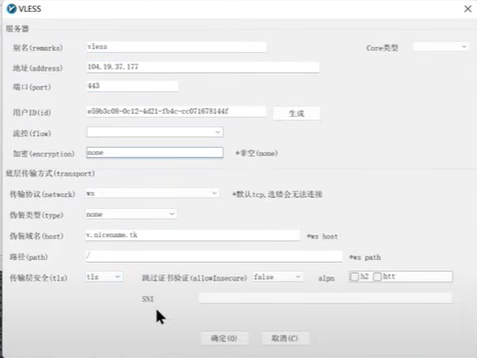  

回源：从CDN到节点服务器  

### nginx进行伪装代理  
原理：  
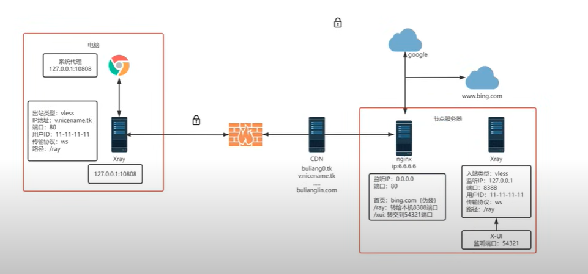 
相当于使用nginx进行转发，如果/xui就会进入x-ui端口
```
# 安装nginx：
apt install nginx
# 配置nginx：
vim /etc/nginx/nginx.conf

————————————————————————————————
user www-data;
worker_processes auto;
pid /run/nginx.pid;
include /etc/nginx/modules-enabled/*.conf;

events {
  worker_connections 768;
}

http {

 server {
    listen 80 default_server;
    listen [::]:80 default_server;

   ssl_protocols         TLSv1.2 TLSv1.3;
   ssl_ciphers           ECDHE-ECDSA-AES128-GCM-SHA256:ECDHE-RSA-AES128-GCM-SHA256:ECDHE-ECDSA-AES256-GCM-SHA384:ECDHE-RSA-AES256-GCM-SHA384:ECDHE-ECDSA-CHACHA20-POLY1305:ECDHE-RSA-CHACHA20-POLY1305:DHE-RSA-AES128-GCM-SHA256:DHE-RSA-AES256-GCM-SHA384;
   ssl_prefer_server_ciphers off;
location / {
  proxy_pass https://www.bing.com; #伪装网址
  proxy_ssl_server_name on;
  proxy_redirect off;
  sub_filter_once off;
  sub_filter "www.bing.com" $server_name;
  proxy_set_header Host "www.bing.com";
  proxy_set_header Referer $http_referer;
  proxy_set_header X-Real-IP $remote_addr;
  proxy_set_header User-Agent $http_user_agent;
  proxy_set_header X-Forwarded-For $proxy_add_x_forwarded_for;
  proxy_set_header X-Forwarded-Proto https;
  proxy_set_header Accept-Encoding "";
  proxy_set_header Accept-Language "zh-CN";
    }

   location /ray {
    proxy_redirect off;
    proxy_pass http://127.0.0.1:8388;
    proxy_http_version 1.1;
    proxy_set_header Upgrade $http_upgrade;
    proxy_set_header Connection "upgrade";
    proxy_set_header Host $host;
    proxy_set_header X-Real-IP $remote_addr;
    proxy_set_header X-Forwarded-For $proxy_add_x_forwarded_for;
    }

   location /xui {
    proxy_redirect off;
    proxy_pass http://127.0.0.1:9999;
    proxy_http_version 1.1;
    proxy_set_header Host $host;
   }
 }
}
————————————————————————————————
#因为xray此时占用了80端口所以无法启动所以需要先停止x-ui
x-ui
9 
0
# 重新加载nginx配置：
systemctl reload nginx.service
#启动x-ui
 x-ui  start 
 #修改里面的x-ray
```

## 节点服务器用拥控制算法  
功能：提高本机电脑和代理服务器之间传送数据的速率。  
基于tcp的
因为以前的基于丢包的使用率很低每一次丢包都会使传播速率直接损失一半，而bbr算法会使传输速率保持相对稳定，每次都会探索的上升，如果稳定会再次上升。  
```
#查询当前使用的 TCP 拥塞控制算法
sysctl net.ipv4.tcp_congestion_control
#查询当前Linux版本
uname -r

#启用BBR TCP拥塞控制算法
echo "net.core.default_qdisc=fq" >> /etc/sysctl.conf
echo "net.ipv4.tcp_congestion_control=bbr" >> /etc/sysctl.conf
sysctl -p
```
