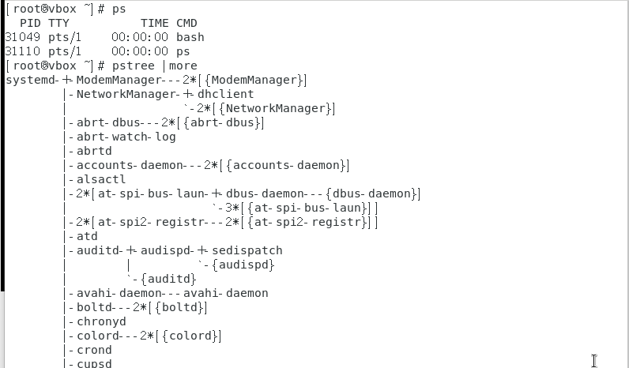
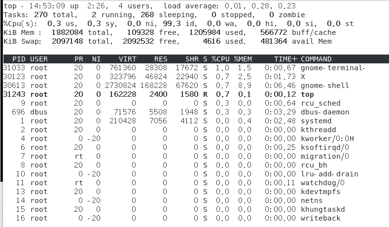
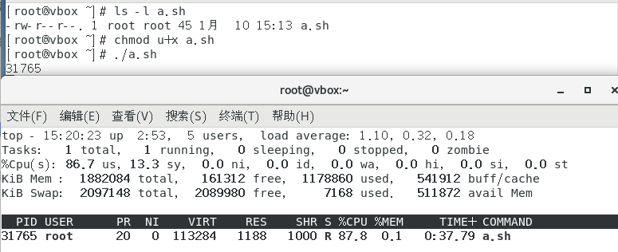
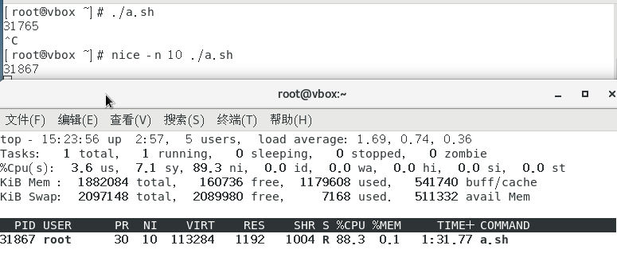
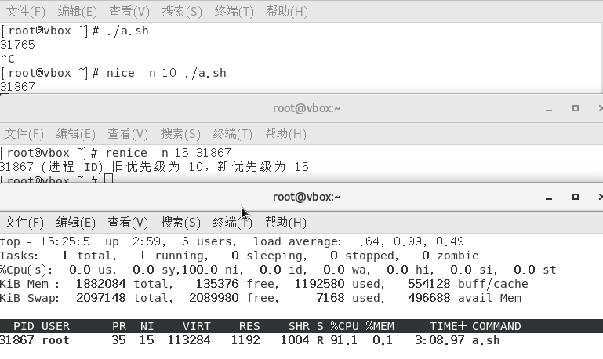
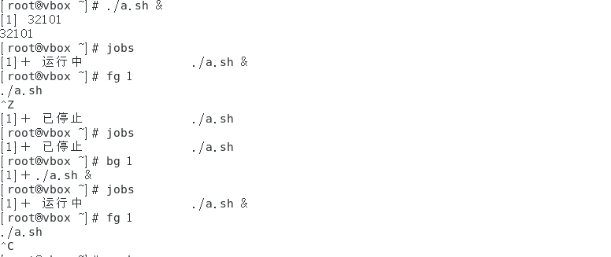
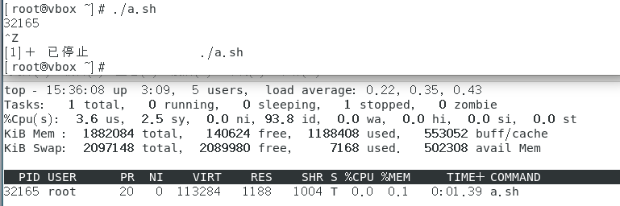
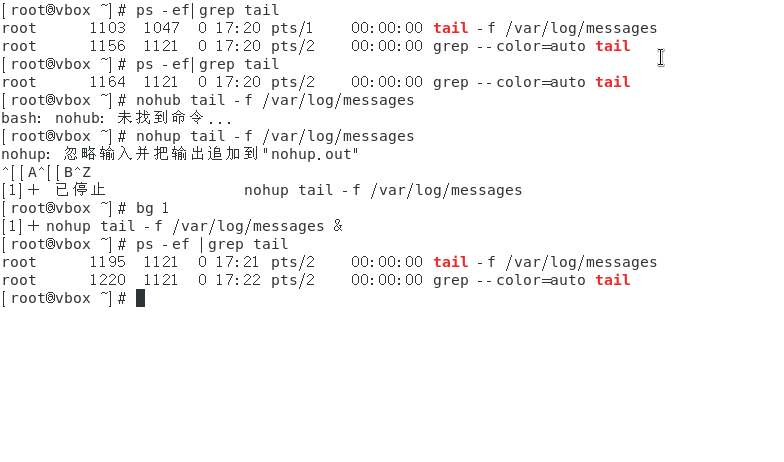
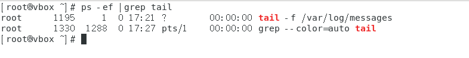
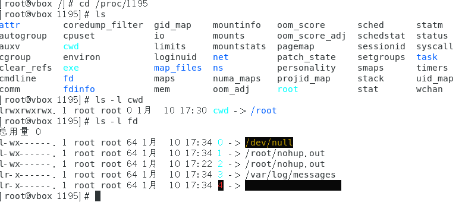

##  1.进程概念：

进程——运行中的程序，是从程序开始运行到终止的整个生命周期是可管理的   
进程的开始是从主程序开始，终止的方式分为：  
正常终止：从main函数返回、调用exit函数、调用return语句  
异常终止：收到信号、被其他进程杀死、运行出错  
 
```
ps  //查看进程状态，不带其他参数查看的是当前状态的进程
——ps  -e  //查看所有进程，不同终端
——ps -e | more  //分页查看
——ps -e | grep 进程名称  //查看进程名称的进程
——ps -ef  //查看所有进程，包括子进程
——ps -eLf  //查看所有进程，包括线程


pstree  //查看进程树（进程是一个树形状的）
top  //查看实时进程状态(动态)
——top -p 进程ID  //查看进程ID的进程
```



PPID：父进程ID——第一个进程是0  
PID：进程的唯一标识符——进程名称可能有多个单ID只有一个    
TTY：当前进程的终端设备——pts：伪终端（虚拟机）  
TIME：进程运行时间  
CMD：进程启动命令  
UID:用户ID——表示是哪一个用户启动的这个进程（身份也是可以改变的）  
LWP：线程的唯一标识符    


`top 指令：` 


4 uers  表示的是用户数——当前有4个用户登录过  
load average 表示的是平均负载，1分钟、5分钟、15分钟——系统繁忙程度  
Tasks 表示的是任务数: running 正在运行的进程数，sleeping 睡眠的进程数，stopped 停止的进程数，zombie 僵尸进程数  
%Cpu(s) 表示的是CPU的使用情况，us 用户百分比，sy 内核百分比，id 空闲百分比，wa 等待百分比，st 虚拟机百分比————这是总共CPU的使用情况，如果想看每一个的话，可以按1键    
Mem 表示的是内存的使用情况，total 总内存，used 已使用内存，free 空闲内存，buff/cache 缓冲区内存
Swap 表示的是交换分区，total 总交换分区，used 已使用交换分区，free 空闲交换分区

## 2.进程的控制

进程的控制：从就绪态到运行态的执行顺序，通过不同的调度算法会有不同的进程执行顺序  
优先级的调整：  
进程在占用较多的资源的时候希望它调小一点，在占用较少资源的时候希望它调大一点  

`./ 不设立优先级 ————NI=0`


`nice -n 10 设立优先级 ————NI=10`


`renice -n 15 进程ID 重新设置优先级 ————NI=15`


```
chomd u+rx 文件名  //给文件添加执行权限(要有读权限才能执行)且在当前用户产生的子进程的执行者是当前进程的用户  
./   表示运行一个进程
top -p 进程ID  //查看进程ID的进程

nice -n 10  //调整优先级范围-20到19，优先值越小优先级越高，抢占资源就越多。
renice -n 10 进程ID  //对于已经运行的重新设置优先级
```

但是打开了很多终端很麻烦，所以可以采用进程作业的控制。  
`开始一个进程在后台运行——>挂起——>后台运行——>前台运行——>结束`

`挂起`

```
jobs  //进程的作业控制——可以查看后台运行的进程
./a.sh  &  //后台运行——运行的程序+& 
ctrl+z  //将前台进程调到后台并且挂起该进程（保存在内存中）  
fg 1 //将进程作业jobs里面的序号调到前台
bg 1 //将前台进程调到后台
```

## 3.结束进程 
信号是进程之间的通信方式之一，典型的用法就是：终端用户输入中断命令，通过信号机制停止一个程序的运行。
```
kill -l  //查看信号  
kill -2 进程ID  //中断信号——通知前台进程终止进程等语ctrl+c在shell脚本中可以用
kill -9 进程ID  //强制终止进程，不受任何阻断
```

## 4.守护进程(daemon)
守护进程是运行在后台的进程，通常用于监控系统状态、执行系统维护任务、提供系统服务等。守护进程通常在系统启动时自动启动，并在系统运行期间持续运行，直到系统关闭。（所占用的目录是根目录） 

还有一个进程和守护进程类似：
使用nohup 命令于&符号 运行一个进程，即使关闭终端，进程也不会终止。



```
tail -f 文件名  //查看文件的实时变化
ps -ef | grep tail  //查看进程名
//关掉中断就会中断这个程序
nohup tail -f 文件名 &  //因为加了&符号，所以是后台运行，nohup确保了即使关闭了终端程序不会终端。nohup会忽略掉输入并且把输出会追加到nohup.out文件中
//结束掉当前的终端
ps -ef | grep tail  //会发现关掉终端后父进程改变了 因为父进程是终端，终端关闭后父进程就变成了1号进程

```
日志文件的由来：因为很多服务没有终端的输出，所以需要查看这些输出是否正确，从而需要日志文件。


```
cd /proc/进程号      //proc这个目录下的所有文件都是不存在的，是操作系统读取内存的信息。
ls -l cwd //查看当前进程正在被挂载在那个目录下，不能被卸载正在被使用。  
ls -l fd //查看中第一行表示输入 0 表示标准输入，第二行表示输出 1 表示标准输出，第三行表示错误 2 表示标准错误.
```
