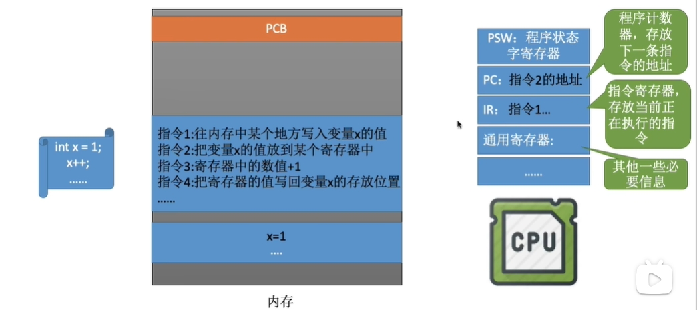
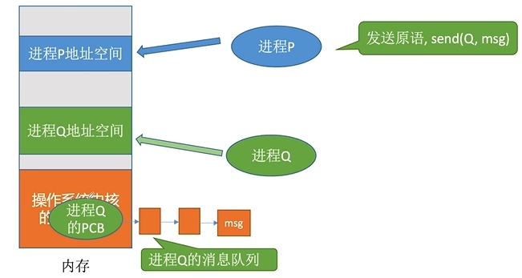
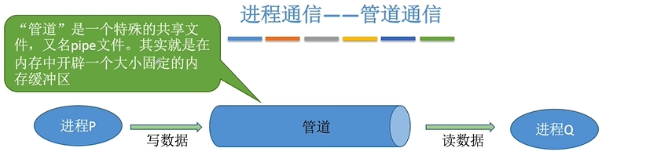
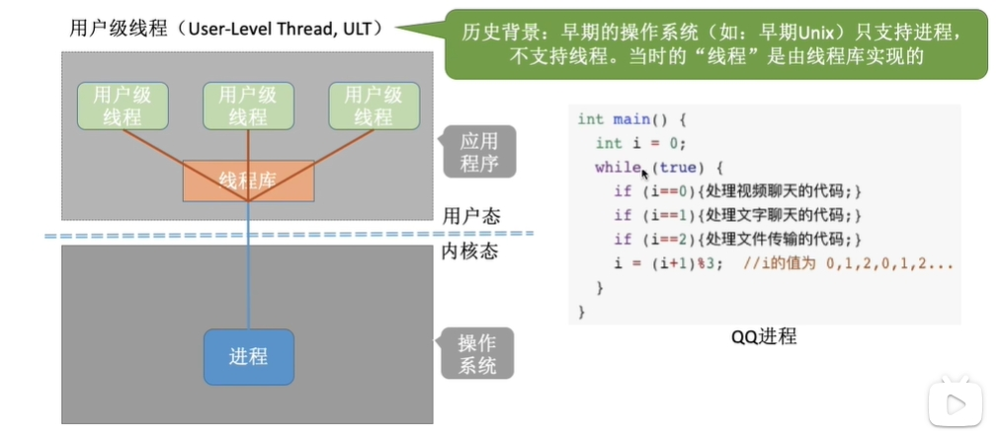
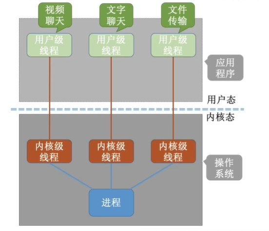
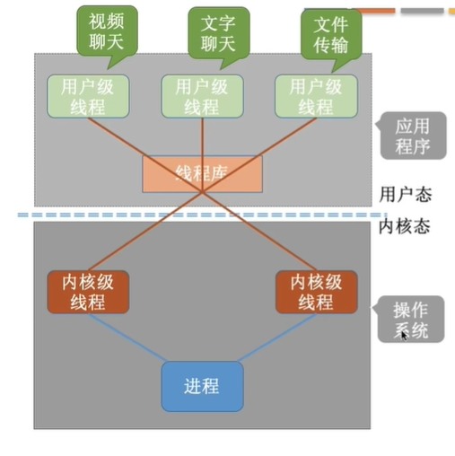
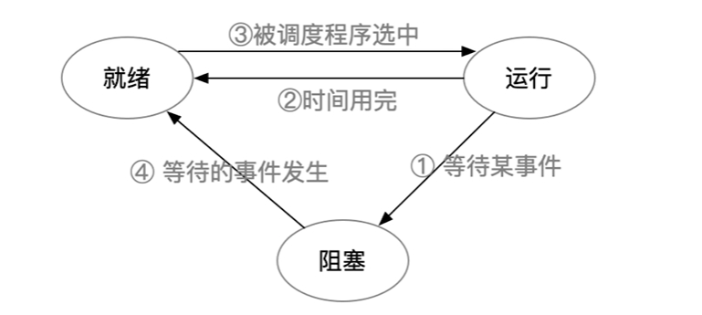
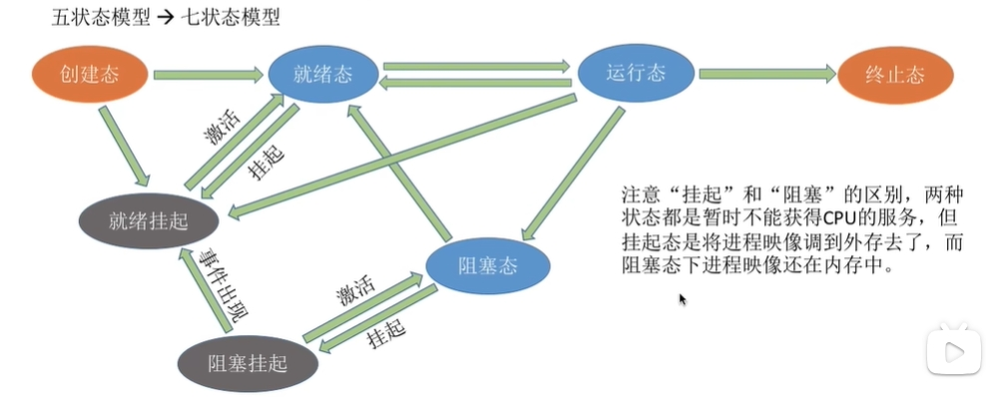

## 1.进程

程序：是指存储在磁盘里面的可执行文件，是一系列指令的集合。是静态的。
进程：是动态的，是程序的一次执行过程
PCB 内部包含的信息有：  
1.进程描述信息  PID  UID  
2.进程控制和管理信息:CPU、磁盘、网络流量等  
当前状态（就绪态、阻塞态、运行态等）  
3.资源分配清单： 正在使用的文件、内存、I/O设备  
4.处理机相关信息:PSW、PC等等各种寄存器的值(用于实现进程切换)

进程实体是由1.PCB:进程描述信息、进程控制和管理信息、资源分配清单、处理机相关信息  
2.程序段：代码（指令序列）  
3.数据段：运行过程中产生的各种数据也在内存中（如：程序中定义的变量）  
程序运行的过程是：代码—>编译exe可执行文件—>内存中执行—>指令放在cpu中执行

进程的状态(PCB中有一个state来表示当前的状态):
1.创建态— 新建态(进程正在创建的时候,操作系统会为进程分配资源、初始化PCB)  
 2.就绪态(处于就绪态的进程已经具有运行条件,但没有空闲CPU,就暂时不能运行 有很多)  
 3.运行态(一个进程此时正在CPU上运行)  
 4.阻塞态—等待态(在进程运行的过程中，可能会请求等待某个事件的发生。在这个事件之前，进程无法继续往下执行,此时操作系统会让这个进程下CPU)  
 5.终止态—结束态(一个进程使用exit系统调用后,操作系统会让该进程下CPU,并且回收内存空间等资源,最后还要回收该进程的PCB,终止态 结束后进程结束了)
运行态————》阻塞态 是系统能够主动进入的状态，通过代码可以实现
阻塞态————〉就绪态 不是进程自己能够控制的是一种被动行为
就绪状态 〈———〉运行状态  只有这两个可以互相转换（时间片到了，或者处理机被占用）

操作系统会把处于同一个状态的进程进行统一管理及PCB组织起来——组织方式(链接方式)：使用 1.执行指针—》PCB1（单CPU）、PCB2（多核）。  
2.就绪指针——〉PCB3——》PCB4(把优先级高的放在前面)  
3.阻塞队列指针——〉…….(会根据阻塞原因不同拆分为多个不同的队列)  

——索引方式  
给相应的进程建立索引表： 指针——》相对应的索引表——〉分别对应不同的PCB

### 进程控制：实现进程之间的状态转换  

#### 1.介绍  
使用原语实现进程的控制（处于内核中）——原语是一种特殊的程序，它的执行具有原子性。就是最小的单位，运行过程必须一气呵成不可中断。否则可能导致就绪状态队列里面存放的是运行状态的PCB。  

#### 2.原语的原子性
特殊是因为：关中断指令和开中断指令，这两个特权指令实现的
原本的CPU每次执行完一个指令后都会检查外部是否有中断请求，而当执行关中断指令后，就不再会进行例行检查，直到执行开中断指令才会恢复每次的检查。恢复检查之后会检查之前时候有未处理的中断信号从而去处理。  
如果普通用户使用“关中断”和“开中断”的特权指令的话就会丧失并发的优点。

#### 3.创建原语
（操作系统创建一个进程时使用的原语）：  
1.申请空白PCB 。  
2.为新进程分配所需资源。  
3.初始化PCB。  
 4.将PCB插入就绪队列。  
实际是让进程从创建态——》就绪态

应用：用户登陆（分时系统中登陆成功系统会为其分配一个新的进程）、作业调度（从外存选择一个进程进入内存）、提供服务、应用请求（创建子进程）

#### 4.撤销原语
（在终止一个进程的时候使用的）：实现从某一种进程转向终止状态  
1.在PCB集合里面找到终止进程的PCB  
2.若进程正在运行，立即剥夺CPU，并且将CPU分配给其他进程。  
3.终止所有子进程。  
4.将进程拥有的所有资源归还给父进程。  

造成终止得事件：  
1.正常结束：进程自己请求终止————使用exit系统调用结束  
2.异常结束：整数除以0、非法使用特权指令然后背操作系统强行杀掉  
3.外界干扰：使用任务管理器得方式 kill指令  

#### 5.阻塞原语和唤醒原语
（程序从运行台————》阻塞态）  
1.找到阻塞进程所对应得PCB  
2.保护进程运行现场，将PCB状态xinxi设为阻塞态，暂时停止进程运行  
3.将PCB插入相应时间的等待队列

（从阻塞态————》就绪态）  
1.在事件等待队列中找到PCB  
2.将PCB从等待队列中移除，设置进程为就绪  
3.将PCB插入就绪队列，等待被调度  

一个进程因为什么事件被阻塞就要因为这个事件被唤醒（成对使用）  
应用：等待系统分配某种资源。需要等待相互合作的其他进程完成工作  

#### 6.切换原语
（运行态《————》就绪态）  
1.将运行环境信息存入PCB中  
2.PCB移入相应队列  
3.选择另一个进程执行，并更新PCB  
4.根据PCB恢复新进程所需的运行环境 

应用：时间片到了。有更高优先级的进程到达。当前进程 主动阻塞。当前进程结束

#### 7.进程运行时的CPU
  

CPU中存在很多的寄存器：  
PSW：程序状态寄存器————存放PCB里面程序的状态  
PC：程序计数寄存器————存放下一条指令的地址  
IR：指令寄存器————存放当前正在执行指令的地址  
通用寄存器————存放一些其他必要信息（就像里面x）  

在执行进程时有很多指令执行后的结果是放在寄存器里面的，但这些寄存器在执行时并不是独属于当前进程的可能会被其他进程调用，所以当代码没有初始化的时候就可能会有其他值。  
解决办法：在进程的切换的时候可以将必要的运行环境先保存在PCB中（进程的运行环境），之后就可以使用这个PCB中的环境去保存了。  

### 进程之间的通信  

概念：进程通信（IPC）是指两个进程之间产生的数据交互  
如在：A软件内调用B软件的信息，并且直接打开了A软件————里面携带有B软件的信息。  
为什么需要操作系统去控制进程之间的通信？  
因为进程拥有的内存地址空间是相互独立的只能读写自己空间里面的东西，所以进程之间无法自动的去调用其他进程地址空间所占用的资源。所以为了安全考虑。  

#### 进程通信的方法

##### 1.共享存储

概念：A进程申请一个共享存储区（里面的资源可以被其他进程所调用）。相当于在内存中开辟一个新的空间。  
原理：先通过shm_open 系统调用申请一片共享内存区，再通过mmap系统调用将共享存储区映射到自己的地址空间（多了一片虚拟内存）。  
注意事项：进程访问这片共享存储区是要互斥访问（同时写会出写的内容被覆盖）  

分两类：  
基于存储区的共享：操作系统划出一块共享存储区，里面的数据形式、存放位置都是由通信进程控制与操作系统无关了————高级通信方式  
基于数据结构的共享：共享空间只放一些数据结构（就必须按照该数据机构方式读/写），这种限制多、速度慢————低级通信方式  

##### 2.消息传递  

概念：进程间的数据交换以格式化的消息为单位。进程通过操作系统提供的“发送消息/接收消息”两个**原语**进行数据交互  
格式化的消息包括：1.消息头（发送进程ID、接受进程ID、消息长度等 ）  
2.消息体  

分两类：  
1.直接通信方式：消息发送进程要指明接受进程的ID（点名道姓）  
进程P发送msg给进程Q：  
1.在进程P的地址空间中生成msg（格式化的消息）  
2.通过系统调用的原语send(Q,msg) 发送到操纵系统内核中  
3.在创建Q的PCB时有个进程Q的消息队列会把P发送的msg传到这个队列里面  
4.进程Q使用receive(P,&msg)这个接受**原语**
5.再把这个msg复制到Q的地址空间内
  

2.间接通信方式（信箱通信方式）：通过“信箱”间接地通信——读写数据在信箱里面是自由存储  
进程P发送msg给进程Q：  
1.进程P在操作系统内核的地址空间中申请一个或多个**邮箱**（A、B）  
2.进程P在自己的地址空间内完善msg  
3.使用**发送原语** send(A,msg) 表示将消息传送到信箱里面  
4.进程Q使用**接受原语** receive(A,&msg) 将信箱里面的信息传递给Q进程了  
允许多个进程往同一个信箱传递消息，也允许多个进程从同一个信箱接受消息  

3.管道通信  
概念：数据的传递只能是单向的（从一端写入，另一端读数据）——读写数据在管道里面存储是先进先出的  
管道类似一个循环队列，在linux中一切皆文件所以管道也可以定义在pipe文件（内存缓冲区）

  

因此单管道通信只能采用半双工通信，即某一时间段内是单向传输。如果要使用双向同时通信，需要设置两个管道（全双工通信）。  
各个进程对管道访问是**互斥**访问(操作系统)  
当管道写满（为空）那么会对进程进行的下一个操作进行阻塞，需要Q将管道里面的进程读出来一个（P写以一个进程进入管道）才可唤醒进程。  
一个管道并不是一直是特定的读进程/写进程，所以当多个进程读同一个管道就会出现错乱（因为一旦被读出后管道里的数据就不会在管道中了）。解决方案：1.一个管道允许多个写进程，一个读进程。2.允许有多个写进程，多个都读进程，但系统会让各个读进程**轮流**从管道中读取。所以管道是多对多的进程。

### 线程

进程是程序的一次执行，但是在一个进程（列如QQ）不可能按顺序就能实现边视频边文字和传送文件的功能  
传统的进程只能串行地执行一系列程序操作，所以以前进程是程序执行的最小单位  
所以为了解决这些问题，实现同时做很多事情（增加并发性）————提出线程  

线程概念：是一个基本的CPU执行单元，也是程序执行流的最小单位————轻量级进程。  
在拥有线程后，进程只作为除了CPU之外的系统资源的分配单元  

两个最小：线程是最小的调度单位————进程是最小的资源分配单位。  
并发性：线程之间也可以并发执行  
系统开销：传统的进程间并发需要切运行环境开销较大，有线程后不需要切换环境。  

线程的属性：  
1.多CPU（多核）计算机中，各个线程可占用不同CPU  
2.每个线程都有一个线程ID、线程控制块（TCB）  
3.线程也有就绪、阻塞、运行三种基本状态  
4.线程几乎不拥有系统资源（因为资源分配是进程管理，线程只用来调度）  
5.同一进程里的线程可以共享资源（不需要线程之间通信），不同进程的线程需要切换运行环境  

##### 1.线程的实现方式和多线程模型

##### 1.用户级线程（UTL）

 通过调用线程库来生成线程，而从代码逻辑上看相当于实现一个while循环然后不断改变循环条件。这个是在用户态就可以实现的操作，不会涉及内核态。————就是从用户视角看能看到的线程  

优点：用户线程的切换在用户空间就可以完成，不需要切换到核心态，开销小，效率高。  
缺点：当一个线程发生了阻塞那么其他线程也被阻塞。————相当于此时的调度基本单位任然是进程。  

##### 2.内核级线程（KTL）

此时的线程是由操作系统进行管理，需要使用内核态，那么此时**操作系统**就需要变态了。

优点：  
1.操作系统支持内核级线程，那么线程就是最小的调度单位（不同代码能跑不同程序）  
2.当某一个线程进入阻塞的话，并不会影响其他线程的操作。如果多核CPU可以并行执行。  
缺点：  
需要操作系统变态，管理成本高、开销大。  

##### 3.多线程模型  

为了综合上述两个线程的优点  
1.一对一模型（类似上面KTL的图）：一个用户级线程映射到一个内核级线程。每个用户进程有与用户级线程同数量的内核级线程、并发性不高主要是并行。  
2.多对一模型（类似上面UTL）：多个用户级线程映射到一个内核级线程。且一个进程只能被分配到一个内核级线程。————这种只是在KTL中的线程库和进程之间插入了一个内核级线程。  
3.多对多模型：n用户和m个内核级线程（n>=m）。每个用户进程有m个内核级线程————当一个内核级线程被阻塞了另外一个内核级线程任然可以运行。————只有所有内核级线程被阻塞了才可以说这个进程被阻塞了。

可以这么理解：用户级线程————代码逻辑、内核级线程（只有整个才是处理及分配的单位即CPU执行整个线程）————运行机会。  

#### 4.线程的状态与转化

线程的控制：  
线程的状态转换和进程的状态转化一样的有五个转态，但我们更注重三状态模型：

线程的组织：  
线程的控制结构（TCB————线程控制块）：  
线程标识符————》TID（与PID类似）  
程序计数器————》线程目前执行到哪里  
其他寄存器————》线程运行的中间结果  
堆栈指针————》堆栈保存函数调用信息、局部变量等  
线程运行状态————》就绪/运行/阻塞  
优先级————》线程调度、资源分配的参考  

其中线程在内核级线程切换时要保存的/恢复的运行环境有：程序计数器PC、其他寄存器、堆栈指针。  

多个线程块组织在一个线程表（thread table）  
TCB1  
TCB2  
TCB3  
  
### 处理机的调度  

调度的概念：  
有一堆任务要处理，由于资源有限，这些事情没法同时处理。这就需要某种规则来决定处理这些任务的顺序。

#### 1.调度的三个层次

由于内存空间有限，有时无法将用户提交的作业全部放入内存————所以要用调度
作业：一个具体的任务(用户向系统提交了一个作业==用户让系统启动一个程序[处理一个具体任务])  
1.高级调度（作业调度）外存————》内存  
按一定的原则从外存(硬盘)存放的作业后备队列中挑选一个作业调入内存,并创建进程。每个作业只能调入一次,调出一次。作业调入时会建立PCB，调出撤销PCB  
2.低级调度(进程调度/处理机调度)内存————》CPU  
按照某种策略从**就绪队列**中选取一个进程，将处理机(CPU)分配给他。————进程调度是操作系统的最基本的一种调度(频率很高)。  
3.中级调度(内存调度)外存————》内存  
原因：  
当内存不够时，可将某些进程的数据调出外存。等内存空闲或者进程需要的时候在重新调入内存中，暂时调到外存等待的进程状态被称为**挂起状态**。被挂起的进程PCB会被组织在挂起队列。  
概念：  
按照某种策略决定将从那个处于挂起状态的进程重新调入内存（当我们在桌面切换进程时有些会很快————就在内存里面，而有些却很慢————被内存调度调到外盘中了）  

调度频率：
低级调度————》中级调度————》高级调度  

补充：  
进程的挂起态与七状态模型  
暂时调到外存等待的进程状态被称为挂起状态（挂起态）  
挂起状态又可以进一步细分为：就绪挂起、阻塞挂起两种状态。  
其中阻塞挂起又可以根据原因划分为更多的队列。  

  

#### 2.进程调度（低级调度）详细  

需要进程调度的情况：  
1.主动：  
进程正常终止  
运行时发生异常终止  
进程主动请求**阻塞**（I/O）  
2.被动：  
处理机分配给该进程的时间片用完  
有更紧急的事需要处理（I/O**中断**）  
有更高优先级的进程到达就绪队列  

不能进行进程调度的情况：  
1.在处理中断过程——————中断处理过程复杂、与硬件密切相关，很难做到中断处理过程中进行进程切换。  
2.进程在操作系统内核程序临界区。  
进程处于临界区是可以进行处理机的调度。  
临界资源：一个时间段内只允许一个进程使用的资源。各进程互斥地访问临界资源。  
临界区：访问临界资源的那段代码————虽然需要把调用的特定的普通设备上锁，但是并不影响处理机去处理其他进程。  
内核程序临界区：访问某种内核数据结构，会把处于内核的数据结构上锁。  
3.在原语操作中。  

进程调度的方式：  
1.非剥夺调度方式，又称为非抢占方式。即，只允许进程主动放弃处理机。在运行过程中即便有更紧迫的任务到达，当前进程依然会继续使用处理机，直到该进程终止或主动要求进入阻塞态类似主动  
2.剥夺调度方式，又称抢占式。当一个进程正在处理机上执行时，如果有一个更重要或紧迫的进程需要使用处理机，则立即暂停正在执行的进程，将处理机分配给更重要更紧迫的任务。类似被动  

广义的进程调度包括：狭义的进程调度、进程切换。  
侠义的进程调度：  
从就绪队列中选一个要运行的进程  
进程切换（所以进程切换是有代价）：  
A进程让出处理机，B进程占用处理机。————对原来运行进程的数据保存和对新进程的数据的恢复。  

#### 3.调度器/调度程序 

由调度算法（谁执行）和时间片大小（运行时间）组成

调度时机————什么事件会触发调度程序  
1.创建新进程（是否将这个进程放入运行态中）  
2.进程退出（从就绪队列选择新的进程让CPU处理）  
3.运行进程阻塞  
4.I/O中断发送（唤起某些阻塞进程）  

非抢占式调度策略：只有运行进程阻塞或者退出才触发调度程序策略。  
抢占式调度测率：每个时钟中断或k个时钟中断会触发调度程序策略。  
注意：如果是内核级线程，那么就是直接调用线程。  

闲逛进程：  
当调度程序没有其他就绪进程时，运行闲逛进程。（确保CPU永远在运转）  
特点：  
优先级最低  
可以是0地址指令（不需要缓存，不需要访问CPU寄存器），占一个完整的指令周期。
能耗低  

#### 4.调度算法的评估

1.CPU利用率  
概念：指的是CPU忙碌的时间占总时间的比列————忙率时间/总时间。  
2.系统吞吐量  
单位时间内完成作业的数量————总共完成了多少**道**作业/总共花多少时间  
3.周转时间  
作业被提交给系统开始，到作业完成为止的这段时间间隔。包括四个部分a.高级调度时间 b.低级调度时间 c.CPU处理进程的时间 d.进程等待I/O操作完成时间。后三项可能多次执行。————周转时间=作业完成时间-作业提交时间  
平均周转时间=各作业周转时间之和/作业数  
带权周转时间=作业周转时间/作业实际运行的时间=（作业完成时间-作业提交时间）/作业实际运行的时间>=1 所以带权周转时间越小越好  
平均带权周转时间=各作业带权周转时间之和/作业数量  
4.等待时间  
指进程/作业处于等待处理机状态时间之和，等待时间越短越好。除了被CPU执行和等待I/O完成的期间都是不算入等待时间。  
5.响应时间  
用户从提交请求到首次产生响应所用的时间。  

调度算法学习：  
1.先来先服务（FCFS）  
思想：  
从公平的角度考虑————先到先服务  
规则：按照作业/进程到达的顺序（等待时间越久的进程就会优先得到服务）  
是否可抢占：非抢占式调度  
优点：公平、简单实现。  
缺点：排在长作业（进程）后面的短作业需要等待很长的时间，短作业带权周转时间会很长。长作业友好，短作业不友好。
2.短作业优先(SJF)  
3.高响应比优先（HRRN）  

#### 进程同步、互斥

进程具有以异步性，指的是各并发执行的进程以各自独立的、不可预期的速度向前推进。  
因为异步性决定了进程执行的顺序不一定，所以需要同步来约束关系。  

同步：指的是直接制约关系，它是指为了完成某种任务而建立的两个或者多个进程，这些进程必须要在某些位置上协调它们的工作次序而产生的制约关系。（管道通信的时候必须要先写数据才能读数据，这就是一种同步）  
