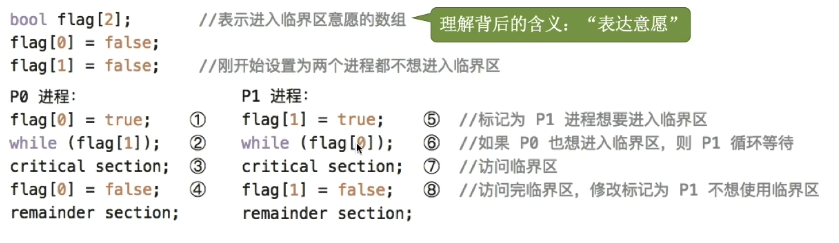

# 操作系统学习
## 1.进程

程序：是指存储在磁盘里面的可执行文件，是一系列指令的集合。是静态的。
进程：是动态的，是程序的一次执行过程
PCB 内部包含的信息有：  
1.进程描述信息  PID  UID  
2.进程控制和管理信息:CPU、磁盘、网络流量等  
当前状态（就绪态、阻塞态、运行态等）  
3.资源分配清单： 正在使用的文件、内存、I/O设备  
4.处理机相关信息:PSW、PC等等各种寄存器的值(用于实现进程切换)

进程实体是由1.PCB:进程描述信息、进程控制和管理信息、资源分配清单、处理机相关信息  
2.程序段：代码（指令序列）  
3.数据段：运行过程中产生的各种数据也在内存中（如：程序中定义的变量）  
程序运行的过程是：代码—>编译exe可执行文件—>内存中执行—>指令放在cpu中执行

进程的状态(PCB中有一个state来表示当前的状态):
1.创建态— 新建态(进程正在创建的时候,操作系统会为进程分配资源、初始化PCB)  
 2.就绪态(处于就绪态的进程已经具有运行条件,但没有空闲CPU,就暂时不能运行 有很多)  
 3.运行态(一个进程此时正在CPU上运行)  
 4.阻塞态—等待态(在进程运行的过程中，可能会请求等待某个事件的发生。在这个事件之前，进程无法继续往下执行,此时操作系统会让这个进程下CPU)  
 5.终止态—结束态(一个进程使用exit系统调用后,操作系统会让该进程下CPU,并且回收内存空间等资源,最后还要回收该进程的PCB,终止态 结束后进程结束了)
运行态————》阻塞态 是系统能够主动进入的状态，通过代码可以实现
阻塞态————〉就绪态 不是进程自己能够控制的是一种被动行为
就绪状态 〈———〉运行状态  只有这两个可以互相转换（时间片到了，或者处理机被占用）

操作系统会把处于同一个状态的进程进行统一管理及PCB组织起来——组织方式(链接方式)：使用 1.执行指针—》PCB1（单CPU）、PCB2（多核）。  
2.就绪指针——〉PCB3——》PCB4(把优先级高的放在前面)  
3.阻塞队列指针——〉…….(会根据阻塞原因不同拆分为多个不同的队列)  

——索引方式  
给相应的进程建立索引表： 指针——》相对应的索引表——〉分别对应不同的PCB

### 进程控制：实现进程之间的状态转换  

#### 1.介绍  
使用原语实现进程的控制（处于内核中）——原语是一种特殊的程序，它的执行具有原子性。就是最小的单位，运行过程必须一气呵成不可中断。否则可能导致就绪状态队列里面存放的是运行状态的PCB。  

#### 2.原语的原子性
特殊是因为：关中断指令和开中断指令，这两个特权指令实现的
原本的CPU每次执行完一个指令后都会检查外部是否有中断请求，而当执行关中断指令后，就不再会进行例行检查，直到执行开中断指令才会恢复每次的检查。恢复检查之后会检查之前时候有未处理的中断信号从而去处理。  
如果普通用户使用“关中断”和“开中断”的特权指令的话就会丧失并发的优点。

#### 3.创建原语
（操作系统创建一个进程时使用的原语）：  
1.申请空白PCB 。  
2.为新进程分配所需资源。  
3.初始化PCB。  
 4.将PCB插入就绪队列。  
实际是让进程从创建态——》就绪态

应用：用户登陆（分时系统中登陆成功系统会为其分配一个新的进程）、作业调度（从外存选择一个进程进入内存）、提供服务、应用请求（创建子进程）

#### 4.撤销原语
（在终止一个进程的时候使用的）：实现从某一种进程转向终止状态  
1.在PCB集合里面找到终止进程的PCB  
2.若进程正在运行，立即剥夺CPU，并且将CPU分配给其他进程。  
3.终止所有子进程。  
4.将进程拥有的所有资源归还给父进程。  

造成终止得事件：  
1.正常结束：进程自己请求终止————使用exit系统调用结束  
2.异常结束：整数除以0、非法使用特权指令然后背操作系统强行杀掉  
3.外界干扰：使用任务管理器得方式 kill指令  

#### 5.阻塞原语和唤醒原语
（程序从运行台————》阻塞态）  
1.找到阻塞进程所对应得PCB  
2.保护进程运行现场，将PCB状态xinxi设为阻塞态，暂时停止进程运行  
3.将PCB插入相应时间的等待队列

（从阻塞态————》就绪态）  
1.在事件等待队列中找到PCB  
2.将PCB从等待队列中移除，设置进程为就绪  
3.将PCB插入就绪队列，等待被调度  

一个进程因为什么事件被阻塞就要因为这个事件被唤醒（成对使用）  
应用：等待系统分配某种资源。需要等待相互合作的其他进程完成工作  

#### 6.切换原语
（运行态《————》就绪态）  
1.将运行环境信息存入PCB中  
2.PCB移入相应队列  
3.选择另一个进程执行，并更新PCB  
4.根据PCB恢复新进程所需的运行环境 

应用：时间片到了。有更高优先级的进程到达。当前进程 主动阻塞。当前进程结束

#### 7.进程运行时的CPU
  

CPU中存在很多的寄存器：  
PSW：程序状态寄存器————存放PCB里面程序的状态  
PC：程序计数寄存器————存放下一条指令的地址  
IR：指令寄存器————存放当前正在执行指令的地址  
通用寄存器————存放一些其他必要信息（就像里面x）  

在执行进程时有很多指令执行后的结果是放在寄存器里面的，但这些寄存器在执行时并不是独属于当前进程的可能会被其他进程调用，所以当代码没有初始化的时候就可能会有其他值。  
解决办法：在进程的切换的时候可以将必要的运行环境先保存在PCB中（进程的运行环境），之后就可以使用这个PCB中的环境去保存了。  

### 进程之间的通信  

概念：进程通信（IPC）是指两个进程之间产生的数据交互  
如在：A软件内调用B软件的信息，并且直接打开了A软件————里面携带有B软件的信息。  
为什么需要操作系统去控制进程之间的通信？  
因为进程拥有的内存地址空间是相互独立的只能读写自己空间里面的东西，所以进程之间无法自动的去调用其他进程地址空间所占用的资源。所以为了安全考虑。  

#### 进程通信的方法

##### 1.共享存储

概念：A进程申请一个共享存储区（里面的资源可以被其他进程所调用）。相当于在内存中开辟一个新的空间。  
原理：先通过shm_open 系统调用申请一片共享内存区，再通过mmap系统调用将共享存储区映射到自己的地址空间（多了一片虚拟内存）。  
注意事项：进程访问这片共享存储区是要互斥访问（同时写会出写的内容被覆盖）  

分两类：  
基于存储区的共享：操作系统划出一块共享存储区，里面的数据形式、存放位置都是由通信进程控制与操作系统无关了————高级通信方式  
基于数据结构的共享：共享空间只放一些数据结构（就必须按照该数据机构方式读/写），这种限制多、速度慢————低级通信方式  

##### 2.消息传递  

概念：进程间的数据交换以格式化的消息为单位。进程通过操作系统提供的“发送消息/接收消息”两个**原语**进行数据交互  
格式化的消息包括：1.消息头（发送进程ID、接受进程ID、消息长度等 ）  
2.消息体  

分两类：  
1.直接通信方式：消息发送进程要指明接受进程的ID（点名道姓）  
进程P发送msg给进程Q：  
1.在进程P的地址空间中生成msg（格式化的消息）  
2.通过系统调用的原语send(Q,msg) 发送到操纵系统内核中  
3.在创建Q的PCB时有个进程Q的消息队列会把P发送的msg传到这个队列里面  
4.进程Q使用receive(P,&msg)这个接受**原语**
5.再把这个msg复制到Q的地址空间内
  


2.间接通信方式（信箱通信方式）：通过“信箱”间接地通信——读写数据在信箱里面是自由存储  
进程P发送msg给进程Q：  
1.进程P在操作系统内核的地址空间中申请一个或多个**邮箱**（A、B）  
2.进程P在自己的地址空间内完善msg  
3.使用**发送原语** send(A,msg) 表示将消息传送到信箱里面  
4.进程Q使用**接受原语** receive(A,&msg) 将信箱里面的信息传递给Q进程了  
允许多个进程往同一个信箱传递消息，也允许多个进程从同一个信箱接受消息  

3.管道通信  
概念：数据的传递只能是单向的（从一端写入，另一端读数据）——读写数据在管道里面存储是先进先出的  
管道类似一个循环队列，在linux中一切皆文件所以管道也可以定义在pipe文件（内存缓冲区）

  

因此单管道通信只能采用半双工通信，即某一时间段内是单向传输。如果要使用双向同时通信，需要设置两个管道（全双工通信）。  
各个进程对管道访问是**互斥**访问(操作系统)  
当管道写满（为空）那么会对进程进行的下一个操作进行阻塞，需要Q将管道里面的进程读出来一个（P写以一个进程进入管道）才可唤醒进程。  
一个管道并不是一直是特定的读进程/写进程，所以当多个进程读同一个管道就会出现错乱（因为一旦被读出后管道里的数据就不会在管道中了）。解决方案：1.一个管道允许多个写进程，一个读进程。2.允许有多个写进程，多个都读进程，但系统会让各个读进程**轮流**从管道中读取。所以管道是多对多的进程。

### 线程

进程是程序的一次执行，但是在一个进程（列如QQ）不可能按顺序就能实现边视频边文字和传送文件的功能  
传统的进程只能串行地执行一系列程序操作，所以以前进程是程序执行的最小单位  
所以为了解决这些问题，实现同时做很多事情（增加并发性）————提出线程  


线程概念：是一个基本的CPU执行单元，也是程序执行流的最小单位————轻量级进程。  
在拥有线程后，进程只作为除了CPU之外的系统资源的分配单元  

两个最小：线程是最小的调度单位————进程是最小的资源分配单位。  
并发性：线程之间也可以并发执行  
系统开销：传统的进程间并发需要切运行环境开销较大，有线程后不需要切换环境。  

线程的属性：  
1.多CPU（多核）计算机中，各个线程可占用不同CPU  
2.每个线程都有一个线程ID、线程控制块（TCB）  
3.线程也有就绪、阻塞、运行三种基本状态  
4.线程几乎不拥有系统资源（因为资源分配是进程管理，线程只用来调度）  
5.同一进程里的线程可以共享资源（不需要线程之间通信），不同进程的线程需要切换运行环境  

##### 1.线程的实现方式和多线程模型

##### 1.用户级线程（UTL）

 通过调用线程库来生成线程，而从代码逻辑上看相当于实现一个while循环然后不断改变循环条件。这个是在用户态就可以实现的操作，不会涉及内核态。————就是从用户视角看能看到的线程  


优点：用户线程的切换在用户空间就可以完成，不需要切换到核心态，开销小，效率高。  
缺点：当一个线程发生了阻塞那么其他线程也被阻塞。————相当于此时的调度基本单位任然是进程。  

##### 2.内核级线程（KTL）

此时的线程是由操作系统进行管理，需要使用内核态，那么此时**操作系统**就需要变态了。


优点：  
1.操作系统支持内核级线程，那么线程就是最小的调度单位（不同代码能跑不同程序）  
2.当某一个线程进入阻塞的话，并不会影响其他线程的操作。如果多核CPU可以并行执行。  
缺点：  
需要操作系统变态，管理成本高、开销大。  

##### 3.多线程模型  

为了综合上述两个线程的优点  
1.一对一模型（类似上面KTL的图）：一个用户级线程映射到一个内核级线程。每个用户进程有与用户级线程同数量的内核级线程、并发性不高主要是并行。  
2.多对一模型（类似上面UTL）：多个用户级线程映射到一个内核级线程。且一个进程只能被分配到一个内核级线程。————这种只是在KTL中的线程库和进程之间插入了一个内核级线程。  
3.多对多模型：n用户和m个内核级线程（n>=m）。每个用户进程有m个内核级线程————当一个内核级线程被阻塞了另外一个内核级线程任然可以运行。————只有所有内核级线程被阻塞了才可以说这个进程被阻塞了。

可以这么理解：用户级线程————代码逻辑、内核级线程（只有整个才是处理及分配的单位即CPU执行整个线程）————运行机会。  

#### 4.线程的状态与转化

线程的控制：  
线程的状态转换和进程的状态转化一样的有五个转态，但我们更注重三状态模型：


线程的组织：  
线程的控制结构（TCB————线程控制块）：  
线程标识符————》TID（与PID类似）  
程序计数器————》线程目前执行到哪里  
其他寄存器————》线程运行的中间结果  
堆栈指针————》堆栈保存函数调用信息、局部变量等  
线程运行状态————》就绪/运行/阻塞  
优先级————》线程调度、资源分配的参考  

其中线程在内核级线程切换时要保存的/恢复的运行环境有：程序计数器PC、其他寄存器、堆栈指针。  

多个线程块组织在一个线程表（thread table）  
TCB1  
TCB2  
TCB3  
  
### 处理机的调度  

调度的概念：  
有一堆任务要处理，由于资源有限，这些事情没法同时处理。这就需要某种规则来决定处理这些任务的顺序。

#### 1.调度的三个层次

由于内存空间有限，有时无法将用户提交的作业全部放入内存————所以要用调度
作业：一个具体的任务(用户向系统提交了一个作业==用户让系统启动一个程序[处理一个具体任务])  
1.高级调度（作业调度）外存————》内存  
按一定的原则从外存(硬盘)存放的作业后备队列中挑选一个作业调入内存,并创建进程。每个作业只能调入一次,调出一次。作业调入时会建立PCB，调出撤销PCB  
2.低级调度(进程调度/处理机调度)内存————》CPU  
按照某种策略从**就绪队列**中选取一个进程，将处理机(CPU)分配给他。————进程调度是操作系统的最基本的一种调度(频率很高)。  
3.中级调度(内存调度)外存————》内存  
原因：  
当内存不够时，可将某些进程的数据调出外存。等内存空闲或者进程需要的时候在重新调入内存中，暂时调到外存等待的进程状态被称为**挂起状态**。被挂起的进程PCB会被组织在挂起队列。  
概念：  
按照某种策略决定将从那个处于挂起状态的进程重新调入内存（当我们在桌面切换进程时有些会很快————就在内存里面，而有些却很慢————被内存调度调到外盘中了）  

调度频率：
低级调度————》中级调度————》高级调度  

补充：  
进程的挂起态与七状态模型  
暂时调到外存等待的进程状态被称为挂起状态（挂起态）  
挂起状态又可以进一步细分为：就绪挂起、阻塞挂起两种状态。  
其中阻塞挂起又可以根据原因划分为更多的队列。  

  

#### 2.进程调度（低级调度）详细  

需要进程调度的情况：  
1.主动：  
进程正常终止  
运行时发生异常终止  
进程主动请求**阻塞**（I/O）  
2.被动：  
处理机分配给该进程的时间片用完  
有更紧急的事需要处理（I/O**中断**）  
有更高优先级的进程到达就绪队列  

不能进行进程调度的情况：  
1.在处理中断过程——————中断处理过程复杂、与硬件密切相关，很难做到中断处理过程中进行进程切换。  
2.进程在操作系统内核程序临界区。  
进程处于临界区是可以进行处理机的调度。  
临界资源：一个时间段内只允许一个进程使用的资源。各进程互斥地访问临界资源。  
临界区：访问临界资源的那段代码————虽然需要把调用的特定的普通设备上锁，但是并不影响处理机去处理其他进程。  
内核程序临界区：访问某种内核数据结构，会把处于内核的数据结构上锁。  
3.在原语操作中。  

进程调度的方式：  
1.非剥夺调度方式，又称为非抢占方式。即，只允许进程主动放弃处理机。在运行过程中即便有更紧迫的任务到达，当前进程依然会继续使用处理机，直到该进程终止或主动要求进入阻塞态类似主动  
2.剥夺调度方式，又称抢占式。当一个进程正在处理机上执行时，如果有一个更重要或紧迫的进程需要使用处理机，则立即暂停正在执行的进程，将处理机分配给更重要更紧迫的任务。类似被动  

广义的进程调度包括：狭义的进程调度、进程切换。  
侠义的进程调度：  
从就绪队列中选一个要运行的进程  
进程切换（所以进程切换是有代价）：  
A进程让出处理机，B进程占用处理机。————对原来运行进程的数据保存和对新进程的数据的恢复。  

#### 3.调度器/调度程序 

由调度算法（谁执行）和时间片大小（运行时间）组成

调度时机————什么事件会触发调度程序  
1.创建新进程（是否将这个进程放入运行态中）  
2.进程退出（从就绪队列选择新的进程让CPU处理）  
3.运行进程阻塞  
4.I/O中断发送（唤起某些阻塞进程）  

非抢占式调度策略：只有运行进程阻塞或者退出才触发调度程序策略。  
抢占式调度测率：每个时钟中断或k个时钟中断会触发调度程序策略。  
注意：如果是内核级线程，那么就是直接调用线程。  

闲逛进程：  
当调度程序没有其他就绪进程时，运行闲逛进程。（确保CPU永远在运转）  
特点：  
优先级最低  
可以是0地址指令（不需要缓存，不需要访问CPU寄存器），占一个完整的指令周期。
能耗低  

#### 4.调度算法的评估

1.CPU利用率  
概念：指的是CPU忙碌的时间占总时间的比列————忙率时间/总时间。  
2.系统吞吐量  
单位时间内完成作业的数量————总共完成了多少**道**作业/总共花多少时间  
3.周转时间  
作业被提交给系统开始，到作业完成为止的这段时间间隔。包括四个部分a.高级调度时间 b.低级调度时间 c.CPU处理进程的时间 d.进程等待I/O操作完成时间。后三项可能多次执行。————周转时间=作业完成时间-作业提交时间  
平均周转时间=各作业周转时间之和/作业数  
带权周转时间=作业周转时间/作业实际运行的时间=（作业完成时间-作业提交时间）/作业实际运行的时间>=1 所以带权周转时间越小越好  
平均带权周转时间=各作业带权周转时间之和/作业数量  
4.等待时间  
指进程/作业处于等待处理机状态时间之和，等待时间越短越好。除了被CPU执行和等待I/O完成的期间都是不算入等待时间。  
5.响应时间  
用户从提交请求到首次产生响应所用的时间。  

调度算法学习：  
1.先来先服务（FCFS）  
思想：  
从公平的角度考虑————先到先服务  
规则：按照作业/进程到达的顺序（等待时间越久的进程就会优先得到服务）  
是否可抢占：非抢占式调度  
优点：公平、简单实现。  
缺点：排在长作业（进程）后面的短作业需要等待很长的时间，短作业带权周转时间会很长。长作业友好，短作业不友好。
2.短作业优先(SJF)  
3.高响应比优先（HRRN）  


#### 5.进程同步、互斥

进程具有以异步性，指的是各并发执行的进程以各自独立的、不可预期的速度向前推进。  
因为异步性决定了进程执行的顺序不一定，所以需要同步来约束关系。  

为什么要进程互斥？————假设有A、B两个进程都访问了打印机，A进程在访问打印机的时候已经打印了一些内容然后由于时间片用完，将处理机的执行给B进程，B进程也在访问打印机，那么就会打印的内容出现混乱。  

同步：指的是直接制约关系，它是指为了完成某种任务而建立的两个或者多个进程，这些进程必须要在某些位置上协调它们的工作次序而产生的制约关系。（管道通信的时候必须要先写数据才能读数据，这就是一种同步）  

对临界资源的访问分为四个区：  
1.进入区：检查是否可以访问临界资源————上锁  
2.临界区（临界段）：访问临界资源————实际访问的代码  
3.退出区：离开临界区————解锁  
4.剩余区：其余代码  

进程互斥所遵循的四个原则：  
1.空闲让进：临界区空闲时，可以允许一个请求进入临界区的进程立即进入临界区。  
2.忙则等待：当已有进程进入临界区时，其他试图进入临界区的进程必须等待。  
3.有限等待：对请求访问的进程，应保证能在有限时间内进入临界区（避免饥饿）。  
4.让权等待：当进程不能进入临界区时，应立即释放处理机，防止进程忙等待。  

#### 6.进程互斥的软件实现方法：  
1.单标志法  
思想：两个进程在访问临界资源的时候，一个进程访问完临界资源后，另一个进程才能访问临界资源。


就像图里面的表示P0、P1两个进程，使用一个内存的标记符号控制while循环，当P0进程访问完临界资源后，将标记符号设置为1，然后P1进程访问临界资源。这样就可以实现每次只有一个进程访问临界资源。P0——>P1——>P0———>P1    这样一直轮流访问。但是如果其中一个进程不执行了，那么另一个进程就会一直等待。所以这个违反了空闲让进的原则。  

2.双标志先检查法：  
思想：设置一个布尔型数组flag[]，数组中各个元素用来标记各进程是否愿意进入临界区。每个进程在进入临界区之前先检查对方是否愿意进入临界区，如果对方愿意则等待，否则自己进入临界区。  


这段代码虽然实现了空闲让进，即一开始会检测另一个进程是否为false（空闲），如果为false则进入临界区。但是这个有可能会出现忙等的情况。即当进程p0执行1的时候进入2这个间隙发生了进程的切换，那么P1进程会执行5然后到达6，此时就会出现两个进程都访问了临界资源。———原因是检查和上锁这两个动作没有一气呵成。   

3.双标志后检查法  
思想：是双标志先检查法的改进，将检查和上锁两个操作**互换**。    



但是由于在进程P0执行1结束后切换进程P1执行5，那么就会陷入死锁的情况，就违反了空闲让进和有限等待的两项原则，会因此让各进程长期无法访问临界资源而产生饥饿的现象。  

4.Peterson算法  
思想：因为单标记法是必须要轮流访问，所以就提出了双标志法。但是双标志法会触犯忙等待的原则，所以就提出了Peterson算法（双标志法+单标志法）。  


这样就既实现是否有意愿（flag[]）进入临界区，又实现了忙等待(turn)。并且不会出现死锁的情况，而且是单独访问。当P0占用了资源切换到P1的时候仍然是占用着资源。没有实现让权等待的原则。  
这个算法实际上就是在进入区：1.主动争取 2.主动谦让 3.检查对方是否也想使用且最后一次是不是自己退让。  

#### 7.进程互斥的硬件实现方法  

1.中断屏蔽方法  
思想：利用“开/关中断指令”实现（与原语的实现思路相同，即在某些进程开始访问临界资源区到结束访问为止都不允许被中断，也就是不能发生进程的切换）  
优点简单、高效 


优点：简单、高效。  
缺点：不适用于多处理机系统————因为关中断指令只对执行关中断指令的处理机有用，所以其他处理机仍然可以发生访问临界资源区，这样就还是会出现临界资源被多个进程访问的情况。只适用于操作系统内核进程（原语）。  

2.TesAndSet指令  
简称TS指令，也有地方称为TestAndSetLock指令，或TSL指令。  
TSL指令是用硬件实现的，执行的过程不允许被中断，只能一气呵成。  


这是逻辑上的实现，世纪上是在硬件上实现的。
他相当于设置了一个bool属性的lock变量，当他被调用TestAndSet的时候，lock的值无论多少都会被设置为true，然后返回lock的旧值old。然后在进程被用while(TSL指令)的时候就会判断这个临界区原来是否被占用。因为调用了TSL指令，所以之后lock的值都会设置为true。直到存在占用这个资源的进程触发解锁进程。  
优点：实现简单，无需像软件实现方法那样严格检查是否上锁，适用于多处理机环境。
缺点：忙等待，不满足让权等待的原则。  

3.Swap指令  
有的地方也叫做Exchange指令，或XCHG指令。  
swap指令是用硬件实现的，执行的过程中不允许被中断，只能一气呵成。  


逻辑上其实和TSL指令是一样的，都是设置了一个bool属性的lock变量，当他被调用TestAndSet的时候，lock的值无论多少都会被设置为true，然后返回lock的旧值old。然后在进程被用while(TSL指令)的时候就会判断这个临界区原来是否被占用。因为调用了TSL指令，所以之后lock的值都会设置为true。直到存在占用这个资源的进程触发解锁进程。  
优点：实现简单，无需像软件实现方法那样严格检查是否上锁，适用于多处理机环境。  
缺点：忙等待，不满足让权等待的原则。  

#### 8.互斥锁  

概念：解决临界区最简单的工具就是互斥锁（mutex lock）.一个进程在临界区域时获得锁：acquire()，然后访问临界区，最后释放锁：release()。  
每个互斥锁有一个布尔变量available，表示锁是否可用。如果锁可用的，调用acquire()的进程可以获得锁，并进入临界区。如果锁不可用的，调用acquire()的进程必须等待，直到锁被释放。  


其中acquire()和release()是原语，原语是不可分割的，即在执行过程中不允许被中断，只能一气呵成。    
缺点：忙等待，不满足让权等待的原则。  
需要连续循环忙等的互斥锁，都可以称为**自旋锁**。如TSL指令、Swap指令，单标志法。  
特点：需要忙等，进程要时间片用完才下处理机，违法“让权等待”。  
优点：等待期间不用切换进程上下文，多处理器系统中，若上锁的时间短，则等待代价很低。常常用于多处理器系统，一个处理器上锁，其他处理器正常运行。所以不适用于单处理器系统。  

#### 9.信号量  
概念：用户可以通过操作系统提供的一对**原语**来对信号量进行操作，从而很方便的实现进程互斥、进程同步。   
信号量：是一个变量（整数、复杂的记录型变量），可以用一个信号量来表示系统中某种资源的数量。比如说一个打印机，那么就可以设置一个初始置为1的信号量。  
一对原语：  
1.wait(S)：wait(S)又称为P操作，S表示信号量，P是荷兰语的Passeren，有“传递”的意思。wait(S)表示进程请求一个单位的资源S，如果S的值大于0，则S减1，进程继续执行；如果S的值为0，则该进程被阻塞，进入等待队列。——P操作  
2.signal(S)：signal(S)又称为V操作，V是荷兰语的Verhoog，有“增加”的意思。signal(S)表示进程释放一个单位的资源S，如果S的值大于0，则S加1，进程继续执行；如果S的值为0，则释放一个等待队列中的进程。——V操作  

分为：  
1.整型信号量  
概念：用一个整数型的变量作为信号量，用来表示系统中某种资源的数量。  
操作：wait(S)——P操作和signal(S)——V操作、初始化。  

```
int S=1; \\初始化信号量
wait(S){      \\P操作———原语实现了上锁和检查一气呵成
    while(S<=0);  \\忙等，但竟然是原语拿这个地方会不会一直在循环中。
    S--;
}
signal(S){    \\V操作———原语  离开临界区
    S++;
}

\\进程P0中
wait(S);      \\申请资源
\\使用资源
signal(S);    \\释放资源

```
缺点：忙等，不满足让权等待的原则。  

2.记录型信号量 
概念：用一个记录型变量作为信号量，他不仅记录资源可用数量，还记录等待使用该资源的进程队列。  

```
typedef struct{
    int value; \\资源数量
    struct process *L; \\等待队列
}S; \\定义信号量

wait(S){  \\P操作——使用资源
    S.value--;
    if(S.value<0){
        add this process to S.L;
        block(P);  \\因为已经没有资源可以分配给这个进程了所以阻塞（从运行态——>阻塞态）实现让权等待不会忙等。
    }
}
signal(S){  \\V操作——释放资源 
    S.value++;
    if(S.value<=0){
        remove a process P from S.L;
        wakeup(P);  \\唤醒进程因为自己的资源释放了所以可以唤醒进程从而使其他进程继续操作，所以实现从阻塞队列（阻塞态——>就绪态）再唤醒队列中的另一个进程。实现了让权等待。并且不会忙等。
    }
}
```


就像图中所示，P0进程使用资源后，将信号量S的值减1，然后判断如果S的值是否小于0，不小于则使用资源。P1进程也一样操作，P2、P3进程也一样操作。但是P2、P3进程在执行的时候，S的值已经小于0了，所以P2、P3进程会被阻塞起来，然后P0、P1进程使用资源后，将信号量S的值加1，然后判断如果S的值是否小于0，小于0则从阻塞队列中唤醒一个进程。

#### 10.信号量机制
因为软件算法和硬件算法实现的互斥，都无法解决让权等待的问题，所以就提出了信号量机制。  
实现进程互斥：  
1.设置一个互斥信号量mutex（这是一个记录型信号量），初始值为1。  
2.在每个进程中执行P(mutex)和V(mutex)操作。  
3.P(mutex)————申请资源，并且如果资源不够的话加锁：  
4.V(mutex)————释放资源，并且从等待队列中拿进程，让其能够访问刚刚释放的资源：    
注意：PV操作必须成对出现。对不同的临界资源需要设置不同的互斥信号量。

实现进程的同步：
同步：让各个进程按要求有顺序地推进，即一个进程的执行需要等待另一个进程的执行结果——一前一后。  
操作：  
1.设置一个同步信号量S，初始值为0。  
2.在先执行的进程中最后执行V(S)操作，在后执行的进程中最后执行P(S)操作。  
3.P(S)————申请资源，并且如果资源不够的话加锁阻塞：  
4.V(S)————释放资源

消费者问题  
问题描述：  
系统中有一组生产者进程和消费者进程，生产者进程每次生产一个产品放入缓冲区，消费者进程每次从缓冲区中取出一个产品进行消费。  
其中生产者、消费者共享一个初始为空、大小为n的缓冲区。  
其中需要注意的是：  
1.生产者进程每次生产一个产品，消费者进程每次消费一个产品。————各个进程互斥的访问缓冲区，不然就可以两个生产者写到缓冲区的同一位置，然后消费者取到的是同一个产品。  
2.只有缓冲区没满时，生产者进程才能生产产品。  
3.只有缓冲区不空时，消费者进程才能消费产品。  


所以多个生产者之间的关系、多个消费者之间的关系是互斥关系，而生产者和消费者之间的关系是同步关系。（互斥信号量初值为1，同步信号量初值为对应的资源初始值）  


注意：  
P操作实现互斥操作一定要在同步操作的后面，否则会出现死锁的情况。  
V操作改变顺序没有太大的影响。  
在缓冲区的操作中一定要短，才能提高并发的效率。

多生产者、多消费者问题  
概念：系统中存在多种生产不同东西的生产者、和消费不同东西的消费者。  
问题描述：桌子上有一个盘子，每次只能放一个水果。爸爸、妈妈、儿子、女儿四个人围在桌子旁，爸爸将苹果、妈妈将橘子、儿子将香蕉、女儿将梨放入盘子中，然后四个人依次从盘子中取出水果吃。  


吸烟者问题：   
假设一个系统有三个抽烟者进程和一个供应者进程。每个抽烟者进程需要三样材料：烟草、纸和胶水。三个抽烟者中，第一个抽烟者拥有烟草，第二个抽烟者拥有纸，第三个抽烟者拥有胶水。供应者每次将两种材料放桌子上，拥有剩下那种材料的抽烟者卷起一根烟并抽掉他，并且给供应者一个信号告诉完成供应者就会放另外两种材料，重复过程。（让三个抽烟者轮流的抽烟）  


读者、写者问题：  
描述：有读者和写者两个并发的进程，共享一个文件，当两个或两个以上的读进程同时访问共享数据时不会产生副作用，但若多个写进程访问共享数据就会出现错误。所以写操作只允许一个进程执行，不允许其他读、写操作进行。读操作就允许多个读，但不允许写。    
此时若一直有读进程，那么写进程就会一直等待，所以就会出现饥饿的情况。  


所以还有写优先的操作，自己完善。  

哲学家进餐问题：  
描述：一张圆转上坐着五个哲学家，他们面前有五只筷子，哲学家们吃饭时需要同时拿起他左右两只筷子。    
每个哲学家需要**两个或者两个以上**的临界资源，所以精髓在于避免死锁的产生。  
所以有三种方案：  
1.最多允许四个哲学家同时进餐。  
2.奇数号哲学家先拿左边的筷子，偶数号哲学家先拿右边的筷子（争吵同一支筷子）。  
3.仅当一个哲学家左右两只筷子都可用时，才允许他拿起筷子进餐。//并没有实现异步。  


管程  
概念：是一种特殊的软件模块在内部实现了PV操作：
1.局部于模块内部的共享数据结构的数据说明。
2.对该数据结构进行操作的一组过程（函数）。
3.对数据结构进行初始化的过程。
4.管程有一个名字。  

基本特征：
1.局部于模块内部的共享数据只能被局部于模块内部的过程（函数）访问。
2.一个进程只有通过调用管程中的过程（函数）才能进入管程访问共享数据。
3.每次仅允许一个进程在管程中执行过程（函数）。

#### 11.死锁
概念：在并发环境下，各个进程因竞争资源而造成的一种互相等待的对方的资源，导致个进程都阻塞无法向前推进的现象。  
饥饿：一个进程由于其他进程一直占用着资源，所以一直无法访问资源，导致无法向前推进的现象。  
死循环：一个进程执行过程中一直循环，所以一直无法向前推进的现象。  

死锁产生的条件：  
1.互斥条件：一个资源每次只能被一个进程使用。  
2.请求与保持条件：一个进程因请求资源而阻塞时，对已获得的资源保持不放。  
3.不剥夺条件：进程已获得的资源，在未使用完之前，不能强行剥夺。  
4.循环等待条件：若干进程之间形成一种头尾相接的循环等待资源关系。  
注意：发生循环等待条件不一定发生死锁，但是发生死锁一定有循环等待条件。  

死锁的预防——静态策略：  
1.破坏互斥条件：
将互斥的资源改为共享资源，如打印机使用SPOOLING技术，  
2.破坏请求与保持条件：
进程已经保持了至少一个资源，但又提出了新的资源请求，而该资源又被其他进程占有，此时请求进程被阻塞，但又对自己已有的资源保持不放。  
可以采用静态分配的方法，即进程在运行前一次申请完所有需要的资源，否则不运行。  
缺点：资源被严重浪费，进程延迟运行。  
3.破坏不剥夺条件：  
a.当某个进程请求资源不满足的时候他必须立即释放他已有的资源。  
b.当某个进程请求资源的时候被其他进程已经占有了，可以由操作系统协助，将想要的资源强行剥夺。   
4.破坏循环等待条件： 
存在一种资源的循环等待链，每个进程对下一个进程持有的资源类型是已知的，并且形成一个环形链。  
可采用顺序资源分配法，将资源进行编号，进程在申请资源时必须按编号顺序进行。  

死锁的避免——动态策略：  
安全序列：是指如果系统按照某种序列分配资源，则每个进程都能顺利完成，则称该序列为安全序列。安全序列有多个，只要找到一个安全序列系统就是安全状态。  
如果系统找不到一个安全序列，则系统处于不安全状态。  
如果系统处于安全状态就一定不会发生死锁。如果系统进入不安全状态系统可能发生死锁，但是死锁一定是不安全状态。

银行家算法：  
荷兰家Dijkstra提出的一种安全状态检查算法。  
核心思想：在进程提出资源请求时，先预判此次分配是否会导致系统进入不安全状态。如果会进入不安全状态，就暂时不答应这次请求，让进程等待。  
操作步骤：  
1.检查此次请求分配的资源是否超过了进程的需求量。  
2.检查此时系统剩余的资源是否能满足进程的需求。  
3.将本次的分配情况和进程的需求量、系统现存的资源量进行比较，判断是否安全。  


死锁的处理策略——检测和接触（允许死锁发生）  
1.死锁的检测：  
用某种数据结构来保存资源的请求和分配信息，并利用某种算法检测是否存在循环等待，如果存在则说明系统中出现了死锁。  
2.死锁的解除：  
a.剥夺资源：从其他死锁进程（刮起某些进程————暂时存放外存）抢占资源，分配给其他死锁进程。应该防止被刮起的进程长时间处于外存中而饿死的现象。  
b.撤销进程（终止进程法）：强制撤销部分、甚至全部死锁进程，并剥夺这些进程的资源。  
c.进程回滚：让一个或多个死锁进程回退到某个安全状态，并释放他所占有的资源。  

## 2.内存

### 1.介绍
什么是内存：
内存可存放数据。程序执行前需要先放到内存中才能被CPU处理--缓和CPU和硬盘之间的速度矛盾。  
内存中有一个一个的“小房间”，每个小房间就是一个”存储单元“。内存地址从0开始，每个地址对应一个存储单元（如果计算机按照字节编址则每个存储单元大小为1字节，即1B=8bit/如果按照字————字长16位，编程则每个存储单元大小为1字，即1B=16bit）。  
1K=1024B  
1M（兆）=1024K  
1G（吉）=1024M      

指令工作的原理：  
高级代码——>（编译）——>机器语言指令（二进制）  
高级代码运行的时候系统会为它提供一个进程的内存，进程内存里面的程序段就是用来存储指令的，数据段就是用来存放变量之类的数据。CPU执行指令就会从程序段中取出指令，然后执行相应的内存里面的数据。    
程序经过编译、链接后生成的指令中指明的是逻辑地址即相对于进程的初始地址————解决逻辑地址和物理地址转化的问题。  

解决逻辑地址和物理地址转化的问题：  
1.绝对装入：**编译**程序的时候，如果知道程序将放到内存中的哪个位置（前提），则编译程序时，就把指令中的逻辑地址直接装入物理地址。————相当于把指令里面的相对地址直接转化为物理地址。  
适用于单道程序环境。  

2.可重定位装入/静态重定位：编译、链接后的装入模块的地址都是从0开始的，指令中使用的地址、数据存放的地址都是相对于初始地址的逻辑地址。可根据内存的当前情况，将装入模块装入到内存的适当位置。装入的时候对地址进行重定位。————类似于在代码中的逻辑地址都加上一个相同的数组存储便利那个。
特点：必须分配其要求的全部内存空间，如果没有足够的内存，就无法装入该作业
适用于早起多道（多个程序同时转入内存）批处理（用户将作业提交给操作系统后不能再进行干涉，一旦开始就会运行到程序结束）系统。

3.动态重定位/动态运行时装入：编译、链接后的地址都是从0开始的。装入程序把装入模块（代码/指令）装入到内存后，并不会立即把逻辑地址转化为物理地址，而是把地址转换推迟到程序真正要执行时才进行。因此装入内存后所有的地址依然是逻辑地址。这种方式需要一个**重定位寄存器**的支持。————允许程序在内存中发生移动。
适用于现代操作系统。

链接的三种方式：  
1.静态链接：在程序运行之前，先把各个目标模块及他们所需的库函数连接成一个完整的装配模块，以后不再拆开。————一开始就全部链接  
2.装入时动态链接：将用户源程序编译后所得到的一组目标模块，在装入内存时，采用边装入边链接的链接方式。————装入的时候链接  
3.运行时动态链接：在程序执行中需要用到某目标模块时，才对它进行链接。————运行的时候链接（需要的时候才装入、链接）  


程序从写到运行：
 
 

### 2.内存管理

负责内存空间的分配与回收：

操作系统需要提供某种技术从逻辑上对内存进行扩充（虚拟内存）  

操作系统需要提供地址转换功能，即把逻辑地址转换为物理地址。  

操作系统需要提供内存保护功能，即确保进程不能访问不属于他的内存空间：  
方法1.设置一对上、下限寄存器，存放进程的上、下限地址。进程的指令要访问某个地址时，CPU检查是否越界。  
方法2.采用重定位寄存器（基址寄存器）和界地址寄存器（限长寄存器）来实现。重定位寄存器存放进程的起始物理地址，界地址寄存器存放进程的最大逻辑地址。————首先CPU检查该地址是否会超过界地址寄存器，如果超过则CPU会报错，否则会加上重定位寄存器的值，然后返回物理地址。  
