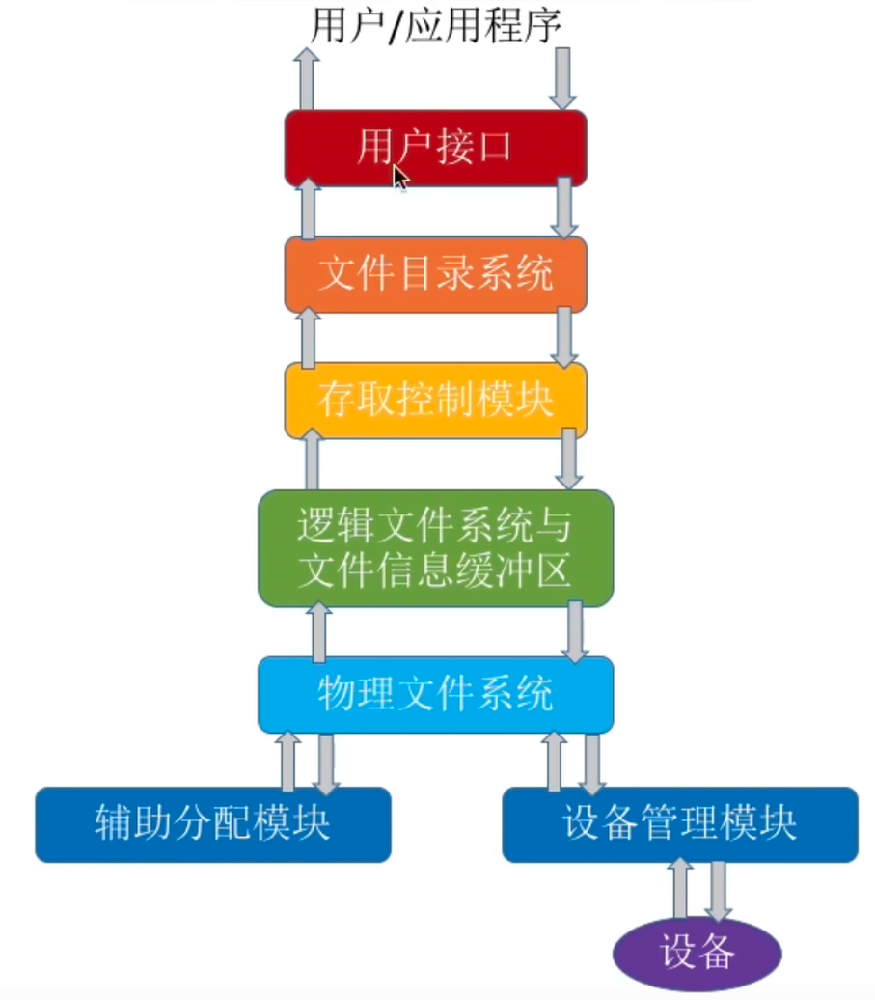

## 文件管理  
### 介绍
文件：就是一组有意义的信息/数据的集合  

文件的属性：  
文件名：由创建文件的用户决定文件名，主要是为了方便用户找到文件，同一目录下不允许有重名文件。 
标识符：一个系统内的各文件标识符唯一，对用户来说毫无可读性，因此标识符只是操作系统用于区分各个文件的一种内部名称。  
类型：指明文件的类型。  
位置：文件的存放路径、在外存中的地址。  
大小：文件大小。  
创建时间、上次修改时间：文件创建时间、文件内容最后一次修改时间。  
保护信息：对文件进行保护的访问控制信息。————对用户分组后，对不同组的用户设置不同的访问权限。在安全里面  

文件内部的数据组织方式：  
无结构文件（文本文件）：由一些二进制或字符流组成，又称”流式文件“。  
有结构文件（如数据库表）————由一组相似的记录组成，又称“记录式文件”。记录是一组相关数据项的集合，数据项是文件系统中最基本的数据单位。   

文件的组织形式：类似树的形式，用户可以自己创建一层一层的目录，各层目录中存放相应的文件。目录也是一种特殊的有结构文件（由记录组成）。  

操作系统向上提供：  
创建文件：调用create系统调用，操作系统在磁盘上为文件分配存储空间，并记录文件的属性信息。  
删除文件：调用delete系统调用，操作系统回收文件的存储空间，并删除文件的属性信息。  
读文件：调用read系统调用，操作系统根据文件的存储位置读取文件内容。————在图形化界面里面双击实现。从外存——>内存  
写文件：调用write系统调用，操作系统根据文件的存储位置写入文件内容。————在图形化界面里面修改内容。从内存——>外存   
打开文件：调用open系统调用，操作系统根据文件的标识符找到文件的存储位置，并返回文件描述符。  
关闭文件：调用close系统调用，操作系统释放文件占用的内存空间。  

外存（硬盘）：类似内存分为一个个的内存块，外存会分为一个个“块/磁盘块/物理块”，每个磁盘块有唯一的地址，称为“物理地址”，大小相等。  
外存也是由一个个存储单元组成，每个存储单元可以存储一定量的数据。每个存储单元对应一个物理地址。————因此即使一个文件大小只有10B,但他依旧占用1KB的磁盘块。外存中的数据读入内存同样以块为单位。   

文件共享：多个用户可以共享使用一个文件。  
文件保护：如何保证不同的用户对文件有不同的操作权限。  

### 文件的逻辑结构
逻辑结构：用户看起来的，文件内部的数据应该是如何组织起来。  
物理结构：操作系统实际管理文件的方式。  

按照文件类型划分：  
无结构文件：文件内部的数据就是一系列的字符流。————不用考虑逻辑结构。  
有结构文件：由一组相似的记录组成，又称“记录式文件”，每条记录由若干个数据项组成。每条记录中有一个数据项可作为关键字。根据各条记录的长度是否相等，可分为定长记录（128B）和可变记录。———>因此根据有结构文件的记录在逻辑上可分为：顺序文件、索引文件、索引顺序文件。  

顺序文件：文件中的记录一个接一个地顺序排列，记录是定长的/可变的（无法实现随机存取），各个记录在物理上可以顺序存储或链式存储。  
顺序存储————逻辑上相邻的记录顺序上也相邻。  
串结构：记录之间的顺序与关键字无关（由记录存入的时间决定记录的顺序）  
顺序结构：记录之间的顺序按关键字顺序排列。————可快速查找某个关键字对应的记录。    
链式存储（无法实现随机存取）————逻辑上相邻的记录在物理上不一定相邻。  
存在一个日志文件，修改的记录会每隔一个时间戳会写到外存中的日志文件中。  

索引文件：建立一张索引表（每个索引表的表项在外存中是连续存放的，但是索引文件在外存中不需要连续存放）————索引表是一个定长记录的顺序文件（可以快速查找某个关键字对应的记录），所以可以根据不同的数据项建立多个索引表。  

索引顺序文件：是一种结合了顺序文件和索引文件的文件结构。不是每个记录对应一个索引表项，而是一组记录对应一个索引表项。————解决了记录小但是索引表项大的问题。  
多级索引顺序文件：建立多个索引表，由顶级索引表指向低级索引表，低级索引表指向记录。————解决了索引表项大的问题。  

### 文件目录
  概念：相当于操作系统里面的文件夹。  
  
  目录文件：本身就是一种有结构文件，由一条条记录组成。每条记录对应一个在该目录文件。————存储的还有物理地址。当我们双击文件目录的时候，操作系统会在那个这个目录表中找到关键字对应的记录，然后根据记录中的物理地址（外存）中读入内存中。  
  文件控制块（FCB）：目录文件中的一条记录，就是文件目录项。包含的基本信息（文件名、文件的物理地址、文件长度、文件的创建时间、文件的修改时间、文件的类型、文件的保护信息），存取控制信息（文件的访问权限），使用信息（文件的读写权限）。由序集合的FCB就组成了”文件目录“。————FCB最主要实现了文件名和文件之间的映射，使用户可以实现”按名存取“。  

  操作：  
  搜索——用户要使用一个文件时，系统要根据文件名搜索目录，找到该文件对应的目录项。  
  创建——用户要创建一个文件时，系统要根据文件名在目录中找到一个空闲目录项，并分配一个FCB，将文件名和文件的物理地址填入该目录项。 
  删除——用户要删除一个文件时，系统要根据文件名在目录中找到该文件对应的目录项，并释放该目录项。  
  显示———用户可以请求显示目录的内容，如显示该目录的所有文件及属性。  
  修改———用户可以请求修改目录中的文件名、文件的物理地址、文件的属性等信息。  

目录结构：  
单级目录结构——早期操作系统并不支持多级目录，整个系统中只建立**一张目录表**，每个文件占一个目录项。    
单级目录实现了“按名存取”，所以不允许文件重名。    

两级目录结构——在单级目录结构的基础上，增加了一张”根目录“，每个用户建立一个自己的目录，称为”用户主目录“。    
主文件目录记录了用户名及相应用户文件目录存放的位置。所以不同用户的文件允许重名，还可以实现访问限制。但是用户不可以给自己的文件进行分类。  

多级目录结构（树状目录结构）———用户（/用户进程）要访问某个文件时要用文件路径标识文件，文件路径名是个字符串。各级目录之间用‘/’隔开。从根目录出发的路径称为**绝对路径**。由多少个/号决定磁盘的I/O次数。  
把整张目录表调入内存后，可以设置它为当前目录。当用户想要访问某个文件时，可以使用当前目录出发的“相对路径”。————因为是把整个表放进内存了，所以只需要一次I/O操作。  
但是不便于实现文件共享。  

无环图目录结构———在多级目录结构的基础上，增加一些指向同一节点的有向边，使整个目录成为一个有向无环图。可以方便地实现多个用户间的文件共享。  
所以删除操作要为共享结点设置一个共享计数器，用以记录有多少个结点指向该结点。 
共享文件和复制文件不同，复制文件是创建一个新文件（修改原文件不改变），而共享文件是多个用户共享同一个文件（修改后原文件更改）。  

### 索引结点（FCB的改进）
穿件一个索引表，里面只存放了文件名和索引结点指针。索引结点存放了文件的其他信息。————索引结点是文件的唯一标识。    
这样会导致检索文件时磁盘的I/O次数减少了。————在外存时候称为“外存索引结点”，在内存中称为“内存索引结点”。    

### 文件的物理结构
磁盘中的存储单元也会被分为一个个“块/磁盘块/物理块”。很多操作系统中，磁盘块的大小与内存块、页面的大小相同。  
这样就能实现内存与磁盘之间的数据交互都是为“块”为单位。  
所以文件的**逻辑地址**可以表示为（逻辑块号：文件的数据被分割为若干个块，每个块按照一定顺序分配到编号，一般从0开始。块内地址：在逻辑块内的偏移量，即从该块的起始位置到特定数据项之间的字节数或记录数）————操作系统为文件分配存储空间都是以块为单位。  
用户只能通过逻辑地址来操作文件，而操作系统实现的是从逻辑地址映射到物理地址上。  

文件分配方式：相当于实现文件逻辑地址到物理地址的映射。    
连续分配：文件占用一整块连续的存储空间————在逻辑上占用，物理上也占用。物理块号=起始块号+逻辑块号。可以实现块内地址不改变。    
优点：  
1.连续分配方式支持顺序访问和直接访问（随机访问）        
2.磁头的移动距离最短，I/O操作最少的分配方式。  
缺点：  
1.文件长度不宜动态增加，因为需要连续的存储空间。  
2.存储空间利用率低，会产生磁盘碎片。    

链接分配：采用离散分配的方式，可以将文件分配离散的磁盘块。分为隐式链接和显式链接。   

隐式分配：FCB中记录了起始块号（逻辑地址块号为0）和结束块号，将0号逻辑块读入内存，由此知道1号逻辑块存放的物理块，于是读入1号逻辑块....读入i号逻辑块，进行i+1次I/O操作。因为只能看见起始和结尾中间都是透明的所以是隐式分配。只支持顺序访问，但拓展文件方便。不产生碎片。    

显示连接：把用于连接文件个物理块的指针显式地存放在一个表中即文件分配表（FAT）。目录表只记录起始块号。  
一个磁盘仅设置一张FAT表，开机时将FAT表调入内存，并常驻内存中。

实现逻辑块号与物理块的转化：先查找FCB里面的逻辑块为0的起始块号然后根据FAT表中寻找下一块，直到找到-1为结束。  
因为FAT表就在内存中所以不需要访问磁盘，从而实现了访问效率高。支持直接访问、随机访问吧。  
缺点：需要占用一定的存储空间。  

索引分配：允许文件离散地分配在各个磁盘中，系统会为每个文件建立一张索引表，索引表中记录了文件中的各个逻辑块对应的物理块。索引表存放的磁盘块称为“索引块”，文件数据存放的磁盘称为“数据块”。  
FCB中存放的索引快号，通过索引块找到相对应的索引表————所以索引表是一个文件对应一张。  
优点：支持随机访问、文件拓展方便。  
缺点：索引块需要占用一定的存储空间。  

当文件大小块数超过一个索引块时：  
1.链接方案：将索引块连接起来形成链接索引块链，每个索引块中存放了下一个索引块的块号。FCB中只存放起始索引块。  
2.多级索引方案：建立多层索引表，第一级索引表中存放了第二级索引表的块号，第二级索引表中存放了数据块的块号。FCB中存放顶级索引表的块号。每次查找索引表都会调一次I/O操作。  
3.混合索引方案：将链接方案和多级索引方案结合起来。就是索引表中包含顶级索引、一级间接索引、直接地址。    

### 对空闲空间的管理  

存储空间的划分与初始化：Windows系统中为磁盘分区（c盘、D盘等）————将物理磁盘划分为一个个文件卷（逻辑卷、逻辑盘）。   
再将分区的磁盘/卷分为目录区（主要存放文件目录信息FCB、用于磁盘存储空间管理的信息）和文件区（存放文件数据）。有的系统支持超大型文件，可以支持由多个物理磁盘组成一个文件卷。    

1.空闲表法——适用于连续分配方式。   
通过空闲盘块表记录第一个空闲盘块号和空闲盘块数，因为是连续的所以可以计算出下一个空闲盘块号。  
分配磁盘的时候，为一个文件分配连续的存储空间，所以可以采用首次适应（通过空闲块表中的空闲盘块数对比决定插在那个空闲盘块号）、最佳使用、最坏适应等算法。    
回收磁盘块时候需要注意表项的合并问题。  

2.空闲链表法  
a.空闲盘块链：以盘块（记录了下一个盘块的指针）为单位组成一条空闲链。   
分配磁盘块的时候： 
操作系统保存着链头、链尾指针————申请k个空闲盘块，操作系统从链头开始，依次摘下k个空闲盘块，并修改链头指针。  
回收磁盘块的时候：  
回收的盘依次挂到链尾，并修改空闲链的链尾指针。  
b.空闲盘区链：以盘区（连续的盘块，里面记录了盘区的长度和下一个盘区的指针）为单位组成一条空闲链。  
分配的时候：  
操作系统保存着链头、链尾指针————申请k个盘块，辞去首次适应、最佳适应等算法，从链头开始检索，安好算法规则找到一个大小符合要求的空闲盘区，分哦诶给文件。  
回收的时候：  
注意合并的问题。  

3.位示图法  
利用一个一个的二进制位对应盘块是否已经分配。  

`0～15(计算机的字长)表示位号，0～n表示字号`

每个二进制位对应一个盘块，0代表空闲块，1代表盘块已分配。  
分配方式：  
需要K个空闲块————顺序扫描位示图，找到K个相邻/不相邻的0，根据字号和位号算出对应的盘块号，将相应盘块分配给文件，将他们置为1。  
回收方式：  
根据回收的盘块号计算出对应的字号、位号；将相应位由1改为0。    

4.成组链接法  
空闲表法、空闲链表法不适用与大型文件系统，因为空闲表或空闲链可能过大。UNIX系统采用了成组链接法对磁盘空闲块进行管理。  
文件卷的目录区专门用一个磁盘块作为“超级块”，当系统启动时，需要将超级块读入**内存**。并保证内存与外运中的超级块数据一致。    

超级块：记录了下一组空闲盘块数（100表示该超级块里面有100个空闲盘块），这数目的所有盘块号

在最后一个分组的大小实际上是小于99因为还有-1表示结束  

分配方式：  
检查第一个分组是否足够，足够就把该超级块的最后一个盘块号分配给文件（201），并修改超级块中的空闲盘块数（100————>99）。    
如果恰好需要100块，因为300号块是存放了再下一组的信息，因此需要吧300号块中的数据复制到超级块中。  

回收方式：  
假设超级块没有满，则直接插入并且添加超级块数目。  
如果超级块已经满了，还需添加n块，则把这新的信息划分出去作为新的超级块，并且该超级块的数目为n，其中里面有指向下一组的指针。   

### 文件的基本操作  

1.Create系统调用：  
在外存中找到文件所需要的空间，根据文件存放的路径信息找到该目录对应的目录文件，在目录中创建文件对应的目录项。  

2.Delete系统调用：   
根据文件存放路径找到相对应的目录文件，从目录中找到文件名对应的目录项。根据目录项记录信息回收文件占用的磁盘块。  

3.Open系统调用：  
根据文件存放路径找到相对应的目录文件，从目录中找到文件名对应的目录项，并检查用户是否有指定的操作权限。将目录项复制到内存中的**“打开文件表”**（之后操作该文件就不需要再重新查目录了因为返回了索引号--文件描述符）中。并将对应表目的编号返回给用户。之后用户使用打开文件表的编号来指明要操作的文件   
进程的打开文件表（表示该进程需要打开的文件）中指向的是系统的打开文件表（整个系统只有一张，整个系统需要打开的文件）

4.Close系统调用：  
将进程的打开文件表相应表项删除，回收分配给该文件的内存空间等资源，系统打开文件表的打开计数器减1。如果减为0，删除对应表项。  

5.Read系统调用：  
查找该文件在进程的“打开文件表”中的位置，查找用户是否有读的权限，表明需要调入的大小和位置。  

6.Write系统调用：  
查找该文件在进程的“打开文件表”中的位置，查找用户是否有写的权限，表明需要调入的大小和位置。  

### 文件共享 
概念：操作系统为用户提供文件共享功能，可以让多个用户共享地使用同一个文件（不是复制）  
基于索引结点的共享方式（硬链接）：不同的用户的目录项中存放的是同一个索引结点（里面有索引计数器，还有文件的物理地址）。  
删除的时候需要注意索引计数器，如果索引计数器为0，则删除索引结点，否则只是删除其中的目录记录。       

基于符号链接的共享方式（软链接）：通过链接到一个硬链接的文件，类似于快捷方式。
删除了链接共享文件，就会显示查找失败。一层一层的查找。       
`上面为硬链接，下面为软连接`  

### 文件保护

1.口令保护  
为文件设置一个口令（一般存放在FCB中或者索引结点中，用户访问时需要先输入文件口令进行对比，如果正确就允许该用户访问文件）  
2.加密保护  
使用某个密码对文件进行加密，在访问文件时需要提供正确的密码才能对文件进行正确的解密。  

3.访问控制（chmod/chown）  
为每个文件的FCB/索引结点设置一个访问控制列表（ACL），列出哪些用户对文件有访问权限，以及访问权限的类型（读、写、执行等）。  

### 文件系统的层次结构

用户接口：文件系统需要向上层的用户提供一些简单易用的功能接口。（read、write、open、close等）  
文件目录系统用户通过文件路径访问文件，根据用户给出的文件路径找到相应的FCB/索引结点。  
存取控制验证：根据用户给出的文件路径找到相应的FCB/索引结点，检查用户是否有访问权限。（文件保护）  
逻辑文件系统与文件信息缓冲区：用户想要访问文件记录号，这一层需要将记录号转化为对应的逻辑地址。调用索引表导内存的时候就需要调入文件信息缓冲区内。  
物理文件系统：这一层需要把上一层提供的文件逻辑地址转化为实际的物理地址  
辅助分配模块：负责文件存储空间的管理，负责分配和回收存储空间。  
设备管理模块：直接与硬件交互，负责和硬件直接相关的一些管理工作。  

### 文件系统的全局结构  
外存应用：  
磁盘————>（物理格式化，低级格式化————划分扇区，检测坏扇区，并用备用扇区替换坏扇区（对操作系统透明的））扇区————>（逻辑格式化）扇区分区/分卷完成C、D、E、F盘的初始化如图1
`图1`

引导块中存放的有系统文件。  
超级块能够快速寻找空余的空间。  
空闲空间管理：位示图法、空闲表法、空闲链表法、成组链接法。    
i节点存放文件的索引。  

内存应用： 

因为返回了一个文件描述符fd所以当采用系统调用的时候可以直接使用fd来快速索引到该文件的位置，对这个文件进行操作。  
  

### 虚拟文件系统和文件系统挂载（安装）  
1.因为存在多种不同的文件系统，所以导致用户需要采用不同的系统调用去控制文件，因此产生了虚拟文件系统VFS，同向上层用户进程提供了统一的标准的系统调用接口，屏蔽了底层具体文件系统的实现细节。  
2.VFS要求下层的文件系统必须实现某些规定的函数功能（规定下层的文件系统必须符合VFS的接口规范）  
3.因为不同的文件系统有不同的文件系统类型，所以虚拟文件系统VFS创建了一个vnode（v结点只存在于主存中），适用于不同的文件系统的数据结构。————拥有函数功能指针（指向自己特定文件系统功能函数）  

文件系统的挂载：就是文件系统的安装。（类似插入U盘）  
在VFS中注册新挂载的文件系统。————内存中的挂载表包含每个文件系统的相关信息，包括文件系统类型、容量大小等。  
新挂载的文件系统，要想VFS提供一个函数地址列表。（需要确定使用的是哪一种文件系统）  
将新文件系统加到挂载点，也就是将新文件系统挂载在某个父目录下。  

