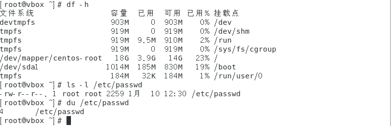
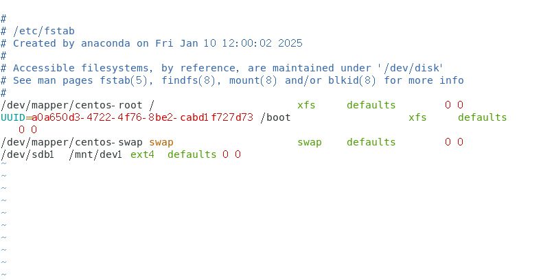

### 磁盘分区和文件大小查看
```
fdisk -l  //查看磁盘当作文件对待
parted -l //查看磁盘  
```
把磁盘当作文件对待并且放到/dev/sda文件夹下面（多一块磁盘就多一个编号如：sda、sdb、sdc）   
21.8 GB表示磁盘的大小 2176....表示相对应的字节大小 425... 分为多少个扇区


512表示一个扇区的大小————最小操作单元  
磁盘的划分就是按照扇区为基本单位划分的（sda1从2048开始到2099199结束）  
system表示该分区采用的是分区格式（文件系统）  
Boot 里面有个*表示是从当前的文件系统下启动的     


使用查看得知这个文件是属于块设备（权限是系统给予的）  
8表示主设备号（相同类型的设备共享同一个主设备号，内核通过它找到对应的驱动程序），0表示从设备号（用于区分同一驱动程序管理的不同设备）。      
/dev/sda1和/dev/sda2是sda磁盘的1号和2号分区,如果存在/dev/sdb主设备号为8、从设备号为16，那么表示sda最多只能分16个分区即sda16         


```
df -h //查看磁盘使用情况
ls -lh   //加上h可以按照K显示文件大小，查询含有空文件的大小。  
du       //表示文件实际占用的空间
```
挂载点就类似于windows的盘符即C、D 盘  



```
dd if=/dev/zero of=afile bs=4M count=10 seek=20 //把/dev/zero文件写入到afile文件中，bs表示按照的大小，count=10表示写入10次，seek=20表示跳过20次，所以afile文件里面有10*4M个实际的字符，20*4M个空字符。  
```
`查看du 与 ls 的区别  `


### 文件管理系统  
Linux中常见的文件管理系统  
ext4  
xfs  
NTFS--windows  

ext文件管理系统中  
1.超级块：类似在操作系统学习中的超级块，在文件系统最开头部分，里面包含了整个分区中的文件总数 df命令就是查看这个，随着里面文件的更改超级块也要更改。    
2.超级块副本：对超级块的备份（不止一份）  
3.i结点：i结点是记录文件的，类似文件目录里面的记录（文件的文件名是记录在目录的i结点里面）所以i结点内部没有文件名————因此删除的时候其实是关掉i结点和文件名的关系        
4.数据块：记录数据，i结点可以记录多个数据块，用链接方式。（一个数据块的默认大小为4k）  


### 硬盘的分区和挂载
```
fidsk
mkfs
aprted
mount

/etc/fstab  //常见的配置文件  
```
 
首先要先对虚拟机添加一块硬盘  
1. 打开 VirtualBox  
启动 Oracle VirtualBox 并选择要添加硬盘的虚拟机。  
2. 进入虚拟机设置  
右键点击虚拟机，选择“设置”或点击工具栏的“设置”按钮。  
3. 进入存储设置  
在设置窗口中，选择“存储”选项。  
4. 添加新硬盘控制器（如有必要）  
如果已有 SATA 或 IDE 控制器，跳过此步。  
若无，点击“控制器”旁的“添加硬盘”图标，选择“添加 SATA 控制器”或“添加 IDE 控制器”。  
5. 创建新虚拟硬盘  
在存储设置中，选择控制器（如 SATA 或 IDE）。  
点击“添加硬盘”图标，选择“创建虚拟硬盘”。    
按照向导设置硬盘类型（VDI、VHD、VMDK）、大小（动态分配或固定大小）及位置。   
6. 附加虚拟硬盘  
创建完成后，选择控制器，点击“添加硬盘”图标，选择“选择磁盘”。  
找到并选择刚创建的虚拟硬盘文件（如 .vdi）。  
7. 保存设置  
点击“确定”保存设置。  

注意：添加了一块新的磁盘可能引起系统需要重装的时候  
解决方法  
1. 检查启动顺序  
关闭虚拟机，打开 VirtualBox，选择虚拟机，点击“设置”  
进入“系统”选项，查看“启动顺序”，确保“硬盘”选项在第一位，且指向原系统盘（通常是第一个硬盘），如果有光驱或网络启动选项，确保它们在硬盘之后。  
2. 确认新硬盘未设置为启动盘  
在“存储”设置中，检查新硬盘是否被误设为启动盘。确保新硬盘仅作为数据盘，而非启动盘。  
3. 启动虚拟机并检查  
启动虚拟机，进入操作系统。检查新硬盘是否被识别（如未识别，需初始化或挂载）。


添加成功后就会有出现/dev/sdb  
```
fdisk /dev/sdb   //表示对磁盘开始分区，进入fdisk交互界面
n     //表示开始分区  
p/e   //p 表示主分区（只能建立四个，当需要五个的时候就创建三个主分区还有两个逻辑分区——合并在一个主分区里面）/e表示拓展分区（逻辑分区）  
1     //表示分区号  
直接回车表示分区大小  //默认2048  
+5G    //表示分区大小  
p      //查看创建的分区 
q      //不保存退出 
d      //删除默认分区   
w     //保存
```


```
mkfs.ext4  /dev/sdb1   //表示对该文件添加文件系统
mkdir /mnt/sdb1   //表示创建一个挂载点
mount -t ext4/auto  /dev/sdb1  /mnt/sdb1    //表示挂载的时候使用ext4文件系统/自动检测
mount    //可以查看所有的挂载信息，这个挂载信息回显示在最后一行  
//注意这里的挂载是属于临时挂载的（放在内存）
vim /etc/fstab   //表示永久挂载
```


`/etc/fstab `


第一个地段表示要挂载的硬盘（或者使用UUID）  
第二个表示挂载的点  
第三个表示文件系统  
第四个表示文件的权限（defaults默认权限为读和写）   
第五个表示dump备份  
第六个表示磁盘的自动检查  


如果硬盘大于2T,就用parted  

### 用户磁盘配额  
因为操作系统是多用户操作的，所以需要对每个用户分配磁盘配额

xfs的磁盘配额方式  
```
fdisk /dev/sdb  //对磁盘进行分区
n    //表示开始分区
p    //表示主分区
1    //表示分区号
直接回车表示分区大小
+5G  //表示分区大小
p    //查看创建的分区
q    //不保存退出
w    //保存
mkfs.xfs  -f /dev/sdb1  //对磁盘使用xfs文件系统-f表示强制操作，因为之前已经有数据。  
mkdir -p /mnt/disk1   //-p表示如果目录不存在创建，如果存在不对它进行任何操作。  
mount  -o  uquota,gquota  /dev/sdb1   /mnt/disk1  //表示支持用户磁盘配额和组磁盘配额，只在内存中
chmod 1777 /mnt/disk1  //对文件赋予全部权限
xfs_quota //查看磁盘配额，进行交互模式  
xfs_quota -x -c 'report -ugibh'  mnt/disk1    //加上参数进行非交互模式，report表示查看磁配额，u用户磁盘配额，g组磁盘配额，i i节点  b 数据块， h界面友好  
xfs_quota -x -c 'limit -u ihard=10  isoft=5' /mnt/disk1  //表示限制用户磁盘配额，ihard表示限制用户磁盘配额的硬限制(节点数量绝对不能超过某个值而isoft表示软限制节点数量可以在一定的时间内超过某个值)
//然后对用户在该分区的限制生效了    
```


### 交换分区的查看与创建  

增加交换分区的大小
```
free -m  //查看内存和交换分区大小
//创建一个/dev/sdb1的磁盘
mkswap /dev/sdb1  //对磁盘进行格式化标记为一个交换分区  
swapon /dev/sdb1  //激活交换分区
swapoff /dev/sdb1  //关闭交换分区
```

使用文件作为交换分区（需要准备充足的文件大小）
```
dd if=/dev/zero bs=4M count=1024 of=/swapfile  
//使用空洞的方式创建，能动态改变大小 
chmod 600 /swapfil   //注意权限  
mkswao /swapfil  //标记为交换分区
swapon /swapfil  //激活交换分区
swapoff /swapfil  //关闭交换分区
```

这样生成的swap是属于临时的，所以要写入配置文件中/etc/fstab    
```
/swapfile swap swap defaults 0 0
```
第一个swap 表示是虚拟交换分区 
第二个swap 表示是类型为交换分区  

### 磁盘阵列RAID
磁盘阵列：多个物理磁盘组合成一个逻辑磁盘的技术  
RAID 0：条带化，数据分散存储在多个磁盘上，提高读写性能，但是没有冗余  
RAID 1：镜像，数据在两个磁盘上完全相同，提供数据冗余，相当于有备份 
RAID 5：分布式奇偶校验，数据分散存储，提供数据冗余，但是空间利用率低  
RAID 10：先镜像再条带化，提供高读写性能和数据冗余，空间利用率中等  
RAID 01：先条带化再镜像，提供高读写性能和数据冗余，空间利用率中等  

软件RAID的使用  
```
//先创建三个分区用来做RAID  /dev/sdb /dev/sdc  /dev/sdd
mdadm -C /dev/md0 -a yes -l1 -n2 /dev/sdb1 /dev/sdc1  //-C 表示创建，/dev/md0 表示创建的逻辑磁盘，-a yes 表示自动创建元数据，-l1 表示条带化(表示穿件的磁盘阵列的级别)，-n2 表示使用两个磁盘合并 /dev/sd[b,c]1  这样也可以合并    
mdadm -D /dev/md0  //查看创建的磁盘阵列的详细信息  
echo DEVICE /dev/sd[b,c]1 >> /etc/mdadm.conf  //表示把/dev/sd[b,c]1 添加到/etc/mdadm.conf 文件中,保存到外存中，下次重启的时候不会丢失。  
mdadm -Evs >> /etc/mdadm.conf  //表示把自己的属性也写到文件中   
mkfs.xfs /dev/md0  //对逻辑磁盘进行格式化  
mount /dev/md0 /mnt/md0  //挂载逻辑磁盘  
mdadm --stop /dev/md0  //停止逻辑磁盘  
```


### 逻辑卷管理  
磁盘阵列就是一个逻辑卷。  

```
//添加一个硬盘  
dd if=/dev/zero of=/dev/sd[b,c] bs=1M count=1  //如果之前使用过这个分区，那么需要清理文件系统文件
umount /mnt/md0  //卸载挂载点
pvcreate /dev/sd[b,c]1  //对磁盘创建物理卷
pvs  //查看物理卷
vgcreate vg0 /dev/sd[b,c]1  //对物理卷创建卷组
vgs  //查看卷组  
lvcreate -l 10%VG -n lv0 vg0  //对卷组创建逻辑卷，-l 10%VG 表示逻辑卷的大小为卷组的大小，-n lv0 表示逻辑卷的名称   vg0表示卷组名称  
lvs  //查看逻辑卷
mkdir /mnt/lv0  //创建挂载点
mkfs.xfs /dev/vg0/lv0  //对逻辑卷进行格式化
mount /dev/vg0/lv0 /mnt/lv0  //挂载逻辑卷
mount |grep lv0  //通过查看挂载，查看是否成功  
```

PV 表示物理分区————一个分区只能属于一个卷组     
VG 表示卷组    
#PV 表示该卷组有几个分区  
#LV 表示该卷组有多少个逻辑卷  

扩充逻辑卷的大小
```
vgs  //查看卷组
vgextend vg0 /dev/sdb1  //对卷组扩充物理卷
lvs  //查看逻辑卷大小
lvextend -l +100M /dev/vg0/lv0  //对逻辑卷lv0扩充大小（注意扩充的大小不能超过卷组剩余大小）
df -h  //查看文件系统下的逻辑卷  
xfs_growfs /dev/vg0/lv0  //对逻辑卷lv0扩充大小，相当于把逻辑卷添加到该文件系统中 
```
