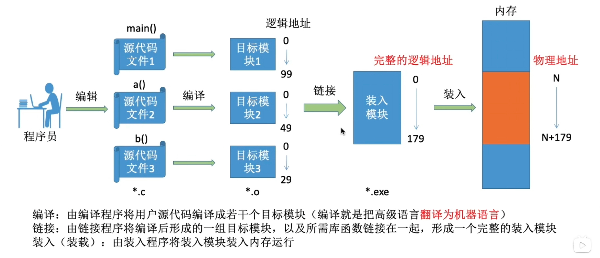
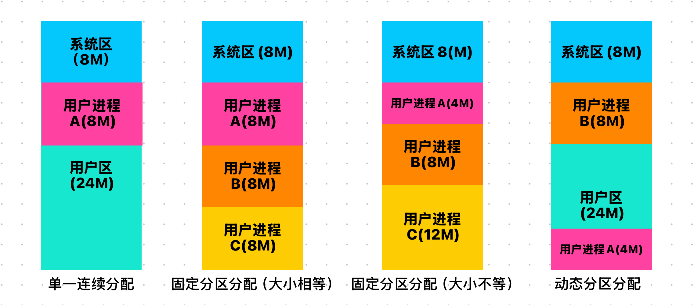

## 内存

### 1.介绍
什么是内存：
内存可存放数据。程序执行前需要先放到内存中才能被CPU处理--缓和CPU和硬盘之间的速度矛盾。  
内存中有一个一个的“小房间”，每个小房间就是一个”存储单元“。内存地址从0开始，每个地址对应一个存储单元（如果计算机按照字节编址则每个存储单元大小为1字节，即1B=8bit/如果按照字————字长16位，编程则每个存储单元大小为1字，即1B=16bit）。  
1K=1024B  
1M（兆）=1024K  
1G（吉）=1024M      

指令工作的原理：  
高级代码——>（编译）——>机器语言指令（二进制）  
高级代码运行的时候系统会为它提供一个进程的内存，进程内存里面的程序段就是用来存储指令的，数据段就是用来存放变量之类的数据。CPU执行指令就会从程序段中取出指令，然后执行相应的内存里面的数据。    
程序经过编译、链接后生成的指令中指明的是逻辑地址即相对于进程的初始地址————解决逻辑地址和物理地址转化的问题。  

解决逻辑地址和物理地址转化的问题：  
1.绝对装入：**编译**程序的时候，如果知道程序将放到内存中的哪个位置（前提），则编译程序时，就把指令中的逻辑地址直接装入物理地址。————相当于把指令里面的相对地址直接转化为物理地址。  
适用于单道程序环境。  

2.可重定位装入/静态重定位：编译、链接后的装入模块的地址都是从0开始的，指令中使用的地址、数据存放的地址都是相对于初始地址的逻辑地址。可根据内存的当前情况，将装入模块装入到内存的适当位置。装入的时候对地址进行重定位。————类似于在代码中的逻辑地址都加上一个相同的数组存储便利那个。
特点：必须分配其要求的全部内存空间，如果没有足够的内存，就无法装入该作业
适用于早起多道（多个程序同时转入内存）批处理（用户将作业提交给操作系统后不能再进行干涉，一旦开始就会运行到程序结束）系统。

3.动态重定位/动态运行时装入：编译、链接后的地址都是从0开始的。装入程序把装入模块（代码/指令）装入到内存后，并不会立即把逻辑地址转化为物理地址，而是把地址转换推迟到程序真正要执行时才进行。因此装入内存后所有的地址依然是逻辑地址。这种方式需要一个**重定位寄存器**的支持。————允许程序在内存中发生移动。
适用于现代操作系统。

链接的三种方式：  
1.静态链接：在程序运行之前，先把各个目标模块及他们所需的库函数连接成一个完整的装配模块，以后不再拆开。————一开始就全部链接  
2.装入时动态链接：将用户源程序编译后所得到的一组目标模块，在装入内存时，采用边装入边链接的链接方式。————装入的时候链接  
3.运行时动态链接：在程序执行中需要用到某目标模块时，才对它进行链接。————运行的时候链接（需要的时候才装入、链接）  

程序从写到运行： 
 

### 2.内存管理

1.负责内存空间的分配与回收  
2.操作系统需要提供某种技术从逻辑上对内存进行扩充（虚拟内存）————内存扩充  
3.操作系统需要提供地址转换功能，即把逻辑地址转换为物理地址。————地址转换  
4.操作系统需要提供内存保护功能，即确保进程不能访问不属于他的内存空间：————存储保护    
方法1.设置一对上、下限寄存器，存放进程的上、下限地址。进程的指令要访问某个地址时，CPU检查是否越界。  
方法2.采用重定位寄存器（基址寄存器）和界地址寄存器（限长寄存器）来实现。重定位寄存器存放进程的起始物理地址，界地址寄存器存放进程的最大逻辑地址。————首先CPU检查该地址是否会超过界地址寄存器，如果超过则CPU会报错，否则会加上重定位寄存器的值，然后返回物理地址。  

#### 内存空间的扩充  
1.覆盖技术  
解决问题：程序大小超过物理内存总和问题。  
思想：将程序分为多段，常用的段常驻内存，不常用的段在需要时掉入内存。内存中分为一个“固定区”和若干个“覆盖区”。需要常驻内存的段放在“固定区”中，掉入后不再掉出。不常用的就放在“覆盖区”。

类似上图A是固定区，B、C不需要同时调用所以两个共用一个覆盖区（大小选择B、C中最大的），同理D、E、F。  
缺点：必须由程序员手工安排，如何安排决定于程序的逻辑结构，对程序员的要求很高。  

2.交换（对换）技术  
解决问题：程序大小超过物理内存总和问题。  
思想：内存紧张时，系统将内存中某些进程暂时换出外存，把外存中某些已具备运行条件的进程换入内存。（进程在内存和外存之间动态调度）在PCB中存储了外存的位置，并且PCB仍然处在常驻内存中，挂起队列中《————》中级调度对应的是挂起队列中的进程再次重新掉入内存。  

在进程被置换到外存时的位置是处于对换区。  
补充：磁盘空间通常分为文件区和对换区。文件区的主要功能是存放文件，主要追求存储空间的利用率因此采用离散分配方式。对换区空间只占用磁盘空间很小的部分，被换出的进程数据会存放在对换区中。由于对换的速度直接影响到系统的整体是有多远，因此对换区空间的管理主要追求换入换出的速度，因此通常采用连续分配方式。  
发生交换通常在许多进程运行且内存吃紧时，而系统负荷降低就暂停。  
优先换出阻塞进程，之后换出优先级低的进程。换出进程并不是一次性将进程的所有数据都换出，其中PCB会常驻内存不会被换出。  

覆盖是在同一个程序或进程中的————对换是在不同程序或作业中的  

#### 内存空间的分配与回收  

连续分配管理方式  
概念：系统为用户进程分配的必须是一个连续的内存空间。  

单一连续分配：内存被分为系统区和用户区。系统区通常位于内存的低地址部分，用于存放操作系统相关数据。用户区用于存放用户进程相关数据。内存中只能有一道用户程序。  
内存中只能有一道用户程序，用户程序独占整个用户区空间。  
优点：实现简单，无外部碎片，可以采用覆盖技术来解决不够用的问题。不一定需要内存保护。  
缺点：只能用于单用户、单任务的操作系统中。有内部碎片，内存利用率低。————内部碎片：分配给某进程的内存区域中，如果有些部分未被使用，则这部分未被使用的内存空间称为“内部碎片”。外部碎片：分配给某进程的内存区域中，如果有些部分未被使用，则这部分未被使用的内存空间称为“外部碎片”。  

固定分区分配：将整个用户空间划分为若干个固定大小的分区，在每个分区中只装入一道作业。  
分配方式：  
1.分区大小相等：缺乏灵活性，但是很适合用于一台计算机控制多个相同对象的场合。  
2.分区大小不等：增加了灵活性，可以满足不同大小的进程需求。  
操作系统需要建立一个数据结构（分区说明表），来记录每个分区的起始地址、大小、状态（是否已分配）。 
优点：实现简单，无外部碎片。  
缺点：有内部碎片，内存利用率低。  

动态（可变）分区分配：这种分配方式不会预先划分内存分区，而是在进程装入内存时，根据进程的大小动态地建立分区，并分配内存。
操作系统会采用空闲分区表或空闲分区链来管理空闲分区。  

缺点：有外部碎片—————可以使用紧凑技术（通过移动内存中的各个进程，使得所有进程的内存区域连续，从而消除外部碎片——动态重定位方式）解决。  
`从低地址————>高地址`

2.非连续分配管理方式  
概念：为用户进程分配的可以是一些分散的内存空间。  

a.基本分页存储管理方式
分页存储：将内存空间（物理）分为一个个大小相等的分区，每个分区就是一个 **“页框”**（页框=页帧=物理块=物理页面），每个页框有一个编号，即“页框号”（页框号=页帧号=物理块号=物理页号）。页框号从0开始编号。  

进程的逻辑地址空间也分为与页框大小相同的一个个部分，称为 **“页”** 或 **“页面”**，每个页面也有一个编号，即“页号”，页号从0开始编号。————把进程A的逻辑地址空间划分为页，但是操作系统是以页框为单位分配内存。所以页框和页面存在一一对应的关系。页面是一块一块的。  

页表：为了能够知道进程每个页面在内存中存放的位置，操作系统为每个进程建立一张页表。（页表通常存在PCB中）  

1.一个进程对应一张页表。  
2.进程中的每个页面对应页表中的一个页表项。  
3.每个页表项由页号、物理块号（页框号）组成。  
4.页表记录进程的每个页面和实际存放的内存块之间的映射关系。

总共的实际物理内存块大小/总共页面大小=页表项数目/内存块数（每个页面所占有的实际内存大小）  
内存块号的范围0～内存块数-1  
而页号是可以隐含的，不占用存储空间。
假设内存4GB，页面大小4KB ==》 4GB/4KB = 1024*1024 个页表项/内存块  
内存块号为 0～1024*1024-1  
至少要20bit即3B（3*8bit）来表示块号   
因为页号是隐含的所以每个页表项占3B，存储整个页表至少需要3*（n+1）B ，其中页表只是存储内存块号，所以为J的块号的实际地址是：J*内存块号大小。  

实现地址转化：虽然进程页面在实际内存中是分散的，但是在逻辑地址中页面连续的，所以可以通过页表项找到对应的内存块号。  
逻辑地址A对应的物理地址=进程A的页号对应的内存块号+页内偏移量  

假设页面大小为50B，进程的逻辑空间大小为200B，逻辑地址110对应的页号、页内偏移量？  
200B/50B=4 所以有4个页面  
逻辑地址从0～49（0号页面） 、50～99（1号页面）、100～149（2号页面）、150～199（3号页面）  
所以110 在第二个页面  
页内偏移量=110%50=10   
补充：在计算机内部，地址是用二进制表示的，如果页面大小刚好是2的整数次幂，那么页内偏移量就是逻辑地址的低几位（ <<  ），前几位就是页号。  

基本地址变换机构：用于实现逻辑地址到物理地址的转换的一组硬件机构。  
系统会设置以恶搞页表寄存器（PTR），存放页表在内存中的起始地址F和页表长度M。进程未执行时，页表的始址和页表长度放在进程的PCB中，当进程被调度时，操作系统内核会把它们放到页表寄存器中。  

注意🟰符号也是中断。  

具有快表的地址变换机构   
**块表**：联想寄存器（TLB），是一种访问速度比内存快很多的高速缓冲存储器（不是内存），用来存放当前进程的页表项的副本，并将其复制到快表中。内存中的页表常常称为慢表。  

快表的工作方式：   
1.CPU给出逻辑地址，由某个硬件算出页号、页内偏移量，将页号送入块表寄存器。  
2.如果页表项在块表中，那么直接读取块表项中的物理地址。-只需要一次访存即可。  
3.如果页表项不在块表中，那么需要访问内存中的页表（慢表），再将其存入块表中。——两次访存。  

  

查找的时候有两种查询方式：  
1.块表查询：先查询块表，如果块表中没有，则查询慢表。  
2.慢表查询：直接块表和慢表同时查询。  

  

因为局部性原理的原因：所以90%的查询都是查询块表。  
时间局部性原理：如果执行了程序中的某条指令，那么不久后这条指令很可能再次执行；如果某个数据被访问，不久后该数据很可能再次被访问。  
空间局部性原理：一旦程序访问了某个存储单元，那么不久后这个存储单元附近的存储单元也很可能被访问。（因为很多数据在内存中都是连续存放的）  

b.两级页表  
产生的原因：
1.如果页表过大，那么需要占用大量的连续页框存放它的页表，所以需要将页表进行分页。————计算机硬件大小不支持  
2.由于局部性原理，进程在一段时间内只要访问某几个页面就可以正常运行，所以没必要要整个页表都常驻内存。  

解决思路：  
1.将长长的页表再次进行分组，使用每个内存块刚好可以放入一个分组。为离散分配的页表再建立一张页表，称为页目录表，或者外层页表，顶层页表。  

2. 可以在需要访问页面时才把页面掉入内存（虚拟存储技术）。可以在页表项中增加一个标志位，用于表示该页面是否已经调入内存。

c.基本分段存储管理方式  
与分页最大的区别就是————1.离散分配时所分配地址空间的基本单位不同，分页地址空间是一维，分段是二维2.页是信息的物理单位是属于系统管理上。分段是信息的逻辑单位，分段对用户是可见的。3.分段比分页更容易实现信息的共享和保护。      
分段的概念：进程的地址空间会按照自身的逻辑关系划分为若干个段，每个段都有一个段名，每段从0开编址。由于是按逻辑功能模块划分，用户编程会更加方便，程序的可读性更高。  
CPU在处理的时候其实是调用的是段号，而不是段号。

所以分段系统中，地址结构由段号和段内地址两部分组成。  
段号的位数决定了每个程序最多可以分为几个段，段内地址地址位数决定了每个段的**最大**长度是多少。  

因此为了解决每个段号都需要一个段长和基址，所以需要一个段表。

每个段对应一个段表项目，其中记录了该段在内存中的起始位置和段的长度。  
2.各个段表项的长度是相同的。————其中段号可以隐含，不占用存储空间。  

PCB中会存放段表起始地址和段表长度  
流程图如下 ：

d.段页式存储管理方式  
将分段（外部碎片）和分页（内部碎片）两种存储管理方式结合起来，形成段页式存储管理方式。  
所以逻辑地址应该是由：段号、段内页号、页内地址组成。  
段号的位数决定了每个进程最多可以分为几个段。  
段号位数决定了每个段最大有多少页。  
页内偏移量决定了每个页的大小、内存块大小。  

一个进程可能对应一个段表但是对应多个页表。段表和页表都在内存中。    
流程图：    
 

### 3.虚拟内存管理
传统的内存管理的缺点：  
一次性原则：1.作业必须一次性全部装入内存后才能开始运行。如果作业很大，但是计算机内存很小，则作业无法运行。   
2.当大量作业要求运行时，由于内存无法容纳所有作业，因此只有少量作业能运行，导致多道程序并发度下降。  
驻留性：一旦作业被装入内存，就会一直驻留在内存中，直至作业运行结束，会导致内存大量浪费。   

虚拟内存技术：  
1.给予局部性原理，在程序装入时，可以将程序中很快会用到的部分装入内存，暂时不用的部分留在磁盘。  
2.在程序执行过程中，当所访问的信息不在内存时，由操作系统负责将所需信息从磁盘装入内存，然后继续执行程序。  
3.在操作系统的管理下，在用户看来似乎有一个比实际内存大得多的内存，称为虚拟内存。  
综合上面三点，虚拟内存技术允许一个作业分多次调入内存。如果内存空间不够，则暂时留在磁盘上。————内存的实际没有变，但是逻辑上变大了。    

虚拟内存有三个主要特征：  
1.多次性：无需在作业运行时一次性全部装入内存，而是允许被多次调入内存。  
2.对换性：在作业运行时无需一直常驻内存，而是允许在需要时调入内存。  
3.虚拟性：从逻辑上扩充了内存的容量，使用户看到的内存容量远大于实际的物理内存容量。  

实现的方式：  
如果采用连续分配方式则不方便使用，所以需要采用离散分配方式————传统的非连续分配方式。  
1.请求分页存储管理：
页表内容：    

会引入缺页中断机构：在请求分页系统中，每当要访问的页面不在内存时，便会产生一个缺页中断，然后由操作系统的缺页中断处理程序处理中断。————此时缺页的进程被阻塞，放入阻塞队列，调页完成后将其唤醒，放回就绪队列。   
在执行缺页中断处理程序时，先检查内存中是否有空闲块，如果有则分配一个空闲块，将所缺页装入该块，并修改页表中相应的页表项。如果内存中没有空闲块，则由页面置换算法选择一个页面淘汰，若该页面在内存期间被修改过（因为数据是从外存调入内存中所以修改后需要对外存的数据也要修改），择要将其写回外存。  
缺页中断：属于内中断————故障。并且一条指令的执行可能出现多次缺页中断。  
地址变换：

2.请求分段存储管理  
3.请求段页式存储管理  
和传统的非连续分配方式相比，添加请求调页/分段的功能和置换调页/分段的功能。
只有所有内存块都满了，才会发生页面置换。所以发生却页中断不一定会引起页面置换。

页面置换的策略：  
1.全局置换：可以将操作系统保留的空闲物理块分配给缺页的进程，或者将别的进程的物理块分配给缺页的进程。  
2.局部置换：发生缺页中断时，只在本进程中进行页面置换。  

页面置换算法（尽可能的少I/O次数）：  
1.最佳置换算法（OPT）：每次选择淘汰的页面将是以后永不使用，在最长时间内不再被访问的页面（就是在后面的时间段该内存块与其他处于内存中的内存块相比时间间隔最大的），实现最低的缺页率。————需要预判页面访问的序列，所以无法实现。    
2.先进先出置换算法（FIFO）：每次选择淘汰的页面是最早进入内存的页面。——产生Belady异常：在采用FIFO算法时，如果置换算法选择不当，则可能出现分配的物理块数增加，缺页次数反而增加的异常现象。    
3.最近最久未使用置换算法（LRU）：每次淘汰的页面是最近最久未使用的页面。  
实现方法：赋予每个页面对应的页表项中，用访问字段记录该页面自上次被访问以来所经历的时间t，当需要淘汰一个页面时，选择现有页面中t值最大的，即最近最久未使用的页面。  
4.时钟置换算法（CLOCK）：是性能和开销的折中。  
实现方式：为每个页面设置一个访问位，再将内存汇总的页面链接成一个循环队列。当某页被访问时，其访问位置1。当需要淘汰一个页面时，只需检查页的访问位。如果是0，则表示该页面最近没有被访问过，可以立即淘汰。如果是1，则将该位置0，暂不淘汰，继续检查下一个页面。直到找到一个访问位为0的页面为止。如果查遍整个队列都没有找到访问位为0的页面，则将队列中的第一个页面淘汰，并把队列中的所有页面访问位都置0，然后继续查找。（最多经历两轮扫描）   
改进型时钟算法：添加一个修改位置，修改位=0表示页面没有被修改过，修改位=1表示页面被修改过。（访问位，修改位）==》（1，1）表示一个页面近期被访问过且修改过。  
规则：将所有可能被置换的页面排成一个循环队列。  
第一轮：从当前位置开始扫描到第一个（0，0）的页面，将该页面置换出去。不修改任何标志位。  
第二轮：第一轮失败，重新扫描，查找第一个（0，1）的页面，将该页面置换出去，并所有扫描过的帧访问位为0。  
第三轮：第二轮失败，重新扫描，查找第一个（0，0）的页面，将该页面置换出去。不修改任何标志位。  
第四轮：第三轮失败，重新扫描，查找第一个（0，1）的页面，将该页面置换出。  
所以最多扫描4轮  

页面分配策略：
驻留集：请求分页系统中给**每个进程**分配的物理块集合（内存块大小）。  
驻留集过小：缺页率很高。  
驻留集过大：分配给进程的物理块数目大于实际所需，导致内存中驻留的进程数目减少，导致多道程序并发度下降。  
驻留集的分配方式：  
1.固定分配：每个进程分配的物理块数目是固定的，驻留集大小不变。————不存在固定分配全局置换的策略。  
2.可变分配：先为每个进程分配一定数目的物理块，在进程运行期间可根据适当的增加或者减少，驻留集大小可变。  

固定分配局部置换策略：为每个进程分配一定数目的物理块，在进程运行期间不增加物理块，只通过局部置换来满足进程的内存需求。  
可变分配局部置换策略：为每个进程分配一定数目的物理块，操作系统会保持一个空闲物理块的队列，当进程发生缺页中断时，操作系统会从空闲物理块队列中取出一个物理块分配给进程，如果空闲队列为空，系统需要选择一个未锁定的页面调出。  
可变分配全局置换策略：刚开始会为每个进程分配一定数量的物理块。当发生缺页中断时，系统需要从该进程的物理块中选择一个进行换出外存。如果频繁的进行页面置换，则需要增加物理块。反之，如果缺页率很低，则可以减少物理块。 

何时掉入页面：  
1.预调页策略：根据局部性原理，进程在一段时间内往往集中访问某几个页面。所以可以在进程未运行前，预先调入相关的页面。————主要用于进程的首次调入（头文件里面的引入）  
2.请求调页策略：进程在运行期间发现缺页时才将所缺页面调入内存。————主要用于进程运行期间。  

何处调入页面：  
系统拥有足够的对换区空间：页面的调入、调出都是在内存与对换区之间进行的。——在进程运行运行前，需要将进程相关的数据从文件去复制到对换区。  
系统缺少足够的对换区空间：凡事不会被修改的数据都直接从文件区调入，由于这些页面不会被修改，因此换出时不必写回对换区。对于可能被修改的数据，则需要调入到对换区，并且换出时需要写回对换区。  

UNIX方式：运行之前进程有关的数据全部放入文件区，故未使用过的页面，都可从文件区调入。若内存中满了，需要换出页面，则写回对换区，下次从对换区调入。    
抖动（颠簸）现象：在请求分页系统中，刚被换出的页面马上又要被访问，需要重新调入内存，这种现象称为抖动。————因为进程频繁的进行页面置换，导致进程的运行效率很低（物理块不够）。    

工作集：在某段时间间隔里面，进程实际访问页面的集合。  
工作集小于驻留集。  

### 4.内存映射文件
操作系统向上层程序员提供的功能（系统调用）  

传统的文件访问方式：  
1.open系统调用：打开文件。  
2.seek系统调用：将读写指针移到某个位置。  
3.read/write系统调用：进行读写操作。    
将上述文件操作变得更简单的操作————内存映射文件。  

修改外存数据方式：  
open系统调用：打开文件。  
mmap系统调用：将文件映射到进程的虚拟地址空间（内存）。————访问内存的方式访问文件数据。      
munmap系统调用：解除文件映射。————修改过的数据返回磁盘区。    
close系统调用：关闭文件。  

共享数据方式：  
多个进程可以映射到同一个文件，共享数据。————因为通过页表的映射，实际上是映射到同一个物理地址（内存中）。      

