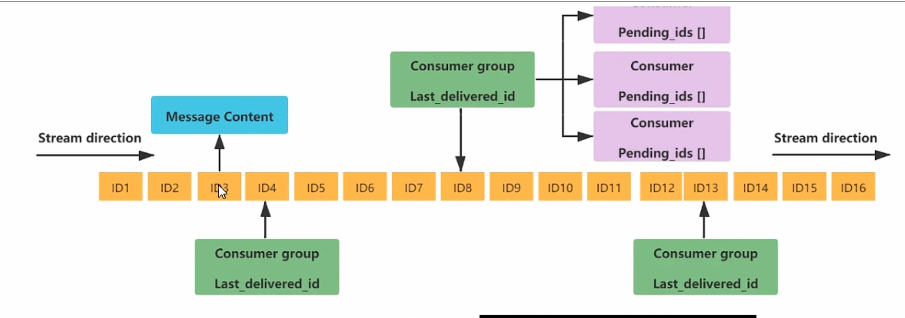

# Redis7
 ## 1.概念
 介绍：远程字典服务器——使用C语言编写，是存在内存中的KV数据库  
作用：是一个分布式缓存，在MYSQL之前的   
特性：  
1.持久化 ：将内存的数据存储在硬盘中   
2.高可用架构搭建：单机、主从、哨兵、集群  
3.分布式锁  
4.队列  

## 2. 性能迭代  
1.Client-eviction :表示允许客户端最大连接数，使用内存和优化    
2.AOF  
3.ACL：访问控制列表  
4.底层优化   


## 2.安装和配置  
1.前提gcc 以及LINUX_64位  
2.下载 压缩包放到LINUX服务器上
3.解压 tar -zxvf redis-7.0.10.tar.gz    
4.进入redis-7.0.10 目录下执行make命令  
  

  

Makefile 编译文件  
redis.conf 配置文件 端口号 密码  日志文件  数据文件  持久化方式  备份文件的配置文件    
src 源码目录  
sentinal 哨兵目录  


 make && make install  编译安装   
 安装到了usr/local/bin目录下


redis-benchmark  性能测试工具  
redis-cli  客户端工具  
redis-server  服务器工具——启动redis服务器  
redis-check-aof  检查aof文件_持久化    
redis-check-rdb  检查rdb文件_持久化  
这两个文件使redis的持久化文件    
redis-sentinel  redis集群使用  

5.备份配置文件  
cp reids.conf redis.conf.bak  

6.修改配置文件  
vim redis.conf  
使用/daemonize实现查找的功能  
修改daemonize yes  后台运行   
protected-mode no  关闭保护模式-其他机器连接的时候  
bind 0.0.0.0  绑定IP地址  0.0.0.0 表示所有IP都可以连接可以远程访问和连接    
requirepass 123456  设置密码  123456  密码    

7.redis-server /redis.conf    表示启动redis服务器  并且使用配置文件启动

8.redis-cli  -a 123456 -p 6379  连接redis服务器 -a 输入密码 123456 使用授权登录的意思   访问端口号为6379   
如果采用redis-cli  进入还需要使用 auth 123456  密码 123456  进行授权登录 如果存在中文乱码问题需要加上--raw  


9.使用PING 命令检测是否回弹PONG命令    

10.quit  退出redis服务器  

11.set k1 hello_world   
get k1     
永远的HELLOWORLD    

12. 卸载redis服务器   
ps -ef | grep redis  查看redis服务器进程  
redis-cli shutdown  关闭redis服务器    
rm -rf /usr/loacal/bin/redis-*  删除redis服务器目录  

## 3.数据类型-10个  
这里的数据类型是VALUE的数据类型，KEY的类型都是字符串  


1.字符串类型-String   
set k1 v1  设置键值对  
get k1  获取键值对  

String是二进制安全的（支持序列化，可以在网络中传输），一个KEY一个VALUE（512M）  

2.列表类型-List  

是个简单的字符串列表，按照插入顺序排序。可以添加一个元素到列表的头部（左边）或者尾部（右边），底层实现的是一个双端列表，最多包含2^32-1个元素  

3.哈希类型-Hash

是一个String类型的field和value的映射表，hash特别适合用于存储对象  
k field value  

4.集合类型-Set

是String类型的无序集合。集合成员是唯一的，这就意味着集合中不能出现重复的数据（value）底层通过哈希实现所以添加、删除、查找的时间复杂度都是O(1)  

5.有序集合类型-Zset

和Set一样也是string类型元素的集合,且不允许重复的成员。不同的是每个元素都会关联一个double类型的分数。redis正是通过分数来为集合中的成员进行从小到大的排序。有序集合的成员是唯一的,但分数(double)却可以重复,底层也是HASH，添加、删除、查找的时间复杂度都是O(1)

K1 double_V1 s1  

6.地理空间类型-Geo  

是对于存储地理位置信息的类型，并对存储的信息进行操作，包括添加地理位置的坐标、计算两个位置的距离、根据坐标获取指定范围内的地理位置等。  

7.基数类型-HyperLogLog

它的优点是在输入元素数量或者体积很大的是hi偶，计算基数所选要的空间总是固定的且很小，并且计算速度也非常快。

8.位图类型-BitMap  

一个字节为8位存储0/1完成每日签到  

9.位域类型-BitField

是对多个比特位域操作  

10.流类型-Stream 

是一个包含了多条时间序列的可持久化的消息队列，每个消息都关联了一个唯一的ID和时间戳。  

### redis中的基本操作
` key * ` 查看所有的键值对  时间位O（N）
`EXISTS KEY_NAME1 KEY_NAME2 KEY_NAME3` 判断键是否存在的数量，如果存在返回数量，不存在返回0  
`type KEY_NAME` 查看键值对的数据类型  
`del KEY_NAME1 KEY_NAME2 KEY_NAME3` 删除键值对成功返回1 失败返回0  
`unlink KEY_NAME1 KEY_NAME2 KEY_NAME3` 非阻塞删除，仅仅从KEYS从KEYSPACE元数据中删除，真正的删除会在后续异步操作中进行  
`ttl key` 查看键值对的剩余生存时间，-1表示永久有效，-2表示不存在
`expire key seconds` 设置键值对的生存时间，单位秒
`move key db[0-15]`  将当前数据库的key移动到指定的数据库db当中,一个redis服务器默认带了16个数据库，编号从0-15,默认进来的时候位0号库    
`select db[0-15]` 切换数据库  
`dbsize` 查看当前数据库的key的数量  时间位O（1）  
 `flushdb` 清空当前库---慎用  
`flushall` 清空所有库---慎用  
 


##  详细数据类型命令以及落地运用
命令不区分大小写  
key值区分大小写  

help @类型查看帮助文档  

### STRING 类型 
单值——单value   
set 指令   
```
set key value [NX | XX ][GET][EX seconds|PX milliseconds|EXAT unix-time-seconds|PXAT unix-time-milliseconds|KEEPTTL]    
EX seconds:以秒为单位设置过期时间 
set k1 v1 ex 10 //10秒后过期 get k1 过了10秒就返回-2   
PX milliseconds：以毫秒为单位设置过期时间  
set k1 v1 px 1000 //1000毫秒后过期 get k1 过了1000毫秒就返回-2   
EXAT unix-time-seconds：以秒为单位UNIX时间戳设置过期时间  
EXAT k1 v1 1717334400 // 表示设置k1、v1在2024-06-01 00:00:00过期 
PXAT unix-time-milliseconds：以毫秒为单位UNIX时间戳设置过期时间  
PXAT k1 v1 1717334400000 // 表示设置k1、v1在2024-06-01 00:00:00过期 
KEEPTTL：保留设置前过期时间，因为使用set k1 v1xx 会覆盖之前设置的时间变成-1 即永久，所以想要保存这个时间就要使用KEEPTTL    set k1 v1xx keepttl   
NX：key不存在时设置值  
set k1 v1 nx //存在返回nil不存在返回v1 
XX：key存在时设置值  
set k1 v1xx xx //存在返回v1xx覆盖不存在返回nil
GET：获取值 若不存在返回nil 
set k1 v1 get  //返回k1的值v1xx 并且把v1付给k1
```

`mset/mget` 同时设置/获取多个键值  
```
mset k1 v1 k2 v2 k3 v3  //这是一个完整的事务 如果一个失败就都失败  
mget k1 k2 k3  
```

`getrange/setrange` 获取指定区间范围内的值  
```
getrange k1 0 2 //获取k1的值v1xx的0-2位 返回v1x 如果使用-1 就是截取全部    
setrange k1 0 v2 //将k1的值v1xx的0位开始替换为v2 返回v2xx   
```

`incr/decr` 自增/自减一定要是数字才能进行  
```
incr k1 4 //将k1的值自增4 返回增加后的数量
decr k1 //将k1的值自减1 返回减少后的值   
```

`strlen` 获取字符串长度  
```
strlen k1 //获取k1的值v1xx的长度 返回4  
```

`append` 追加字符串  
```
append k1 v2 //将v2追加到k1的值v1xx后面 返回v1xxv2  
```

分布式锁  
```
setnx lock uuid //设置lock的值uuid 如果lock不存在则设置成功 返回1 如果lock存在则设置失败 返回0这样就成功建立了一个锁 
del lock //删除锁  

setex loock 10 uuid //类似set loock uuid ex 10 设置10秒后过期   

```

`getset` 获取并设置值  
```
getset k1 v2 //获取k1的值v1xx 并设置k1的值为v2 类似 set k1 v2 get       
```

### LIST 
单key 多value  允许重复
本质是一个双端链表  
```
lpush/rpush  list1 1 2 3 4 5  // 从左/右插入元素——即每次添加往那个方向添加
lrange list1 0 -1  // 查看list1中的所有元素从右到左输出  5 4 3 2 1 没有rrange
lpop/rpop list1   // 从左/右弹出元素一个元素
lindex list1 0  // 查看list1中的左边的第0个元素按下表取出  
llen list1  // 查看list1中的元素的数量  
lrem key count value // 从左到右删除count个value元素 0 表示所有 
ltrim key start end // 从左到右保留start到end的元素下标然后赋值给KEY    
rpoplpush source destination // 从source中的右边弹出一个元素，然后插入到destination中的左边 两个链表的通信了  
lset key index value // 从左到右数设置index下标对应的value值 
linsert key before/after value newvalue // 在value的前面/后面插入newvalue,如果存在多个只会在第一个后面/前面添加  
```

应用场景：
微信公众号订阅消息

### Hash  
key-value  但是value是一个键值对集合map<String,map<Object,Object>>  
本质是一个键值对集合
```
hset key field value // 给key的field设置value值还能在已经创建的往后面继续添加 
如： hset user name z3 id 1 age 12 // 给user的name设置z3，id设置1，age设置12 
hget key field // 只能查看key的field的值一种
如： hget user name // 查看user的name的值 返回z3 
hmget key field1 field2 field3 // 查看key的field1，field2，field3的值

hgetall key // 查看key的所有field和value  
如： hgetall user // 查看user的所有field和value 返回name z3 id 1 age 12
hdel key field1 field2  // 删除key的field1，field2的值
hlen key // 查看key的field的数量 
hexists key field // 判断key的field是否存在 返回1表示存在，0表示不存在   
hkeys key // 查看key的所有field
hvals key // 查看key的所有value

hincrby key field increment // 给key的field的值增加increment
如： hincrby user age 1  // 给user的age的值增加1整数   
hincrbyfloat key field increment // 给key的field的值增加increment小数  
如： hincrbyfloat user source  1.1  // 给user的age的值增加1.1小数  

hsetnx key field value // 如果key的field不存在则设置value值，存在则不设置
如： hsetnx user core 3  // 如果user的core不存在则设置3，存在则不设置

```

场景应用： 
购物车的显示  

### SET  

单值多value 且无重复  无序的
```
sadd key member1 member2 member3 // 向key中添加member1，member2，member3如果存在重复的值会自动去除 可以继续往后面添加 
smembers key // 查看key中的所有member 
sismember key member //判断key中的member是否存在 返回1表示存在，0表示不存在
srem key value //删除一个已经有了的value值返回1 没有返回0  
scard key // 查看key中的member的数量  

srandmember key [数字] // 从集合中随机展现设置的数字个数元素，元素不删除  
spop key [数字] // 从集合中随机弹出的数字个数元素，元素删除

smove source destination member // 将source中的已存在的member移动到destination中并且source中已经删除了

sdiff key1 key2 // 查看key1和key2的差集  即key1中有key2中没有的元素如果交换顺序输出就不一样了  
sunion key1 key2 // 查看key1和key2的并集  即key1和key2的所有元素
sinter key1 key2 // 查看key1和key2的交集  即key1和key2的相同元素
sintercard numkey key1 key2 // 他只返回结果的基数（去重以后的基数的个数）。
如： sintercard 2 key1 key2 

``` 

应用场景：
1. 共同关注
2. 共同好友
3. 共同爱好


### ZSET 
单值多value 且无重复  有序的
在set的基础上增加了一个分数score，分数可以重复，但是成员不能重复  
```
zadd key score1 member1 score2 member2 score3 member3 // 向key中添加member1，member2，member3如果存在重复的值会自动去除 可以继续往后面添加
zrange key start end [withscores] // 查看key中的所有member从左到右输出  start和end是下标 0表示第一个  -1表示最后一个  withscores表示显示分数从小到大  
zrevrange key start end [withscores] // 查看key中的所有member从右到左输出  start和end是下标 0表示第一个  -1表示最后一个  withscores表示显示分数从大到小

zrangebyscore key min max [withscores] // 查看key中的所有member从左到右输出  min和max是分数  withscores表示显示分数从小到大 按照分数取值如果加上（60 表示不包含60分 limit 0 1 表示从左到右输出一个元素  

zscore key member // 查看key中的member的分数  
zrem key member // 删除key中的member  
zincrby key increment member // 给key中的member的分数增加increment  
如：    zincrby zset1 10 z3 // 给zset1中的z3的分数增加10  

zcount key min max // 查看key中的member的分数在min和max之间的数量
zmpop numkeys key <min|max> [count count] // 从给的numkeys的键名列表中的找到第一个非空排序集合中并且弹出一个或者多个元素，它们是成员分数对  
如果： zmpop 1 zset1 max count 2  // 从zset1中弹出2个分数最大的元素

zrank key values //获得下标值按照zrange的顺序     
zrevrank key values值 //逆序获得下标值

```

应用场景：
1. 排行榜
2. 带权重的消息队列


### BITMAP 位图
由0/1 状态表现的二进制的BIT数组  

实现：由String类型作为底层实现一种统计二值状态的数据类型。位图的本质是数组，它是基于String数据类型的按位操作的每位对应一个偏移量
  
因为只要使用2^32位就可以存储42.9亿的数据  


```
使用type key 查看类型  返回的是string类型
setbit key offset value // 给key的offset位置设置value值  0表示0，1表示1 是从0开始的偏移量
get key // 查看key的值返回的是ASCII码  
getbit key offset // 查看key的offset位置的值  0表示0，1表示1 就可以实现查看多少天是否成功  这个数据量小  

setlen key // 查看key的长度注意的是按照字节的长度统计的 一个字节8位 如果设置setbit key 8 1那么返回长度为2 的字节  

bitcount key [start end] // 统计全部建里面含有1的个数  

bitop  operation destkey key1 key2 key3 // 对多个key进行and（交集）、or（并集）、not（非）、xor（异或）操作并将结果保存到destkey中
如： bitpo and k3  20230102 20230103   // 对20230102和20230103进行and操作并将结果保存到k3中
  bitcount k3  //就会输出20230102和20230103的交集的个数 速度快  

```

应用场景：
1. 签到 
2. 广告是否被点击播放过  

###  HyperLogLog  
是一个string类型的，但是使用get去获取的时候返回的是一个封装的返回值并不储存本身元素 
作用：统计某个网站/文章的UV——unique visitor 独立访客  一般理解为客户端的IP    
大规模的防止作弊，去重复统计独立访客，比如同样IP视为同一个客户  

HyperLogLog 只会做基数统计不会存储数据本身 每个HyperLogLog 只需要花费12KB 内存就可以计算接近2^64个不同元素的基数，还会去重存在标准误差0.81     

```
pfadd key element1 element2 element3 // 向key中添加element1，element2，element3 
pfcount key // 查看key的基数估计值 
pfmerge key  key1 key2 key3 // 将key1，key2，key3的基数合并到key中

```

### GEO 地理空间  
类型为 zset 相当于带着分数 
使用的是经纬度进行表示       
核心思想：把球面转化为平面，区块转化为网格。主要分为三部——1.把三维的球面转化成二维的平面 
2.把平面转化成一纬的点块  3.最后一纬的点块转化为二进制通过base32编码  

获取某个地址的经纬度——调用API 
```
GEOADD key longitude latitude member1  longitude2 latitude2 member2 // 向key中添加经度、纬度给member1、member2  

GEOPOS key member1 member2  // 查看member1，member2的经纬度  
GEOHASH key member1 member2  // 利用GEOHASH算法生成base32编码的值——3纬变2纬变1纬（映射）
GEODIST key member1 member2 [m|km|ft|mi] // 查看member1，member2的距离 默认单位是米 可以设km、mi、ft
GEORADIUS key longitude latitude 10KM withdist withcoord withhash withcount count 10 desc  // 在key的关键子中以当前的经纬度为中心，10KM为半径，返回10个元素，并且按照距离排序，距离越近越靠前，默认是升序，如果想要降序需要加上desc
withdist 显示距离 withcoord 显示经纬度 withhash 显示hash值 withcount 显示数量 count 显示数量 10 显示10个  desc 降序
替换成为number了而不是一个经纬度  
GEORADIUSBYMEMBER key member1 10KM withdist withcoord withhash withcount count 10 desc  // 在key的关键子中以member1为中心，10KM为半径，返回10个元素，并且按照距离排序，距离越近越靠前，默认是升序，如果想要降序需要加上desc

zrangebylex key 0 -1 // 会返回一个中文乱码 需要在登陆的时候加上--raw 
```

### Stream 
type key 查看类型 返回的是stream类型  
作用：REDIS消息队列——异步队列 
类似消息中间件+阻塞队列  

其中每个都有：  
1.Message Content 消息内容   
2.Message ID 消息ID   
3.Message Group 消息消费者，通过XGROUP CREATE 创建同一个组可以有多个消费者  
4.Last delivered ID 消息者使用消费的ID，消费者消费一个游标就会往后面读取一个  
5.Consumer  消费组中的消费者  
6.Pending_ids 消费者会有一个状态变量，用于记录当前已经被消费了但未ack的消息id，如果客户没有ack变量那么这个里面的id会越来越多，从而保证不会在网络运输途中丢失信息  

#### 生产组的相关消息
```
XADD key  *  filed value  // 条件消息ID必须要比上一个ID 要大，默认*号表示自动生成规矩,会返回一个消息ID 是由两部分组成，毫秒时间戳-该毫秒产生的第n条消息 ————所以对客户端要求必须是时间戳-自增id的格式      
如：xadd stream * id 12 name z3 
xadd stream * key 13 message z4   
这个就相当于向队列添加了两个消息，id是12和13，name是z3和z4  


XRANGE key start end [COUNT count] // 查看key中的消息内容，start和end是消息ID，count是数量
如：xrange stream - + 1 //只查看一条消息并且id从小到大的顺序  

XREVRANGE key end start [COUNT count] // 查看key中的消息内容，end和start是消息ID，count是数量，不过使用的是反转的顺序  

XDEL key id // 删除key中的消息按照主键删除  
XLEN key  // 查看队列有几个消息的长度   

XTRIM  key  maxlen/minid 2  //对于stream长度的截取，如果超长会进行截取 maxlen 2 表示按照id截取最大的两个 minid id 表示按照id排序比当前id小的舍弃掉  

XREAD [COUNT count] [BLOCK milliseconds] [COUNT count] STREAMS key [key ...] id [id ...] //用于获取消息（阻塞/非阻塞），只会返回大于指定id的消息  COUNT 表示读取的数量 BLOCK 表示阻塞或者不阻塞如果没有返回nil有就返回 其中id的地方填写$ 表示当前的最新消息，而填写0-0/000表示从最小id开始读取，如果不填写count数量就是从头读到尾  
如：在阻塞的情况下  XREAD count 1 block 0 streams key1 $  //表示监听比当前消息更加新的一条 ，此时因为是阻塞block状态不会进行 
只有后续进行了 XADD a * v1 k1 这个处罚后阻塞才会成功进行，从而完成消费者生产者模式  

```

#### 消费者的相关消息  
```
XGROUP CREATE key groupname id [MKSTREAM] //用于创建消费组
如 XGROUP CREATE stream groupA $/0  //$表示从队尾的下一条开始，0表示从对头开始  

XREADGROUP GROUP GROUPA consumer1 stream > [count] / /'>'表示从第一条尚未消费的消息开始读取，消费组groupA中的消费者consumer1从mystream 消息队列中读取所有消息但是不同系消费组的消费者可以消费同一条消息,其中count没有写表示全部读取 
```
之后期许使用 XREADGROUP GROUP GROUPA consumer2 stream >  //就会一条消息也读不出来  
所以得出结论如果STREAM中的消息一旦被消费组中的消费者读取了，就不能再被该消费组内的其他消费者读取，即同一个消费者内不能消费同一条消息。  
而不同消费组就可以读取到————得出结论我们是按照组来读取  
消费者的目的：让组内多个消费者共同分担读取消息，我们通常会让每个消费者读取部分消息从而实现消息读取负载均衡分布的  

#### ACK机制  
问题：  
基于STREAM实现的消息队列，如何保证消费者在发生故障重启后仍然可以读取未处理的消息  

Stream会自动使用内部队列（PENDING List）留存消费组里每个消费者读取的消息保底措施，直到消费者使用XACK命令通知STREAM消息已经处理完成  


` XPENDING key groupname ` 查看消费组中每个消费者已经发送但是未ack的消息  
会先返回读取的数量，然后消费者读取的最小id和最大id（时间戳），然后返回各个消费者读取的数量 

` XPENDING key groupname - + [count] consumer ` 查看消费组中(consumer)消费者已经发送但是未ack的消息  

` XACK key groupname id1 id2 id3 ` 这里的id是上面显示的时间戳，通知消息队列已经处理完成  


### 位域  
定义：可以看作一个二进制数组，并且可以对任意偏移位置进行访问。可以将一个很多小的整数存储到一个较大的位图中，或者将很大的建分割成为很多较小的键进行存储  

作用：位域修改、溢出控制直接修改0/1   

类型是一个string类型  
```
BITFIELD key [GET type offset] [SET type offset value] [INCRBY type offset increment] [OVERFLOW WRAP|SAT|FAIL] // 获取/设置/自增指定偏移量上的位域  

如：
bitfield bitkey set hello 
 
bitfield bitkey get i8 0 //获取有符号为的8位从0位开始

bitfield bitkey set i8 0 120 //设置有符号位为8位从0开始修改为120  

get bitkey //获取string类型的bitkey的值    

//因为只有8位1111 1111 所以会出现溢出现象
bitfield bitkey incrby u4 2 1 //表示无符号4位数从第二位开始不断加1  
会从0～15 然后发生溢出就会归0 因为默认overflow是wrap   

```

`bitfield test overflow sat set i8 0 120`这个就是设置溢出方式    
WRAP:使用回绕方式
SAT:使用饱和方式溢出使得下溢计算的结果为最小的整数值，上溢计算结果为最大整数值  
FAIL:命令将拒绝执行那些导致上下溢出的计算结果，并且向用户返回空值表示计算未被执行  


