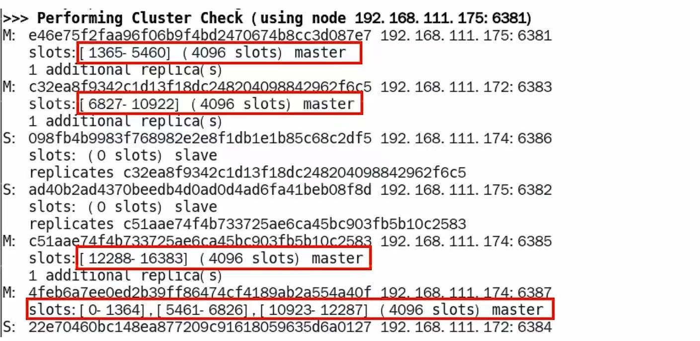

# redis 进阶  
## 1，持久化  
定义：将内存中的数据写入到磁盘，防止数据丢失——如果我门没有使用持久化技术，下次重新启动REDIS的时候只有空的redis没有任何东西 


### RDB
定义：在指定的时间间隔内将内存中的所有数据集以文件的形式写入磁盘，也就是Snapshot快照，它恢复时是将快照文件（RDB文件名为dump.rdb）直接读到内存里  

#### 配置文件
`vim /etc/redis/redis.conf`  
查找/snapshot  
6.0的版本为：
```
save 900 1 // 900秒内如果至少有1个key被修改，则进行快照  
save 300 10 // 300秒内如果至少有10个key被修改，则进行快照  
save 60 10000 // 60秒内如果至少有10000个key被修改，则进行快照  
```
7的版本为：  
```
save 3600 1 // 3600秒内如果至少有1个key被修改，则进行快照  
save 300 100 // 300秒内如果至少有100个key被修改，则进行快照  
save 60 10000 // 60秒内如果至少有10000个key被修改，则进行快照  
```


#### 自动触发  
1.配置文件中配置的自动触发修改配置文件的越433行中的save配置————`save 5 2`      
2.修改保存路径搜索/dir 修改为`/var/lib/redis`-以后生成的dump.rdb文件会保存在这里  
3.指定dump.rdb文件的名称，在配置文件中搜索dbfilename 修改为`dump6379.rdb`-配置好端口号，shutdown重启  
4.`redis-server`   
`redis-cli -a 密码 -p port `  
5.`config get dir` 查看保存路径 redis可以使用config命令查看配置文件是否正确   
  
触发备份的条件：  
1.时间满足  
2.次数满足  
如果是5秒内修改一次然后超过五秒之后再修改也不会触发，所以必须要在同一个五秒之内才会触发  

恢复数据:  
将备份文件移动到redis安装目录并启动服务就可  
当我门使用类似的 `flushdb/flushall`这种终结命令的时候也会触发生成备份.rdb--(但是此时已经被清空了所以下次读取的仍然是空备份)       
当在redis中使用`shutdown`命令模拟关机的时候也会触发备份但这次.rdb保存的文件就是关机时刻的快照  
所以综上所述：一旦产生了快照，一定要备份并且备份的文件不要在同一个主机中防止文件损坏后无法恢复  

使用备份：  
把备份文件dump.rdb移动到redis/data目录下并重新启动服务就可  

#### 手动触发    
定义：当一个非常非常重要的数据进入，但是没有达到自动备份的条件的时候就需要用到它 
原理：后台开了一个子进程立刻去备份生成一个临时文件，然后用新的去替换他  

单独指令：    
`save`:在主程序中会执行阻塞当前redis服务器，直到持久化完成执行save命令中REDIS不能处理其他命令，线上禁止使用————就是无法接受其他传来的信息了    
`bgsave`:会在后台异步进行快照操作，不阻塞快照同时还可以响应客户端的请求，该触发方式会fork（）一个子进程由子进程复制持久化过程。fork-创建一个一模一样的子进程但是是独立的  但是会自动执行exec()命令并且里面有一个脚本文件去执行  

  

`LASTSAVE`：查看上一次快照的时间 这是一个时间戳需要`date -d @时间戳`  

优点：  
1. 适合大规模、整体的数据恢复  
2. 灾难恢复速度快，加载速度快  


缺点：  
1. 在没有正确的关闭时候可能会丢失最新数据——快照丢失  
2. 如果数据量很大，fork子进程的时候会阻塞——内存占据大  

文件修复: 
定义：当在写文件中突然出现中断的时候，文件会损坏，此时需要修复——但是之前的数据是可以使用的  
`redis-check-rdb /var/lib/redis/dump.rdb`用来修复损坏的文件  

触发RDB快照：  
1.配置文件中配置——自动触发   
2.手动触发    
3.flushall/flushdb清空的时候，不过会产生空的dump.rdb文件 
4.shutdown的时候  
5.主从复制的时候  

#### 禁用RDB快照  
动态的禁用——一次生效  
`redis-cli config set save ""`  

静态的禁用——永久生效  
`vim /etc/redis/redis.conf`  
`save ""`

优化配置项：  
`stop-writes-on-bgsave-error` 后台保存失败的时候停止写入，一致性，如果为yes，则表示在备份失败的时候停止写入，如果为no，则表示在备份失败的时候继续写入就是继续接受发来的请求  
`rdbcompression` 是否压缩rdb文件，默认为yes，表示压缩，如果设置为no，则表示不压缩，但是不推荐设置为no，因为压缩的文件恢复速度快  
`rdbchecksum`  RDB的算法检查，即对文件进行校验默认yes  
`rdb-del-sync-files` 表示在没有持久性的情况下删除复制文件中使用的RDB文件  


### AOF 
定义：以日志的形式记录每一个写操作，将Redis执行过的所有写指令记录下来（读操作不记录），只许追加文件但不可以改写文件，redis启动之初会读取该文件重新构建数据，换言之，redis重启的话就根据日志文件的内容将写指令从前到后执行一次以完成数据的恢复工作  

配置文件：需要添加`appendonly yes`

重启的时候就会调用AOF文件去重新加载Redis的状态  


流程：  
1.客户端只是作为命令的来源发送到redis服务器    
2.这些命令并不是直接到达AOF文件，而是先到AOF缓冲区，只有当缓冲区存储到一定的数量以后再写入AOF文件中  
3.AOF会根据AOF缓冲区同步文件的三种写回策略将命令写入磁盘上的AOF文件  
4.AOF文件为了避免文件膨胀，会根据规则进行命令的合并（称为AOF重写），从而达到AOF文件压缩的目的  

总的来所：Redis 执行 AOF 写入时，先写入缓冲区，再根据 appendfsync 的策略决定是否、何时将数据 写入文件 并同步到硬盘。

#### 写回策略  
appendfsync 写回策略  
1.Always：同步写回，每次写入都会立刻写入到AOF文件中，但是性能较低I/O操作频繁  
2.Everysec：每秒写回，每秒写入一次到AOF文件中，性能较高，但是数据丢失的风险较大——默认  
3.No：**操作系统**控制写回，由操作系统决定何时写回，性能较高，但是数据丢失的风险较大  

####  6/7版本的区别  
保存文件位置：  
6版本：保存位置和RDB类似都是通过配置文件设置dir配置，如果是RDB就为dump.rdb，如果是AOF就为appendonly.aof  
7版本：自己设置了一个`appenddirname "appendonlydir"` 配置文件就是在RDB配置的dir下再生成一个appendonlydir的文件里面  


保存名称：  
6版本：有且只有一个`appendfilename "appendonly.aof"`  
7版本：将原来单个AOF文件拆分为多个AOF文件。分为三个类型：  
BASE: 表示基础AOF，它一般由子进程重写，该文件最多只有一个 ——基本文件    
INCR: 表示增量AOF，它记录了自上次重写后所有写操作，存在多个 ——增量文件    
HISTORY: 表示历史AOF，它是由BASE和INCR AOF变化而来，每次AOFRW成功完成时，本次AOFRW都会变成HISTORY 类型的AOF被自动删除  
我门引入manifest清单文件进行管理    
appendonly.aof.manifest中为：
```
file appendonly.aof.1.base.rdb seq:1 type:base
file appendonly.aof.2.incr.aof seq:2 type:incr
file appendonly.aof.3.incr.aof seq:3 type:incr
```
incr.aof是增量文件-即在每次客户端都在运行输入指令的时候都会把指令存入这个文件里面(只记录写操作)。内部记录的是显示库名称然后是指令。        
base.rdb是全量文件   
manifest是索引文件，用来记录全量文件的信息，比如文件名，文件大小，文件的创建时间等  

异常情况：    
当incr.aof写入文件出现错误的情况，会导致服务器出现错误，无法连接。 但是有redis-check-aof工具可以用来检测aof文件的错误。`redis-check-aof --fix appendonly.aof.1.incr.aof `只会修复incr.aof文件。   

### 重写机制  
定义：因为AOF文件是不断将写操作记录到文件中，随着Redis不断的进行，AOF会越来越大，占用服务器内存会越大，AOF要求恢复时间越长，为了解决这个问题新增重写机制。即当AOF文件的大小超过所设定的峰值时，Redis就会自动启动AOF文件的内容压缩，只保留可以恢复数据的最小指令集。或者使用手动`BGREWRITEAOF`命令重写AOF文件。  

压缩最小指令集：  
```
SET K1 V1 
SET K1 V2 
SET K1 V3
``` 
这三条命令占用空间且启动的时候每次都要执行一次，所以可以使用压缩实现把前面的删掉--K1 V3 然后放入RDB后缀中   


配置：
```
auto-aof-rewrite-percentage 100  # 当AOF文件的大小超过上一次重写的AOF文件大小的百分之多少时会再次进行重写。
auto-aof-rewrite-min-size 64mb  # 当AOF文件的大小大于64mb时会再次进行重写。
aof-use-rdb-preamble no  # 防止干扰不使用混合模式  
```
上述是需要同时满足，且的关系才触发  
根据上次重写的AOF大小，判断当前AOF大小是否超过上次重写的AOF大小是否增加了1倍，如果超过就进行重写。
满足文件大小  

手动重写：`BGREWRITEAOF`命令重写AOF文件。


自动/手动触发重写机制都会实现下面的效果：
```
appendonly.aof.1.base.rdb
appendonly.aof.1.incr.aof
appendonly.aof.manifest  
///会变成为
appendonly.aof.2.base.rdb
appendonly.aof.2.incr.aof
appendonly.aof.manifest  
```

优势：  
1. 使用AOF Redis的时候使用fsync策略，是使用后台线程执行的，所以不会阻塞主线程，并且如果出现丢失的话也只会丢失最近1s的写入。  
2. 可以使用redis-check-aof --fiex修复他  
3.当AOF变得很大会自动重写  
4.因为是个日志，只要没有执行日志重写操作就仍可以停止服务器、删除最新命令去保存数据集。  

劣势：
1. 体积大，文件重写需要一定时间。
2. 数据恢复速度慢。
3. 数据恢复速度慢。


## 混合模式
定义：  
混合使用AOF和RDB两种方式，但是Redis加载的时候会先考虑AOF文件,如果有就会先加载AOF，没有就会加载RDB文件。所以AOF的优先级高于RDB,所以可以认为里面存放了两个RDB文件   

  

选择：通常情况下AOF保存的数据比RDB更加完整，但是RDB更适用于备份数据库（AOF更注重不断变化），rdb留着作为备份  

既能快速加载又能避免过多的数据丢失  
配置： `aof-use-rdb-preamble yes  # 使用混合模式 `  

结论：RDB镜像做全量持久化，AOF做增量持久化。  
先使用RDB进行快照存储，然后使用AOF持久化记录所有的写操作，当重写策略满足或手动触发重写的时候，将最新的数据存储为新的RDB记录。这样重启的话，重启服务的时候会从RDB和AOF两部分恢复数据，既保证了数据完整性，又提高了恢复数据的性能。所以会产生文件为一部分为RDB一部分为AOF==》AOF包括了RDB头部+AOF的混写  


## 纯缓存模式  
定义：同时关闭RDB+AOF文件，当服务器需要高并发的情况不希望备份去分掉内存使用的时候就可以关闭。  

```
save ""  # 关闭RDB,禁用的情况下任然可以使用SAVE、BGSAVE命令去生成RDB文件  
appendonly no  # 关闭AOF,禁用的情况下任然可以使用APPENDONLY命令去生成AOF文件  
```


# Redis事务  
mysql事务：事务执行过程中不会被其他命令打断，只有执行完事务中的所有命令才会去执行其他命令，并且命令要么都成功要么都失败。    
redis事务：可以一次性执行多个命令，本质是一组命令的集合。一个事务中的所有命令都是序列化，按顺序地串行执行而不会被其他命令插入，不允许加塞 ——不保证原子性，没有能力回滚，只有决定是否开始执行全部指令的能力。   

作用：在一个队列中，能一次性、顺序、排他的执行一系列命令  

指令：
```
MULTI  # 开启事务
EXEC  # 执行事务
DISCARD  # 取消事务
UNWATCH  # 取消watch监控
WATCH key1 key2 ...  # 监控key1 key2 ...，如果在事务执行之前这个(或这些) key 被其他命令所改动，那么事务将被打断。
```

## 正常执行
```
multi  # 开启事务，放入一个队列中

EXEC  #  执行事务，按照队列中的顺序执行  
```

## 放弃事务
```
MULTI  # 开启事务，放入一个队列中

DISCARD  # 因为有变故不想要这个队列了，放弃执行  
```

## 全体连坐  
```
multi  # 开启事务，放入一个队列中
//一条命令错误全部不执行

EXEC  #  由于已经出现了错误就全部不会执行  
```

## 冤头债主 
当一个命令失败了但是其他命令仍然会执行成功，没有检查出来，运行时才会出错  
```
MULTI  # 开启事务，放入一个队列中
//插入一条错误命令但是此时没有运行无法检测出来如:INCR 一个字符串  
EXEC  #  执行事务，按照队列中的顺序执行，虽然中间有错误命令但是没有检测出来，就错误命令会出错其他命令正常执行  
```

## watch监控
悲观锁：每次去拿数据的时候都会认为别人会修改，所以每次在拿数据的时候都会上锁，这样别人想要拿数据就会被BLOCK锁。——安全了但是性能降低了  
乐观锁：每次拿数据的时候都认为别人不会修改，所以不会上锁，但是在更新的时候会判断一下在此期间有没有去更新这个数据-通过版本号是否对应  

CAS机制——check and set 检查再设置，就是如果被其他地方修改了那么原本的事务也就失效了——直接队列失效了。因为服务器的版本升级了和当前版本不匹配就会失效。    

```
unwatch  key2 # 取消watch监控
watch key1   
multi  # 开启事务，放入一个队列中

exec  #  执行事务，按照队列中的顺序执行，但是在执行的时候会检查watch监控的key是否被修改，如果被修改了那么事务就会失效。

```
一旦执行了exec命令，之前加的监控锁都会被取消了，当客户端连接丢失的时候，所有东西都会被取消监视。  


# Redis管道  
定义：优化频繁命令往返造成的性能瓶颈————使用批处理。  
pipeline技术  
问题由来：
Redis是一种基于C/S模式以请求/响应协议的TCP服务。  
客户端向服务端发送命令分为四步（发送——>排队——>执行——>返回结果），监听Socket(套接字，一种用于接和发送通信的API)，通常以阻塞模式等待服务端响应。  
服务端处理命令，并将结果返回给客户端。  
如果需要执行大量的命令，那么就要等待上一次应答后在执行，这中间不仅多了RTT，而且还频繁调用系统IO，发送网络请求，同时需要REDIS调用多次READ()和WRITE()，会操作系统多次从用户态到内核态。  
解决：可以一次性发送多条命令给服务端，服务端一次处理完毕后，通过一条响应一次性将结果返回，通过减少客户端于REDIS通信次数来实现降低往返时延时间（RTT）。——类似mget 和 mset   
 
将要执行的命令写到一个文件中 
```
vim test.txt 
cat test.txt | redis-cli -a 1111 --pipe  # 先使用LINUX的管道符号把他的结果放到后面中去执行
```
管道与原生批处理的区别：  
原生批处理是具有原子性，管道是非原子性  
原生基础命令是在REDIS的服务器执行而管道客户端与服务端共同完成的。  

管道与事务的对比  
事务具有原子性，管道不具有  
管道是一次性将命令发送到服务端而事务是通过队列一条一条发送道服务端的。  
事务会阻塞其他命令的执行，而管道不会（原子性）  

注意事项：  
如果管道中的命令发生了异常他是会继续执行完所有的指令的。  
保存的个数不能过多，因为一次发送的指令过多，会导致阻塞，并且服务端的内存也会占用过多的内存。  

# Redis发布订阅
定义：
Redis发布订阅是一种消息通信模式：发送者（pub）发送消息，订阅者（sub）接收消息。


小总结：因为每个客户端都有单独的客户端ID 所以就确保了不会订阅返回的消息不会重复。  

# Redis复值机制  
定义： 
主从复制，MASTER以写为主，SLAVE以读为主。当MASTER数据变化的是hi偶，自动将更新的数据异步同步道其他的SLAVE上。  

   

作用：  
1.实现读写分离  
2.容灾恢复  
3.数据备份  
4.负载均衡  

原理：  
1.配从库不配主库  
2.权限细节  
主机使用requirepass 设置的是主机的密码，需要使用masterauth 密码去验证  


### 一主二从
```
info replication  # 查看当前的复制信息  

replicaof 主库ip port  #在配置文件中，要求从机跟随那个主机  

slaveof 主库ip port   #使用手动配置的方式如果断开了每次就需要重启配置，可以实现重新跟随一台新主机  

slaveof no one  # 断开从机，自立为王 
  
```
通用配置：
```
vim redis.conf  

daemonize yes  # 后台启动  
 
#bind 127.0.0.1 #注释掉，否则只允许本机访问  

protected-mode no  # 关闭保护模式，允许所有的主机访问  

port 6379  # 端口号表示redis服务端的端口号  

dir    /    #指定保存文件的目录绝对路径    

pidfile  /var/run/redis_6379.pid  #指定保存进程号的文件的路径和文件名  

logfile "/var/log/redis_6379.log"  #指定保存日志的文件的路径和文件名 

requirepass 1111  # 设置密码   

dbfilename dump6379.rdb  #指定保存RDB文件的文件名  

```
从机配置：  
```
replicaof 192.168.111.185  6379  # 配置从机拜访主机的ip和端口号
masterauth "11111"  # 设置从机访问主机时候的密码，就是主机的密码    
```

之后可以通过查看主机的log文件查看是否匹配成功  
或者使用`info replication`查看  

问题：  
1.从机是否可以执行写命令————不能  
2.从机切入点问题————从机是从头开始复制还是从切入点开始复制呢，答案是从头开始复制然后主机写从机跟随，并不会因为切入点的问题而读取不到  
3.主机宕机了后从机能否上位—————不会，并且数据依旧保存的有，状态依旧是从机但是连接为关闭状态  
4.主机宕机重启后从机有影响吗————没有影响，并且状态变成UP连接状态    


使用手动配置的方式：  
```
CONFIG SET masterauth mypassword # 设置主机密码添加临时变量，即配置文件中没有写密码  

slaveof 192.168.111.185 6379  # 配置从机拜访主机的ip和端口号

```


### 薪火相传
定义：上一个A从机可以作为下一个B从机的主机，从机同样可以接受其他的从机的连接和同步请求，这样就可以缓解主机的写压力  
  
 
通过更改一个配置文件使他跟随的主机成为另一个从机或者使用`slaveof`命令使他暂时更改

注意事项：  
中间的从机任然没有写的权限，只能读，这样配置可以缓解最顶层主机的读压力只有一台读了  

### 反客为主
定义： 断开与主机的连接，从机变成主机，可以使用当前的数据库进行系列操作。  
使用`slaveof no one`命令断开从机  

### 总结  
流程：  
slave 启动，同步初请——连接道master后发送一个SYNC命令，首次连接会一次完全同步（全量复制）将自动执行，slave自身原有的数据会被清除，master会将自己的所有数据发送给slave，slave接收完后加载到内存中。  
全量复制————即master节点收到sync命令后会开始在后台保存快照（即rdb持久化，主从复制时会触发RDB），同时收集所有接收到的用于修改数据集命令缓存起来，master节点执行RDB持久化完成后，会将RDB文件和所有缓存命令发送给slave，slave保存到本地磁盘，加载到内存中，slave执行这些命令完成同步。  
心跳持续，保存通信————`repl-ping-replica-period 10 `主从关系的连接通过Ping命令去维持确保每个服务器都在    
进入平稳，增量复制————MASTER继续将新的所有收集到的修改命令自动依次传给SLAVA,完成同步  
从机下线，重连断续————`OFFSET`是用来区别从机的版本号，master会检查backlog里面的offset，master和slave都会保存一个复制的offset(是用来保存自己当前进展如果低于主机的进展就会自动同步，类似断点续传)还有ID   

缺点:  
复制演示，信号衰减————因为所有的写操作都在Master上操作，然后同步更新，具有一定的延迟。  
MASTER挂了————默认情况下不会从机主动上位，需要手动配置  


# 哨兵模式  
定义： 
哨兵模式是一种特殊的模式，能够后台监控主机是否故障，如果故障了根据**投票数**自动将从库转换为主库。  
作用：无人值守运维机制——监控redis的运行状态，当主机宕机后从机自动登录  
1.主从监控——监控主从库是否正常    
2.消息通知——可以将故障转义的结果给客户端    
3.故障转义——如果主机出现错误可以使用一台从机作为新的主机    
4.配置中心——客户端通过连接哨兵来获得当前服务的主节点地址  

## 步骤
1.框架配置：三个哨兵——自动监视和维护集群，不存放数据，只是吹哨人。（哨兵集群——至少奇数因为一个哨兵挂掉了）   
一主而从：数据的读取和存放  
2.配置：sentinel.conf配置文件(因为在一台主机配置三个哨兵服务所以配置文件名称不能相同)    
```
sentinel monitor <master-name> <ip> <redis-port> <quorum>  
// 监控master-name 主机ip 端口号 法定投票数——客观下线、主管下线    
``` 
 quorum是因为一个哨兵可能因为网络波动而认为一个主机宕机了，在哨兵集群中需要多个哨兵沟通确认这个主机真的已经宕机了，quorum就是用来客观下线的一个依据。  
 
 ```
 sentinel auth-pass <master-name> <password>  
 //哨兵连接主机的密码和服务的密码
 ```

 ### 通用配置
```
主机192.168.111.185中需要在config配置一个在masterauth<master-password>下面配置 —— 主机因为可能变成从机所以需要配置一个这个以便密码正确   
masterauth "1111"
哨兵配置 
vim sentinel端口号.conf 
bind 0.0.0.0 # 注释掉，否则只允许本机访问
protected-mode no # 关闭保护模式，允许所有的主机访问
port 端口号 # 端口号表示redis服务端的端口号
dir / #指定保存文件的目录绝对路径    
pidfile /var/run/redis_端口号.pid #指定保存进程号的文件的路径和文件名  
logfile "/var/log/redis_端口号.log" #指定保存日志的文件的路径和文件名 
daemonize yes # 后台启动
sentinel monitor mymaster 192.168.111.185 6379 2 # 指定主机的IP地址和需要经过多少个投票数量
sentinel auth-pass mymaster 1111 # 输入主机中用户密码  
```

启动哨兵  
```
redis-sentinel 哨兵配置文件路径  --sentinel  # 启动哨兵  
```
通过观察哨兵的日志可以知道一个哨兵是先监视主机，然后随着主机同步给从机哨兵也会监视其他同步哨兵。实现一个哨兵监视所有主从机。并且会把自己的配置文件重写，添加了哨兵的ID、主从关系等。  

### 哨兵选举
因为主机已经发生了异常，从机在一定短时间内会无法读取到数据，因为哨兵正在重写读取网络配置和相应的选举导致，过了一段时间后就又可以读取数据了，如果仅仅是主从复制就可以瞬间读取。   
步骤：  
1.先检查到主机宕机  
2.经过多台哨兵投票票数超过一半后选举出新的主机    
3.重写自己的配置文件保存在磁盘中。  

可能出现的问题：  
管道断开——往往发生在远端把读写管道关闭了，在对这个管道进行读写操作。从TCP四次挥手来看远端已经发送FIN包了给你，你继续往管道读写会受到远端发来的RST包表示已经断开连接了，所以操作系统会给你返回SIGPIPE的信号并且error返回Broken pipe(32)，就会退出这次连接重新连接一次就可以了。  

如果宕机的主机重新上线后：  
会被夺权变成从机——所以主机需要配置一个masterauth密码，否则会连接不上。  

一个哨兵可以监控多个master  

## 运行流程和选举原理   
主观下线：  
单个哨兵自己主管上检测到的关于主机的状，单从哨兵的角度来看，如果发送了PING心跳后在一定时间内没有收到合法的回复，就会达到主管下线的条件  
在配置文件中默认使用30S   
——————————>  
客观下线：  
需要一定数量的哨兵认为主观下线，多个哨兵达成一致意见才能认为一个主机在客观上宕机了  
——————————>  
选举领导哨兵：  
各个哨兵会集中选择一个领导哨兵（而不是所有哨兵一起发送消息）发送消息
兵王如何选举出来的：  
Raft算法————先到先得每个哨兵只能投一票    
   
Sentinel 1 首先发起竞选 Leader：  
向其他 Sentinel 发送选票请求。  
Sentinel 2 和 Sentinel 3 同意了这个请求，分别给它投票 +1。  
Sentinel 1 获得 2 票（包括自己一共 3 票），达成了多数派，成为 Leader：  
图中右侧标注：“收到2票：Sentinel 2、Sentinel 3 → 选举 Sentinel 1”。  
同一时间段内：  
Sentinel 2 自己尝试成为 Leader，发起请求，但 只收到 Sentinel 1 的选票。  
因此 票数不够多数派（3 个哨兵中至少要 2 票），选举失败。  
Sentinel 3 则是最慢的，自己尝试拉票，但 一个选票都没拿到，当然也失败。     
——————————
由兵王开始推动故障切换流程并选出一个新的MASTER：  
1.新王登基：  
      
首先比较优先级、然后比较偏移量（版本号大）、比较RuniD(小)——这个只是为了防止平票做出的最后选择  
2.群臣俯首   
选中的从机会先执行`slaveof no one`命令断开与原主机的连接，自立门户。并让其他从机通过`slaveof`命令连接到新的主机上。  
3.旧主拜服    
兵王会让原来的主机降级成为从机并恢复正常工作  

## 使用建议  
1.数量为奇数  
2.配置一样  
3.部署在DOCKER 上需要端口对齐  
4.因为需要一段时间选举，所以可能会导致这段时间的数据丢失了  

# Redis集群  
定义：  
由于数据量过大，单个Master节点无法承载，所以需要使用多个Master节点分担压力，将数据分散到多个节点中，每个节点负责一部分数据。   
  

作用：  
集群支持多个主机，每个主机可以挂载多个从机  
由于集群自带哨兵故障转移机制，内置了高可用技术，无需再去使用哨兵功能  
客户端与Redis的节点连接，不再需要使用集群中的所有节点而是只要一个节点可用就行  
槽位slot负责分配到各个物理服务节点，由对应的集群来负责维护节点、插槽和数据之间的关系    

## 槽位与分片
集群的密钥空间被分为16384个槽位，有效地设置了16384个主节点的集群大小上限（但是建议最大节点设置为1000个节点）  
定义：  
集群中没有使用一致的HASH算法而是引用了哈希槽的定义————Redis的集群有16384个哈希槽，每个KEY通过CRC16校验后对16384取模来决定放那个槽，集群中的每个节点负责一部分HASH槽位，就是每台REIDS主机会负责对应分段————不属于自己的会转发到对应的节点  
      
    
分片：使用Redis集群时我们会将存储的数据分散到多台redis机器上成为分片  

优势：  
高可用、方便扩容/缩容——这种结构很容易添加/删除节点。比如说我们想要添加某个节点或者异常某个节点。添加D节点可以把其他节点的一部分槽位转移到D节点上，删除A节点可以先把A节点的槽位转移到其他节点上，知道A节点位空，然后删除A节点。    

### 槽位的映射  
#### 哈希取余分区   
hash(key) %N  
优点：简单粗暴、直接有效  
缺点：原本规划好的节点，进行扩容或者缩容就比较麻烦了，不管扩缩容每次数据变动导致节点有变动，映射关系需要重新计算。会导致hash全部重新映射    


#### 一致性哈希算法分区  
是为了解决分布式缓存数据变动和映射的问题。目的就是服务器个数发动变化的时候尽量减少影响客户端到服务器的映射    
1.算法构建一致性哈希环  
  
一致哈希算法必然有个HASH函数按照算法产生的hash值，这个算法的所有可能哈希值会构成一个全量集，这个集合可以成为一个HASH空间[0,2^32-1]。这是一个线性空间，但是在算法中，我们通过适当的逻辑使他首尾相连，这样逻辑上就形成了一个环形空间  
任然是取模但是是对2^32取模——这就是hash环   
2.服务器IP节点映射   
将集群中各个IP节点映射到环上的某一个位置。将各个服务器使用Hash进行一个哈希，具体可以选择服务器的IP或主机名作为关键字进行哈希，这样每台机器就能确定其在哈希环上的位置。通过HASH(IP)确定位置  
3.Key落到服务器的落键规则     
    
当我们需要存储一个KV键值对时，首先计算key的hash值，hash(key)，将这个key使用相同的函数HASH计算出哈希值并确定此数据在环上的位置，从此位置沿着环顺时针行走，第一台遇到的服务器就对应到服务器上，并将键值对存储到该节点上  


优点：假设一台C服务器宕机了，只有此服务器的前一台服务器受影响（B~C受影响），其他服务器不受影响。B~C的数据会转移到D上  
扩张性：增加了一台X在A~B之间，只有X~B的数据会受到影响，其他不受影响  

缺点：在服务器节点太少的时候，容易造成节点分布不均匀而造成的数据倾斜，大部分数据存储在某一台服务器上  


#### 哈希槽分区  
实质上就是一个数组，大小为[0,2^14-1] 形成hash slot 空间  
作用：解决均匀分配的问题，在数据和节点之间加入一层，这层成为哈希槽，用于管理数据和节点的关系 
     
槽解决粒度问题，相当于把粒度变大，这样便于数据移动。哈希解决映射问题，使用KEY的哈希值来计算所在的槽，便于数据分析  
一个集群只能由16384个槽，编号为0-16383.这些槽会分配给集群中的所有主节点，分配策略没有要求  
使用键值对里面的键来作为对应的  

## 经典面试题
### redis 集群为什么是16384个槽？    
CRC16算法产生的hash值由有16bit,该算法可以产生2^16个值，正好对应65536个值。  
2^14=16384  
因为正常的心跳数据包带有节点的完整配置，可以用幂等的方式用旧的命令替换就节点，以便更新旧的配置
这就意味这它们包含原始节点的插槽配置，该系欸但使用2K的空间和16K的插槽，但会使用8K的空间（使用65K的插槽）  
同时由于设计初衷Redis集群不大可能扩展到1000个以上的主节点  
因此16K处于正确的范围内，以确保每个主机具有足够的插槽，最多可容纳1000个居中，否则位图难以压缩在网络传播中慢  

总的来说：  
1.如果发送65536/8/1024=8Kb 16384/8/1024=2Kb 就能节省发送心跳包的带宽也是  
2.集群节点数量越多，心跳包体内所携带的数据就越多。如果超过了1000就会导致网络拥塞，所以1000个节点16384个节点够用了  
3.槽位越少，节点少的情况下，压缩配比高，容易传输  

### 集群中会不会数据写丢失  
Redis集群不保证强一致性，就是原本主机写从机复制，但是突然主机宕机但是从机还没来的急复制，然后执行上位就会导致缺失一条信息  

## 案列搭建  
1.配置文件：  
```
mkdir -p /myredis/cluster  //新建文件夹  

//进行集群的配置191.168.111.175  
vim /myredis/cluster/redisCluster6381.conf
vim /myredis/cluster/redisCluster6382.conf

bind 0.0.0.0  //绑定所有IP
port 6381/6382  //端口号
protected-mode no  //关闭保护模式
daemonize yes  //后台启动
logfile "/myredis/cluster/redisCluster6381/6382.log"  //日志文件
pidfile /var/run/redis_6381/6382.pid  //进程文件  
dir /myredis/cluster  //数据文件
appendonly yes  //开启AOF
appendfilename "appendonly6381/6382.aof"  //AOF文件名
requirepass "1111"  //设置密码
masterauth "1111"  //设置主机的密码  

cluster-enabled yes  //开启集群
cluster-config-file nodes-6381/6382.conf  //集群的配置文件
cluster-node-timeout 5000  //集群节点超时时间
```

6381为主机6382为从机，同理配置。  

2.启动集群  
```
redis-server /myredis/cluster/redisCluster6381.conf
redis-server /myredis/cluster/redisCluster6382.conf
```

3.创建集群  
`redis-cli -a  1111 --cluster create --cluster-replicas 1 192.168.111.175:6381 192.168.111.175:6382`  
其中--cluster create集群形式创建  
--cluster-replicas 1 表示为每个主机点创建一个从机构成一主一从的集群   
按回车之后会自动分片去匹配 
之后会在配置文件`/myredis/cluster`中生成`nodes-6381/6382.conf`文件    
集群成功后会产生nodes的配置文件,`CLUSTER NODES`命令可以从查看集群  
`cluster info`查看集群的环境  

4.操作集群  
当对键进行写操作的时候应该先获取到对应的槽位，然后根据槽位去对应的节点写入     
所以需要配置路由到位，防止路由失效要加-c（重定向）  重新连接`redis-cli -a 1111 -c`     
`cluster keyslot <key>`获取键的槽位    

5.主从切换     
当主机宕机后从机会主动上位，不需要手动配置  
如果宕机主机又重新返回的话不会上位，变成从机了。  

Redis集群不保证强一致性，所以可能会丢失一些被系统收到的写请求  

如果想要恢复原始的位置  
```
CLUSTER FAILOVER  //节点的从属调整   
```
 
 6.主从扩容  
新建redis节点和从节点   
将新建的主节点加入集群`redis-cil -a 密码 --cluster add-node 集群中主节点IP:端口 自己节点IP:端口`  
通过主节点的引荐进入集群但是没有分配槽位  
`redis-cli -a 密码 --cluster reshard 集群中的主节点IP:端口` 重新分片   
然后手动填入分配槽位的数量————>然后选择放入的ID（新建节点的ID）————>填入`all`表示全部接受了
————>`yes`开始集群中全部重新分配了  
原理原本在集群中初始化分配的内存不动，后面添加进去集群重新分配16384个槽位的时候是把原本的主机管制范围内每个都匀出一些，这样原本主节点管制范围内变化会小，而新进入集群的主机管理的是原本集群中的每个主机管理下的空间分出的零散的空间而已。  
    

从节点加入集群并且挂载主节点  
`redis-cli -a 密码 --cluster add-node 从机节点IP:端口 主机节点IP：端口 --cluster-slave --cluster-master-id 主机节点ID（和上面是同一个不过这个是ID）`  

7.主从缩容  
清处从节点————获得从节点ID`redis-cli -a 密码 CLUSTER CHECK   IP:端口号`  
`redis-cli -a 密码 --cluster del-node 从机IP:端口 从节点ID`删除从节点      
清出来的槽号重新分配回原来的集群中的主节点  
首先找到接收的节点ID——A然后找到要删除的节点ID——B  
`redis-cli -a 密码 --cluster reshard 主机IP:端口`  
填写B节点的所有槽位数量————>填写A节点（表示接受的的节点）————>`done`————>`yes`开始  
  
此时的B节点会从主节点变成从节点并且跟着主机A      
删除主节点  
`redis-cli -a 密码 --cluster del-node 从机IP:端口 从机节点ID`    
这样缩容会导致槽位多一点的区别其他没什么。    

## 注意事项  
不在同一个分片中的槽位不能使用M（mget、mset）开口的批处理操作，可以通过{}来定义同一个组的概念，使用key内相同内容的键值对放到同一个slot槽位去。  
`mset k1{z} z1  k2{z} z2 k3{z} z3`这样就相当于使用一个槽位储存了这些东西就不会分槽。  

CRC16算法的调用————C语言下的包  


配置文件中：  
`cluster-require-full-coverage yes`  表示集群是否完整才对外暴露服务，因为集群中有一个节点彻底宕机了主从都没了，这样就有些槽位无法接受了到数据了回导致有些集群无法接受了  

常用指令：  
`CLUSTER COUNTKEYSINSLOT 槽位数字编号` 看看该槽位是否被占用  
`CLUSTER KEYSLOT 键名 `表示该键放到那个槽位  
`CLUSTER NODES `  查看集群中的节点    


# SPRING+REDIS  
中间件  
## jedis  
定义：  
Jedis是Redis的Java实现的客户端，其API提供了比较全面的Redis命令的支持。    
步骤：
1.导入依赖 jar 包 
```
<dependency>
  <groupId>redis.clients</groupId>
  <artifactId>jedis</artifactId>
  <version>4.0.1</version>
</dependency>
```
2.连接池配置  
```
public JedisPool jedisPool(){
  Jedis jedis =  new Jedis("host",port);  
  //连接池配置
  jedis.auth("1111");  
  system.out,println(jedis.ping());  //发送一个ping命令确定打得通  
  jedis.set("k1","v1");  
  Set<String> keys = jedis.keys("*");  //获取所有的键值对的键名，返回一个set集合  
  System.out.println(keys);  //打印出所有的键名  
  jedis.get("k1");  //获取键值对    
  jedis.ttl("k1");  //获取键值对的过期时间    
  jedis.expire("k1",10);  //设置键值对的过期时间      

}
```
## lettuce    
因为jedis使用的时候是拿自己的客户端去连接Redis服务端，每个线程都要创建自己的实例去连接Redis客户端，当有很多个线程的时候，不仅开销大需要反复的创建关闭一个Jedis连接，而且也是线程不安全的，一个线程通过Jedis实列更改Redis服务器之后回影响另一个线程    
因此采用lettuce  
步骤：  
1.导入依赖  
```
<dependency>
  <groupId>io.lettuce</groupId>
  <artifactId>lettuce-core</artifactId>
  <version>6.1.8.RELEASE</version>
</dependency>
```
2.连接池配置  
```
1.使用构建器链式构成URI  
RedisURI uri = RedisURI.
builder().
redis(服务器地址).
withPort(端口).
withAuthentication(用户名("default"),"密码").
build(); 
RedisClient client = RedisClient.create(uri);   
 StatefulRedisConnection  connection = client.connect();    

RedisCommand command = connection.sync();    
command.set("k1","v1");  //设置键值对
String value = command.get("k1");  //获取键值对
//关闭释放资源  
conn.close();
client.shutdown();
```

## redisTemplate      

### 连接单机  
1.导入依赖  
```
<dependency>
  <groupId>org.springframework.boot</groupId>
  <artifactId>spring-boot-starter-data-redis</artifactId>
</dependency>  
自带的有这个包  
```
2.YML配置文件  
```
//redis单机  
spring.redis.database=0 //表示从0号库开始  
spring.redis.host=192.168.111.175 //表示主机地址  
spring.redis.port=6381 //表示端口号  
spring.redis.password=1111 //表示密码  
spring.redis.lettuce.pool.max-active=10 //表示最大连接数 
spring.redis.lettuce.pool.max-wait=2000 //表示最大等待时间  
spring.redis.lettuce.pool.max-idle=5 //表示最大空闲连接数  
spring.redis.lettuce.pool.min-idle=2 //表示最小空闲连接数  

```

3.配置  
```
@Configuration
public class RedisConfig{

}
如果使用默认的不能成功序列化（默认的序列化是jdkSerializer序列化的数据库，而redis需要使用的是StringRedisSerializer序列化器 ），虽然可以成功传入但是会出现编码的肉眼无法识别  
1.就可以在下面使用 stringRedisTemplate  类型去传输就可以解决两边序列化不同的问题    
2.加载配置从而达到效果  


4.使用  
```
@Resource
private RedisTemplate redisTemplate;  
redisTemplate.opsForValue().set("k1","v1");  //设置键值对并且传入REDIS里面了  
```


### 连接集群  
1.导入依赖  
```
<dependency>
  <groupId>org.springframework.boot</groupId>
  <artifactId>spring-boot-starter-data-redis</artifactId>
</dependency>  
自带的有这个包  
``` 
2.YML配置文件    
```
spring.redis.database=0 //表示从0号库开始  
spring.redis.host=192.168.111.175 //表示主机地址  
spring.redis.port=6381 //表示端口号  
spring.redis.password=1111 //表示密码  
spring.redis.lettuce.pool.max-active=10 //表示最大连接数 
spring.redis.lettuce.pool.max-wait=2000 //表示最大等待时间  
spring.redis.lettuce.pool.max-idle=5 //表示最大空闲连接数  
spring.redis.lettuce.pool.min-idle=2 //表示最小空闲连接数 
redis.cluster.nodes=192.168.111.175:6381,192.168.111.175:6382,192.168.111.175:6383 //表示集群的节点    
```

同理注意序列化问题JDK的序列化和REDIS的序列化  

3.事故发生  
当一台主机宕机Redis可以实现自动上位，但是JAVA后端没有成功更新，导致无法自动连接上位机器    
解决办法  
刷新节点拓扑视图，自适应拓扑刷新与定时拓扑刷新——>修改YML  
```
spring.redis.lettuce.cluster.refresh.adaptive=true //表示自适应刷新  
spring.redis.lettuce.cluster.refresh.period=5000 //表示刷新时间  
spring.redis.cluster.nodes=192.168.111.175:6381,192.168.111.175:6382,192.168.111.175:6383 //表示集群的节点从而达到自动上位      

```


