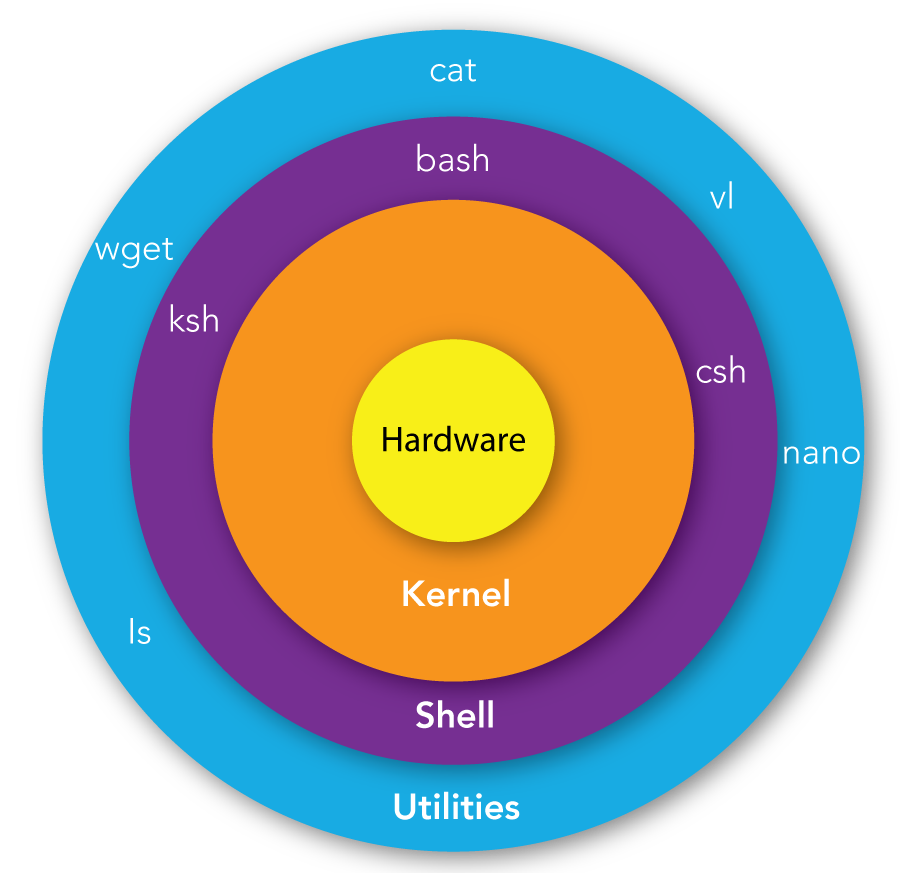

# shell

## 什么是 shell

Shell 是操作系统中的一个命令行解释器，充当用户与操作系统内核之间的接口。用户通过输入命令，Shell 解释并执行这些命令，与系统进行交互。



## 常见的 shell 类型

- Bourne Shell (sh)：最早的 Unix Shell，功能简单。
- Bourne Again Shell (bash)：sh 的增强版，广泛使用。
- C Shell (csh)：语法类似 C 语言，支持作业控制。
- Korn Shell (ksh)：结合了 sh 和 csh 的特性，功能强大。
- Z Shell (zsh)：bash 的扩展，支持更多功能，如插件和主题。

### 查看当前使用的 shell

```bash
echo $SHELL

echo $0
```

## shell 中命令

shell 是命令解释器，其可以解释的命令的种类可以分为内部命令和外部命令两种。

### 内置命令（Built-in Commands）

内置命令是 Shell 自身提供的命令，无需调用外部程序，执行速度快。常见的包括 `cd`、`exit` 等。

### 外部命令（External Commands）

外部命令是独立的可执行程序，通常位于系统的 /bin、/usr/bin 等目录中，或者是用户自己编译可执行文件的目录中。Shell 通过 PATH 环境变量查找这些命令。常见的包括 `ls`、`cp` 等。

或者是用户通过某些编程语言（如 C/C++/Rust/go 等）编写代码后，编译生成的可执行文件。

### Shell 命令的执行流程

1. 如果命令名是内置命令，Shell 直接执行。

2. 如果命令名是外部命令，Shell 会根据以下规则查找可执行文件：
   1. 如果命令名包含路径（如 ./hello 或 /usr/bin/ls），Shell 直接尝试执行该路径下的文件。
   2. 如果命令名不包含路径（如 hello 或 ls），Shell 会在 PATH 环境变量指定的目录中查找可执行文件。

#### 可执行文件（不在 PATH 环境变量中）

例如， 一个 go 语言的 hello world 程序：

```go
package main

import "fmt"

func main() {
	fmt.Println("Hello, World!")
}
```

```bash
# 编译 hello.go 文件
go build hello.go -o hello

# 运行 hello 文件
./hello
```

当你在 Shell 中输入 ./hello 时，Shell 的执行过程如下：

1. 解析命令：Shell 解析 ./hello，发现它是一个路径指向的可执行文件。
2. 查找可执行文件：Shell 检查当前目录下是否存在 hello 文件，并验证其是否具有可执行权限。
3. 调用系统调用：如果文件存在且可执行，Shell 调用操作系统的 exec 系统调用，将 hello 加载到内存并执行。
4. 执行程序：hello 程序开始运行，输出 Hello, World!。
5. 返回控制权：程序运行结束后，控制权返回给 Shell。

#### 可执行文件（在 PATH 环境变量中）

例如， 将上述编译后的 hello 文件， 移动到 /usr/bin 目录下， 然后通过 `hello` 命令， 执行 hello 程序。

```bash
mv hello /usr/bin/
hello
```

当输入 `hello` 命令时，Shell 的执行过程如下：

1. 解析命令：Shell 解析 hello，发现它是一个外部命令（因为 hello 不是 Shell 的内置命令）。
2. 查找可执行文件：Shell 根据 PATH 环境变量中定义的目录顺序，逐个查找是否存在名为 hello 的可执行文件。PATH 环境变量通常包含以下目录（以冒号分隔）：

```bash
/usr/local/bin:/usr/bin:/bin:/usr/sbin:/sbin
```

Shell 会依次检查这些目录：
- 检查 /usr/local/bin 目录，未找到 hello。
- 检查 /usr/bin 目录，找到 hello 文件。

3. 验证文件权限：Shell 检查 /usr/bin/hello 文件是否具有可执行权限。如果文件权限正确（例如 -rwxr-xr-x），Shell 继续执行；否则，返回权限错误。

4. 调用系统调用：Shell 调用操作系统的 exec 系统调用，将 /usr/bin/hello 加载到内存并执行。
exec 系统调用会替换当前进程的地址空间为 hello 程序的地址空间。

1. 执行程序：hello 程序开始运行，执行其代码逻辑（输出 Hello, World!）。

2. 返回控制权：hello 程序运行结束后，控制权返回给 Shell。Shell 继续等待用户输入下一条命令。

### Shell 中命令的类型判断

```bash
type command
```
